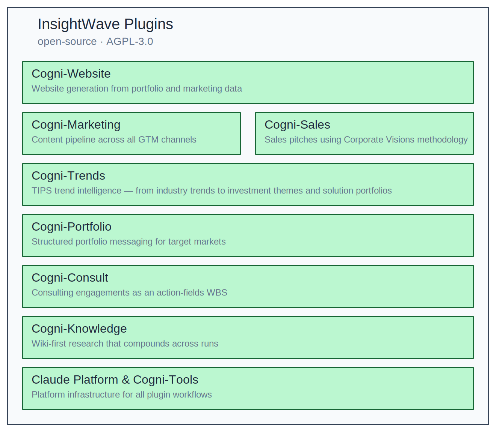

# insight-wave

Open-source plugins for consulting, sales, and marketing on [Claude Code](https://claude.ai/code). 13 AGPL-3.0 plugins that automate the research-heavy, methodology-driven work behind B2B deliverables — trend scouting, portfolio positioning, sales pitches, content creation, visual production, website generation, and source verification.

Each plugin implements an established framework (Corporate Visions, Double Diamond, TIPS, IS/DOES/MEANS) rather than general-purpose text generation. Outputs include inline citations, structured data models, and quality gates. Every deliverable follows a reproducible methodology you can inspect and override.


*Plugin ecosystem architecture — edit source: `assets/architecture.excalidraw`*

## What the plugins do

13 plugins organized around nine capability areas. Each area handles a distinct part of the consulting-to-delivery workflow; plugins within an area share data formats and can be used independently or together.

### Research

[cogni-research](cogni-research/README.md) runs 5-25 parallel web research agents to produce multi-section reports with inline citations — from a basic 3,000-word scan to recursive deep-research trees of 15,000 words. Five report types (basic, detailed, deep, outline, resource), three source modes (web, local documents, hybrid), and a structural review loop before finalization. 3 skills and 8 agents.

> "Write a detailed research report on AI regulation in the EU with IEEE citations"

→ [Plugin guide](docs/plugin-guide/cogni-research.md) · [Research to Report workflow](docs/workflows/research-to-report.md)

### Trend Intelligence

[cogni-trends](cogni-trends/README.md) scouts industry trends across four TIPS dimensions with bilingual DE/EN web research, producing 60 scored trend candidates per run using multi-framework analysis (TIPS, Ansoff, Rogers, CRAAP). The value-modeler consolidates candidates into 3-7 investment themes with solution blueprints. Reusable industry catalogs accumulate knowledge across engagements. Purpose-built for DACH markets with curated German institutional sources (VDMA, BITKOM, Fraunhofer). 6 skills and 9 agents.

> "Scout trends for the automotive industry, then model investment themes from the results"

→ [Plugin guide](docs/plugin-guide/cogni-trends.md) · [Trends to Solutions workflow](docs/workflows/trends-to-solutions.md)

### Portfolio Messaging

[cogni-portfolio](cogni-portfolio/README.md) structures products, features, and target markets into market-specific value propositions using IS/DOES/MEANS messaging. 19 skills handle the full positioning lifecycle — from TAM/SAM/SOM market sizing and competitive analysis through three-layer quality assessment to export-ready proposals and workbooks. Eight industry taxonomies (ICT, SaaS, FinTech, HealthTech, MarTech, Industrial Tech, Professional Services, Open Source) classify your portfolio automatically. 19 skills and 20 agents.

> "Set up a portfolio for our cloud monitoring product targeting mid-market SaaS companies in DACH"

→ [Plugin guide](docs/plugin-guide/cogni-portfolio.md)

### Content Production

[cogni-marketing](cogni-marketing/README.md) bridges portfolio propositions and trend themes into channel-ready content across 16 formats — blogs, LinkedIn articles, whitepapers, battle cards, email nurtures, video scripts, and more. A 3D content matrix (market x GTM path x content type) tracks coverage gaps. [cogni-copywriting](cogni-copywriting/README.md) polishes any document for executive readability using 7 messaging frameworks (BLUF, Pyramid, SCQA, STAR, PSB, FAB, Inverted Pyramid) and runs 5 parallel stakeholder personas to catch blind spots. [cogni-narrative](cogni-narrative/README.md) transforms structured content into executive narratives using 10 story arc frameworks with quality scoring (0-100, A-F grades). Together: 18 skills and 8 agents.

> "Generate thought leadership content for the AI automation theme across LinkedIn and blog formats"

→ [Plugin guide: cogni-marketing](docs/plugin-guide/cogni-marketing.md) · [Content Pipeline workflow](docs/workflows/content-pipeline.md)

### Sales Pitches

[cogni-sales](cogni-sales/README.md) generates account-specific pitches using the Corporate Visions Why Change methodology — four research phases (Why Change, Why Now, Why You, Why Pay) each backed by a dedicated web research agent. Outputs a `sales-presentation.md` and `sales-proposal.md` with sequential citations. Works in two modes: customer mode for named accounts with company-specific research, or segment mode for reusable market-vertical pitches. 1 skill and 4 agents.

> "Create a Why Change pitch for Siemens Manufacturing based on our managed services portfolio"

→ [Plugin guide](docs/plugin-guide/cogni-sales.md) · [Portfolio to Pitch workflow](docs/workflows/portfolio-to-pitch.md)

### Consulting Orchestration

[cogni-consulting](cogni-consulting/README.md) manages Double Diamond engagements — dispatching to research, trends, portfolio, and claims plugins at the right phase. Eight vision classes (strategic options, business case, GTM roadmap, cost optimization, digital transformation, innovation portfolio, market entry, business model hypothesis) scope the engagement. Phase gates are advisory — your consulting judgment drives the process. 7 skills and 1 agent.

> "I need to evaluate strategic options for expanding our cloud services portfolio in the DACH mid-market"

→ [Plugin guide](docs/plugin-guide/cogni-consulting.md) · [Consulting Engagement workflow](docs/workflows/consulting-engagement.md)

### Visual Production

[cogni-visual](cogni-visual/README.md) transforms narratives into five visual formats: slide decks (11 layout types), big-picture journey maps (1,100-1,500 Excalidraw elements), Big Block solution architecture diagrams, scrollable web narratives, and printed poster storyboards. 11 skills generate structured briefs; 17 agents render them into .pptx, .excalidraw, .pen, or .html files. All visuals inherit brand identity from your workspace theme.

> "Create a slide deck from the sales presentation, then render the strategy as a big picture journey map"

→ [Plugin guide](docs/plugin-guide/cogni-visual.md)

### Website Generation

[cogni-website](cogni-website/README.md) assembles multi-page customer websites from portfolio, marketing, trend, and research content produced by other plugins — outputting a deployable static site with shared navigation, theming, and responsive HTML. Service pages update in minutes as your portfolio model changes, staying consistent with your messaging and SEO-optimized. 6 skills and 3 agents.

> "Build a customer website from our portfolio and marketing content with a Pencil-rendered hero"

→ [Plugin guide](docs/plugin-guide/cogni-website.md) · [Portfolio to Website workflow](docs/workflows/portfolio-to-website.md)

### Platform & Quality

#### Workspace Foundation

[cogni-workspace](cogni-workspace/README.md) manages the shared foundation — environment variables, MCP server installation, theme management, plugin discovery, and workspace health. Runs dependency checks, discovers installed plugins, and generates shared settings. Includes Obsidian vault integration for browsable knowledge management. 5 skills.

> "Initialize my insight-wave workspace and check plugin health"

→ [Plugin guide](docs/plugin-guide/cogni-workspace.md) · [Getting started](docs/getting-started.md)

#### Source Verification

[cogni-claims](cogni-claims/README.md) verifies whether sourced claims match what their cited sources actually say — catching misquotations, unsupported conclusions, selective omissions, and stale data. Other plugins register claims during generation; cogni-claims fetches each source and flags deviations for your review. 2 skills and 2 agents.

> "Verify all claims in the trend report against their cited sources"

→ [Plugin guide](docs/plugin-guide/cogni-claims.md)

#### Help & Learning

[cogni-help](cogni-help/README.md) provides a 12-course interactive curriculum, 6 cross-plugin workflow templates, and troubleshooting diagnostics. Routes tasks to the right plugin, chains multi-plugin workflows, and generates cheatsheets for any plugin. 7 skills and 1 agent.

> "Which plugin should I use to verify claims in my research report?"

→ [Plugin guide](docs/plugin-guide/cogni-help.md)

Beyond the open-source plugins, cogni-works offers consulting services — plugin engineering for domain-specific workflows, managed deployment, and a partner certification program — through [cogni-work.ai](https://cogni-work.ai). Whether you run a consulting practice, a sales organization, or a marketing team, the site shows how these capabilities translate into managed workflows and onboarding for your team.

## Who this is for

### Consulting Firms

You compete on methodology depth, not headcount — but quality assurance depends on individual partners, and every pitch costs days of senior capacity.

- **Account-specific pitches in 90 minutes** — [cogni-sales](cogni-sales/README.md) generates Corporate Visions Why Change pitches with web-researched evidence per customer → [Portfolio to Pitch](docs/workflows/portfolio-to-pitch.md)
- **Verified research in 20 minutes** — [cogni-research](cogni-research/README.md) runs 5-25 parallel agents to produce DACH-sourced reports with inline citations → [Research to Report](docs/workflows/research-to-report.md)
- **60 scored trend candidates per scouting run** — [cogni-trends](cogni-trends/README.md) identifies industry trends across four TIPS dimensions with bilingual DE/EN research → [Trends to Solutions](docs/workflows/trends-to-solutions.md)
- **Double Diamond with quality gates** — [cogni-consulting](cogni-consulting/README.md) orchestrates engagements with automated phase readiness assessment → [Consulting Engagement](docs/workflows/consulting-engagement.md)
- **Consistent portfolio messaging** — [cogni-portfolio](cogni-portfolio/README.md) structures IS/DOES/MEANS propositions across Feature x Market pairs with three-layer quality assessment
- **Service pages that track your portfolio** — [cogni-website](cogni-website/README.md) generates responsive websites from your portfolio model, updated in minutes as offerings evolve

**Start here:** [cogni-sales](cogni-sales/README.md), [cogni-research](cogni-research/README.md), [cogni-portfolio](cogni-portfolio/README.md)

For consulting on applying these workflows in client engagements, or to certify your team as practitioners: [cogni-work.ai](https://cogni-work.ai)

### Sales Organizations

Your reps spend 2-3 days per opportunity on research and deck creation. The standard presentation stops working after the third customer — but account-specific pitches require senior capacity tied up in large deals.

- **Methodology-disciplined pitches** — [cogni-sales](cogni-sales/README.md) follows the full Corporate Visions arc (Why Change → Why Now → Why You → Why Pay) with web-researched evidence per phase
- **Verified account briefings** — [cogni-research](cogni-research/README.md) delivers DACH market data you can stand behind in front of a customer → [Research to Report](docs/workflows/research-to-report.md)
- **Consistent messaging from one foundation** — [cogni-portfolio](cogni-portfolio/README.md) produces buyer-role-specific value propositions for each opportunity
- **Proposals and one-pagers without the marketing queue** — [cogni-marketing](cogni-marketing/README.md) generates sales enablement content (battle cards, demo scripts, objection handlers) from portfolio data
- **Always-current solution pages** — [cogni-website](cogni-website/README.md) publishes product and solution pages directly from the portfolio model, conversion-optimized and consistent with your messaging

**Start here:** [cogni-sales](cogni-sales/README.md), [cogni-portfolio](cogni-portfolio/README.md), [cogni-research](cogni-research/README.md)

For CRM integration and managed deployment of sales workflows: [cogni-work.ai](https://cogni-work.ai)

### Marketing Teams

Your pipeline needs more content, but the budget doesn't cover additional headcount. Meanwhile, every format is written from scratch and brand voice varies by channel.

- **16 content formats from one narrative** — [cogni-marketing](cogni-marketing/README.md) generates blog, LinkedIn, newsletter, and whitepaper from a single source in consistent brand voice → [Content Pipeline](docs/workflows/content-pipeline.md)
- **Source-verified thought leadership** — [cogni-research](cogni-research/README.md) produces DACH market data with inline citations — no invented statistics → [Research to Report](docs/workflows/research-to-report.md)
- **Consistent messaging foundation** — [cogni-portfolio](cogni-portfolio/README.md) translates your positioning into market-specific value propositions across all channels
- **Trend-driven content relevance** — [cogni-trends](cogni-trends/README.md) identifies industry trends for thought leadership content, structured by TIPS dimensions → [Trends to Solutions](docs/workflows/trends-to-solutions.md)
- **Website pages from your content engine** — [cogni-website](cogni-website/README.md) assembles SEO-optimized service pages from portfolio and marketing outputs, keeping your web presence in sync with your content calendar

**Start here:** [cogni-marketing](cogni-marketing/README.md), [cogni-portfolio](cogni-portfolio/README.md), [cogni-research](cogni-research/README.md)

For CMS integration and managed content operations: [cogni-work.ai](https://cogni-work.ai)

## Prerequisites

### Getting started

Choose the path that fits your role:

#### Standard path: Claude Desktop / Cowork

For consultants, sales teams, and marketing teams who want to use plugins through a visual interface:

- [Download Claude Desktop](https://claude.ai/download) (macOS, Windows)
- [Get started with Cowork](https://support.claude.com/en/articles/13345190-get-started-with-cowork) — collaborative working sessions with local file access
- [Set up MCP servers in Desktop](https://support.claude.com/en/articles/10949351-getting-started-with-local-mcp-servers-on-claude-desktop) — connect plugins to external tools
- Course: [Introduction to Claude Cowork](https://anthropic.skilljar.com/introduction-to-claude-cowork)

#### Specialist path: Claude Code

For developers and power users who want CLI access, IDE integration, and full plugin control:

- [Claude Code setup](https://docs.anthropic.com/en/docs/claude-code/setup) (CLI, VS Code, JetBrains)
- [MCP in Claude Code](https://docs.anthropic.com/en/docs/claude-code/mcp) — configure MCP servers for extended capabilities
- [Discover and install plugins](https://code.claude.com/docs/en/discover-plugins) — browse and install marketplace plugins
- Course: [Introduction to Agent Skills](https://anthropic.skilljar.com/introduction-to-agent-skills)
- Course: [Introduction to Subagents](https://anthropic.skilljar.com/introduction-to-subagents)

### Quick install

The insight-wave marketplace lives at [`cogni-work/insight-wave`](https://github.com/cogni-work/insight-wave):

```
/plugin marketplace add cogni-work/insight-wave
```

For the full walkthrough, see [Getting Started](docs/getting-started.md).

### Core requirements

Both paths require:

- Terminal access (macOS, Linux, or WSL)
- `bash` 3.2+, `python3` (stdlib only), `jq`
- Optional: [Obsidian](https://obsidian.md/) for browsable knowledge management

### MCP servers

Some plugins extend their capabilities through external [MCP servers](https://docs.anthropic.com/en/docs/build-with-claude/mcp). Plugins declare their MCP dependencies in `.mcp.json` files — Desktop/Cowork auto-discovers and starts required servers on install.

| MCP Server | Used by | What it enables | Install |
|------------|---------|-----------------|---------|
| excalidraw | [cogni-visual](cogni-visual/README.md), [cogni-portfolio](cogni-portfolio/README.md) | Diagram and journey map rendering (big pictures, big blocks, solution architecture, report enrichment) | Auto-installed by `manage-workspace` from [yctimlin/mcp_excalidraw](https://github.com/yctimlin/mcp_excalidraw) (git clone + build). Includes React canvas on localhost:3000. |
| claude-in-chrome | [cogni-claims](cogni-claims/README.md), [cogni-help](cogni-help/README.md), [cogni-website](cogni-website/README.md), [cogni-workspace](cogni-workspace/README.md) | Browser automation — claim verification, issue filing, website preview, theme extraction | Manual — install [Chrome extension](https://code.claude.com/docs/en/chrome) |
| pencil | [cogni-visual](cogni-visual/README.md), [cogni-website](cogni-website/README.md) | Web narrative, storyboard, and poster rendering; homepage hero generation | Manual — open [Pencil](https://docs.pencil.dev/getting-started/installation) desktop app |

Plugins that don't use MCP servers work without them — only install what you need.

### Security & compliance

- **API keys**: Created exclusively through the Claude Console, scoped to Organizations with workspace-level isolation. Rotate regularly and audit via the Admin API.
- **Data residency**: The direct Anthropic API offers global and US inference geographies. For guaranteed EU data residency, use AWS Bedrock (Frankfurt) or Google Vertex AI (Frankfurt, Zurich).
- **Enterprise SSO**: Enterprise plan includes SSO with domain capture and SCIM provisioning, one Identity Provider per parent organization.

For the full deployment guide including GDPR compliance, data handling policies, and operations best practices, see [Deployment Guide](docs/deployment-guide.md).

### Learn more

- [Getting started guide](docs/getting-started.md) — full installation walkthrough
- [Ecosystem overview](docs/ecosystem-overview.md) — plugin landscape and data flow
- [Plugin anatomy](docs/architecture/plugin-anatomy.md) — how plugins are structured
- [MCP overview](https://docs.anthropic.com/en/docs/build-with-claude/mcp) — what Model Context Protocol is and how it works
- [MCP course](https://anthropic.skilljar.com/introduction-to-model-context-protocol) — hands-on introduction to building and using MCP servers
- [Build an MCP server](https://modelcontextprotocol.io/docs/develop/build-server) — official MCP development docs

## Quick start

### 1. Add the marketplace

```shell
/plugin marketplace add cogni-work/insight-wave
```

### 2. Install plugins

```shell
/plugin install cogni-workspace@insight-wave    # install first — foundation layer
/plugin install cogni-research@insight-wave
/plugin install cogni-trends@insight-wave
/plugin install cogni-portfolio@insight-wave
/plugin install cogni-narrative@insight-wave
/plugin install cogni-copywriting@insight-wave
/plugin install cogni-sales@insight-wave
/plugin install cogni-marketing@insight-wave
/plugin install cogni-visual@insight-wave
/plugin install cogni-claims@insight-wave
/plugin install cogni-consulting@insight-wave
/plugin install cogni-website@insight-wave
/plugin install cogni-help@insight-wave
```

Or browse interactively with `/plugin` and go to the **Discover** tab.

### 3. Initialize your workspace

```
/manage-workspace
```

This runs dependency checks, discovers installed plugins, gathers your preferences, and generates shared settings. See the [getting started guide](docs/getting-started.md) for the full walkthrough.

## How it works

insight-wave runs on [Claude Code](https://claude.ai/code), Anthropic's agentic coding tool. Plugins are installed from this marketplace and loaded on demand — skills, agents, and slash commands activate when relevant to your task.

The workplace combines Claude Code with [Obsidian](https://obsidian.md/) for persistent, browsable knowledge management. Everything runs on your laptop — no cloud infrastructure required, GDPR-compliant by design.

```
insight-wave/
├── .claude-plugin/
│   └── marketplace.json                    # Marketplace manifest (13 plugins)
├── docs/                                   # User documentation
│   ├── getting-started.md                  # Installation and first steps
│   ├── ecosystem-overview.md               # Plugin landscape and data flow
│   ├── plugin-guide/                       # Per-plugin deep dives (13 guides)
│   ├── workflows/                          # Cross-plugin pipeline guides (6 workflows)
│   ├── architecture/                       # Design philosophy, plugin anatomy, ER diagram
│   └── contributing/                       # Plugin development guide
├── cogni-claims/                           # Claim verification
├── cogni-consulting/                       # Double Diamond orchestrator
├── cogni-copywriting/                      # Copywriting toolkit
├── cogni-help/                             # Help hub: courses, guide, workflows, troubleshoot
├── cogni-marketing/                        # B2B marketing content engine
├── cogni-narrative/                        # Story arc narrative transformation
├── cogni-portfolio/                        # Portfolio messaging & planning
├── cogni-research/                         # Multi-agent research reports
├── cogni-sales/                            # B2B sales pitch generation
├── cogni-trends/                           # Trend scouting & reporting
├── cogni-visual/                           # Visual deliverables
├── cogni-website/                          # Multi-page customer websites
├── cogni-workspace/                        # Workspace orchestrator
├── cogni-portfolio-evals/                  # Eval harness (not a marketplace plugin)
├── CLA.md                                  # Contributor License Agreement
├── CODE_OF_CONDUCT.md                      # Contributor Covenant v2.1
├── CONTRIBUTING.md                         # Contribution guide & CLA info
├── LICENSE                                 # AGPL-3.0-only
├── MARKETPLACE_TERMS.md                    # Third-party plugin terms
├── ROADMAP.md                              # Patent-based ecosystem roadmap
├── SECURITY.md                             # Vulnerability disclosure policy
├── community-plugin-contributing-template.md
└── README.md
```

Plugins follow the [Claude Code plugin standard](https://code.claude.com/docs/en/plugins-reference). No external dependencies — everything runs inside your Claude Code session.

## Plugins at a glance

| Plugin | Capability | Skills | Agents | What it does |
|--------|-----------|--------|--------|--------------|
| [cogni-research](cogni-research/README.md) | Research | 3 | 8 | Multi-agent web research with parallel section researchers, five report types, and claims-verified review loops |
| [cogni-trends](cogni-trends/README.md) | Trend Intelligence | 6 | 9 | TIPS trend scouting with bilingual DE/EN research, investment theme modeling, and reusable industry catalogs |
| [cogni-portfolio](cogni-portfolio/README.md) | Portfolio | 19 | 20 | IS/DOES/MEANS portfolio positioning with eight industry taxonomies, competitive analysis, and market sizing |
| [cogni-marketing](cogni-marketing/README.md) | Content | 11 | 3 | B2B marketing content engine — 16 formats across thought leadership, demand gen, lead gen, sales enablement, ABM |
| [cogni-copywriting](cogni-copywriting/README.md) | Content | 4 | 2 | Professional copywriting with 7 messaging frameworks, 5 stakeholder personas, and arc-aware polishing |
| [cogni-narrative](cogni-narrative/README.md) | Content | 3 | 3 | Story arc narrative transformation using 10 frameworks with quality scoring and derivative format adaptation |
| [cogni-sales](cogni-sales/README.md) | Sales | 1 | 4 | Corporate Visions Why Change pitch generation for named customers or market segments |
| [cogni-consulting](cogni-consulting/README.md) | Consulting | 7 | 1 | Double Diamond consulting orchestrator with 8 vision classes and Lean Canvas authoring |
| [cogni-visual](cogni-visual/README.md) | Visual | 11 | 17 | Slide decks, journey maps, solution architectures, web narratives, and poster storyboards from narratives |
| [cogni-website](cogni-website/README.md) | Website | 6 | 3 | Multi-page customer websites from portfolio, marketing, and research content with shared navigation and theming |
| [cogni-claims](cogni-claims/README.md) | Quality | 2 | 2 | Source verification — catches misquotations, unsupported conclusions, and stale data in sourced claims |
| [cogni-help](cogni-help/README.md) | Platform | 7 | 1 | 12-course curriculum, plugin discovery, workflow templates, troubleshooting, and cheatsheets |
| [cogni-workspace](cogni-workspace/README.md) | Platform | 5 | 0 | Shared foundation — env vars, MCP installation, theme management, plugin discovery, workspace health, Obsidian integration |

**85 skills, 73 agents** across the ecosystem.

See [Cross-Plugin Data Flow](docs/er-diagram.md) for how data flows between plugins, or browse the [full documentation](docs/getting-started.md).

Workflow guides: [Research to Report](docs/workflows/research-to-report.md) | [Portfolio to Pitch](docs/workflows/portfolio-to-pitch.md) | [Portfolio to Website](docs/workflows/portfolio-to-website.md) | [Trends to Solutions](docs/workflows/trends-to-solutions.md) | [Consulting Engagement](docs/workflows/consulting-engagement.md) | [Content Pipeline](docs/workflows/content-pipeline.md)

## Contributing

We welcome contributions. See [CONTRIBUTING.md](CONTRIBUTING.md) for workflow, CLA requirements, and marketplace plugin guidelines. By participating you agree to abide by our [Code of Conduct](CODE_OF_CONDUCT.md).

To build your own plugin, start from the [community plugin template](community-plugin-contributing-template.md) and the [plugin development guide](docs/contributing/plugin-development.md).

Contributions range from bug fixes and documentation improvements to new plugins and taxonomy templates. Open an issue to discuss your plugin idea before starting development — we'll help you find the right architecture fit.

All plugins are developed directly in this monorepo. To report issues or suggest improvements, open an issue on [insight-wave](https://github.com/cogni-work/insight-wave/issues).

## Professional services

Build your own plugins using the [community template](community-plugin-contributing-template.md) and the [Claude Code plugin standard](https://code.claude.com/docs/en/plugins-reference).

cogni-works offers plugin engineering for domain-specific workflows, managed deployment with team onboarding, and a partner certification program for firms building practices on the platform. These services complement the open-source plugins with implementation expertise, ongoing maintenance, and formal qualification paths.

[cogni-work.ai](https://cogni-work.ai)

## License

All plugins are licensed under AGPL-3.0-only. See [LICENSE](LICENSE) for details.

---

Built by [cogni-work](https://cogni-work.ai) — open-source plugins for Claude Code.
