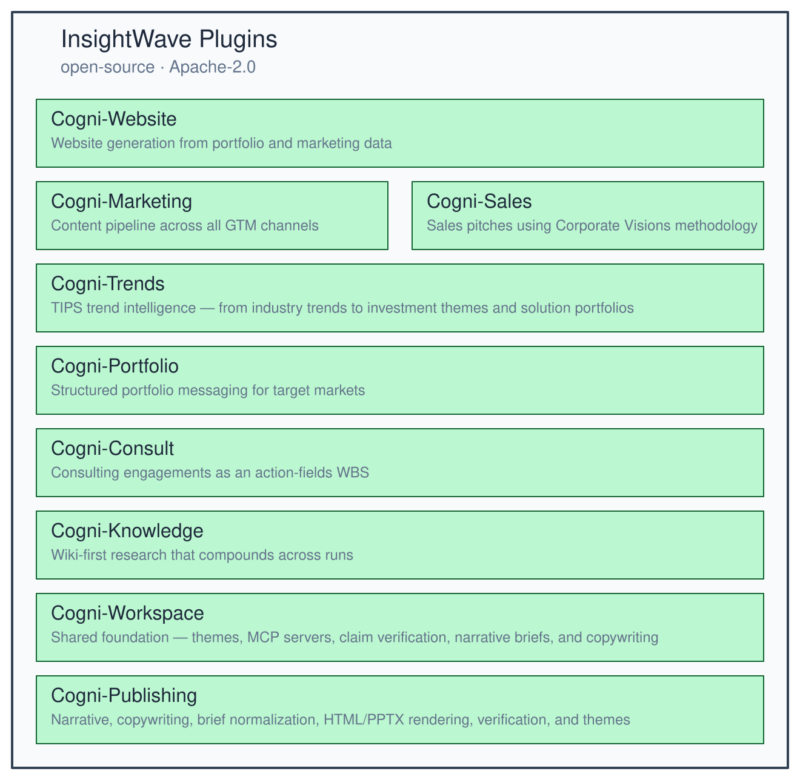

# insight-wave

Open-source plugins for consulting, sales, and marketing on [Claude Code](https://claude.ai/code). 8 Apache-2.0 plugins that automate the research-heavy, methodology-driven work behind B2B deliverables — trend scouting, portfolio positioning, sales pitches, content creation, visual production, website generation, knowledge management, and source verification.

Each plugin implements an established framework (Corporate Visions, Double Diamond, TIPS, IS/DOES/MEANS) rather than general-purpose text generation. Outputs include inline citations, structured data models, and quality gates. Every deliverable follows a reproducible methodology you can inspect and override.

**European-first, multi-market & multilingual.** insight-wave is built for European B2B, not DACH alone. Research, trend scouting, and portfolio positioning run bilingually (local language + English) against curated regional authority sources across a built-out European set — DACH/DE, FR, IT, ES, NL, PL — plus UK and US, with 16+ output languages in native UTF-8. A broader set of registered regions (single-country, composite EU/Nordics, and global) is taxonomy-ready for expansion. See **[Supported markets & languages](cogni-workspace/README.md#supported-markets--languages)** for the full registry and the built-out-vs-registered distinction.


*Plugin ecosystem architecture — edit source: `assets/architecture.excalidraw`*

## What the plugins do

8 plugins organized around eight capability areas: one horizontal area — cogni-workspace, the shared workspace layer every other plugin builds on — and seven vertical areas, one per business-domain plugin, each keeping its own project lifecycle. Plugins share data formats and can be used independently or together.

### Workspace Infrastructure

[cogni-workspace](cogni-workspace/README.md) is the horizontal layer every other plugin builds on. It manages the shared foundation — environment variables, MCP server installation, theme management, plugin discovery, and workspace health. Runs dependency checks, discovers installed plugins, and generates shared settings. Includes Obsidian vault integration for browsable knowledge management. 14 skills and 19 agents.

> "Initialize my insight-wave workspace and check plugin health"

**Rendering.** The `text-to-narrative` skill turns text into an arc-driven narrative and hands it to Claude Design as one design brief for slides, a document, an infographic or a web page. Existing briefs still render inside Claude Code: `render-html-slides` and the `pptx` agent for decks (11 layout types), the `web` and `storyboard` agents for scrollable pages and printed poster series, and `/render-infographic` for single-page infographics into .pptx, .excalidraw, .pen, or .html files. All visuals inherit brand identity from your workspace theme.

> "Turn the sales narrative into a design brief for slides, then enrich the trend report with charts and diagrams"

**Narrative and executive copy.** The `narrative` skill transforms structured content into executive narratives using 15 story arc frameworks, and the `copywriter` skill polishes any document for executive readability using 7 messaging frameworks (BLUF, Pyramid, SCQA, STAR, PSB, FAB, Inverted Pyramid) with 5 parallel stakeholder personas to catch blind spots.

**Source verification.** The `claims` skill verifies whether sourced claims match what their cited sources actually say — catching misquotations, unsupported conclusions, selective omissions, and stale data. Other plugins register claims during generation; cogni-workspace fetches each source and flags deviations for your review.

> "Verify all claims in the trend report against their cited sources"

→ [Plugin guide](docs/plugin-guide/cogni-workspace.md) · [Getting started](docs/workflows/install-to-infographic.md)

### Knowledge Management

[cogni-knowledge](cogni-knowledge/README.md) is the wiki-first research orchestrator — it binds its own vendored wiki knowledge base to any number of research projects so findings compound across runs instead of dying in chat history. Its zero-network inverted pipeline (plan → curate → fetch → ingest → compose → verify → finalize) deposits verified syntheses straight into the wiki, where future questions read them as prior framing. 21 skills and 16 agents.

> "Set up a knowledge base on the EU AI Act and deposit my first research synthesis"

→ [Plugin guide](docs/plugin-guide/cogni-knowledge.md)

### Consulting Orchestration

[cogni-consult](cogni-consult/README.md) manages consulting engagements where action fields are the work-breakdown-structure containers for every deliverable. Scoping derives 3-6 action fields from one SMART key question; each deliverable runs its own design-thinking loop (empathize→define→ideate→prototype→test), acting stakeholder personas challenge the work in their own voice, and one cogni-knowledge base per engagement compounds research across all deliverables. 9 skills and 4 agents.

> "I need to evaluate strategic options for expanding our cloud services portfolio in the DACH mid-market"

→ [Plugin guide](docs/plugin-guide/cogni-consult.md) · [Consulting Engagement workflow](docs/workflows/consulting-engagement.md)

### Trend Intelligence

[cogni-trends](cogni-trends/README.md) scouts industry trends across four TIPS dimensions with bilingual DE/EN web research, producing 60 scored trend candidates per run using multi-framework analysis (TIPS, Ansoff, Rogers, CRAAP). The value-modeler consolidates candidates into 3-7 investment themes with solution blueprints. Reusable industry catalogs accumulate knowledge across engagements. European-first with curated institutional sources per market — German-rooted (VDMA, BITKOM, Fraunhofer) and extending across FR/IT/ES/NL/PL plus UK/US. 9 skills and 12 agents.

> "Scout trends for the automotive industry, then model investment themes from the results"

→ [Plugin guide](docs/plugin-guide/cogni-trends.md) · [Trends to Solutions workflow](docs/workflows/trends-to-solutions.md)

### Portfolio Messaging

[cogni-portfolio](cogni-portfolio/README.md) structures products, features, and target markets into market-specific value propositions using IS/DOES/MEANS messaging. 21 skills handle the full positioning lifecycle — from TAM/SAM/SOM market sizing and competitive analysis through three-layer quality assessment to export-ready proposals and workbooks. Eight industry taxonomies (ICT, SaaS, FinTech, HealthTech, MarTech, Industrial Tech, Professional Services, Open Source) classify your portfolio automatically. 21 skills and 20 agents.

> "Set up a portfolio for our cloud monitoring product targeting mid-market SaaS companies in DACH"

→ [Plugin guide](docs/plugin-guide/cogni-portfolio.md) · [Portfolio to Pitch workflow](docs/workflows/portfolio-to-pitch.md)

### Content Production

[cogni-marketing](cogni-marketing/README.md) bridges portfolio propositions and trend themes into channel-ready content across 16 formats — blogs, LinkedIn articles, whitepapers, battle cards, email nurtures, video scripts, and more. A 3D content matrix (market x GTM path x content type) tracks coverage gaps. 11 skills and 3 agents.

> "Generate thought leadership content for the AI automation theme across LinkedIn and blog formats"

→ [Plugin guide: cogni-marketing](docs/plugin-guide/cogni-marketing.md) · [Content Pipeline workflow](docs/workflows/content-pipeline.md)

### Sales Pitches

[cogni-sales](cogni-sales/README.md) generates account-specific pitches using the Corporate Visions Why Change methodology — four research phases (Why Change, Why Now, Why You, Why Pay) each backed by a dedicated web research agent. Outputs a `sales-presentation.md` and `sales-proposal.md` with sequential citations. Works in two modes: customer mode for named accounts with company-specific research, or segment mode for reusable market-vertical pitches. 1 skill and 4 agents.

> "Create a Why Change pitch for Siemens Manufacturing based on our managed services portfolio"

→ [Plugin guide](docs/plugin-guide/cogni-sales.md) · [Portfolio to Pitch workflow](docs/workflows/portfolio-to-pitch.md)

### Website Generation

[cogni-website](cogni-website/README.md) assembles multi-page customer websites from portfolio, marketing, trend, and research content produced by other plugins — outputting a deployable static site with shared navigation, theming, and responsive HTML. Service pages update in minutes as your portfolio model changes, staying consistent with your messaging and SEO-optimized. 6 skills and 3 agents.

> "Build a customer website from our portfolio and marketing content with a Pencil-rendered hero"

→ [Plugin guide](docs/plugin-guide/cogni-website.md) · [Portfolio to Website workflow](docs/workflows/portfolio-to-website.md)

Beyond the open-source plugins, cogni-works offers consulting services — plugin engineering for domain-specific workflows, managed deployment, and a partner certification program — through [cogni-work.ai](https://cogni-work.ai). Whether you run a consulting practice, a sales organization, or a marketing team, the site shows how these capabilities translate into managed workflows and onboarding for your team.

## Who this is for

### Consulting Firms

You compete on methodology depth, not headcount — but quality assurance depends on individual partners, and every pitch costs days of senior capacity.

- **Account-specific pitches in 90 minutes** — [cogni-sales](cogni-sales/README.md) generates Corporate Visions Why Change pitches with web-researched evidence per customer → [Portfolio to Pitch](docs/workflows/portfolio-to-pitch.md)
- **Verified research that compounds** — [cogni-knowledge](cogni-knowledge/README.md) runs a zero-network inverted pipeline to produce syntheses sourced from curated regional authorities with citation-consistent verification, deposited into a wiki that future runs read first
- **60 scored trend candidates per scouting run** — [cogni-trends](cogni-trends/README.md) identifies industry trends across four TIPS dimensions with bilingual DE/EN research → [Trends to Solutions](docs/workflows/trends-to-solutions.md)
- **Engagements run as action-field WBS** — [cogni-consult](cogni-consult/README.md) orchestrates consulting engagements with per-deliverable design thinking and acting persona challenges → [Consulting Engagement](docs/workflows/consulting-engagement.md)
- **Consistent portfolio messaging** — [cogni-portfolio](cogni-portfolio/README.md) structures IS/DOES/MEANS propositions across Feature x Market pairs with three-layer quality assessment
- **Service pages that track your portfolio** — [cogni-website](cogni-website/README.md) generates responsive websites from your portfolio model, updated in minutes as offerings evolve

**Start here:** [cogni-sales](cogni-sales/README.md), [cogni-knowledge](cogni-knowledge/README.md), [cogni-portfolio](cogni-portfolio/README.md)

For consulting on applying these workflows in client engagements, or to certify your team as practitioners: [cogni-work.ai](https://cogni-work.ai)

### Sales Organizations

Your reps spend 2-3 days per opportunity on research and deck creation. The standard presentation stops working after the third customer — but account-specific pitches require senior capacity tied up in large deals.

- **Methodology-disciplined pitches** — [cogni-sales](cogni-sales/README.md) follows the full Corporate Visions arc (Why Change → Why Now → Why You → Why Pay) with web-researched evidence per phase
- **Verified account briefings** — [cogni-knowledge](cogni-knowledge/README.md) delivers market data — bound to your target market and bilingually sourced — you can stand behind in front of a customer, with every claim citation-checked
- **Consistent messaging from one foundation** — [cogni-portfolio](cogni-portfolio/README.md) produces buyer-role-specific value propositions for each opportunity
- **Proposals and one-pagers without the marketing queue** — [cogni-marketing](cogni-marketing/README.md) generates sales enablement content (battle cards, demo scripts, objection handlers) from portfolio data
- **Always-current solution pages** — [cogni-website](cogni-website/README.md) publishes product and solution pages directly from the portfolio model, conversion-optimized and consistent with your messaging

**Start here:** [cogni-sales](cogni-sales/README.md), [cogni-portfolio](cogni-portfolio/README.md), [cogni-knowledge](cogni-knowledge/README.md)

For CRM integration and managed deployment of sales workflows: [cogni-work.ai](https://cogni-work.ai)

### Marketing Teams

Your pipeline needs more content, but the budget doesn't cover additional headcount. Meanwhile, every format is written from scratch and brand voice varies by channel.

- **16 content formats from one narrative** — [cogni-marketing](cogni-marketing/README.md) generates blog, LinkedIn, newsletter, and whitepaper from a single source in consistent brand voice → [Content Pipeline](docs/workflows/content-pipeline.md)
- **Source-verified thought leadership** — [cogni-knowledge](cogni-knowledge/README.md) produces market data sourced from curated regional authorities with citation-consistent verification — no invented statistics
- **Consistent messaging foundation** — [cogni-portfolio](cogni-portfolio/README.md) translates your positioning into market-specific value propositions across all channels
- **Trend-driven content relevance** — [cogni-trends](cogni-trends/README.md) identifies industry trends for thought leadership content, structured by TIPS dimensions → [Trends to Solutions](docs/workflows/trends-to-solutions.md)
- **Website pages from your content engine** — [cogni-website](cogni-website/README.md) assembles SEO-optimized service pages from portfolio and marketing outputs, keeping your web presence in sync with your content calendar

**Start here:** [cogni-marketing](cogni-marketing/README.md), [cogni-portfolio](cogni-portfolio/README.md), [cogni-knowledge](cogni-knowledge/README.md)

For CMS integration and managed content operations: [cogni-work.ai](https://cogni-work.ai)

## Install

Install insight-wave via Claude Code desktop — about 15 minutes from zero, in this order:

1. **Install Claude Code** — [Claude Code desktop guide](docs/claude-code-desktop.md) — macOS, Windows, authentication, troubleshooting. Skip if you already have it.
2. **Configure for your environment** *(optional, enterprise only)* — [Deployment Guide](docs/deployment-guide.md) — GDPR, SSO, managed settings, MDM / Group Policy. Skip unless your firm mandates managed Claude Code settings before install.
3. **Install insight-wave and render your first infographic** — [From Install to Infographic](docs/workflows/install-to-infographic.md) — adds the marketplace, installs plugins, runs `/install-mcp`, renders your first infographic. This is the capstone step where you go from installed to producing.

### Security & compliance

For regulated environments — GDPR, SSO, managed settings, MDM / Group Policy, egress controls, audit logging — the [Deployment Guide](docs/deployment-guide.md) covers the enterprise-grade configuration options and trust-boundary decisions. Individual-install users can skip this; it matters only when your firm mandates managed Claude Code settings before install. The guide is derived from `cogni-docs/references/deploy-data.json` and refreshed whenever the underlying Anthropic / Claude Code posture changes.

### MCP servers at a glance

Some plugins extend their capabilities through external [MCP servers](https://docs.anthropic.com/en/docs/build-with-claude/mcp). No plugin declares a server itself — `cogni-workspace:install-mcp` installs it on demand and writes it into your own MCP config, so nothing is configured on a machine that never installed it.

| MCP Server | Used by | What it enables | Install |
|------------|---------|-----------------|---------|
| excalidraw | [cogni-portfolio](cogni-portfolio/README.md), [cogni-workspace](cogni-workspace/README.md) | Diagram rendering (infographics, concept diagrams, solution architecture, report enrichment) | Auto-installed by `manage-workspace` from [yctimlin/mcp_excalidraw](https://github.com/yctimlin/mcp_excalidraw) (git clone + build). Includes React canvas on localhost:3000. |
| claude-in-chrome | [cogni-website](cogni-website/README.md), [cogni-workspace](cogni-workspace/README.md) | Browser automation — claim verification, website preview | Manual — install [Chrome extension](https://code.claude.com/docs/en/chrome) |
| pencil | [cogni-website](cogni-website/README.md), [cogni-workspace](cogni-workspace/README.md) | Web narrative, storyboard, and poster rendering; homepage hero generation | Manual — open [Pencil](https://docs.pencil.dev/getting-started/installation) desktop app |

Plugins that don't use MCP servers work without them — only install what you need.

### Learn more

- [MCP overview](https://docs.anthropic.com/en/docs/build-with-claude/mcp) — what Model Context Protocol is and how it works
- [MCP course](https://anthropic.skilljar.com/introduction-to-model-context-protocol) — hands-on introduction to building and using MCP servers
- [Build an MCP server](https://modelcontextprotocol.io/docs/develop/build-server) — official MCP development docs

## How it works

insight-wave runs on [Claude Code](https://claude.ai/code), Anthropic's agentic coding tool. Plugins are installed from this marketplace and loaded on demand — skills, agents, and slash commands activate when relevant to your task.

The workplace combines Claude Code with [Obsidian](https://obsidian.md/) for persistent, browsable knowledge management. Everything runs on your laptop — no cloud infrastructure required, GDPR-compliant by design.

```
insight-wave/
├── .claude-plugin/
│   └── marketplace.json                    # Marketplace manifest (8 plugins)
├── docs/                                   # User documentation
│   ├── getting-started.md                  # Forwarder → workflows/install-to-infographic.md
│   ├── ecosystem-overview.md               # Plugin landscape and data flow
│   ├── plugin-guide/                       # Per-plugin deep dives (8 guides)
│   ├── workflows/                          # Cross-plugin pipeline guides (7 workflows)
│   ├── architecture/                       # Design philosophy, plugin anatomy, ER diagram
│   └── contributing/                       # Plugin development guide
├── cogni-consult/                          # Action-fields-WBS consulting orchestrator
├── cogni-knowledge/                        # Wiki-first research orchestrator
├── cogni-marketing/                        # B2B marketing content engine
├── cogni-portfolio/                        # Portfolio messaging & planning
├── cogni-sales/                            # B2B sales pitch generation
├── cogni-trends/                           # Trend scouting & reporting
├── cogni-website/                          # Multi-page customer websites
├── cogni-workspace/                        # Workspace orchestrator
├── cogni-portfolio-evals/                  # Eval harness (not a marketplace plugin)
├── CLA.md                                  # Contributor License Agreement
├── CODE_OF_CONDUCT.md                      # Contributor Covenant v2.1
├── CONTRIBUTING.md                         # Contribution guide & CLA info
├── LICENSE                                 # Apache-2.0
├── MARKETPLACE_TERMS.md                    # Third-party plugin terms
├── SECURITY.md                             # Vulnerability disclosure policy
├── community-plugin-contributing-template.md
└── README.md
```

Plugins follow the [Claude Code plugin standard](https://code.claude.com/docs/en/plugins-reference). No external dependencies — everything runs inside your Claude Code session.

## Plugins at a glance

| Plugin | Capability | Skills | Agents | What it does |
|--------|-----------|--------|--------|--------------|
| [cogni-knowledge](cogni-knowledge/README.md) | Knowledge Management | 21 | 16 | Wiki-first research orchestrator — binds its own vendored wiki base to N research projects so findings compound across runs via a zero-network inverted pipeline |
| [cogni-consult](cogni-consult/README.md) | Consulting Orchestration | 9 | 4 | Action-fields-WBS consulting orchestrator with per-deliverable design thinking and acting stakeholder personas |
| [cogni-trends](cogni-trends/README.md) | Trend Intelligence | 9 | 12 | TIPS trend scouting with bilingual DE/EN research, investment theme modeling, and reusable industry catalogs |
| [cogni-portfolio](cogni-portfolio/README.md) | Portfolio Messaging | 21 | 20 | IS/DOES/MEANS portfolio positioning with eight industry taxonomies, competitive analysis, and market sizing |
| [cogni-marketing](cogni-marketing/README.md) | Content Production | 11 | 3 | B2B marketing content engine — 16 formats across thought leadership, demand gen, lead gen, sales enablement, ABM |
| [cogni-sales](cogni-sales/README.md) | Sales Pitches | 1 | 4 | Corporate Visions Why Change pitch generation for named customers or market segments |
| [cogni-website](cogni-website/README.md) | Website Generation | 6 | 3 | Multi-page customer websites from portfolio, marketing, and research content with shared navigation and theming |
| [cogni-workspace](cogni-workspace/README.md) | Workspace Infrastructure | 14 | 19 | Shared foundation — env vars, MCP installation, theme management, plugin discovery, workspace health, Obsidian integration, bundled wiki, claim verification, story-arc narrative to Claude Design brief, executive copywriting, and slide/infographic/storyboard/web rendering |

**92 skills, 81 agents** across the 8 active plugins.

See [Cross-Plugin Data Flow](docs/er-diagram.md) for how data flows between plugins, or browse the [full documentation](docs/ecosystem-overview.md).

Workflow guides: [Install to Infographic](docs/workflows/install-to-infographic.md) | [Research to Report](docs/workflows/research-to-report.md) | [Portfolio to Pitch](docs/workflows/portfolio-to-pitch.md) | [Portfolio to Website](docs/workflows/portfolio-to-website.md) | [Trends to Solutions](docs/workflows/trends-to-solutions.md) | [Consulting Engagement](docs/workflows/consulting-engagement.md) | [Content Pipeline](docs/workflows/content-pipeline.md)

## Querying the wiki

A vendor-curated reference wiki ships at [`wiki/`](wiki/) with grounded, citable answers about the ecosystem — plugins, skills, agents, architecture, conventions, workflows, and cross-cutting concepts. Built on the Karpathy-style wiki engine (now vendored into [`cogni-knowledge`](cogni-knowledge/README.md)): every answer cites specific wiki pages, never draws from model memory, and links back to the canonical source on GitHub.

**From a clone of this repo:** start at [`wiki/index.md`](wiki/wiki/index.md) — point Claude at that index and it reads the pages it needs, citing each one.

**From a marketplace install:** the same wiki ships bundled inside `cogni-workspace` and lands in the plugin cache on install; start at that bundle's own `wiki/index.md`.

Plugin updates refresh the bundled wiki automatically — no separate update step needed. Users who want their own personal, mutable knowledge base should run `cogni-knowledge:knowledge-setup` to create one of their own.

## Contributing

We welcome contributions. See [CONTRIBUTING.md](CONTRIBUTING.md) for workflow, CLA requirements, and marketplace plugin guidelines. By participating you agree to abide by our [Code of Conduct](CODE_OF_CONDUCT.md).

To build your own plugin, start from the [community plugin template](community-plugin-contributing-template.md) and the [plugin development guide](docs/contributing/plugin-development.md).

Contributions range from bug fixes and documentation improvements to new plugins and taxonomy templates. Open an issue to discuss your plugin idea before starting development — we'll help you find the right architecture fit.

All plugins are developed directly in this monorepo. To report issues or suggest improvements, open an issue on [insight-wave](https://github.com/cogni-work/insight-wave/issues).

## Professional services

Build your own plugins using the [community template](community-plugin-contributing-template.md) and the [Claude Code plugin standard](https://code.claude.com/docs/en/plugins-reference).

cogni-works offers plugin engineering for domain-specific workflows, managed deployment with team onboarding, and a partner certification program for firms building practices on the platform. These services complement the open-source plugins with implementation expertise, ongoing maintenance, and formal qualification paths.

[cogni-work.ai](https://cogni-work.ai)

## License

All plugins are licensed under Apache-2.0. See [LICENSE](LICENSE) for details.

---

Built by [cogni-work](https://cogni-work.ai) — open-source plugins for Claude Code.
