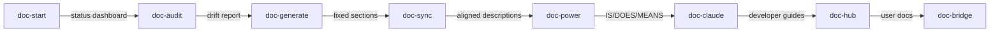

# Workflow: Documentation Pipeline

**Pipeline**: cogni-docs (doc-start → doc-audit → doc-generate → doc-sync → doc-power → doc-claude → doc-hub → doc-bridge)
**Duration**: 30-90 min depending on number of plugins
**Use case**: Maintainer documenting a monorepo or improving existing plugin documentation

## Step 0: Entry Point (doc-start)

**Command**: `/doc-start`

**Input**: A repo path (prompted if not configured)
**Output**: Status dashboard + recommended next action

**Tips**:
- Start here if you're unsure what documentation needs work
- doc-start runs a quick scan and recommends the single highest-priority action
- If you already know what to do, skip straight to the specific skill

## Step 1: Audit (doc-audit)

**Command**: `/doc-audit` or `/doc-audit {plugin-name}`

**Input**: Plugin directories to audit
**Output**: Drift report with 9 checks per plugin (components, architecture, descriptions, dependencies, plugin.json, CLAUDE.md, messaging, docs/, commercial tone)

**Tips**:
- Run on all plugins first to get the full picture
- The summary table shows OK/DRIFT/MISSING/WEAK per category at a glance
- Focus on DRIFT and MISSING first — those are the most impactful fixes

## Step 2: Generate (doc-generate)

**Command**: `/doc-generate {plugin-name}` or `/doc-generate all`

**Input**: Plugins with structural drift (component tables, architecture trees)
**Output**: Updated README sections rebuilt from actual disk contents

**Tips**:
- Only regenerates auto-generatable sections — hand-written messaging is preserved
- New plugins get IS/DOES/MEANS scaffolded placeholders
- Review before committing — structural accuracy is automated, voice is not

## Step 3: Sync (doc-sync)

**Command**: `/doc-sync {plugin-name}` or `/doc-sync all`

**Input**: Plugins with description alignment drift
**Output**: Unified descriptions across README, plugin.json, and marketplace.json

**Tips**:
- README is the canonical source — plugin.json and marketplace.json are derived
- Skip if doc-audit showed no description alignment issues

## Step 4: Power Message (doc-power)

**Command**: `/doc-power {plugin-name}` or `/doc-power all`

**Input**: Plugins with weak or missing IS/DOES/MEANS messaging
**Output**: Draft messaging for hand-written sections (title, problem table, identity, benefits)

**Tips**:
- Shows side-by-side comparisons — never overwrites without approval
- Focus on plugins the audit flagged as WEAK
- Optionally pass `--polish` to bring in cogni-copywriting for additional polish

## Step 5: CLAUDE.md (doc-claude)

**Command**: `/doc-claude {plugin-name}`

**Input**: Complex plugins (5+ skills, 3+ agents) lacking a developer guide
**Output**: CLAUDE.md with architecture, component inventory, design principles, data model

**Tips**:
- Only needed for complex plugins — the audit flags which ones qualify
- Skip entirely for simple plugins with fewer than 5 skills

## Step 6: Hub (doc-hub)

**Command**: `/doc-hub all` or `/doc-hub --category=workflows`

**Input**: The complete set of plugin READMEs and SKILL.md files
**Output**: docs/ directory with plugin guides, workflow guides, getting-started, architecture docs

**Tips**:
- Transforms README pitch voice into tutorial voice
- Discovers and documents cross-plugin workflows automatically
- Run after messaging is finalized — doc-hub reads the current README state

## Step 7: Bridge (doc-bridge)

**Command**: `/doc-bridge`

**Input**: All plugin READMEs and docs/ content
**Output**: Journey-based root README grouping plugins by workflow stage

**Tips**:
- Run last — the bridge reads everything else and creates a narrative overview
- Groups plugins as Research → Analyze → Articulate → Sell → Visualize → Verify → Learn
- Preserves hand-written sections like "Who This Is For" and "Contributing"

## Not Every Step Is Required

Most documentation sessions use 2-3 skills, not all 8. Common subsets:

- **Quick health check**: doc-start → doc-audit (just scan and report)
- **Fix stale docs**: doc-audit → doc-generate → doc-sync (structural fixes only)
- **Improve messaging**: doc-audit → doc-power (messaging focus)
- **Full documentation**: all steps in order (comprehensive overhaul)

doc-start recommends which subset based on what it finds.
