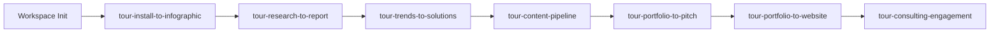

# Workflow: Full Onboarding

**Pipeline**: cogni-workspace → cogni-help workflow tours
**Duration**: ~5–6 hours total (spread across sessions)
**Use case**: New user learning the complete insight-wave ecosystem

## Step 1: Initialize Workspace

**Command**: `/manage-workspace`

**Input**: Your project directory
**Output**: Configured workspace with env vars, settings, themes, and plugin discovery

**Tips**:
- Do this before starting any tours — the workspace provides the foundation
- Choose your language preference (EN/DE) during setup
- Pick a theme with `/pick-theme` — it affects all visual output

## Step 2: Start Learning

**Command**: `/teach tour-install-to-infographic`

**Output**: Interactive `tour-install-to-infographic` (the first-run capstone tour) — chains cogni-workspace, themes, and cogni-visual into a single deliverable

**Tips**:
- The install-to-infographic tour is meta — it produces a real artifact and shows you the cross-plugin handoff shape
- Progress is saved automatically — resume anytime with `/teach tour-install-to-infographic`
- Check your progress at any time with `/courses`

## Step 3: Follow the Curriculum

Work through the seven tours. Each tour walks an end-to-end pipeline; later
tours assume the earlier ones have given you the cross-plugin reflexes:

| Tour | Pipeline | Time |
|------|----------|------|
| `tour-install-to-infographic` | cogni-workspace → themes → cogni-visual | ~45 min |
| `tour-research-to-report` | cogni-research → cogni-narrative → cogni-visual | ~45 min |
| `tour-trends-to-solutions` | cogni-trends → cogni-portfolio → cogni-marketing | ~50 min |
| `tour-content-pipeline` | cogni-marketing → cogni-narrative → cogni-copywriting → cogni-visual | ~50 min |
| `tour-portfolio-to-pitch` | cogni-portfolio → cogni-narrative → cogni-sales → cogni-visual | ~50 min |
| `tour-portfolio-to-website` | cogni-portfolio → cogni-workspace → cogni-website | ~45 min |
| `tour-consulting-engagement` | cogni-consulting (Discover → Define → Develop → Deliver) | ~60 min |

**Tips**:
- Each tour has exercises that create real artifacts in `_teacher-exercises/`
- Skip-ahead is allowed if you're already proficient in a pipeline
- The teach skill checks plugin prerequisites before each exercise — install missing plugins via the marketplace before continuing
- `tour-consulting-engagement` is the capstone — it orchestrates most other plugins via the cogni-consulting Double Diamond

## Step 4: Practice

After completing tours, reinforce learning with real work:

1. Pick a small project in your domain
2. Use `/guide` to find the right plugins for your task
3. Use `/workflow` to see how plugins chain together
4. File issues with `/issues` if you encounter problems

## Common Pitfalls

- **Skipping the install-to-infographic tour**: Even experienced users benefit from
  walking the workspace → themes → visual handoff once. The artifact you produce
  doubles as a smoke test that the workspace is configured correctly.
- **Binge learning**: Spread tours across sessions. Exercises build muscle memory
  better when you've had time to let concepts settle.
- **Not doing exercises**: Reading theory without hands-on practice doesn't stick.
  Each tour exercise produces a deliverable you can keep and reuse.
