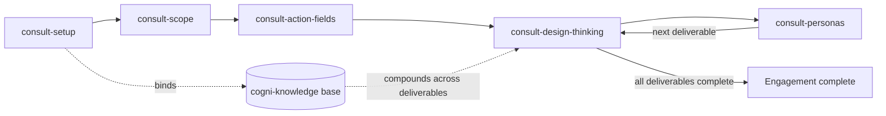

# Workflow: Consulting Engagement

**Pipeline**: cogni-consult setup → scope → action fields → design-thinking loops → persona challenges (resume anytime)
**Duration**: Days to weeks depending on engagement scope and number of action fields
**Use case**: Consultant starting a structured engagement with compounding research

> The previous version of this playbook covered the cogni-consulting
> (Double Diamond) plugin, which has been removed (source in git history).
> New engagements use cogni-consult.

## Step 1: Setup

**Command**: `/cogni-consult:consult-setup`

**Input**: Engagement name, client, desired outcome, market, language
**Output**: Scaffolded engagement directory (`scope/`, `action-fields/`, `personas/`, `.metadata/`) with `consult-project.json`, plus a bound cogni-knowledge base

**Tips**:
- The knowledge-base binding is the high-leverage step — every deliverable's research compounds through it
- One base per engagement, always; running `knowledge-setup` twice creates a second base research won't route through
- Setup registers the engagement so `consult-resume` finds it from any directory

## Step 2: Scope

**Command**: `/cogni-consult:consult-scope`

**Dispatches to**: cogni-knowledge (when a scoping dimension needs market or regulatory evidence)

**Output**: One SMART key question (`scope/key-question.md`) and 3-6 named action fields — the engagement's work-breakdown structure

**Tips**:
- Walk all five dimensions: Strategic Context, Scope, Stakeholder, Constraints / Barriers, Success factors
- Route research gaps through the bound knowledge base — never raw web search; syntheses land in `scope/research/`
- Six action fields is the ceiling — merge closely related themes at scoping time

## Step 3: Plan the Action-Field WBS

**Command**: `/cogni-consult:consult-action-fields`

**Output**: Fields × deliverables dashboard, planned deliverable sets per field (`field.json`), and a recommended next deliverable

**Tips**:
- For empty fields, the skill proposes 1-3 deliverables from the deliverable-types catalog by field-type affinity
- Fields can be added, split, or merged at any point; each deliverable lives in exactly one field
- Multiple fields can have deliverables in-progress simultaneously — parallel progress is fine

## Step 4: Run the Design-Thinking Loop

**Command**: `/cogni-consult:consult-design-thinking`

**Dispatches to**: cogni-knowledge (knowledge-query first, full research pipeline only when the base is silent)

**Output**: A deliverable artifact (Obsidian-browsable markdown) with `sources[]` lineage on every evidence-backed claim

**Tips**:
- Five stages per deliverable: empathize → define → ideate → prototype → test
- At empathize, query the knowledge base before any new research — prior deliverables' syntheses are reusable
- Finalized syntheses are copied to `action-fields/{field}/research/{topic}.md` for stable paths
- The loop scales to fit — simple deliverables converge in one pass; don't skip it, the decision log is the defensibility

## Step 5: Challenge with Acting Personas

**Command**: `/cogni-consult:consult-personas`

**Output**: Persona challenges recorded in the deliverable's `## Persona Challenges` section and the persona's work log

**Tips**:
- Shipped defaults: consulting partner (frameworks, commercial defensibility) and project manager (delivery realism)
- Three modes: define (seed client-side personas from the Stakeholder dimension), enrich (empathy map from engagement evidence), challenge
- Enrich before challenging — an unenriched persona pushes back with generic frameworks
- Challenges inform, never block; the consultant dispositions each (accepted / revised / rejected with reason)

## Step 6: Resume Across Sessions

**Command**: `/cogni-consult:consult-resume`

**Output**: WBS dashboard plus exactly one recommended next action

**Tips**:
- Read-only — it never edits engagement state
- One recommendation, not a menu; on confirmation it dispatches the named skill with the engagement path handed off

## Common Pitfalls

- **Skipping the knowledge-base binding**: Without it every deliverable's research
  starts cold. The binding happens at setup and cannot be retrofitted cleanly.
- **Deriving too many action fields**: More than six means thinner deliverable
  sets per field and an unreadable WBS dashboard.
- **Not enriching personas before challenging**: Even one or two enriched
  empathy-map quadrants sharpen the feedback considerably.
- **Treating the engagement as a linear sequence**: Deliverables track
  independently; the WBS handles parallel progress across fields.
