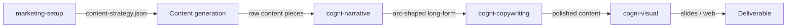

# Workflow: Content Pipeline

**Pipeline**: cogni-marketing → cogni-narrative (long-form only) → cogni-copywriting → cogni-visual
**Duration**: 2–6 hours for a complete content batch, depending on format count and polish depth
**Use case**: Multi-channel marketing content production — articles, battle cards, email nurtures, plus optional slide deck or web narrative — sourced from portfolio propositions and TIPS themes

**Narrative bridge.** For long-form formats (thought leadership, whitepapers, keynote abstracts), `cogni-narrative` sits between content generation and polish — it applies a story arc framework and writes `arc_id` frontmatter that `cogni-copywriting` reads for arc-aware polishing. Short-form formats (LinkedIn posts, battle cards, emails) skip this step and go straight from generation to polish.

## Step 1: Set Up the Marketing Project (cogni-marketing)

**Command**: `/marketing-setup`

**Input**: A cogni-portfolio project, optionally a TIPS project from cogni-trends
**Output**: `marketing-project.json` with brand voice, target markets, and GTM-path-to-theme mapping

**Tips**:
- Set tone, language, and industry conventions during setup — they apply to every generated piece
- Without a TIPS project the engine uses generic themes; for strategy-connected content, run `/trend-scout` first
- Bilingual projects: pick `de` or `en` as primary — content can later be regenerated in the other language

## Step 2: Build the Content Strategy (cogni-marketing)

**Command**: `/content-strategy`

**Input**: `marketing-project.json` plus portfolio and trends data
**Output**: A 3D matrix across markets × GTM paths × content types with priority sequencing

**Tips**:
- The matrix surfaces gaps — start with the highest-priority cell at the intersection of your most important market and strongest theme
- Treat the matrix as a plan, not a target — you don't have to fill every cell to ship a campaign
- Re-run after adding new propositions; the diff shows where coverage changed

## Step 3: Generate Content (cogni-marketing)

**Command**: One per funnel stage:

| Funnel stage | Content type | Command |
|--------------|--------------|---------|
| Awareness | Thought leadership | `/thought-leadership` |
| Engagement | Demand generation | `/demand-gen` |
| Conversion | Lead generation | `/lead-gen` |
| Decision | Sales enablement | `/sales-enablement` |
| Account-specific | ABM | `/abm` |

**Input**: `content-strategy.json` plus the format and theme you're targeting
**Output**: Raw content pieces in up to 16 formats — blog posts, LinkedIn articles and posts, whitepapers, email nurtures, battle cards, one-pagers, video scripts, carousels

**Tips**:
- Content-writer agents run in parallel — request multiple pieces in one prompt to generate a batch
- Each piece references the TIPS claims and portfolio propositions it draws from — sourced content traces back to data
- For named-account work, skip Steps 2–3 and go straight to `/abm` with the target account

## Step 4: Polish with cogni-copywriting

**Command**: `/copywrite <content-path>` per piece, or describe the batch task

**Input**: Raw content from Step 3 (or `arc_id`-tagged narrative for long-form)
**Output**: Polished pieces optimized for executive readability and channel conventions

**Tips**:
- Pyramid Principle, BLUF, active voice, readability scoring — the polish skill applies framework-aware rewrites
- For multi-stakeholder content (whitepapers, executive briefings), run `/review-doc` after polish — five reader personas score and synthesize feedback
- German content auto-detects and applies Wolf Schneider rules with Amstad readability scoring

## Step 5: Render to Visual (Optional, cogni-visual)

**Command**: Describe the output you want — `/render-html-slides`, web narrative, or a campaign summary deck

**Input**: Long-form polished content from Step 4
**Output**: A PPTX deck, a scrollable web narrative, or a campaign-summary deck

**Tips**:
- cogni-visual reads the polished narrative, detects the story arc, and maps content to slide layouts with assertion headlines
- For a leave-behind document or a microsite, prefer the web-narrative format over slides
- Stop at Step 4 if the content stays in markdown; visual rendering is opt-in

## Common Pitfalls

- **Channel overload.** 16 formats is what cogni-marketing supports — not a target for one sprint. Start with 3–4 priority channels and expand after the first batch performs.
- **Skipping the content strategy.** Generating content without the matrix means no coverage visibility. You end up with content for the topics that feel interesting, not the gaps that matter strategically.
- **Polishing before the strategy is final.** Polish a blog post and then change the GTM path it targets, and you redo the work. Generate first, validate strategy fit, then polish.
- **Generic content from generic themes.** Shallow TIPS themes or portfolio propositions without market-specific DOES/MEANS produce generic filler. Invest in specific input data before scaling generation.

---

For the narrative tutorial — including the full content-type-to-skill table, parallel generation patterns, campaign orchestration, content-calendar scheduling, and variations matrix — see [`docs/workflows/content-pipeline.md`](../../../../../docs/workflows/content-pipeline.md).
