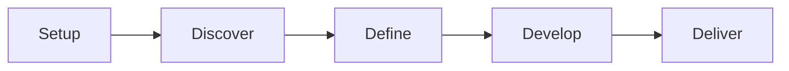

# Workflow: New Consulting Engagement

**Pipeline**: cogni-consulting setup → Discover → Define → Develop → Deliver
**Duration**: Days to weeks depending on engagement scope
**Use case**: Consultant starting a structured Double Diamond engagement

## Setup Phase

**Command**: `/consulting-setup`

**Input**: Client name, engagement scope, vision statement
**Output**: Project configuration with phase gates and plugin dispatch rules

**Tips**:
- Start with a clear vision statement — it guides all subsequent phases
- The setup creates `consulting-project.json` to track phase progress
- Define success criteria for each phase gate upfront

## Phase 1: Discover

**Command**: `/consulting-discover`

**Dispatches to**: cogni-research (market/domain research), cogni-trends (trend landscape)

**Output**: Research findings, trend analysis, landscape map

**Tips**:
- Cast a wide net — Discover is about breadth, not depth
- Use cogni-research for targeted deep-dives on specific questions
- Use cogni-trends to map the strategic trend landscape
- Document key findings as they emerge — they feed into Define

## Phase 2: Define

**Command**: `/consulting-define`

**Dispatches to**: cogni-portfolio (propositions), cogni-consulting lean canvas methods
(business-model-hypothesis vision class), cogni-narrative (problem framing)

**Output**: Defined problem space, portfolio propositions, business model hypothesis

**Tips**:
- This is where breadth converges to focus — select the strongest opportunities
- Use cogni-consulting's lean canvas methods to test business model hypotheses quickly
- Use cogni-portfolio to structure propositions with IS/DOES/MEANS
- The narrative here frames the problem — why this matters, why now

## Phase 3: Develop

**Command**: `/consulting-develop`

**Dispatches to**: cogni-copywriting (polish), cogni-narrative (solution story),
cogni-claims (verify)

**Output**: Polished solution narrative, verified claims, refined content

**Tips**:
- Develop is about quality — take time to polish and verify
- Run claims verification before any client-facing content
- Use stakeholder review (cogni-copywriting) to pressure-test the narrative

## Phase 4: Deliver

**Command**: `/consulting-deliver`

**Dispatches to**: cogni-visual (slides/maps), cogni-sales (pitch), cogni-marketing
(go-to-market materials)

**Output**: Final deliverables — presentations, proposals, campaign materials

**Tips**:
- Match deliverable format to audience (exec deck vs. detailed report)
- Generate both a presentation and a leave-behind document
- For sales-oriented engagements, use cogni-sales for the pitch deck
- For marketing-oriented engagements, use cogni-marketing for GTM materials

## Common Pitfalls

- **Rushing through Discover**: The quality of Define depends on thorough discovery.
  Don't skip to solutions before understanding the landscape.
- **Skipping phase gates**: Each phase gate exists for a reason. Don't advance to
  Develop with an unclear problem definition.
- **Not using the orchestrator**: cogni-consulting tracks phase state and dispatches
  to the right plugins. Don't manually chain plugins when the orchestrator handles it.
