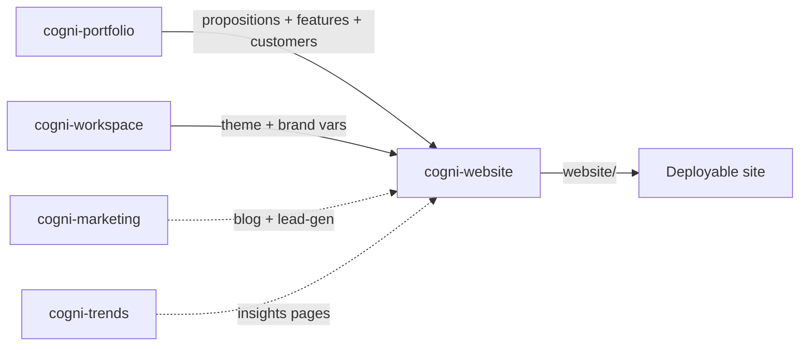

# Workflow: Portfolio to Website

**Pipeline**: cogni-portfolio → cogni-workspace → cogni-website
**Duration**: 2–4 hours for a complete multi-page customer website
**Use case**: Generate a deployable static site directly from the portfolio model — service pages, product pages, customer landing pages — themed to match the rest of your deliverables

## Step 1: Confirm Portfolio is Ready (cogni-portfolio)

**Command**: `/portfolio-resume` (or check via `Show portfolio status`)

**Input**: An existing cogni-portfolio project with at least one product, propositions, and customer profiles
**Output**: Confirmation of which portfolio entities the website will draw from

**Tips**:
- Propositions become page headlines, features become capability lists, customer narratives become case-study blocks
- If propositions or customer profiles are missing, generate them first via `/propositions` and `/customers` — the website plan keys off them
- Operational-only portfolio entities (markets without propositions) won't reach the site

## Step 2: Pick or Confirm a Theme (cogni-workspace)

**Command**: `/pick-theme`

**Input**: An available workspace theme (extracted via `/manage-themes` or a preset)
**Output**: A workspace-stored active theme that cogni-website inherits

**Tips**:
- Theme drives colors, fonts, and design variables across every page
- Switching the theme later and re-running `/website-build` reskins the entire site — theme changes are global
- If you don't have a theme yet, run the `install-to-infographic` workflow first to extract one

## Step 3: Set Up the Website Project (cogni-website)

**Command**: `/website-setup`

**Input**: A target directory plus a few configuration answers (target market, primary CTA, language)
**Output**: `website-project.json` with discovered portfolio entities and project config

**Tips**:
- The setup walks through optional content sources — cogni-marketing for blog/lead-gen pages, cogni-trends for insights pages, cogni-research for whitepapers
- Skip optional sources you don't have content for; they can be added on a later run
- The chosen language is the site's primary language — German content lands as `de`

## Step 4: Plan the Sitemap (cogni-website)

**Command**: `/website-plan`

**Input**: `website-project.json` plus the available content sources
**Output**: `website-plan.json` — sitemap, content map, navigation flow

**Tips**:
- Review and adjust priorities before building — the planner picks defaults but the running order shapes the homepage
- Pages with shallow content sources (a proposition without a customer narrative) generate thin landing pages — fill the gap in cogni-portfolio first or drop the page from the plan
- Re-run `/website-plan` after adding new propositions; the diff shows what the build will change

## Step 5: Build the Site (cogni-website)

**Command**: `/website-build`

**Input**: `website-plan.json`
**Output**: Rendered `website/{page-slug}.html` files plus `website/assets/` (themed CSS, JS, hero imagery)

**Tips**:
- Build dispatches the `site-assembler` agent, which renders every page from the plan in parallel
- If Pencil MCP is available, the `hero-renderer` agent generates hero imagery for landing pages — without Pencil, hero blocks fall back to themed gradients
- Only modified pages rebuild on subsequent runs; full rebuild on theme change

## Step 6: Preview and Iterate (cogni-website)

**Command**: `/website-preview`

**Input**: The built `website/` directory
**Output**: A local browser preview via claude-in-chrome MCP

**Tips**:
- Iterate on theme tweaks, copy edits, or page additions by re-running `/website-build` after changes
- For deployment, the `website/` directory is self-contained — push it to any static host (Netlify, GitHub Pages, S3)
- Add legally required pages — `/website-legal` generates Impressum, Datenschutzerklärung, and cookie notices for the configured jurisdiction

## Common Pitfalls

- **Missing propositions or customers.** The website plan needs propositions to fill service-page headlines and customer profiles to seed landing pages. Generating the site before the portfolio is populated produces a thin three-page placeholder.
- **Theme not picked before build.** `/website-build` reads the active theme from workspace state. Without a chosen theme, the build falls back to the default and the site visually drifts from your slides and dashboards.
- **Pencil MCP missing for hero imagery.** The `hero-renderer` agent needs Pencil MCP. Without it, hero sections render as themed gradients — usable, but not the AI-generated imagery you're seeing in demos.
- **Optional sources not installed.** Adding cogni-marketing or cogni-trends after `/website-plan` requires re-running plan and build to pick up the new pages.

---

For the narrative tutorial — including the full prerequisite matrix, deployable artifact list, and related-guide cross-references — see [`docs/workflows/portfolio-to-website.md`](../../../../../docs/workflows/portfolio-to-website.md).
