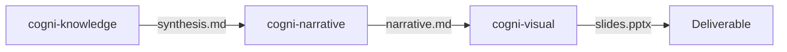

# Workflow: Research to Report

**Pipeline**: cogni-knowledge → cogni-narrative → cogni-visual
**Duration**: 2-4 hours depending on research depth
**Use case**: Analyst producing a presentation from original research

## Step 1: Research (cogni-knowledge)

**Command**: Describe your topic, or `/knowledge-compose`

**Input**: A research question or topic brief
**Output**: A cited synthesis, verified zero-network against each source's extracted claims, deposited into the bound wiki

**Tips**:
- The inverted pipeline runs plan → curate → fetch → ingest → distill → compose → verify → finalize
- The plan decomposes the topic into 3–7 sub-questions; deeper runs ingest more sources
- Citations are verified zero-network during `knowledge-verify`; for a live-source re-check run `/knowledge-refresh --resweep` (dispatches cogni-claims)
- Every run deposits its synthesis back into the wiki, so the next run reads it as prior framing

## Step 2: Narrative (cogni-narrative)

**Command**: `/narrate`

**Input**: The synthesis from Step 1
**Output**: An executive narrative shaped by a story arc

**Tips**:
- Choose the arc that fits your audience: SCQA for problem-solution, Minto Pyramid
  for recommendation-first, Hero's Journey for transformation stories
- Review the narrative before proceeding — this is where the story takes shape
- Use `/review-narrative` for quality scoring

## Step 3: Visual (cogni-visual)

**Command**: `/render-slides`

**Input**: The polished narrative from Step 2
**Output**: A PPTX slide deck

**Tips**:
- The theme is applied from your workspace settings
- Request specific slide count if you have time constraints
- For web delivery, consider `/render-web-narrative` instead of slides

## Common Pitfalls

- **Skipping the narrative step**: Going directly from research to slides produces
  data-heavy, story-light presentations. The narrative step is where insight emerges.
- **Wrong research depth**: Deep research for a 5-slide deck wastes time. Match
  research depth to deliverable scope.
- **Not verifying claims**: If you bring your own content instead of letting
  cogni-knowledge produce it, consider running `/verify-claims` before the narrative step.
