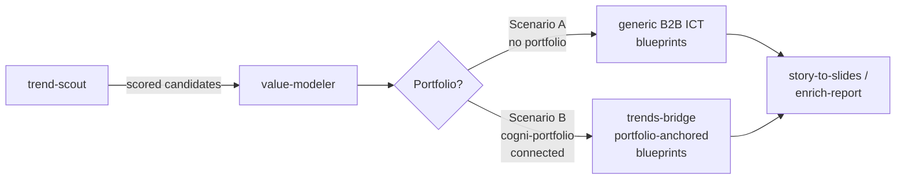

# Workflow: Trends to Solutions

**Pipeline**: cogni-trends (trend-scout + value-modeler) → optional cogni-portfolio (trends-bridge) → cogni-visual (story-to-slides / enrich-report)
**Duration**: 4–8 hours for a complete trends-to-solutions analysis
**Use case**: Strategy and advisory work — turning scouted trends into ranked solution blueprints with a visual deliverable

## Choose Your Scenario

The pipeline branches at Step 2 (value modeling) and reconverges at Step 4 (visual deliverable):

- **Scenario A — Standalone trends + generic blueprints.** No cogni-portfolio project. value-modeler uses the bundled **generic B2B ICT portfolio** (7 products, 51 features with taxonomy mappings) as the anchor and generates DOES/MEANS dynamically from the research context. Outputs are taxonomy-grounded but not company-specific. Use for new-industry scouting, discovery engagements, or CxO points of view without a defined product set.
- **Scenario B — With cogni-portfolio connected.** A cogni-portfolio project exists. `trends-bridge` exports portfolio context to value-modeler so Solution Templates map to real products and features, and ranked solutions can flow back into the portfolio. Use when trend signals must drive an actual portfolio roadmap.

You can start in Scenario A and re-enter Scenario B later against the same trend-scout output.

## Step 1: Scout Trends (shared)

**Command**: `/trend-scout`

**Input**: Industry or domain to analyze
**Output**: 60 scored trend candidates mapped to Trendradar dimensions (4 dimensions × 3 action horizons)

**Tips**:
- Set `region` correctly for DACH/EU — the scout uses regional authority sources (Fraunhofer, BITKOM, VDMA, destatis) that the EN/US default would miss
- Narrow 60 candidates → 15–25 most relevant before running value-modeler — quality of the final deliverable depends on this culling step
- Optional: `/trend-report` produces a written CxO trend report in parallel; investment-theme construction happens in Step 2

## Step 2: Model Investment Themes and Solution Blueprints

**Command**: `/value-modeler` (Scenario A) or `/trends-bridge portfolio-to-tips` then `/value-modeler` (Scenario B)

**Input**: Agreed trend candidates from Step 1 (+ portfolio-context.json for Scenario B)
**Output**: Investment themes (Handlungsfelder) with T→I→P→S value chains, ranked Solution Templates, SPIs, success metrics, Business Relevance scoring

**Scenario A — Standalone**: Run `/value-modeler` directly. Phase 2 falls back to the generic B2B ICT portfolio (7 products, 51 features). DOES/MEANS generated dynamically from the project's research context. Outputs are taxonomy-grounded.

**Scenario B — With portfolio**: Two sub-steps. First export portfolio context (`/trends-bridge portfolio-to-tips` writes `portfolio-context.json` v3.2 into the TIPS pursuit). Then run `/value-modeler` — Solution Templates now map to real features, readiness scoring reflects actual portfolio gaps.

**Tips**:
- Review Business Relevance scoring in either scenario — default weights rarely match the client's strategic priorities
- 3–7 investment themes is the producible range; for a client deck, narrow to 3–4 before generating visuals
- Skipping `portfolio-to-tips` in Scenario B silently falls back to Scenario A — the run "works" but solutions won't reference real features

## Step 3: Backflow Ranked Solutions to Portfolio (Scenario B only)

**Command**: `/trends-bridge tips-to-portfolio`

**Input**: Ranked value model from Step 2, connected cogni-portfolio project
**Output**: New features, proposition variants, evidence entries, and `portfolio-opportunities.json` (innovation opportunities the trends surfaced)

**Tips**:
- Skip in Scenario A — there is no portfolio to push into
- Review and curate generated entities inside cogni-portfolio (`/features`, `/propositions`, `/solutions`) before they propagate into pitches and marketing
- This is what closes the loop: trend signals become portfolio mutations the team can build against

## Step 4: Produce Visual Deliverables (shared)

**Command**: `/story-to-slides` (Option A) or `/enrich-report` (Option B)

**Input**: Value-modeler narrative or trend report
**Output**: Themed slide deck or interactive HTML report with Chart.js visualizations

**Tips**:
- Both options work for either scenario — the underlying value-model JSON is the same shape
- Generate the trend report (`/trend-report`) before running `/enrich-report`
- Inherit the workspace theme via `/pick-theme` before rendering so visuals match brand

## Common Pitfalls

- **Weak trend selection in Step 1.** Generic trends produce generic solutions. Cull the 60 candidates carefully — this is the quality gate for the entire downstream pipeline.
- **Too many themes.** value-modeler can produce up to 7 investment themes; client decks land better with 3–4. Narrow before Step 4.
- **Skipping Business Relevance scoring.** Default weights aren't client-specific. Adjust weights before generating blueprints, regardless of scenario.
- **Scenario A — confusing generic blueprints for company-specific advice.** The bundled B2B ICT portfolio is a taxonomy scaffold. Useful for "what to do about this trend" framing; not a substitute for grounding solutions in real capabilities.
- **Scenario B — forgetting the export step.** value-modeler in Scenario B requires `portfolio-context.json`. Without `/trends-bridge portfolio-to-tips`, the run silently falls back to the generic portfolio.
