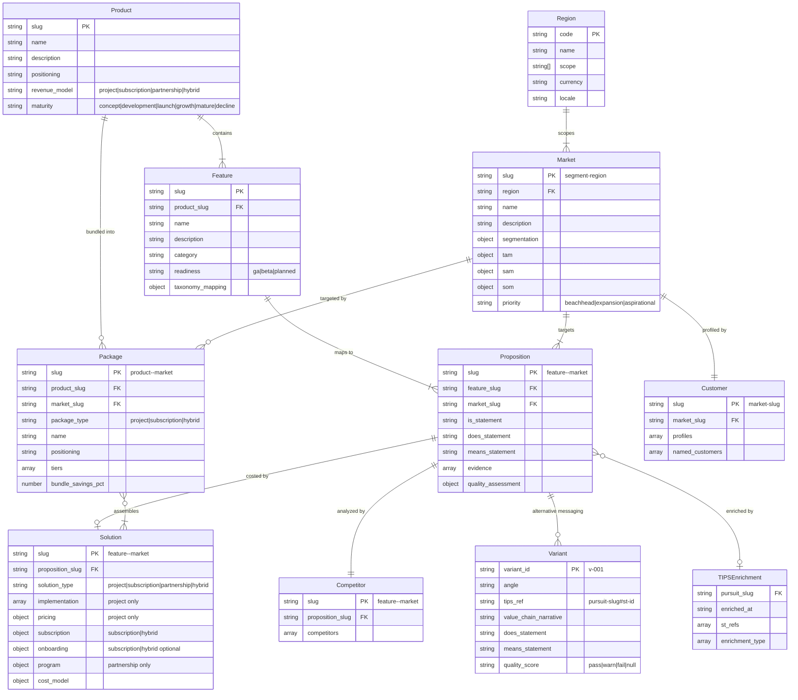

# cogni-portfolio Data Model Reference

## Project Structure

```
cogni-portfolio/{project-slug}/
├── portfolio.json                          # Root manifest (company context + config)
├── README.md                               # Synthesized messaging repository
├── products/
│   └── {product-slug}.json                 # Product definitions
├── features/
│   └── {feature-slug}.json                 # Market-independent feature definitions (IS layer)
├── markets/
│   └── {segment}-{region}.json             # Target market definitions with TAM/SAM/SOM
├── propositions/
│   └── {feature}--{market}.json            # IS/DOES/MEANS value propositions per Feature x Market
├── solutions/
│   └── {feature}--{market}.json            # Implementation plans + pricing per proposition
├── competitors/
│   └── {feature}--{market}.json            # Competitive landscape per proposition
├── customers/
│   └── {market-slug}.json                  # Ideal customer profiles + named accounts per market
├── packages/
│   └── {product}--{market}.json            # Bundled solution tiers per Product x Market
├── context/                                # Extracted intelligence from uploaded documents
│   ├── context-index.json                  # Lookup manifest (by category, relevance, entity)
│   └── {source-slug}--{seq}.json           # Individual context entries
├── uploads/                                # Source documents for ingestion
├── output/                                 # Generated exports (proposals, briefs, XLSX)
│   ├── architecture.excalidraw            # Product-feature architecture diagram (Excalidraw)
│   ├── dashboard.html                     # Interactive portfolio dashboard (HTML)
│   └── README.md                          # Synthesized messaging repository
└── research/                               # Portfolio scan artifacts (when scan is used)
    ├── research-report.md                  # Scan findings per taxonomy dimension
    └── .logs/                              # Raw scan data (offerings, sources)
```

## Entity Schemas

### portfolio.json (Project Root)

Lightweight root manifest for project discovery and resume. Created during setup, updated as workflow progresses.

```json
{
  "slug": "acme-cloud-services",
  "company": {
    "name": "Acme Cloud Services",
    "description": "Cloud infrastructure management for mid-market SaaS",
    "industry": "Cloud Infrastructure",
    "domain": "acme.com",
    "regional_urls": {
      "de": "acme.com/de",
      "en": "acme.com/en"
    },
    "products": ["Cloud Platform", "Monitoring Suite"]
  },
  "language": "de",
  "delivery_defaults": {
    "roles": [
      { "role": "Solution Architect", "rate_day": 1800, "currency": "EUR" },
      { "role": "Implementation Engineer", "rate_day": 1200, "currency": "EUR" },
      { "role": "Project Manager", "rate_day": 1400, "currency": "EUR" }
    ],
    "target_margin_pct": 35,
    "assumptions": [
      "Standard 8-hour workday",
      "Remote delivery unless on-site explicitly scoped"
    ]
  },
  "taxonomy": {
    "type": "b2b-ict",
    "version": "3.7",
    "dimensions": 8,
    "categories": 57,
    "source": "cogni-portfolio/templates/b2b-ict/template.md"
  },
  "created": "2026-01-15",
  "updated": "2026-02-20"
}
```

Required fields: `slug`, `company.name`, `company.description`, `company.industry`
Optional fields: `company.domain`, `company.regional_urls`, `language`, `delivery_defaults`, `taxonomy`, `created`, `updated`

The `language` field is a lowercase ISO 639-1 code (e.g., `"de"`, `"en"`). If absent, defaults to `"en"`. Controls the language of all generated user-facing content. JSON field names and slugs always remain in English.

The `taxonomy` object adopts an industry-standard classification system. Supported taxonomy types:

| Type | Dimensions | Categories | Target Vertical |
|------|-----------|------------|-----------------|
| `b2b-ict` | 8 | 57 | Enterprise ICT service providers |
| `b2b-saas` | 8 | 47 | B2B SaaS platform companies |
| `b2b-opensource` | 8 | 50 | Commercial open-source (COSS) companies |
| `b2b-fintech` | 8 | 48 | Financial technology providers |
| `b2b-professional-services` | 8 | 44 | Professional services & consulting firms |
| `b2b-industrial-tech` | 8 | 48 | Industrial technology & OT providers |
| `b2b-healthtech` | 8 | 46 | Healthcare technology providers |
| `b2b-martech` | 8 | 45 | Marketing technology & AdTech providers |

All taxonomies share Dimension 0 (Provider Profile Metrics, 6 categories). The `portfolio-setup` skill auto-selects a taxonomy by matching company context against `industry_match` patterns in each template's frontmatter. Template definitions live in `templates/{type}/template.md`.

The `delivery_defaults` object provides company-wide defaults for solution cost modeling: roles with day rates, target margin percentage, and shared delivery assumptions.

### products/{slug}.json

```json
{
  "slug": "cloud-platform",
  "name": "Cloud Platform",
  "description": "Unified cloud infrastructure management platform.",
  "positioning": "The most developer-friendly cloud management solution.",
  "pricing_tier": "Enterprise",
  "revenue_model": "subscription",
  "maturity": "growth",
  "launch_date": "2024-03-01",
  "version": "2.1",
  "created": "2026-01-15"
}
```

Required fields: `slug`, `name`, `description`
Optional fields: `positioning`, `pricing_tier`, `revenue_model`, `maturity`, `launch_date`, `version`, `source_file`, `created`

Valid `maturity` values: `concept`, `development`, `launch`, `growth`, `mature`, `decline`

Valid `revenue_model` values: `subscription` (SaaS/license), `project` (consulting/implementation, **default when absent**), `partnership` (revenue-share), `hybrid` (combination)

### features/{slug}.json

A feature is market-independent. It describes what the product/service IS. Each feature belongs to exactly one product.

```json
{
  "slug": "cloud-monitoring",
  "product_slug": "cloud-platform",
  "name": "Cloud Infrastructure Monitoring",
  "description": "Real-time monitoring of cloud infrastructure with automated alerting.",
  "category": "observability",
  "readiness": "ga",
  "sort_order": 10,
  "taxonomy_mapping": {
    "dimension": 4,
    "dimension_name": "Cloud Services",
    "category_id": "4.6",
    "category_name": "Cloud-Native Platform",
    "horizon": "current"
  },
  "excluded_markets": [
    {
      "market_slug": "iot-industrial-dach",
      "reason": "IoT buyers need edge-level telemetry, not cloud infrastructure monitoring"
    }
  ],
  "created": "2026-01-15"
}
```

Required fields: `slug`, `product_slug`, `name`, `description`
Optional fields: `category`, `readiness`, `taxonomy_mapping`, `sort_order`, `excluded_markets`, `source_file`, `created`, `updated`

Valid `readiness` values: `ga` (generally available), `beta` (limited availability / pilot), `planned` (roadmap only)

`sort_order` (integer, optional): Controls display ordering within a product. Lower numbers appear first — customer-facing value at top, infrastructure/utility at bottom. Use increments of 10 (10, 20, 30...) to leave room for insertions. Features without `sort_order` sort after all ordered features, then alphabetically by slug.

Valid `taxonomy_mapping.horizon` values: `current` (0-1yr, GA), `emerging` (1-3yr, pilot/beta), `future` (3+yr, roadmap)

`excluded_markets` (array of objects, optional): Feature x Market pairs explicitly marked as "not relevant." Each entry has:
- `market_slug` (string, required): Must match an existing `markets/{slug}.json` file
- `reason` (string, required): Explains why this feature is not relevant for that market

Excluded pairs are subtracted from expected proposition counts and omitted from missing-proposition lists. Downstream quality assessors, the dashboard, and synthesize treat them as intentionally absent — not as gaps. The propositions skill can persist exclusion decisions from its consultation workflow directly into this field.

### markets/{slug}.json

A target market defined by region, segmentation criteria, and sized by TAM/SAM/SOM. Slug encodes segment and region: `{segment}-{region}`.

```json
{
  "slug": "mid-market-saas-dach",
  "name": "Mid-Market SaaS Companies (DACH)",
  "region": "dach",
  "description": "SaaS companies, 50-500 employees, $5M-$100M ARR in DACH.",
  "segmentation": {
    "company_size": "50-500 employees",
    "revenue_range": "$5M-$100M ARR",
    "vertical": "Software as a Service",
    "employees_min": 50,
    "employees_max": 500,
    "arr_min": 5000000,
    "arr_max": 100000000,
    "vertical_codes": ["saas"]
  },
  "tam": { "value": 5000000000, "currency": "EUR", "description": "...", "source": "..." },
  "sam": { "value": 500000000, "currency": "EUR", "description": "...", "source": "..." },
  "som": { "value": 15000000, "currency": "EUR", "description": "...", "source": "..." },
  "priority": "beachhead",
  "sort_order": 10,
  "created": "2026-01-15"
}
```

Required fields: `slug`, `name`, `region`, `description`
Optional fields: `segmentation`, `tam`, `sam`, `som`, `priority`, `sort_order`, `source_file`, `created`, `updated`

Valid `priority` values: `beachhead` (primary go-to-market), `expansion` (secondary growth), `aspirational` (long-term)

`sort_order` (integer, optional): Controls display ordering across all markets. Lower numbers appear first — beachhead markets should use the lowest values to appear first in dashboards and matrices. Use increments of 10 (10, 20, 30...) to leave room for insertions. Convention: beachhead markets 10-30, expansion 40-60, aspirational 70+. Markets without `sort_order` sort after all ordered markets, then alphabetically by slug.

Valid `region` codes: `de`, `dach`, `eu`, `uk`, `nordics`, `us`, `na`, `cn`, `apac`, `jp`, `latam`, `mea`, `global`

Normalized segmentation fields (`employees_min/max`, `arr_min/max`, `vertical_codes`) enable automated overlap detection between markets sharing the same region.

### propositions/{feature-slug}--{market-slug}.json

A proposition maps one feature to one target market with IS/DOES/MEANS messaging.

```json
{
  "slug": "cloud-monitoring--mid-market-saas-dach",
  "feature_slug": "cloud-monitoring",
  "market_slug": "mid-market-saas-dach",
  "is_statement": "Real-time cloud monitoring with automated alerting for servers, containers, and networks.",
  "does_statement": "Reduces MTTR by 60% via intelligent alert correlation, eliminating alert fatigue in growing teams.",
  "means_statement": "Maintain 99.95% uptime SLAs without additional SRE hires, protecting revenue during scaling.",
  "evidence": [
    {
      "statement": "58% average MTTR reduction across 12 beta customers",
      "source_url": "https://example.com/case-study",
      "source_title": "Cloud Monitoring Case Study 2025",
      "narrative_type": "why_now",
      "tips_path": {
        "trend": "EU AI Act Compliance",
        "implication": "Automated audit trail requirements",
        "possibility": "Compliance-as-differentiator positioning",
        "urgency": "act"
      }
    }
  ],
  "variants": [],
  "tips_enrichment": {
    "pursuit_slug": "automotive-ai-predictive-maintenance-abc12345",
    "enriched_at": "2026-03-13T14:30:00Z",
    "st_refs": ["st-001", "st-003"],
    "enrichment_type": ["does_refined", "variant_created"]
  },
  "quality_assessment": {
    "overall": "pass",
    "does_score": {
      "buyer_centricity": "pass",
      "buyer_perspective": "pass",
      "need_correctness": "pass",
      "market_specificity": "warn",
      "differentiation": "pass",
      "status_quo_contrast": "pass",
      "conciseness": "pass"
    },
    "means_score": {
      "outcome_specificity": "pass",
      "escalation": "pass",
      "quantification": "warn",
      "emotional_resonance": "pass",
      "conciseness": "pass"
    },
    "assessed_at": "2026-03-13"
  },
  "created": "2026-01-20"
}
```

Required fields: `slug`, `feature_slug`, `market_slug`, `is_statement`, `does_statement`, `means_statement`
Optional fields: `evidence`, `variants`, `tips_enrichment`, `quality_assessment`, `created`, `updated`

IS/DOES/MEANS word targets: IS 20-35 words, DOES 15-30 words, MEANS 15-30 words

Valid `narrative_type` values: `why_now` (trend urgency opener), `sales_guide` (I->P causal link), `proposal_justification` (full T->I->P chain)

Valid `tips_path.urgency` values: `act`, `plan`, `observe` (matches TIPS horizon)

Valid `enrichment_type` values: `does_refined`, `means_refined`, `evidence_added`, `variant_created`, `solution_proposed`

Quality `overall` derivation: `fail` if any dimension is `fail`; `warn` if any is `warn` with none failing; `pass` otherwise.

#### Proposition Variants

Alternative DOES/MEANS messaging derived from TIPS value chains. The top-level statements remain the primary variant.

```json
{
  "variant_id": "v-001",
  "angle": "regulatory-compliance",
  "tips_ref": "automotive-pursuit-abc12345#st-003",
  "value_chain_narrative": "EU AI Act compliance pressure (T) -> automated audit trails (I) -> compliance-as-differentiator (P)",
  "does_statement": "Automates compliance audit trails, reducing manual documentation by 80%",
  "means_statement": "Eliminates 200+ hours/year of compliance overhead while turning regulatory readiness into a trust signal",
  "evidence": [],
  "quality_score": null,
  "created": "2026-03-13"
}
```

### solutions/{feature-slug}--{market-slug}.json

A solution attaches commercial terms to a proposition (same slug). Structure depends on the parent product's `revenue_model`.

#### Project Solutions (`solution_type: "project"` or absent)

```json
{
  "slug": "cloud-monitoring--mid-market-saas-dach",
  "proposition_slug": "cloud-monitoring--mid-market-saas-dach",
  "solution_type": "project",
  "implementation": [
    { "phase": "Discovery & Setup", "duration_weeks": 2, "description": "Requirements gathering..." },
    { "phase": "Core Deployment", "duration_weeks": 4, "description": "Agent rollout..." },
    { "phase": "Tuning & Handover", "duration_weeks": 2, "description": "Alert threshold optimization..." }
  ],
  "pricing": {
    "proof_of_value": { "price": 15000, "currency": "EUR", "scope": "Single environment, 2-week pilot" },
    "small": { "price": 50000, "currency": "EUR", "scope": "Up to 50 nodes, 8-week delivery" },
    "medium": { "price": 120000, "currency": "EUR", "scope": "Up to 200 nodes, 12 weeks" },
    "large": { "price": 250000, "currency": "EUR", "scope": "Unlimited nodes, 16 weeks" }
  },
  "cost_model": {
    "assumptions": ["Blended rate 1,400 EUR/day", "Target margin 30-40%"],
    "bill_of_materials": {
      "roles": [{ "role": "Solution Architect", "rate_day": 1800, "currency": "EUR" }],
      "tooling": [{ "item": "Monitoring license", "cost": 0, "note": "Included in PoV" }],
      "infrastructure": [{ "item": "Cloud hosting", "cost_monthly": 500, "currency": "EUR" }]
    },
    "effort_by_tier": {
      "proof_of_value": { "total_days": 12, "breakdown": [], "internal_cost": 16000, "margin_pct": 6.25 },
      "small": { "total_days": 40, "breakdown": [], "internal_cost": 35600, "margin_pct": 28.8 }
    }
  },
  "created": "2026-03-05"
}
```

#### Subscription Solutions (`solution_type: "subscription"`)

```json
{
  "slug": "deep-research--beratung-kmu-dach",
  "proposition_slug": "deep-research--beratung-kmu-dach",
  "solution_type": "subscription",
  "onboarding": {
    "description": "Initial setup and enablement",
    "phases": [{ "phase": "Kickoff", "duration_weeks": 1, "description": "Account creation..." }],
    "pricing": { "included": true, "price": 0, "note": "Included in first month" }
  },
  "subscription": {
    "model": "tiered",
    "tiers": {
      "free": { "price_monthly": 0, "price_annual": 0, "scope": "Basic features", "limits": "3 projects/month" },
      "pro": { "price_monthly": 149, "price_annual": 1490, "scope": "All features", "limits": "Unlimited" },
      "enterprise": { "price_monthly": null, "price_annual": null, "scope": "Custom, SSO, SLA" }
    },
    "currency": "EUR",
    "billing_cycle": "monthly | annual",
    "discount_annual_pct": 17
  },
  "professional_services": {
    "available": true,
    "options": [{ "name": "Onboarding Workshop", "price": 3000, "currency": "EUR", "scope": "Half-day" }]
  },
  "cost_model": {
    "assumptions": ["Hosting per seat: 15 EUR/month"],
    "unit_economics": { "cac": 500, "ltv": 8940, "ltv_cac_ratio": 17.9, "gross_margin_pct": 85, "churn_monthly_pct": 3 }
  },
  "created": "2026-03-10"
}
```

#### Partnership Solutions (`solution_type: "partnership"`)

```json
{
  "slug": "plugin-plattform--agentur-dach",
  "proposition_slug": "plugin-plattform--agentur-dach",
  "solution_type": "partnership",
  "program": {
    "stages": [
      { "stage": "Pilot Partnership", "duration_months": 3, "description": "Joint reference use case", "commitment": "1 developer" },
      { "stage": "Certified Partnership", "duration_months": 12, "description": "Co-marketing, lead sharing", "commitment": "2+ certified consultants" }
    ],
    "revenue_share": { "model": "referral", "partner_pct": 20, "description": "20% rev-share on referred customers Y1" }
  },
  "cost_model": {
    "assumptions": ["Partner management: 0.2 FTE per active partnership"]
  },
  "created": "2026-03-10"
}
```

#### Schema Reference by Solution Type

| Field | project | subscription | partnership | hybrid |
|---|---|---|---|---|
| `solution_type` | `"project"` or absent | `"subscription"` | `"partnership"` | `"hybrid"` |
| `implementation` | required | -- | -- | -- |
| `pricing` (PoV/S/M/L) | required | -- | -- | -- |
| `onboarding` | -- | optional | -- | optional |
| `subscription` | -- | required | -- | required |
| `professional_services` | -- | optional | -- | optional |
| `program` | -- | -- | required | -- |
| `cost_model` | optional (effort-based) | optional (unit economics) | optional | optional |

Common required fields: `slug`, `proposition_slug`
Common optional fields: `solution_type`, `cost_model`, `created`

### packages/{product-slug}--{market-slug}.json

Bundles solutions from one product into sellable tiers for a specific market.

```json
{
  "slug": "cloud-platform--mid-market-saas-dach",
  "product_slug": "cloud-platform",
  "market_slug": "mid-market-saas-dach",
  "package_type": "project",
  "name": "Cloud Platform Implementation",
  "positioning": "Complete cloud observability in one engagement",
  "tiers": [
    {
      "tier": "foundation",
      "name": "Foundation",
      "included_solutions": ["cloud-monitoring--mid-market-saas-dach"],
      "price": 45000,
      "currency": "EUR",
      "scope": "Core monitoring for one environment"
    }
  ],
  "bundle_savings_pct": 15,
  "created": "2026-03-11"
}
```

Required fields: `slug`, `product_slug`, `market_slug`, `package_type`, `name`, `tiers` (array)
Optional fields: `positioning`, `bundle_savings_pct`, `created`

| Tier Field | project | subscription | hybrid |
|---|---|---|---|
| `price` | required | -- | -- |
| `price_monthly` | -- | required (or null) | required (or null) |
| `price_annual` | -- | required (or null) | required (or null) |
| `included_solutions` | required | required | required |
| `scope` | required | required | required |
| `currency` | required | required | required |

### competitors/{feature-slug}--{market-slug}.json

```json
{
  "slug": "cloud-monitoring--mid-market-saas-dach",
  "proposition_slug": "cloud-monitoring--mid-market-saas-dach",
  "competitors": [
    {
      "name": "Datadog",
      "source_url": "https://example.com/datadog-review",
      "positioning": "Full-stack observability for cloud-scale companies",
      "strengths": ["Brand recognition", "Broad integrations"],
      "weaknesses": ["Expensive at scale", "Overkill for mid-market"],
      "differentiation": "40% lower cost, deploys in hours vs. weeks."
    }
  ],
  "created": "2026-01-25"
}
```

Required fields: `slug`, `proposition_slug`, `competitors` (array with at least `name`)
Optional fields: `created`

### customers/{market-slug}.json

```json
{
  "slug": "mid-market-saas-dach",
  "market_slug": "mid-market-saas-dach",
  "profiles": [
    {
      "role": "VP Engineering",
      "seniority": "C-1",
      "pain_points": ["Infrastructure complexity outpacing team capacity"],
      "buying_criteria": ["Time to value under 2 weeks"],
      "information_sources": ["Hacker News", "Infrastructure podcasts"],
      "decision_role": "Economic buyer and technical evaluator"
    }
  ],
  "named_customers": [
    {
      "name": "Siemens AG",
      "domain": "siemens.com",
      "industry": "Industrial Manufacturing",
      "headquarters": "Munich, Germany",
      "employees": 300000,
      "revenue": { "value": 72000000000, "currency": "EUR", "year": 2025 },
      "fit_score": "high",
      "fit_rationale": "Large industrial customer with strong digital transformation mandate.",
      "pain_points": ["Legacy infrastructure migration"],
      "current_stack": ["ServiceNow", "Splunk"],
      "source_urls": ["https://example.com/annual-report"],
      "researched_at": "2026-03-13"
    }
  ],
  "created": "2026-01-25"
}
```

Required fields: `slug`, `market_slug`, `profiles` (array with at least `role`)
Optional fields: `named_customers`, `created`

Valid `fit_score` values: `high`, `medium`, `low`

### context/{source-slug}--{seq}.json

Structured intelligence extracted from uploaded documents. Unlike entities (products, features, markets), context entries capture institutional knowledge — competitive intelligence, pricing benchmarks, strategic positioning, customer insights — that downstream skills use to generate sharper, company-specific output. Each entry is a self-contained insight linked to the source document and optionally to specific portfolio entities.

```json
{
  "slug": "pricing-strategy-2025--001",
  "source_file": "pricing-strategy-2025.pdf",
  "category": "pricing",
  "relevance": ["solutions", "packages"],
  "summary": "Internal pricing model uses 35% target margin with blended day rate of 1,400 EUR for DACH mid-market engagements.",
  "detail": "The 2025 pricing framework establishes a blended day rate of 1,400 EUR across all delivery roles for DACH mid-market engagements. Target gross margin is 35%, with flexibility to go as low as 25% for strategic accounts. Proof-of-value engagements are capped at 15,000 EUR with a maximum 2-week scope to minimize sales cycle friction.",
  "entities": {
    "products": ["cloud-platform"],
    "features": [],
    "markets": ["mid-market-saas-dach"]
  },
  "confidence": "high",
  "created": "2026-03-22"
}
```

Required fields: `slug`, `source_file`, `category`, `relevance`, `summary`, `detail`, `confidence`, `created`
Optional fields: `entities`

Valid `category` values:

| Category | What It Captures | Primary Downstream Skills |
|---|---|---|
| `competitive` | Win/loss reports, competitor mentions, battlecards, RFP responses | compete, propositions |
| `market` | Market research, TAM analyses, customer segmentation, industry reports | markets, propositions |
| `pricing` | Pricing models, rate cards, discount structures, margin targets | solutions, packages |
| `customer` | Interview transcripts, CRM summaries, buyer persona research, NPS data | customers, propositions |
| `technical` | Architecture docs, technical specs, product roadmaps, integration guides | features |
| `strategic` | Strategy decks, positioning documents, differentiation analyses | propositions, solutions |

Valid `confidence` values: `high` (verbatim from document), `medium` (inferred from document content), `low` (requires validation)

The `relevance` array lists downstream skill names that should consume this context: `propositions`, `solutions`, `markets`, `compete`, `customers`, `features`, `packages`.

The `entities` object optionally links context to specific portfolio entities by slug. When present, downstream skills apply this context to those entities specifically rather than broadly.

### context/context-index.json

Lookup manifest rebuilt whenever context entries are added or removed. Provides three index paths so downstream skills can quickly find relevant context without scanning every file.

```json
{
  "version": "1.0",
  "entry_count": 12,
  "updated": "2026-03-22",
  "by_category": {
    "competitive": ["competitive-landscape--001"],
    "pricing": ["pricing-strategy-2025--001", "pricing-strategy-2025--002"],
    "strategic": ["board-deck-2025--001"]
  },
  "by_relevance": {
    "propositions": ["competitive-landscape--001", "board-deck-2025--001"],
    "solutions": ["pricing-strategy-2025--001", "pricing-strategy-2025--002"],
    "packages": ["pricing-strategy-2025--001"]
  },
  "by_entity": {
    "products/cloud-platform": ["pricing-strategy-2025--001"],
    "markets/mid-market-saas-dach": ["pricing-strategy-2025--001"]
  }
}
```

## Cross-Plugin Schemas

### portfolio-context.json (Export to TIPS)

Written by the trends-bridge `portfolio-to-tips` operation into the TIPS project directory. Provides portfolio context for TIPS value-modeler Phase 2.

```json
{
  "schema_version": "3.0",
  "source": "cogni-portfolio",
  "portfolio_slug": "acme-cloud-services",
  "extracted_at": "2026-03-13T10:00:00Z",
  "products": [
    {
      "slug": "cloud-platform",
      "name": "Cloud Platform",
      "revenue_model": "subscription",
      "maturity": "growth",
      "features": [
        {
          "slug": "cloud-monitoring",
          "name": "Cloud Infrastructure Monitoring",
          "description": "Real-time monitoring...",
          "category": "observability",
          "readiness": "ga",
          "propositions": [
            {
              "market_slug": "mid-market-saas-dach",
              "is_statement": "...",
              "does_statement": "...",
              "means_statement": "...",
              "evidence_count": 3,
              "variant_count": 2,
              "quality_assessment": { "overall": "pass", "does_score": {}, "means_score": {} },
              "solution_summary": {
                "solution_type": "project",
                "pricing_tiers": ["proof_of_value", "small", "medium", "large"],
                "price_range": { "min": 15000, "max": 250000, "currency": "EUR" }
              }
            }
          ]
        }
      ]
    }
  ],
  "differentiators": [
    {
      "domain": "sovereign-infrastructure",
      "claim": "European sovereign cloud with BSI-C5 attestation and German-only data residency",
      "evidence": "BSI-C5 attestation certificate, data center locations in Biere and Frankfurt",
      "swap_test_fails": true
    },
    {
      "domain": "network",
      "claim": "Telco-grade network footprint with edge computing at 30,000+ cell tower sites",
      "evidence": "Parent company network infrastructure, IoT connectivity platform",
      "swap_test_fails": true
    }
  ],
  "markets": [
    {
      "slug": "mid-market-saas-dach",
      "name": "Mid-Market SaaS (DACH)",
      "region": "dach",
      "priority": "beachhead",
      "segmentation_summary": "SaaS companies, 50-500 employees",
      "vertical_codes": ["saas"],
      "tam_value": 5000000000,
      "currency": "EUR",
      "market_relevance": "direct",
      "match_reason": "vertical_codes includes 'saas' matching TIPS subsector"
    }
  ]
}
```

Schema version notes: v3.1 adds `differentiators[]` array at the provider level. v3.0 adds `variant_count` and `quality_assessment` per proposition. v2.0 had propositions without quality or variant data. v1.0 (no `schema_version` field) had no embedded propositions.

### differentiators[] (v3.1)

Provider-level competitive differentiators that downstream consumers (e.g., trend-report) use in portfolio close sections. Each entry represents a capability the provider can credibly claim that competitors cannot easily replicate.

| Field | Type | Description |
|-------|------|-------------|
| `domain` | string | Capability domain: `sovereign-infrastructure`, `network`, `security`, `scale`, `industry-expertise`, `platform`, `regulatory` |
| `claim` | string | One-sentence differentiator statement suitable for a portfolio close paragraph |
| `evidence` | string | Brief factual backing (certifications, infrastructure facts, customer base) |
| `swap_test_fails` | boolean | True if replacing the provider name with a competitor makes the claim false or implausible |

Only include differentiators where `swap_test_fails` is true — generic capabilities that any provider could claim are not differentiators. Aim for 3-6 entries covering the provider's strongest domains.

Valid `market_relevance` values: `direct` (vertical_codes match), `industry` (subsector match), `broad` (parent industry match), `none` (no relationship)

### portfolio-opportunities.json (Import from TIPS)

Written by the trends-bridge `tips-to-portfolio` operation into the TIPS project directory. Captures unmatched Solution Templates as structured innovation opportunities.

```json
{
  "schema_version": "1.0",
  "pursuit_slug": "automotive-ai-predictive-maintenance-abc12345",
  "portfolio_slug": "acme-cloud-services",
  "generated_at": "2026-03-13T10:00:00Z",
  "opportunities": [
    {
      "opportunity_id": "opp-001",
      "st_id": "st-003",
      "st_name": "Regulatory Compliance Automation Suite",
      "st_description": "Automated audit trail generation for EU AI Act requirements",
      "theme_ref": "theme-002",
      "match_confidence": "none",
      "opportunity_score": 8.2,
      "scoring_breakdown": {
        "ranking_value": 4.2, "ranking_weight": 0.4,
        "tam_alignment": 0.85, "tam_weight": 0.3,
        "competitive_whitespace": 0.90, "whitespace_weight": 0.3
      },
      "classification": "build",
      "classification_rationale": "Core to company IP. No turnkey vendor solution exists.",
      "classification_alternatives": ["partner"],
      "revenue_estimate": {
        "annual_value": 500000, "currency": "EUR",
        "basis": "5 enterprise customers x 100K ACV", "confidence": "low"
      },
      "feature_spec": {
        "proposed_slug": "compliance-automation",
        "proposed_product_slug": "cloud-platform",
        "name": "Regulatory Compliance Automation Suite",
        "description": "Automated audit trail generation and regulatory reporting.",
        "category": "compliance",
        "readiness": "planned",
        "unmet_needs": ["Explainable AI audit trails", "Cross-border regulatory mapping"],
        "source_themes": ["theme-002"],
        "source_sts": ["st-003"]
      },
      "priority": "high",
      "user_decision": null
    }
  ],
  "summary": {
    "total_opportunities": 3,
    "by_classification": { "build": 2, "buy": 0, "partner": 1 },
    "by_priority": { "high": 1, "medium": 1, "low": 1 },
    "total_estimated_revenue": 1200000,
    "currency": "EUR"
  }
}
```

Opportunity score formula: `(ranking_value/5 * 0.4 + tam_alignment * 0.3 + competitive_whitespace * 0.3) * 10`

Valid `classification` values: `build` (internal development), `buy` (acquire/license), `partner` (ecosystem collaboration)

Valid `revenue_estimate.confidence` values: `high`, `medium`, `low`

Priority derivation: `high` (score >= 7.0 AND ranking_value >= 4.0), `medium` (score >= 4.0 OR ranking_value >= 3.0), `low` (everything else)

## Scan Artifacts

Scan offerings are intermediate research artifacts stored in `research/.logs/`, not first-class entities. After scanning, offerings are mapped to features and products.

| Offering Field | Feature Field | Notes |
|---|---|---|
| Name | `name` + `slug` | Slug derived from name |
| Description | `description` | Direct mapping |
| Category ID | `taxonomy_mapping.category_id` | From taxonomy |
| Service Horizon | `taxonomy_mapping.horizon` + `readiness` | `current`->`ga`, `emerging`->`beta`, `future`->`planned` |
| USP | -- | Captured downstream in `proposition.is_statement` |
| Pricing Model | -- | Informs `product.revenue_model` |

## Workflow Phases

| Phase | Skill | What Happens |
|-------|-------|-------------|
| Setup | portfolio-setup | Company context, directory scaffold, optional taxonomy + scan |
| Products | products | Define top-level product offerings |
| Features | features | Define market-independent capabilities (IS layer) |
| Markets | markets | Discover and size target markets with TAM/SAM/SOM |
| Propositions | propositions | Generate IS/DOES/MEANS per Feature x Market |
| Solutions | solutions | Implementation plans, pricing, cost models |
| Packages | packages | Bundle solutions into Product x Market tiers |
| Compete | compete | Competitive landscape per proposition |
| Customers | customers | Ideal customer profiles + named accounts per market |
| Ingest | portfolio-ingest | Extract entities and context from uploaded documents |
| Scan | portfolio-scan | Discover services by scanning company websites |
| Verify | portfolio-verify | Verify web-sourced claims against cited sources |
| Synthesize | synthesize | Aggregate all entities into README.md messaging repository |
| Export | portfolio-export | Generate proposals, market briefs, XLSX workbooks |
| Bridge | trends-bridge | Bidirectional TIPS integration (matching, enrichment, opportunities) |

Recommended pipeline order: setup -> [products -> features -> markets -> propositions] -> customers -> solutions -> packages -> compete -> verify -> synthesize -> export

## Entity Relationships



### File Hierarchy

```
portfolio.json (root manifest)
├── products/{slug}.json
│   ├── features/{slug}.json (product_slug FK)
│   │   ├── propositions/{feat}--{mkt}.json (feature_slug + market_slug)
│   │   │   ├── solutions/{feat}--{mkt}.json (proposition_slug FK)
│   │   │   ├── competitors/{feat}--{mkt}.json (proposition_slug FK)
│   │   │   └── [TIPS variants & evidence via trends-bridge]
│   │   └── [Quality assessment via proposition-quality-assessor]
│   └── packages/{prod}--{mkt}.json (product_slug + market_slug, references solution slugs)
├── markets/{slug}.json (region code FK -> regions.json)
│   └── customers/{slug}.json (market_slug FK)
├── context/{source-slug}--{seq}.json (intelligence from uploaded documents, linked to entities)
└── [Cross-plugin: portfolio-context.json -> TIPS, portfolio-opportunities.json <- TIPS]
```

### Cardinalities

- One product contains many features (1:N exclusive)
- One product can have many packages, one per target market (1:N)
- One region scopes many markets (1:N)
- One feature maps to many markets via propositions (N:M through propositions)
- Each proposition has at most one solution, one competitor analysis
- Each proposition can have many variants (1:N)
- Each market has exactly one customer profile
- Each package assembles N solutions from one product for one market

## Naming Conventions

| Convention | Rule | Example |
|---|---|---|
| Project slug | kebab-case, descriptive | `acme-cloud-services` |
| Product slug | kebab-case, product name | `cloud-platform` |
| Feature slug | kebab-case, noun-based | `cloud-monitoring` |
| Market slug | `{segment}-{region}` | `mid-market-saas-dach` |
| Proposition slug | `{feature}--{market}` | `cloud-monitoring--mid-market-saas-dach` |
| Solution slug | Same as proposition slug | `cloud-monitoring--mid-market-saas-dach` |
| Package slug | `{product}--{market}` | `cloud-platform--mid-market-saas-dach` |
| Competitor slug | Same as proposition slug | `cloud-monitoring--mid-market-saas-dach` |
| Customer slug | Same as market slug | `mid-market-saas-dach` |
| Context slug | `{source-slug}--{seq}` | `pricing-strategy-2025--001` |
| Opportunity ID | `opp-{SEQ}` | `opp-001` |
| Variant ID | `v-{SEQ}` within proposition | `v-001` |

Double-dash (`--`) separates composite slugs (feature--market, product--market). Single-dash (`-`) is used within individual slugs (kebab-case).
