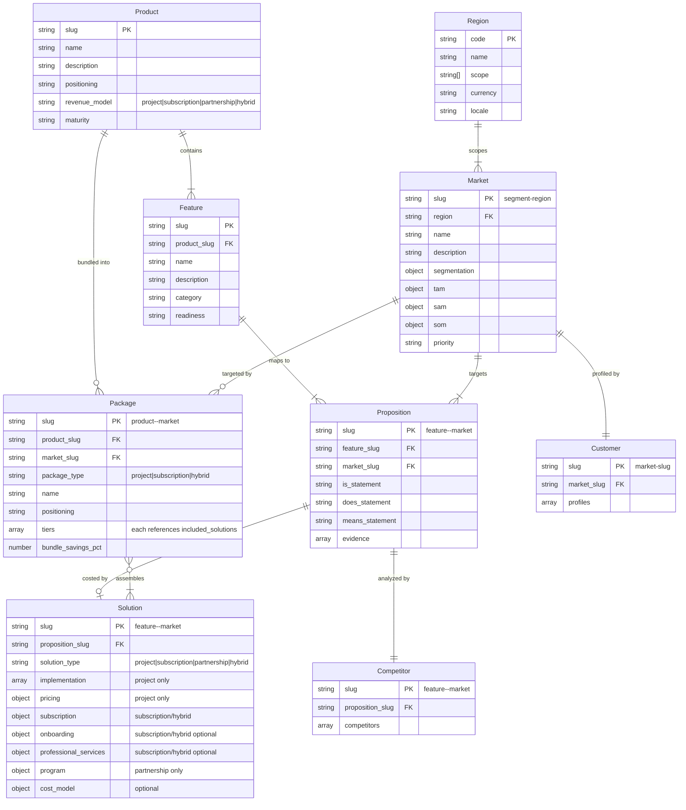

# cogni-portfolio Data Model Reference

## Entity Schemas

### portfolio.json (Project Root)

```json
{
  "slug": "project-slug",
  "company": {
    "name": "Company Name",
    "description": "What the company does",
    "industry": "Industry sector",
    "products": ["Product A", "Product B"]
  },
  "language": "de",
  "created": "2026-01-15",
  "updated": "2026-02-20"
}
```

Required fields: `slug`, `company.name`, `company.description`, `company.industry`
Optional fields: `language`, `delivery_defaults`, `created`, `updated`

The `language` field is a lowercase ISO 639-1 code (e.g., `"de"`, `"en"`, `"fr"`). If absent, defaults to `"en"`. It controls the language of all generated user-facing text content (descriptions, statements, messaging, proposals, briefs, profile text). JSON field names and slugs always remain in English.

The `delivery_defaults` object provides company-wide defaults for solution cost modeling:

```json
{
  "delivery_defaults": {
    "roles": [
      { "role": "Solution Architect", "rate_day": 1800, "currency": "EUR" },
      { "role": "Implementation Engineer", "rate_day": 1200, "currency": "EUR" },
      { "role": "Project Manager", "rate_day": 1400, "currency": "EUR" }
    ],
    "target_margin_pct": 35,
    "assumptions": [
      "Standard 8-hour workday",
      "Remote delivery unless on-site explicitly scoped"
    ]
  }
}
```

- `roles` (array): Default delivery roles with day rates. Solutions inherit these unless overridden.
- `target_margin_pct` (number): Company's target gross margin percentage. Used by quality gates to flag solutions priced below target.
- `assumptions` (string array): Company-wide delivery assumptions inherited by all solutions. Solution-specific assumptions are additive.

### products/{slug}.json

A product is a named offering that bundles related features. Every feature belongs to exactly one product.

```json
{
  "slug": "cloud-platform",
  "name": "Cloud Platform",
  "description": "Unified cloud infrastructure management platform for mid-market SaaS companies.",
  "positioning": "The most developer-friendly cloud management solution.",
  "pricing_tier": "Enterprise",
  "maturity": "growth",
  "launch_date": "2024-03-01",
  "version": "2.1",
  "created": "2026-01-15"
}
```

Required fields: `slug`, `name`, `description`
Optional fields: `positioning`, `pricing_tier`, `revenue_model`, `maturity`, `launch_date`, `version`, `source_file`, `created`

Valid `maturity` values: `concept`, `development`, `launch`, `growth`, `mature`, `decline`

Valid `revenue_model` values:
- `subscription` — Recurring revenue (SaaS, license). Solutions use onboarding + subscription tiers + optional professional services. Cost model uses unit economics (CAC, LTV, churn, gross margin).
- `project` — One-time engagements (consulting, implementation). Solutions use implementation phases + project pricing tiers (PoV/Small/Medium/Large). Cost model uses effort × rate + margin. **This is the default when `revenue_model` is absent.**
- `partnership` — Revenue-share or co-investment models. Solutions use program stages + revenue-share terms.
- `hybrid` — Combination (e.g., subscription base + consulting add-ons). Solutions combine subscription tiers with optional project-scoped services.

### features/{slug}.json

A feature is market-independent. It describes what the product/service IS. Each feature belongs to exactly one product.

```json
{
  "slug": "cloud-monitoring",
  "product_slug": "cloud-platform",
  "name": "Cloud Infrastructure Monitoring",
  "description": "Real-time monitoring of cloud infrastructure including servers, containers, and network components with automated alerting.",
  "category": "observability",
  "created": "2026-01-15"
}
```

Required fields: `slug`, `product_slug`, `name`, `description`
Optional fields: `category`, `readiness`, `source_file`, `created`, `updated`

Valid `readiness` values: `ga` (generally available), `beta` (limited availability / pilot), `planned` (roadmap only, not yet built)

The `category` field is a free-form label for grouping features (e.g., `"observability"`, `"integration"`, `"security"`). Categories are not constrained to a fixed vocabulary — validation will warn on categories used by only one feature to catch typos.

### markets/{slug}.json

A target market defined by region, segmentation criteria, and sized by TAM/SAM/SOM. The slug encodes the segment and region: `{segment}-{region}` (e.g., `mid-market-saas-dach`).

```json
{
  "slug": "mid-market-saas-dach",
  "name": "Mid-Market SaaS Companies (DACH)",
  "region": "dach",
  "description": "SaaS companies, 50-500 employees, $5M-$100M ARR in DACH.",
  "segmentation": {
    "company_size": "50-500 employees",
    "revenue_range": "$5M-$100M ARR",
    "vertical": "Software as a Service",
    "employees_min": 50,
    "employees_max": 500,
    "arr_min": 5000000,
    "arr_max": 100000000,
    "vertical_codes": ["saas"]
  },
  "tam": {
    "value": 5000000000,
    "currency": "EUR",
    "description": "Global cloud monitoring in SaaS",
    "source": "Gartner 2025 Cloud Monitoring Report"
  },
  "sam": {
    "value": 500000000,
    "currency": "EUR",
    "description": "DACH mid-market SaaS segment",
    "source": "Internal estimate based on DACH SaaS census"
  },
  "som": {
    "value": 15000000,
    "currency": "EUR",
    "description": "150 customers x 100K ACV in 3 years",
    "source": "Bottom-up estimate"
  },
  "created": "2026-01-15"
}
```

Required fields: `slug`, `name`, `region`, `description`
Optional fields: `segmentation`, `tam`, `sam`, `som`, `priority`, `source_file`, `created`, `updated`

Valid `priority` values: `beachhead` (primary go-to-market target), `expansion` (secondary growth market), `aspirational` (long-term opportunity, not yet pursued)

The `region` field must be a valid region code from the standard taxonomy in `$CLAUDE_PLUGIN_ROOT/skills/setup/references/regions.json`. Valid codes: `de`, `dach`, `eu`, `uk`, `nordics`, `us`, `na`, `cn`, `apac`, `jp`, `latam`, `mea`, `global`.

The `segmentation` object captures non-geographic criteria (company size, revenue, vertical, etc.). Geographic scope is expressed solely through `region` -- do not duplicate it in `segmentation.geography`.

**Normalized segmentation fields** (optional, used for overlap detection):
- `employees_min` / `employees_max` (integer): headcount range boundaries
- `arr_min` / `arr_max` (number): annual recurring revenue range in the market's currency
- `vertical_codes` (string array): lowercase identifiers for industry verticals (e.g., `["saas", "fintech"]`)

These normalized fields enable automated overlap detection between markets sharing the same region. The free-text fields (`company_size`, `revenue_range`, `vertical`) remain for human readability.

`source_file` (optional, all entity types): Filename of the document in `uploads/` from which this entity was extracted during ingestion.

`updated` (optional, all entity types): ISO 8601 date (`YYYY-MM-DD`) of the last meaningful content change. Used for staleness tracking — downstream entities (propositions, solutions) can be flagged as stale when their upstream entities (features, markets) have a newer `updated` date. Skills should set `updated` whenever they modify entity content.

### propositions/{feature-slug}--{market-slug}.json

A proposition maps one feature to one target market with market-specific messaging.

```json
{
  "slug": "cloud-monitoring--mid-market-saas",
  "feature_slug": "cloud-monitoring",
  "market_slug": "mid-market-saas",
  "is_statement": "Real-time cloud monitoring with automated alerting for servers, containers, and networks.",
  "does_statement": "Reduces MTTR by 60% via intelligent alert correlation, eliminating alert fatigue in growing teams.",
  "means_statement": "Maintain 99.95% uptime SLAs without additional SRE hires, protecting revenue during scaling.",
  "evidence": [
    {
      "statement": "58% average MTTR reduction across 12 beta customers",
      "source_url": "https://example.com/case-study",
      "source_title": "Cloud Monitoring Case Study 2025"
    }
  ],
  "created": "2026-01-20"
}
```

Required fields: `slug`, `feature_slug`, `market_slug`, `is_statement`, `does_statement`, `means_statement`
Optional fields: `evidence`, `created`

Each evidence entry can be a structured object with `statement` (string, required), `source_url` (string or null), and `source_title` (string or null). When web research produces evidence, include the source URL for claim verification. Entries without a source use null for URL/title fields.

**Naming convention**: Proposition file names use double-dash (`--`) to join feature and market slugs: `{feature-slug}--{market-slug}.json`

### solutions/{feature-slug}--{market-slug}.json

A solution attaches commercial terms to a proposition (same slug). The structure depends on the parent product's `revenue_model`. Solutions exist in two structural variants: **project** (effort-based) and **subscription** (recurring revenue). The `solution_type` field determines which variant applies. When absent, defaults to `"project"` for backward compatibility.

#### Project Solutions (`solution_type: "project"` or absent)

Traditional implementation-based solutions with phased delivery and project pricing tiers. Used for consulting, implementation, and advisory engagements.

```json
{
  "slug": "cloud-monitoring--mid-market-saas",
  "proposition_slug": "cloud-monitoring--mid-market-saas",
  "solution_type": "project",
  "implementation": [
    {
      "phase": "Discovery & Setup",
      "duration_weeks": 2,
      "description": "Requirements gathering, environment audit, success criteria definition"
    },
    {
      "phase": "Core Deployment",
      "duration_weeks": 4,
      "description": "Agent rollout, alerting rules, dashboard config, tool integration"
    },
    {
      "phase": "Tuning & Handover",
      "duration_weeks": 2,
      "description": "Alert threshold optimization, team training, runbook handover"
    }
  ],
  "pricing": {
    "proof_of_value": {
      "price": 15000,
      "currency": "EUR",
      "scope": "Single environment, 2-week pilot with defined success criteria"
    },
    "small": {
      "price": 50000,
      "currency": "EUR",
      "scope": "Up to 50 nodes, basic alerting, 8-week delivery"
    },
    "medium": {
      "price": 120000,
      "currency": "EUR",
      "scope": "Up to 200 nodes, full alerting and dashboards, 12 weeks"
    },
    "large": {
      "price": 250000,
      "currency": "EUR",
      "scope": "Unlimited nodes, full stack with dedicated CSM, 16 weeks"
    }
  },
  "cost_model": {
    "assumptions": [
      "Blended rate 1,400 EUR/day (60/40 senior/junior)",
      "Customer provides staging access within 5 days",
      "No custom integrations beyond standard API connectors",
      "Target margin 30-40% standard, 10-20% PoV"
    ],
    "bill_of_materials": {
      "roles": [
        { "role": "Solution Architect", "rate_day": 1800, "currency": "EUR" },
        { "role": "Implementation Engineer", "rate_day": 1200, "currency": "EUR" },
        { "role": "Project Manager", "rate_day": 1400, "currency": "EUR" }
      ],
      "tooling": [
        { "item": "Monitoring platform license (pilot)", "cost": 0, "note": "Included in PoV tier" }
      ],
      "infrastructure": [
        { "item": "Cloud hosting for collector agents", "cost_monthly": 500, "currency": "EUR" }
      ]
    },
    "effort_by_tier": {
      "proof_of_value": {
        "total_days": 12,
        "breakdown": [
          { "role": "Solution Architect", "days": 4 },
          { "role": "Implementation Engineer", "days": 6 },
          { "role": "Project Manager", "days": 2 }
        ],
        "internal_cost": 16000,
        "margin_pct": 6.25
      },
      "small": {
        "total_days": 40,
        "breakdown": [
          { "role": "Solution Architect", "days": 10 },
          { "role": "Implementation Engineer", "days": 22 },
          { "role": "Project Manager", "days": 8 }
        ],
        "internal_cost": 35600,
        "margin_pct": 28.8
      },
      "medium": {
        "total_days": 60,
        "breakdown": [
          { "role": "Solution Architect", "days": 14 },
          { "role": "Implementation Engineer", "days": 35 },
          { "role": "Project Manager", "days": 11 }
        ],
        "internal_cost": 82600,
        "margin_pct": 31.2
      },
      "large": {
        "total_days": 130,
        "breakdown": [
          { "role": "Solution Architect", "days": 28 },
          { "role": "Implementation Engineer", "days": 75 },
          { "role": "Project Manager", "days": 27 }
        ],
        "internal_cost": 178200,
        "margin_pct": 28.7
      }
    }
  },
  "created": "2026-03-05"
}
```

#### Subscription Solutions (`solution_type: "subscription"`)

Recurring-revenue solutions with onboarding, subscription tiers, and optional professional services. Used for SaaS, platform, and license-based products.

```json
{
  "slug": "deep-research--beratung-kmu-dach",
  "proposition_slug": "deep-research--beratung-kmu-dach",
  "solution_type": "subscription",
  "onboarding": {
    "description": "Initiales Setup und Enablement",
    "phases": [
      {
        "phase": "Kickoff & Workspace-Setup",
        "duration_weeks": 1,
        "description": "Account-Erstellung, Workspace-Konfiguration, Datenanbindung"
      }
    ],
    "pricing": {
      "included": true,
      "price": 0,
      "note": "Im ersten Subscription-Monat enthalten"
    }
  },
  "subscription": {
    "model": "tiered",
    "tiers": {
      "free": {
        "price_monthly": 0,
        "price_annual": 0,
        "scope": "Community-Plugins, Basis-Funktionalität, Community-Support",
        "limits": "3 Research-Projekte/Monat, keine Premium-Plugins"
      },
      "pro": {
        "price_monthly": 149,
        "price_annual": 1490,
        "scope": "Alle Plugins, Priority-Support, erweiterte Agenten-Kapazität",
        "limits": "Unbegrenzte Projekte, alle Premium-Features"
      },
      "enterprise": {
        "price_monthly": null,
        "price_annual": null,
        "scope": "Custom Pricing, SSO, dedizierter Success Manager, SLA",
        "note": "Preis auf Anfrage, ab 10 Seats"
      }
    },
    "currency": "EUR",
    "billing_cycle": "monthly | annual",
    "discount_annual_pct": 17
  },
  "professional_services": {
    "available": true,
    "description": "Optionale Beratungsleistungen für beschleunigte Adoption",
    "options": [
      {
        "name": "Onboarding-Workshop",
        "price": 3000,
        "currency": "EUR",
        "scope": "Halbtägiger Workshop: Use-Case-Mapping und Team-Training"
      },
      {
        "name": "Adoption-Paket",
        "price": 7500,
        "currency": "EUR",
        "scope": "4 Wochen Begleitung: Check-ins, Use-Case-Optimierung, Best-Practice-Transfer"
      }
    ]
  },
  "cost_model": {
    "assumptions": [
      "Hosting-Kosten pro Seat: 15 EUR/Monat",
      "Support-Kosten pro Pro-Seat: 10 EUR/Monat",
      "Onboarding-Workshop: 1 Berater × 0.5 Tage = 900 EUR intern"
    ],
    "unit_economics": {
      "cac": 500,
      "ltv": 8940,
      "ltv_cac_ratio": 17.9,
      "gross_margin_pct": 85,
      "churn_monthly_pct": 3
    }
  },
  "created": "2026-03-10"
}
```

#### Partnership Solutions (`solution_type: "partnership"`)

Revenue-share or co-investment programs with staged partner engagement.

```json
{
  "slug": "plugin-plattform--agentur-dach",
  "proposition_slug": "plugin-plattform--agentur-dach",
  "solution_type": "partnership",
  "program": {
    "stages": [
      {
        "stage": "Pilot-Partnerschaft",
        "duration_months": 3,
        "description": "Gemeinsame Entwicklung eines Referenz-Use-Cases",
        "commitment": "1 Entwickler, wöchentliche Syncs"
      },
      {
        "stage": "Zertifizierte Partnerschaft",
        "duration_months": 12,
        "description": "Co-Marketing, Lead-Sharing, gemeinsame Kundenansprache",
        "commitment": "2+ zertifizierte Berater, quartalsweise Reviews"
      }
    ],
    "revenue_share": {
      "model": "referral",
      "partner_pct": 20,
      "description": "20% Revenue-Share auf geworbene Subscription-Kunden im ersten Jahr"
    }
  },
  "cost_model": {
    "assumptions": [
      "Partner-Management: 0.2 FTE pro aktiver Partnerschaft",
      "Zertifizierungsprogramm: 2.000 EUR einmalig pro Partner"
    ]
  },
  "created": "2026-03-10"
}
```

#### Schema Reference by Solution Type

| Field | project | subscription | partnership | hybrid |
|---|---|---|---|---|
| `solution_type` | `"project"` or absent | `"subscription"` | `"partnership"` | `"hybrid"` |
| `implementation` | required | — | — | — |
| `pricing` (PoV/S/M/L) | required | — | — | — |
| `onboarding` | — | optional | — | optional |
| `subscription` | — | required | — | required |
| `professional_services` | — | optional | — | optional |
| `program` | — | — | required | — |
| `cost_model` | optional (effort-based) | optional (unit economics) | optional | optional |

**Hybrid solutions** combine `subscription` (required) with optional `onboarding`, `professional_services`, and/or a reduced `implementation` block for initial setup projects.

#### Common Fields (all solution types)

Required fields: `slug`, `proposition_slug`
Optional fields: `solution_type`, `cost_model`, `created`

#### Project Solution Fields

Required: `implementation` (array with at least one phase entry), `pricing` (object with `proof_of_value`, `small`, `medium`, `large` tiers)

Each implementation phase has `phase` (string, required), `duration_weeks` (number, required), and `description` (string, required). Each pricing tier has `price` (number, required), `currency` (string, required), and `scope` (string, required).

The `cost_model` object is optional but recommended for rigorous business cases:

- **`assumptions`** (string array): Explicit statements about rate basis, client prerequisites, scope exclusions, and target margins. These are the statements that get challenged in deal reviews — making them explicit prevents hidden assumptions from undermining pricing credibility.
- **`bill_of_materials`**: Resources required for delivery.
  - `roles` (array): Each entry has `role` (string), `rate_day` (number), `currency` (string). Roles can reference defaults from `portfolio.json` `delivery_defaults.roles` or be overridden per solution.
  - `tooling` (array, optional): Each entry has `item` (string), `cost` (number), `note` (string, optional). Software licenses, platforms, or tools consumed during delivery.
  - `infrastructure` (array, optional): Each entry has `item` (string), `cost_monthly` (number), `currency` (string). Recurring infrastructure costs during the engagement.
- **`effort_by_tier`**: Effort allocation for each pricing tier. Each tier object has:
  - `total_days` (number): Total person-days for this tier
  - `breakdown` (array): Per-role allocation with `role` (string) and `days` (number)
  - `internal_cost` (number): Computed cost (sum of role days * rates + tooling + infrastructure)
  - `margin_pct` (number): `(price - internal_cost) / price * 100`

#### Subscription Solution Fields

Required: `subscription` (object with `model`, `tiers`, `currency`)

- **`subscription.model`**: `"tiered"` (Free/Pro/Enterprise), `"usage"` (pay-per-use), or `"flat"` (single price)
- **`subscription.tiers`**: Object with tier names as keys. Each tier has `price_monthly` (number or null), `price_annual` (number or null), `scope` (string). Optional: `limits` (string), `note` (string).
- **`subscription.currency`**: ISO currency code
- **`subscription.billing_cycle`**: `"monthly | annual"` or `"annual"`
- **`subscription.discount_annual_pct`**: Annual discount percentage (optional)

Optional: `onboarding` (object with `description`, `phases`, `pricing`), `professional_services` (object with `available`, `description`, `options` array)

The `cost_model` for subscription solutions uses `unit_economics` instead of `effort_by_tier`:
- **`unit_economics.cac`**: Customer acquisition cost
- **`unit_economics.ltv`**: Customer lifetime value
- **`unit_economics.ltv_cac_ratio`**: LTV/CAC ratio (target > 3)
- **`unit_economics.gross_margin_pct`**: Gross margin percentage (target > 70%)
- **`unit_economics.churn_monthly_pct`**: Monthly churn rate (target < 5%)

#### Partnership Solution Fields

Required: `program` (object with `stages` array and `revenue_share`)

- **`program.stages`**: Array of engagement stages with `stage` (string), `duration_months` (number), `description` (string), `commitment` (string)
- **`program.revenue_share`**: Object with `model` (string), `partner_pct` (number), `description` (string)

**Naming convention**: Solution file names use the same double-dash (`--`) convention as propositions: `{feature-slug}--{market-slug}.json`

### packages/{product-slug}--{market-slug}.json

A package bundles solutions from one product into sellable tiers for a specific market. It represents what the customer actually buys — a cohesive offering assembled from individual feature-level solutions.

The `package_type` field mirrors the parent product's `revenue_model` and determines the tier structure.

#### Project Packages (`package_type: "project"`)

```json
{
  "slug": "cloud-platform--mid-market-saas-dach",
  "product_slug": "cloud-platform",
  "market_slug": "mid-market-saas-dach",
  "package_type": "project",
  "name": "Cloud Platform Implementation",
  "positioning": "Complete cloud observability in one engagement",
  "tiers": [
    {
      "tier": "foundation",
      "name": "Foundation",
      "included_solutions": ["cloud-monitoring--mid-market-saas-dach"],
      "price": 45000,
      "currency": "EUR",
      "scope": "Core monitoring for one environment"
    },
    {
      "tier": "professional",
      "name": "Professional",
      "included_solutions": [
        "cloud-monitoring--mid-market-saas-dach",
        "real-time-alerting--mid-market-saas-dach"
      ],
      "price": 85000,
      "currency": "EUR",
      "scope": "Full observability with intelligent alerting"
    },
    {
      "tier": "enterprise",
      "name": "Enterprise",
      "included_solutions": [
        "cloud-monitoring--mid-market-saas-dach",
        "real-time-alerting--mid-market-saas-dach",
        "analytics-dashboard--mid-market-saas-dach"
      ],
      "price": 150000,
      "currency": "EUR",
      "scope": "Complete platform with executive dashboards"
    }
  ],
  "bundle_savings_pct": 15,
  "created": "2026-03-11"
}
```

#### Subscription Packages (`package_type: "subscription"`)

```json
{
  "slug": "cogni-works--beratung-kmu-dach",
  "product_slug": "cogni-works",
  "market_slug": "beratung-kmu-dach",
  "package_type": "subscription",
  "name": "cogni-works Beratungsplattform",
  "positioning": "AI-powered consulting toolkit in one subscription",
  "tiers": [
    {
      "tier": "starter",
      "name": "Starter",
      "included_solutions": ["deep-research--beratung-kmu-dach"],
      "price_monthly": 99,
      "price_annual": 990,
      "currency": "EUR",
      "scope": "Core research capability"
    },
    {
      "tier": "professional",
      "name": "Professional",
      "included_solutions": [
        "deep-research--beratung-kmu-dach",
        "report-generator--beratung-kmu-dach"
      ],
      "price_monthly": 249,
      "price_annual": 2490,
      "currency": "EUR",
      "scope": "Full research + automated reporting"
    },
    {
      "tier": "enterprise",
      "name": "Enterprise",
      "included_solutions": [
        "deep-research--beratung-kmu-dach",
        "report-generator--beratung-kmu-dach",
        "portfolio-analyzer--beratung-kmu-dach"
      ],
      "price_monthly": null,
      "price_annual": null,
      "currency": "EUR",
      "scope": "Full platform, SSO, SLA, dedicated CSM"
    }
  ],
  "bundle_savings_pct": 20,
  "created": "2026-03-11"
}
```

#### Schema Reference by Package Type

| Field | project | subscription | hybrid |
|---|---|---|---|
| `package_type` | `"project"` | `"subscription"` | `"hybrid"` |
| Tier: `price` | required | — | — |
| Tier: `price_monthly` | — | required (or null) | required (or null) |
| Tier: `price_annual` | — | required (or null) | required (or null) |
| Tier: `included_solutions` | required | required | required |
| Tier: `scope` | required | required | required |
| Tier: `currency` | required | required | required |

#### Common Fields (all package types)

Required fields: `slug`, `product_slug`, `market_slug`, `package_type`, `name`, `tiers` (array with at least one tier)
Optional fields: `positioning`, `bundle_savings_pct`, `created`

Each tier requires: `tier` (kebab-case identifier), `name`, `included_solutions` (array of solution slugs), `scope` (string), `currency` (string)

**Naming convention**: Package file names use double-dash (`--`) to join product and market slugs: `{product-slug}--{market-slug}.json`

### competitors/{feature-slug}--{market-slug}.json

Competitive landscape for a specific proposition (same slug as the proposition it analyzes).

```json
{
  "slug": "cloud-monitoring--mid-market-saas",
  "proposition_slug": "cloud-monitoring--mid-market-saas",
  "competitors": [
    {
      "name": "Datadog",
      "source_url": "https://example.com/datadog-review",
      "positioning": "Full-stack observability for cloud-scale companies",
      "strengths": ["Brand recognition", "Broad integrations", "Unified APM + logs + metrics"],
      "weaknesses": ["Expensive at scale", "Overkill for mid-market", "Opaque pricing"],
      "differentiation": "40% lower cost, deploys in hours vs. weeks, purpose-built for mid-market."
    }
  ],
  "created": "2026-01-25"
}
```

Required fields: `slug`, `proposition_slug`, `competitors` (array with at least `name`)
Optional fields: `created`

Each competitor entry may include `source_url` (string or null) pointing to the primary research source used for positioning and pricing claims. This enables downstream claim verification.

### customers/{market-slug}.json

Ideal customer profile for a target market (same slug as the market).

```json
{
  "slug": "mid-market-saas",
  "market_slug": "mid-market-saas",
  "profiles": [
    {
      "role": "VP Engineering",
      "seniority": "C-1",
      "pain_points": [
        "Infrastructure complexity outpacing team capacity",
        "Alert fatigue causing missed critical incidents",
        "SLA pressure with flat headcount"
      ],
      "buying_criteria": [
        "Time to value under 2 weeks",
        "Total cost under $100K/year",
        "Minimal configuration overhead"
      ],
      "information_sources": ["Hacker News", "Infrastructure podcasts", "Peer recommendations"],
      "decision_role": "Economic buyer and technical evaluator"
    }
  ],
  "created": "2026-01-25"
}
```

Required fields: `slug`, `market_slug`, `profiles` (array with at least `role`)
Optional fields: `created`

## Naming Conventions

| Convention | Rule | Example |
|---|---|---|
| Project slug | kebab-case, descriptive | `acme-cloud-services` |
| Product slug | kebab-case, product name | `cloud-platform` |
| Feature slug | kebab-case, noun-based | `cloud-monitoring` |
| Market slug | `{segment}-{region}` | `mid-market-saas-dach` |
| Proposition slug | `{feature}--{market}` | `cloud-monitoring--mid-market-saas-dach` |
| Solution slug | Same as proposition slug | `cloud-monitoring--mid-market-saas-dach` |
| Package slug | `{product}--{market}` | `cloud-platform--mid-market-saas-dach` |
| Competitor slug | Same as proposition slug | `cloud-monitoring--mid-market-saas-dach` |
| Customer slug | Same as market slug | `mid-market-saas-dach` |

## Entity Relationships



- One product contains many features (1:N exclusive)
- One product can have many packages, one per target market (1:N)
- One region scopes many markets (1:N)
- One feature can map to many markets (producing many propositions)
- One market can receive many features (producing many propositions)
- Each proposition has at most one solution (implementation plan + pricing)
- Each proposition has exactly one competitor analysis
- Each market has exactly one customer profile
- Each package assembles N solutions from one product for one market (N:1 with product, N:1 with market, references N solutions via tiers)
- Region is defined in the taxonomy (`regions.json`), not as a project entity
- Features reference their parent product by `product_slug`
- Markets reference their region by `region` code
- Propositions, solutions, competitors, customers, and packages reference their parents by slug
