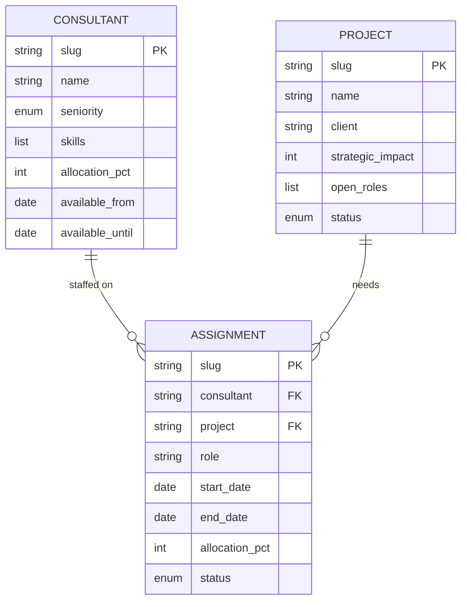

# cogni-projects Data Model

The self-contained entity schema for a cogni-projects portfolio. Three entity
types — **consultant**, **project**, and **assignment** — are authored as
Obsidian-browsable markdown files with YAML frontmatter and registered into the
portfolio manifest. This document is the canonical field contract shared by the
`projects-entities` authoring skill, the `validate-entities.py` validator, and
the later staffing-match / backfilling / dashboard skills.

Partners author these records manually (no external system dependency in the
MVP), so the schema is deliberately flat and human-writable.

## Portfolio layout

A portfolio is one `cogni-projects/<portfolio-slug>/` directory rooted by a
`projects-portfolio.json` manifest (scaffolded by `projects-setup`):

```
cogni-projects/<portfolio-slug>/
├── projects-portfolio.json    Root manifest — identity + consultants[]/projects[]/assignments[] refs
├── consultants/               consultant entity records — <slug>.md
├── projects/                  project entity records — <slug>.md
├── assignments/               assignment entity records — <consultant>--<project>.md
└── .metadata/                 append-only logs (execution, staffing, decisions)
```

Each entity lives in one markdown file under its type's subdirectory. The file's
subdirectory determines its type, and the frontmatter `type` field must agree.

## Frontmatter conventions

- Frontmatter is a leading `---` … `---` fence at the top of the file.
- Values are **flat**: scalars, ISO dates (`YYYY-MM-DD`), integers, and simple
  string lists (`[a, b]` inline or `- item` block form). No nested objects —
  this keeps the stdlib validator dependency-free (no PyYAML).
- Slugs are **kebab-case** (`^[a-z0-9]+(-[a-z0-9]+)*$`), derived from the entity
  name. Assignment slugs are composite: `<consultant-slug>--<project-slug>`.
- Unknown frontmatter keys are ignored (a warning, not an error) so the schema
  stays forward-compatible.

---

## consultant

A person the firm can staff onto projects — their profile, seniority, skills,
and availability window.

Stored at `consultants/<slug>.md`.

```markdown
---
type: consultant
slug: mara-lindqvist
name: Mara Lindqvist
seniority: senior
skills: [supply-chain, sap, change-management]
grade: M3
location: stockholm
available_from: 2026-03-01
available_until: 2026-09-30
allocation_pct: 60
updated: 2026-07-17
---

Free-form profile notes, engagement history, and certifications go in the body.
```

**Required fields:** `type` (= `consultant`), `slug`, `name`, `seniority`, `skills`.

**Optional fields:** `grade`, `location`, `available_from`, `available_until`,
`allocation_pct`, `updated`.

Valid `seniority` values:

| Value | Meaning |
|-------|---------|
| `junior` | Analyst / entry level |
| `consultant` | Core delivery |
| `senior` | Senior consultant / manager |
| `principal` | Principal / senior manager |
| `partner` | Partner / director |

`allocation_pct` is an integer `0..100` — the consultant's current committed
allocation. `available_from` / `available_until` bound the window in which the
consultant can take new work (the "availability" the staffing engine reads).

---

## project

A client engagement (or prospect) with staffing needs, a timeline, and a
strategic-impact score.

Stored at `projects/<slug>.md`.

```markdown
---
type: project
slug: nordic-retail-erp
name: Nordic Retail ERP Rollout
client: Nordic Retail Group
strategic_impact: 4
open_roles: [erp-lead, integration-architect, change-lead]
start_date: 2026-04-01
end_date: 2026-12-15
status: active
updated: 2026-07-17
---

Engagement scope, commercial context, and staffing notes go in the body.
```

**Required fields:** `type` (= `project`), `slug`, `name`, `client`, `strategic_impact`.

**Optional fields:** `open_roles`, `start_date`, `end_date`, `status`, `updated`.

`strategic_impact` is an integer `1..5` (1 = tactical, 5 = firm-defining) — the
score the staffing engine weighs against availability so staffing optimizes firm
strategy, not just utilization.

Valid `status` values:

| Value | Meaning |
|-------|---------|
| `prospective` | Pipeline / not yet won |
| `active` | In delivery |
| `closed` | Delivered or lost |

`open_roles` is a list of role labels the project still needs staffed.

---

## assignment

A consultant committed to a project for a role over a date window. The join that
the staffing engine produces and the backfilling recommender reasons over.

Stored at `assignments/<consultant-slug>--<project-slug>.md`.

```markdown
---
type: assignment
slug: mara-lindqvist--nordic-retail-erp
consultant: mara-lindqvist
project: nordic-retail-erp
role: erp-lead
start_date: 2026-04-01
end_date: 2026-09-30
allocation_pct: 60
status: active
updated: 2026-07-17
---

Notes on the assignment — ramp, handover, backfill plan.
```

**Required fields:** `type` (= `assignment`), `slug`, `consultant`, `project`,
`role`, `start_date`, `end_date`.

**Optional fields:** `allocation_pct`, `status`, `updated`.

`consultant` and `project` are slug references to a `consultants/<slug>.md` and a
`projects/<slug>.md` entity. `allocation_pct` is an integer `0..100`.

Valid `status` values:

| Value | Meaning |
|-------|---------|
| `planned` | Committed but not yet started |
| `active` | Consultant currently on the project |
| `completed` | Assignment finished |

---

## Naming conventions

| Entity | Slug shape | Example |
|--------|-----------|---------|
| consultant | kebab-case, from the person's name | `mara-lindqvist` |
| project | kebab-case, from the engagement name | `nordic-retail-erp` |
| assignment | `<consultant-slug>--<project-slug>` | `mara-lindqvist--nordic-retail-erp` |

The `--` double-hyphen separator in assignment slugs makes the join legible and
keeps one assignment per consultant-project pair addressable by a stable slug.

## Manifest registration

When `projects-entities` authors an entity, `scripts/register-entity.py
<portfolio-dir> <entity-file>` upserts a **summary ref** into the matching array
in `projects-portfolio.json` (keyed on `slug`, so a re-run replaces rather than
appends) and bumps the manifest `updated` date. That script is the only writer of
these refs — do not hand-edit the manifest. The ref is a compact pointer, not a
copy of the frontmatter:

```json
{
  "consultants": [
    {"slug": "mara-lindqvist", "name": "Mara Lindqvist", "file": "consultants/mara-lindqvist.md"}
  ],
  "projects": [
    {"slug": "nordic-retail-erp", "name": "Nordic Retail ERP Rollout", "file": "projects/nordic-retail-erp.md"}
  ],
  "assignments": [
    {"slug": "mara-lindqvist--nordic-retail-erp", "consultant": "mara-lindqvist", "project": "nordic-retail-erp", "file": "assignments/mara-lindqvist--nordic-retail-erp.md"}
  ]
}
```

The entity markdown file is the source of truth for full field values; the
manifest ref is the index the dashboard and staffing skills scan without opening
every file.

## Entity relationships



## Validation

`scripts/validate-entities.py <path>` checks any entity file — or every entity
under a portfolio directory — against this schema: required keys, valid enum
values, kebab-case slug shape, ISO dates and their `start_date <= end_date` /
`available_from <= available_until` ordering, and integer ranges. It returns the
repo-standard `{"success", "data", "error"}` envelope with `success: false` and
a per-field `{entity, file, field, message}` list when an entity is malformed.

It validates **frontmatter shape only**. An assignment's `consultant` and
`project` values are not resolved to real entity files, so a passing run is not
evidence those refs exist — read both referenced entities before authoring an
assignment.
