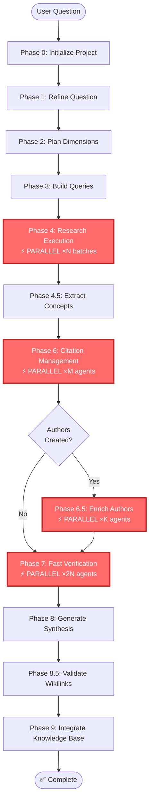

# Deep Research Phase Summary - Quick Reference

## High-Level Flow



## Phase Overview Table

| Phase | Name | Agent/Script | Input | Output | Parallel? |
|-------|------|--------------|-------|--------|-----------|
| **0** | Project Init | initialize-research-project.sh | User question | .metadata/, directories | No |
| **1** | Question Refine | deeper-research skill (direct) | User question | 00-initial-question/data/*.md | No |
| **2** | Dimension Plan | dimension-planner | 00-initial-question | 01-research-dimensions/data/, 02-refined-questions/data/ | No |
| **3** | Query Build | query-builder | 02-refined-questions/data/ | 03-query-batches/data/ | No |
| **4** | Research Execute | research-executor | 03-query-batches/data/ | 04-findings/data/, **06-megatrends/data/** | **Yes ×N** |
| **4.5** | Concept Extract | concept-extractor | 04-findings/data/ | 05-domain-concepts/data/ | No |
| **5** | ~~Megatrend Cluster~~ | ~~REMOVED~~ | ~~N/A~~ | ~~Megatrends in Phase 4~~ | ~~N/A~~ |
| **6** | Publisher Generate | publisher-generator | 07-sources/data/ | 08-publishers/data/ | **Yes ×N** (dimension-based) |
| **6.2** | Citation Generate | citation-generator.sh | 07-sources/data/, 08-publishers/data/ | 09-citations/data/ | No |
| **7** | Fact Verify | fact-checker | 04-findings/data/ | 10-claims/data/, .logs/ | **Yes ×2N** |
| **8** | Synthesis Build | synthesis-hub | All entities 00-11 | research-hub.md, 09-citations/README.md | No |
| **8.5** | Validate Graph | validate-wikilinks.sh | All entities | Validation report | No |
| **9** | KB Integrate | update-knowledge-base.sh | All entities | Final report, index | No |

## Parallel Execution Rules

### Phase 4: Research Execution
```
N = count(03-query-batches/data/*.md)
Strategy: 1 agent per batch
Output: findings + megatrends (both created here!)
```

### Phase 6: Citation Management
```
M = ceiling(count(04-findings/data/*.md) / 10), max 10
Strategy: 10-Findings-Per-Agent Rule
Distribution: Round-robin
```

### Phase 6.5: Author Enrichment
```
IF count(08-authors/*.md) == 0: SKIP
K = ceiling(count(08-authors/*.md) / 10), max 10
Strategy: 10-Authors-Per-Agent Rule
Distribution: Self-partitioning
```

### Phase 7: Fact Verification
```
L = 2 × N (where N = batch count from Phase 4)
Strategy: 2× Rule
Distribution: Round-robin across findings
```

## Critical Entity Flow

```
User Question
    ↓
[00] Initial Question (1 file)
    ↓
[01] Dimensions (3-6 files) + [02] Questions (6-30 files)
    ↓
[03] Query Batches (N files, 5-7 queries each)
    ↓
[04] Findings (many) + [06] Megatrends (many) ← CREATED TOGETHER IN PHASE 4
    ↓
[05] Concepts (recurring terms)
    ↓
[07] Sources + [08] Authors + [09] Citations
    ↓
[08] Authors ENRICHED (if any exist)
    ↓
[10] Claims (with confidence scores)
    ↓
[11] Synthesis (5 markdown files)
    ↓
Validated & Integrated
```

## Agent Output Standards

All agents should return JSON with **at minimum** a `success` field:

```json
{
  "success": true,
  "...": "additional fields specific to phase"
}
```

**Exception**: Phase 7 (fact-checker) returns text summary to orchestrator, writes JSON to files.

## Key Changes from Current Implementation

1. **Phase 5 REMOVED** - Megatrends created in Phase 4, not separate invocation
2. **Phase 4 creates megatrends** - research-executor creates both findings AND megatrends
3. **Phase 7 text response** - fact-checker returns summary text, not JSON
4. **Phase 8 JSON input** - synthesis-hub needs sprint_context structure
5. **13 phases total** - Not 10 (includes 4.5, 6.5, 8.5)
