# Deep Research Workflow - Target State Architecture

## Complete Phase Flow with Entities and Subagents

```mermaid
flowchart TD
    Start([User Question]) --> P0

    %% Phase 0: Initialization
    P0["Phase 0: Project Initialization<br/>Script: initialize-research-project.sh"]
    P0 --> E_Meta[(".metadata/<br/>sprint-log.json")]
    E_Meta --> P1

    %% Phase 1: Question Refinement
    P1["Phase 1: Question Refinement<br/>Deep-research skill (direct execution)"]
    P1 --> E00["00-initial-question/<br/>question-uuid.md"]
    E00 --> P2

    %% Phase 2: Dimensional Planning
    P2["Phase 2: Dimensional Planning<br/>Agent: dimension-planner"]
    P2 --> E01["01-research-dimensions/data/<br/>3-6 dimension files"]
    P2 --> E02["02-refined-questions/data/<br/>6-30 question files"]
    E01 --> P3
    E02 --> P3

    %% Phase 3: Query Construction
    P3["Phase 3: Query Construction<br/>Agent: query-builder"]
    P3 --> E03["03-query-batches/data/<br/>N batch files<br/>5-7 queries each"]
    E03 --> CountBatches{"Count Batches<br/>for parallelization"}
    CountBatches --> P4_Parallel

    %% Phase 4: Parallel Research Execution
    P4_Parallel{{"Phase 4: Research Execution<br/>PARALLEL: N agents<br/>1 per batch"}}
    P4_Parallel --> P4_1["research-executor<br/>Agent 1: Batch 1"]
    P4_Parallel --> P4_2["research-executor<br/>Agent 2: Batch 2"]
    P4_Parallel --> P4_N["research-executor<br/>Agent N: Batch N"]

    P4_1 --> E04["04-findings/data/<br/>finding-uuid.md"]
    P4_2 --> E04
    P4_N --> E04

    P4_1 --> E06["06-megatrends/data/<br/>megatrend-uuid.md"]
    P4_2 --> E06
    P4_N --> E06

    E04 --> Sync4["Wait for all<br/>research-executor agents"]
    E06 --> Sync4
    Sync4 --> P4_5

    %% Phase 4.5: Concept Extraction
    P4_5["Phase 4.5: Concept Extraction<br/>Agent: concept-extractor<br/>Sequential"]
    P4_5 --> E05["05-domain-concepts/data/<br/>concept-uuid.md"]
    E05 --> P6_Count

    %% Phase 6: Publisher Generation Parallel
    P6_Count{"Calculate Agents<br/>1-Per-Dimension"}
    P6_Count --> P6_Parallel{{"Phase 6: Publisher Generation<br/>PARALLEL: N agents<br/>Dimension-based partitioning"}}

    P6_Parallel --> P6_1["publisher-generator<br/>Agent 1: Dimension 1"]
    P6_Parallel --> P6_2["publisher-generator<br/>Agent 2: Dimension 2"]
    P6_Parallel --> P6_N["publisher-generator<br/>Agent N: Dimension N"]

    P6_1 --> E08["08-publishers/data/<br/>publisher-uuid.md"]
    P6_2 --> E08
    P6_N --> E08

    E08 --> Sync6["Wait for all<br/>publisher-generator agents"]
    Sync6 --> P6_2_CG["Phase 6.2: Citation Generation<br/>citation-generator.sh"]

    P6_2_CG --> E09["09-citations/data/<br/>citation-uuid.md"]
    E09 --> P6_5_Check

    %% Phase 6.5: Author Enrichment Conditional
    P6_5_Check{"Authors Created?<br/>Count > 0?"}
    P6_5_Check -->|Yes| P6_5_Count{"Calculate Agents<br/>10-Authors-Per-Agent"}
    P6_5_Check -->|No| P7_Count["Skip Phase 6.5"]

    P6_5_Count --> P6_5_Parallel{{"Phase 6.5: Author Enrichment<br/>PARALLEL: K agents<br/>Partition-based distribution"}}

    P6_5_Parallel --> P6_5_1["author-enricher<br/>Agent 1: Authors 1-10"]
    P6_5_Parallel --> P6_5_2["author-enricher<br/>Agent 2: Authors 11-20"]
    P6_5_Parallel --> P6_5_K["author-enricher<br/>Agent K: Authors..."]

    P6_5_1 --> E08_Updated["08-authors/<br/>UPDATED with context"]
    P6_5_2 --> E08_Updated
    P6_5_K --> E08_Updated

    E08_Updated --> Sync6_5["Wait for all<br/>author-enricher agents"]
    Sync6_5 --> P7_Count
    P7_Count --> P7_Calc

    %% Phase 7: Fact Verification Parallel
    P7_Calc{"Calculate Agents<br/>2x batch count"}
    P7_Calc --> P7_Parallel{{"Phase 7: Fact Verification<br/>PARALLEL: 2xN agents<br/>Round-robin distribution"}}

    P7_Parallel --> P7_1["fact-checker<br/>Agent 1: Partition 1"]
    P7_Parallel --> P7_2["fact-checker<br/>Agent 2: Partition 2"]
    P7_Parallel --> P7_L["fact-checker<br/>Agent L: Partition L"]

    P7_1 --> E10["10-claims/data/<br/>claim-uuid.md"]
    P7_2 --> E10
    P7_L --> E10

    P7_1 --> E_Reports[".logs/<br/>partition-N-fact-check.md<br/>partition-N-stats.json"]
    P7_2 --> E_Reports
    P7_L --> E_Reports

    E10 --> Sync7["Wait for all<br/>fact-checker agents"]
    E_Reports --> Sync7
    Sync7 --> P8

    %% Phase 8: Synthesis Generation
    P8["Phase 8: Synthesis Generation<br/>Agent: synthesis-hub<br/>Sequential"]
    E00 -.Read All.-> P8
    E01 -.Read All.-> P8
    E02 -.Read All.-> P8
    E04 -.Read All.-> P8
    E05 -.Read All.-> P8
    E06 -.Read All.-> P8
    E07 -.Read All.-> P8
    E08_Updated -.Read All.-> P8
    E09 -.Read All.-> P8
    E10 -.Read All.-> P8

    P8 --> E12["09-citations/README.md<br/>research-hub.md"]
    E12 --> P8_5

    %% Phase 8.5: Validate Knowledge Graph
    P8_5["Phase 8.5: Validate Knowledge Graph<br/>Script: validate-wikilinks.sh"]
    E12 -.Validate All Wikilinks.-> P8_5
    P8_5 --> Validation{"Broken Links?"}
    Validation -->|Yes| AskUser{"Ask User:<br/>Fix before proceeding?"}
    AskUser -->|Yes| ManualFix["Manual Review<br/>& Fixes"]
    AskUser -->|No| P9["Continue with Warning"]
    Validation -->|No| P9
    ManualFix --> P9

    %% Phase 9: Knowledge Base Integration
    P9["Phase 9: Knowledge Base Integration<br/>Script: update-knowledge-base.sh"]
    E_Meta -.Update.-> P9
    P9 --> FinalReport["Final Report:<br/>- Entity counts<br/>- Synthesis location<br/>- Compliance metrics<br/>- JSON statistics"]

    FinalReport --> Complete([Research Complete])

    %% Styling
    classDef phaseStyle fill:#4A90E2,stroke:#2E5C8A,stroke-width:2px,color:#fff
    classDef agentStyle fill:#7B68EE,stroke:#4B0082,stroke-width:2px,color:#fff
    classDef parallelStyle fill:#FF6B6B,stroke:#C92A2A,stroke-width:3px,color:#fff
    classDef entityStyle fill:#51CF66,stroke:#2F9E44,stroke-width:2px,color:#000
    classDef decisionStyle fill:#FFA94D,stroke:#E67700,stroke-width:2px,color:#000
    classDef scriptStyle fill:#20C997,stroke:#087F5B,stroke-width:2px,color:#fff

    class P0,P1,P2,P3,P4_5,P8,P8_5,P9 phaseStyle
    class P4_1,P4_2,P4_N,P6_1,P6_2,P6_M,P6_5_1,P6_5_2,P6_5_K,P7_1,P7_2,P7_L agentStyle
    class P4_Parallel,P6_Parallel,P6_5_Parallel,P7_Parallel parallelStyle
    class E00,E01,E02,E03,E04,E05,E06,E07,E08,E09,E10,E11,E_Meta,E_Reports,E08_Updated entityStyle
    class CountBatches,P6_Count,P6_5_Check,P6_5_Count,P7_Calc,Validation,AskUser decisionStyle
```



**Key Relationships:**
- Phase 2.5 (batch-creator) creates **one batch per refined question** from Phase 2
- Batch naming: `{question-id}-batch.md` (e.g., `question-market-size-a1b2c3d4-batch.md`)
- Each batch contains 4-7 search configs for that question
- Batch count = Question count = Phase 3 parallelization factor

## Entity Directory Structure

```
project-path/
├── .metadata/
│   ├── sprint-log.json          [Phase 0: Created]
│   └── entity-index.json        [Phase 6: Updated for deduplication]
│
├── 00-initial-question/
│   └── question-uuid.md         [Phase 1: deeper-research skill]
│
├── 01-research-dimensions/data/
│   ├── technical.md             [Phase 2: dimension-planner]
│   ├── economic.md
│   └── ... (3-6 files)
│
├── 02-refined-questions/data/
│   ├── tech-q1.md               [Phase 2: dimension-planner]
│   ├── tech-q2.md
│   └── ... (6-30 files)
│
├── 03-query-batches/data/
│   ├── query-batch-technical.md     [Phase 3: query-builder]
│   ├── query-batch-economic.md
│   └── ... (N batches, one per dimension)
│
├── 04-findings/data/
│   ├── finding-uuid.md          [Phase 4: research-executor ×N parallel]
│   └── ... (variable count)
│
├── 05-domain-concepts/data/
│   ├── concept-uuid.md          [Phase 4.5: concept-extractor]
│   └── ... (recurring terms, 2+ mentions)
│
├── 06-megatrends/data/
│   ├── megatrend-uuid.md            [Phase 4: research-executor ×N parallel]
│   └── ... (thematic clusters)
│
├── 07-sources/data/
│   ├── source-uuid.md           [Phase 5.2: source-creator ×N parallel]
│   └── ...
│
├── 08-publishers/data/
│   ├── publisher-uuid.md        [Phase 6: publisher-generator ×N parallel]
│   └── ... (individual + organization types)
│
├── 09-citations/data/
│   ├── citation-uuid.md         [Phase 6.2: citation-generator.sh script]
│   └── ... (APA 7th edition)
│
├── 10-claims/data/
│   ├── claim-uuid.md            [Phase 7: fact-checker ×L parallel]
│   └── ... (with confidence scores)
│
├── 11-trends/data/
│   └── portfolio-*.md           [Phase 8: trends-creator]
│
├── 09-citations/
│   └── README.md                [Phase 9: evidence-synthesizer]
│
├── research-hub.md           [Phase 10: synthesis-hub]
│
└── .logs/
    ├── partition-0-fact-check.md    [Phase 7: fact-checker]
    ├── partition-0-stats.json
    └── ... (one per partition)
```

## Parallel Execution Strategy

### Phase 4: Research Execution

- **Strategy**: 1 agent per dimension (via dimension-based batch)
- **Count**: N = number of dimensions = number of batches
- **Distribution**: Each agent processes all queries for one dimension
- **Batch Size**: Variable (typically 4-20 queries per dimension, not fixed at 5-7)
- **Output**: Each agent creates findings AND megatrends

### Phase 6: Publisher Generation

- **Strategy**: Dimension-based partitioning
- **Count**: N = number of dimensions
- **Distribution**: One publisher-generator sub-agent per dimension
- **Output**: Publishers (individual + organization types, enriched with context)

### Phase 6.2: Citation Generation

- **Strategy**: Sequential script execution
- **Script**: citation-generator.sh
- **Function**: Generate APA 7th edition citations linking sources to publishers
- **Output**: Citation entities with multi-strategy publisher resolution

### Phase 7: Fact Verification

- **Strategy**: 2× Rule (2 × batch count from Phase 4)
- **Count**: L = 2 × N (where N = batch count)
- **Distribution**: Round-robin across findings
- **Output**: Claims + partition reports (both markdown and JSON)

## Agent Response Formats (Target State)

**Note**: Phase 1 (Question Refinement) is executed directly in deeper-research skill and does not return a response to an orchestrator.

### Phase 2: dimension-planner

```json
{
  "success": true,
  "dimensions": 4,
  "questions": 12
}
```

### Phase 3: query-builder

```json
{
  "success": true,
  "batches": 5,
  "total_queries": 40,
  "queries_per_question": 2.0,
  "questions_processed": 20
}
```

**Note**: `batches` count equals the number of research dimensions (one batch per dimension).

### Phase 4: research-executor (per agent)

```json
{
  "success": true,
  "batch_id": "batch-001",
  "findings_created": 15,
  "megatrends_created": 4,
  "queries_executed": 7,
  "no_results_queries": 1
}
```

### Phase 4.5: concept-extractor

```json
{
  "success": true,
  "concepts_created": 12
}
```

### Phase 6: publisher-generator (per sub-agent)

```json
{
  "success": true,
  "sources_processed": 8,
  "publishers_created": 6,
  "publishers_enriched": 6,
  "by_type": {
    "individual": 3,
    "organization": 3
  }
}
```

### Phase 6.2: citation-generator (script output)

```json
{
  "success": true,
  "citations_created": 42,
  "citations_skipped": 2,
  "publisher_matches": {
    "domain_exact": 28,
    "name_exact": 8,
    "reverse_index": 3,
    "domain_fallback": 3
  }
}
```

### Phase 6.5: author-enricher (per agent) [DEPRECATED - Phase removed]

```json
{
  "authors_processed": 15,
  "authors_enriched": 13,
  "authors_failed": 2,
  "minimal_enrichment": 2,
  "failed_authors": ["Name 1", "Name 2"]
}
```

### Phase 7: fact-checker (per agent)

**Text Summary** (returned to orchestrator):

```text
✅ Partition 0 fact-checking complete.
- Findings processed: 35
- Claims created: 127 (3 flagged for review)
- Report: .logs/partition-0-fact-check.md
- Avg confidence: 0.78
```

**JSON Statistics** (written to file):

```json
{
  "success": true,
  "findings_processed": 35,
  "claims_created": 127,
  "avg_confidence": 0.78,
  "flagged_for_review": 3,
  "critical_low_confidence": 2,
  "error_count": 0,
  "partition_info": {
    "mode": "self-partitioning",
    "partition_index": 0,
    "total_partitions": 10,
    "findings_start": 0,
    "findings_end": 35,
    "findings_total": 342
  }
}
```

### Phase 8: synthesis-hub

```json
{
  "success": true,
  "synthesis_files": {
    "report": "research-hub.md",
    "evidence": "09-citations/README.md"
  },
  "total_entities": 835,
  "claims_used": 43,
  "avg_confidence": 0.78,
  "wikilinks_generated": 450,
  "concepts_integrated": 12,
  "sprint_number": 1
}
```

## Critical Corrections from Current State

### 1. Phase 5 REMOVED

- **Current**: Attempts to invoke research-executor in "megatrend-clustering mode"
- **Target**: Megatrends created automatically in Phase 4
- **Action**: Remove Phase 5 entirely from orchestrator

### 2. Phase 4 Agent Response

- **Current**: Expects `{"findings": 15}`
- **Target**: `{"findings_created": 15, "megatrends_created": 4, ...}`
- **Action**: Update field name and expect additional fields

### 3. Phase 7 Response Format

- **Current**: Expects JSON `{"claims": 23, "avg_confidence": 0.78}`
- **Target**: Text summary + JSON written to .logs/ directory
- **Action**: Update orchestrator to parse text summary and read JSON files for aggregation

### 4. Phase 8 Input Format

- **Current**: Passes simple project path
- **Target**: Pass JSON with sprint_context:

```json
{
  "project_path": "/path/to/project",
  "sprint_context": {
    "sprint_number": 1,
    "sprint_count": 1,
    "previous_syntheses": []
  }
}
```

- **Action**: Update orchestrator to construct proper JSON input

### 5. Phase Count

- **Current**: References "10-stage pipeline" in some places
- **Target**: 13 phases (0-9 plus 4.5, 6.5, 8.5)
- **Action**: Standardize on 13 phases everywhere

## Implementation Priority

1. **HIGH**: Fix Phase 5 removal (breaking change)
2. **HIGH**: Fix Phase 7 response parsing (breaking change)
3. **HIGH**: Fix Phase 8 input structure (breaking change)
4. **MEDIUM**: Update all response format expectations
5. **LOW**: Documentation consistency (phase counts, field names)
