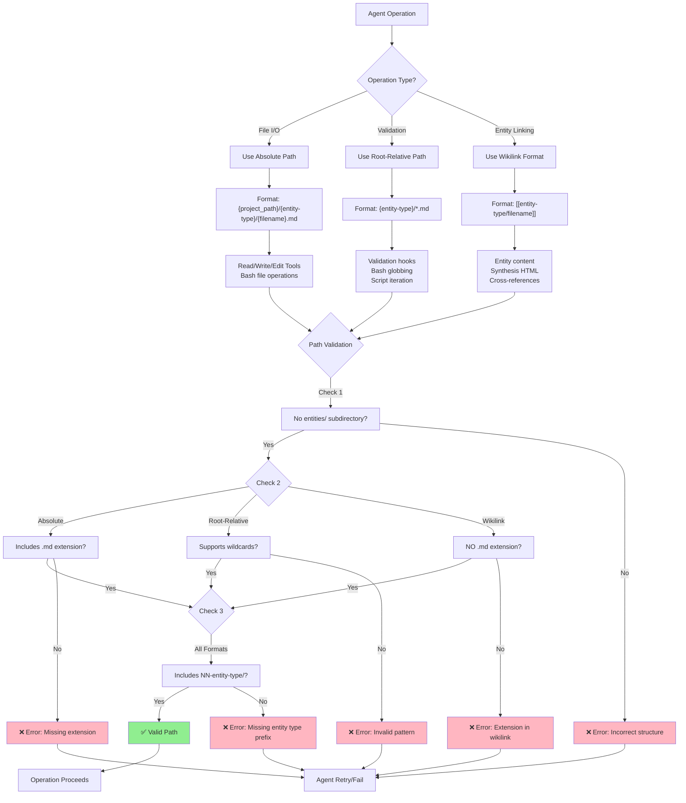

# Entity Path Resolution Conventions

**Version**: 1.1.0
**Plugin**: cogni-research
**Audience**: Technical (agent developers, plugin maintainers)
**Priority**: P7 (Medium) - Standardization to prevent path errors

---

## Overview

### Purpose

This document standardizes entity path resolution across all deeper-research agents, hooks, and scripts to prevent:

- **Path resolution errors** during file operations (Write, Read, Bash)
- **Broken wikilinks** in Obsidian graph visualization
- **Validation failures** in hooks due to inconsistent path formats
- **Agent retries** caused by incorrect entity directory references

### Impact of Path Inconsistencies

Real-world issues observed in 403-entity research project:

1. **Write Tool Failures**: Agents attempt to write to non-existent `entities/` subdirectories
2. **Validation Hook Errors**: Path matchers fail when expecting flat structure but receiving nested paths
3. **Broken Wikilinks**: Inconsistent wikilink formats (`[[entities/09-claims/claim-abc]]` vs `[[09-claims/claim-abc]]`) prevent Obsidian graph resolution
4. **Globbing Mismatches**: Scripts using `09-claims/*.md` fail to find files in `entities/09-claims/`
5. **Cross-Reference Failures**: Synthesis HTML links don't resolve to actual entity files

**Result**: Increased latency (agent retries), manual intervention requirements, degraded Obsidian integration.

---

## Path Standards

The deeper-research plugin uses **three distinct path formats** depending on the operation context. All agents MUST use the correct format for each operation type.

### 1. Absolute Paths (File Operations)

**Purpose**: Direct file system operations via Read, Write, Edit tools

**Format**:
```
{project-path}/{entity-type}/{filename}.md
```

**Examples**:
```bash
/Users/researcher/research-projects/KUKA-Innovations/09-claims/claim-a3f5b2c1.md
/Users/researcher/research-projects/KUKA-Innovations/06-sources/source-8f2e1a9b.md
/Users/researcher/research-projects/KUKA-Innovations/.metadata/entity-index.json
```

**Key Characteristics**:
- **Always absolute** (never relative)
- **No `entities/` subdirectory** (flat structure at project root)
- **Includes file extension** (.md for entities, .json for metadata)
- **Constructed from parameters**: `{project_path}` parameter + entity type + filename

**Usage Scenarios**:
- Write tool creating new entity files
- Read tool loading entity content for processing
- Edit tool modifying existing entities
- Bash tool file operations (cp, mv, rm)

**Agent Examples**:

**research-executor** (Phase 3: Finding Extraction):
```yaml
# Create finding entity at absolute path
Write tool:
  file_path: "{project_path}/04-findings/data/finding-{uuid}.md"
  content: "---\nentity_type: 04-findings\n..."
```

**fact-checker** (Phase 2: Load Findings):
```yaml
# Read finding entity from absolute path
Read tool:
  file_path: "{project_path}/04-findings/data/{finding-id}.md"
```

**synthesis-hub** (Phase 10: Write Synthesis):
```yaml
# Write synthesis report to project root
Write tool:
  file_path: "{project_path}/research-hub.md"
  content: "# Research Report..."
```

---

### 2. Root-Relative Paths (Validation, Globbing, Scripting)

**Purpose**: Validation hooks, bash globbing, script operations within project directory

**Format**:
```
{entity-type}/*.md
{entity-type}/{filename}.md
```

**Examples**:
```bash
09-claims/*.md
06-sources/source-*.md
.metadata/entity-index.json
```

**Key Characteristics**:
- **Relative to project root** (no leading `/`)
- **No `entities/` prefix** (flat structure)
- **Supports wildcards** for globbing (`*.md`, `*-*.md`)
- **Used in validation and batch processing**

**Usage Scenarios**:
- Validation hooks checking entity existence
- Bash globbing for batch operations
- Scripts iterating over entity directories
- Hook matchers validating file paths

**Script Examples**:

**post-entity-creation.sh** (Validation 3: UUID Uniqueness):
```bash
# Check entity index at root-relative path
ENTITY_INDEX="$PROJECT_PATH/.metadata/entity-index.json"

# Extract entity directory (root-relative)
ENTITY_DIR=$(dirname "$FILE_PATH")
DIR_NAME=$(basename "$ENTITY_DIR")  # e.g., "09-claims"
```

**pre-synthesis-validation.sh** (Gate 1: Claims Availability):
```bash
# Count claim entities using root-relative glob
CLAIMS_DIR="$PROJECT_DIR/09-claims"
CLAIM_COUNT=$(find "$CLAIMS_DIR" -name "*.md" -not -name "README.md" | wc -l)
```

**validate-wikilinks.sh** (Link Resolution):
```bash
# Validate wikilink target exists (root-relative)
target_file="$PROJECT_PATH/$link_path.md"  # link_path = "09-claims/claim-abc"
if [ ! -f "$target_file" ]; then
    echo "Broken wikilink: $link"
fi
```

---

### 3. Wikilink Format (Entity Cross-References)

**Purpose**: Obsidian-compatible entity linking in markdown content and HTML synthesis

**Format**:
```
[[{entity-type}/{filename}]]
[[{entity-type}/{filename}|Display Text]]
```

**Examples**:
```markdown
[[10-claims/data/claim-a3f5b2c1]]
[[07-sources/data/source-8f2e1a9b|KUKA LBR iisy Whitepaper]]
[[04-findings/data/finding-xyz789|Finding on payload capacity]]
[[08-publishers/data/publisher-nature-publishing]]
```

**Key Characteristics**:
- **Obsidian wikilink syntax** (`[[ ]]` not `[ ]( )`)
- **No file extension** (.md omitted)
- **No `entities/` prefix** (flat structure)
- **Optional display text** after pipe `|`
- **Entity type prefix required** (e.g., `10-claims/data/`, `07-sources/data/`)

**Usage Scenarios**:
- Entity markdown content referencing other entities
- Synthesis HTML embedding entity links
- Claim entities linking to supporting findings
- Citations referencing sources and authors

**Agent Examples**:

**research-executor** (Phase 3: Finding Extraction):
```markdown
# In finding entity content
{Finding text with inline wikilink to [[03-query-batches/data/batch-001]]}

**Source**: [[07-sources/data/source-8f2e1a9b|KUKA Whitepaper]] (https://example.com) - Accessed 2025-10-20
```

**fact-checker** (Phase 5: Entity Creation):
```yaml
---
entity_type: 09-claims
source_findings:
  - [[04-findings/data/finding-001]]
  - [[04-findings/data/finding-002]]
---

# Claim: KUKA LBR iisy payload capacity

Supporting findings:
- [[04-findings/data/finding-001]]
- [[04-findings/data/finding-002]]
```

**synthesis-hub** (Task 6: Supporting Arguments HTML):
```html
<!-- Evidence section with wikilink -->
<p>Finding excerpt (1-2 sentences) [[04-findings/data/finding-xyz]]</p>

<!-- Citations with entity references -->
<li id="cite-001">
  Author, A. (2024). Title. <em>Journal</em>, 45(3), 123-145.
  [[07-sources/data/source-001|Source]] [[08-publishers/data/publisher-001|Publisher]]
</li>
```

**CRITICAL**: Synthesis-builder must use wikilinks, **NEVER** markdown links:

```html
<!-- ✅ CORRECT: Obsidian wikilink format -->
<p>Evidence: [[04-findings/data/finding-abc]]</p>

<!-- ❌ INCORRECT: Markdown link (breaks Obsidian graph) -->
<p>Evidence: [Finding](../04-findings/data/finding-abc.md)</p>
```

---

## Directory Structure

### Standard Project Layout (Flat Structure)

The deeper-research plugin uses a **flat entity structure** at the project root. There is **NO `entities/` subdirectory**.

```
{project-path}/                           # e.g., ~/research-projects/KUKA-Innovations/
├── .metadata/                            # Project metadata (not entity type)
│   ├── project-config.json
│   ├── entity-index.json
│   └── sprint-log.json
├── 00-initial-question/                  # Entity type: Initial question
│   └── data/
│       └── question-{uuid}.md
├── 01-research-dimensions/data/               # Entity type: Dimensions
│   └── data/
│       ├── dimension-technical-{uuid}.md
│       ├── dimension-market-{uuid}.md
│       └── ...
├── 02-refined-questions/data/                 # Entity type: Refined questions
│   └── data/
│       └── refined-{uuid}.md
├── 03-query-batches/data/                     # Entity type: Query batches
│   └── data/
│       ├── batch-001-{uuid}.md
│       ├── batch-002-{uuid}.md
│       └── ...
├── 04-findings/data/                          # Entity type: Findings from web search
│   └── data/
│       ├── finding-{uuid1}.md
│       ├── finding-{uuid2}.md
│       └── ... (100+ files typical)
├── 05-domain-concepts/data/                   # Entity type: Domain concepts
│   └── data/
│       ├── concept-{uuid1}.md
│       └── ...
├── 06-megatrends/data/                            # Entity type: Thematic clusters
│   └── data/
│       ├── megatrend-safety-{uuid}.md
│       ├── megatrend-payload-{uuid}.md
│       └── ...
├── 07-sources/data/                           # Entity type: Source metadata
│   └── data/
│       ├── source-{uuid1}.md
│       ├── source-{uuid2}.md
│       └── ... (50+ files typical)
├── 08-publishers/data/                        # Entity type: Publisher profiles
│   └── data/
│       ├── publisher-nature-{uuid}.md
│       ├── publisher-springer-{uuid}.md
│       └── ...
├── 09-citations/data/                         # Entity type: Formal citations
│   └── data/
│       ├── citation-{uuid1}.md
│       ├── citation-{uuid2}.md
│       └── ...
├── 10-claims/data/                            # Entity type: Verified claims
│   └── data/
│       ├── claim-{uuid1}.md
│       ├── claim-{uuid2}.md
│       └── ... (50-150 files typical)
├── 11-trends/data/                          # Entity type: Research trends
│   └── data/
│       ├── trend-{uuid1}.md
│       └── ...
├── research-hub.md                    # Comprehensive research synthesis
└── README.md                             # Project overview
```

### Key Architectural Principles

1. **Flat Structure**: All entity types are **direct children** of project root
2. **No Nesting**: No `entities/` parent directory wrapping entity types
3. **Numeric Prefixes**: Entity type directories use `NN-name` format (00-10) for ordering
4. **UUID Filenames**: Entity files named `{type-descriptor}-{uuid}.md` for uniqueness
5. **Metadata Isolation**: `.metadata/` directory for project-level data (not entities)
6. **README Location**: README files are placed in entity **root directories**, while entity files remain in `/data/` subdirectories

### README vs Entity File Placement

**CRITICAL DISTINCTION**: README files and entity files have different placement rules:

| File Type | Location | Example |
|-----------|----------|---------|
| **Entity files** | `{entity-type}/data/{entity-id}.md` | `11-trends/data/trend-abc123.md` |
| **README files** | `{entity-type}/README.md` | `11-trends/README.md` |
| **Per-dimension READMEs** | `{entity-type}/README-{slug}.md` | `11-trends/README-problem.md` |

**Rationale**:
- Entity files are stored in `/data/` subdirectories for clean separation
- README files are placed at the entity root for easy navigation and Obsidian visibility
- This allows users to see README files first when exploring entity directories

### Multi-Sprint Structure (Optional)

**Note**: Some agents reference `sprints/sprint-{N}/` subdirectories. This is for multi-sprint projects with incremental research sessions.

**Standard (Single Sprint)**:
```
{project-path}/09-claims/data/claim-abc.md
```

**Multi-Sprint (Sprint Isolation)**:
```
{project-path}/sprints/sprint-1/09-claims/data/claim-abc.md
{project-path}/sprints/sprint-2/09-claims/data/claim-xyz.md
```

**Current Implementation**: synthesis-hub agent expects multi-sprint structure, but other agents use flat structure. **Standardization required** - see Recommendations section.

---

## Agent-Specific Guidelines

### research-executor

**Responsibility**: Create findings, sources, megatrends from web search results

**Path Patterns**:

```yaml
# INPUT: Read query batch (absolute path)
Read: "{project_path}/03-query-batches/data/{batch_id}.md"

# OUTPUT: Create finding entities (absolute paths)
Write: "{project_path}/04-findings/data/finding-{uuid}.md"

# OUTPUT: Create source entities (absolute paths)
Write: "{project_path}/07-sources/data/source-{uuid}.md"

# OUTPUT: Create megatrend entities (absolute paths)
Write: "{project_path}/06-megatrends/data/megatrend-{uuid}.md"

# WIKILINKS in content:
# - Batch reference: [[03-query-batches/data/{batch_id}]]
# - Source reference: [[07-sources/data/source-{uuid}|Source Title]]
```

**Common Mistakes**:
- ❌ Writing to `entities/04-findings/data/` instead of `04-findings/data/`
- ❌ Using markdown links `[Source](../07-sources/data/source.md)` instead of `[[07-sources/data/source]]`
- ❌ Omitting entity type prefix in wikilinks `[[source-abc]]` instead of `[[07-sources/data/source-abc]]`

---

### fact-checker

**Responsibility**: Extract claims from findings with verification

**Path Patterns**:

```yaml
# INPUT: Read findings from partition (absolute paths)
Read: "{project_path}/04-findings/data/{finding-id}.md"

# OUTPUT: Create claim entities (absolute paths)
Write: "{project_path}/09-claims/claim-{uuid}.md"

# GLOBBING: Discover findings (root-relative)
Bash: "ls {project_path}/04-findings/data/*.md"

# WIKILINKS in claim frontmatter:
# - source_findings: [[04-findings/data/finding-001]], [[04-findings/data/finding-002]]
```

**Common Mistakes**:
- ❌ Globbing `entities/04-findings/data/*.md` (non-existent directory)
- ❌ Broken wikilinks `[[findings/finding-001]]` (missing numeric prefix `04-`)
- ❌ Relative paths `./04-findings/data/` instead of absolute `{project_path}/04-findings/data/`

---

### synthesis-hub

**Responsibility**: Generate HTML synthesis from claims, megatrends, citations

**Path Patterns**:

```yaml
# INPUT: Read sprint metadata (absolute path)
Read: "{project_path}/.metadata/sprint-log.json"

# INPUT: List claims (root-relative with Bash)
Bash: "ls {project_path}/10-claims/data/*.md"

# INPUT: Read claim entities (absolute paths)
Read: "{project_path}/10-claims/data/{claim-id}.md"

# INPUT: Read megatrends, citations (absolute paths)
Read: "{project_path}/06-megatrends/data/{megatrend-id}.md"
Read: "{project_path}/09-citations/data/{citation-id}.md"

# OUTPUT: Write synthesis report (absolute path)
Write: "{project_path}/research-hub.md"

# WIKILINKS in HTML content (Obsidian format):
# - Findings: [[04-findings/data/finding-xyz]]
# - Sources: [[07-sources/data/source-abc|Source Title]]
# - Publishers: [[08-publishers/data/publisher-nature]]
```

**CRITICAL Requirements**:

1. **Use wikilinks in HTML**, not markdown links or HTML anchors:
   ```html
   <!-- ✅ CORRECT -->
   <p>Evidence: [[04-findings/data/finding-xyz]]</p>

   <!-- ❌ INCORRECT -->
   <p>Evidence: <a href="../04-findings/data/finding-xyz.md">Finding</a></p>
   ```

2. **Multi-Sprint Path Awareness**:
   - Current code references `sprints/sprint-{N}/10-claims/data/`
   - Standard structure uses `10-claims/data/` at root
   - **Resolution**: Detect project structure dynamically or standardize to flat

**Common Mistakes**:
- ❌ Using markdown links `[Finding](path.md)` instead of wikilinks
- ❌ HTML anchors `<a href="">` for entity links (breaks Obsidian)
- ❌ Mixing sprint paths `sprints/sprint-1/10-claims/data/` with flat paths `10-claims/data/`

---

### publisher-generator [CURRENT]

**Responsibility**: Create and enrich publisher entities from sources (dimension-based partitions)

**Path Patterns**:

```yaml
# INPUT: Read sources (absolute paths, passed as parameter)
Read: "{project_path}/07-sources/data/{source-id}.md"

# OUTPUT: Create publisher entities (absolute paths)
Write: "{project_path}/08-publishers/data/publisher-{uuid}.md"

# WIKILINKS in publisher frontmatter:
# - sources: [[07-sources/data/source-abc]], [[07-sources/data/source-def]]
# - publisher_type: "individual" or "organization"
```

**Common Mistakes**:
- ❌ Creating duplicate publishers with slightly different names
- ❌ Missing publisher_type discriminator in frontmatter
- ❌ Not enriching publishers before completion

---

### citation-manager [DEPRECATED - Removed v1.2.4]

**Note**: This agent was decommissioned in v1.2.4 (Sprint 203). Citation workflow now uses:
- Phase 6: `publisher-generator` sub-agent (publisher creation/enrichment)
- Phase 6.2: `citation-generator.sh` script (citation generation)

---

### Validation Hooks

**post-entity-creation.sh**:

```bash
# File path from hook environment (absolute)
FILE_PATH="${FILE_PATH:-}"  # e.g., /path/to/project/10-claims/data/claim-abc.md

# Extract project path (parent of entity directory)
DATA_DIR=$(dirname "$FILE_PATH")        # /path/to/project/10-claims/data/data
ENTITY_DIR=$(dirname "$DATA_DIR")       # /path/to/project/10-claims
PROJECT_PATH=$(dirname "$ENTITY_DIR")   # /path/to/project

# Validate wikilink targets (root-relative resolution)
target_file="$PROJECT_PATH/$link_path.md"  # link_path from [[entity-type/filename]]
if [ ! -f "$target_file" ]; then
    echo "Broken wikilink: $link (target does not exist)"
fi
```

**pre-synthesis-validation.sh**:

```bash
# Project directory from environment
PROJECT_DIR="${CLAUDE_PROJECT_DIR:-$(pwd)}"

# Entity directories (root-relative concatenation)
CLAIMS_DIR="$PROJECT_DIR/09-claims"
CITATIONS_DIR="$PROJECT_DIR/08-citations"
FINDINGS_DIR="$PROJECT_DIR/04-findings"

# Glob for entity files (root-relative)
CLAIM_COUNT=$(find "$CLAIMS_DIR" -name "*.md" -not -name "README.md" | wc -l)
```

---

## Common Mistakes (Anti-Patterns)

### ❌ Mistake 1: Using `entities/` Subdirectory

**Problem**: Agents create files in non-existent `entities/` directory

```yaml
# ❌ INCORRECT
Write: "{project_path}/entities/09-claims/claim-abc.md"

# ✅ CORRECT
Write: "{project_path}/09-claims/claim-abc.md"
```

**Impact**: Write tool fails, validation hooks can't find files, broken project structure

---

### ❌ Mistake 2: Mixing Absolute and Relative Paths

**Problem**: Inconsistent path construction in same operation

```yaml
# ❌ INCORRECT (mixing absolute and relative)
Read: "/Users/researcher/project/09-claims/claim-abc.md"
Write: "./09-claims/claim-xyz.md"  # Relative path fails if cwd changes

# ✅ CORRECT (consistent absolute paths)
Read: "{project_path}/09-claims/claim-abc.md"
Write: "{project_path}/09-claims/claim-xyz.md"
```

**Impact**: File not found errors, agent retries, inconsistent behavior

---

### ❌ Mistake 3: Using Markdown Links Instead of Wikilinks

**Problem**: Entity references use markdown `[text](path)` format

```markdown
# ❌ INCORRECT (markdown link)
Supporting evidence: [Finding ABC](../04-findings/data/finding-abc.md)

# ✅ CORRECT (Obsidian wikilink)
Supporting evidence: [[04-findings/data/finding-abc]]
```

**Impact**: Obsidian graph doesn't show connections, broken wikilink validation

---

### ❌ Mistake 4: Omitting Entity Type Prefix in Wikilinks

**Problem**: Wikilinks reference filename only, not entity type directory

```markdown
# ❌ INCORRECT (ambiguous, no directory)
See [[claim-abc]] for details

# ✅ CORRECT (explicit entity type with data subdir)
See [[10-claims/data/claim-abc]] for details
```

**Impact**: Wikilink resolution fails, multiple files with same UUID across types create ambiguity

---

### ❌ Mistake 5: Including .md Extension in Wikilinks

**Problem**: Wikilinks include file extension

```markdown
# ❌ INCORRECT (.md extension)
Reference: [[10-claims/data/claim-abc.md]]

# ✅ CORRECT (no extension)
Reference: [[10-claims/data/claim-abc]]
```

**Impact**: Obsidian doesn't recognize wikilink, validation fails to resolve target

---

### ❌ Mistake 6: Globbing with Incorrect Patterns

**Problem**: Globbing patterns expect wrong directory structure

```bash
# ❌ INCORRECT (non-existent entities/ parent)
find "$PROJECT_PATH/entities/10-claims" -name "*.md"

# ✅ CORRECT (flat structure with data subdir)
find "$PROJECT_PATH/$DIR_CLAIMS/$DATA_SUBDIR" -name "*.md"
```

**Impact**: Zero files found, validation gates fail, agent processing aborts

---

## Path Resolution Workflow



---

## Validation

### Automated Validation Scripts

**validate-wikilinks.sh**:

```bash
# Purpose: Verify all wikilinks resolve to existing entity files
# Usage: bash scripts/validate-wikilinks.sh --project-path /path/to/project

# Key Checks:
# 1. Wikilink format: [[NN-entity-type/filename]] (no .md extension)
# 2. Target file exists: {project_path}/{link_path}.md
# 3. No broken links across all entity types
```

**pre-synthesis-validation.sh**:

```bash
# Purpose: Validate prerequisites before synthesis generation
# Trigger: PostToolUse hook when Task tool invokes synthesis-hub

# Gate 3: Wikilink Integrity
# - Extract all wikilinks from claim entities
# - Resolve targets using: {PROJECT_DIR}/{link_path}.md
# - Flag broken links as CRITICAL_ERRORS
# - Verify claims link to findings (04-findings/data/)
```

**post-entity-creation.sh**:

```bash
# Purpose: Validate entity structure after creation
# Trigger: PostToolUse hook after Write tool creates .md files in NN-* directories

# Validation 2: Wikilink Format
# - Pattern: ^[0-9]{2}-[a-z-]+/[a-z0-9-]+$
# - Example: 09-claims/claim-abc123 (valid)
# - Example: claims/claim-abc (invalid - missing prefix)
```

### Manual Validation Checklist

**Before Committing New Agent Code**:

1. ✅ **Absolute paths for file operations**:
   - All Write calls use `{project_path}/{entity-type}/{filename}.md`
   - All Read calls use absolute paths from parameters
   - No relative paths (`./`, `../`) in file operations

2. ✅ **Root-relative paths for validation**:
   - Bash globbing uses `{project_path}/{entity-type}/*.md`
   - No `entities/` prefix in any paths
   - Scripts construct paths from `PROJECT_PATH` environment variable

3. ✅ **Wikilinks for entity references**:
   - All entity links use `[[NN-entity-type/filename]]` format
   - No markdown links `[text](path.md)` in entity content
   - No .md extension in wikilinks
   - Entity type prefix always included

4. ✅ **Flat directory structure**:
   - Entities at `{project_path}/{entity-type}/` (not `entities/{entity-type}/`)
   - Metadata at `{project_path}/.metadata/`
   - No nested entity subdirectories

5. ✅ **Multi-sprint awareness** (if applicable):
   - Detect sprint structure dynamically
   - Support both flat (`09-claims/`) and sprint (`sprints/sprint-1/09-claims/`) layouts
   - Document which structure agent expects

---

## Recommendations

### For Agent Developers

1. **Always use `{project_path}` parameter** for constructing absolute paths
2. **Never hardcode directory structures** - detect dynamically or use conventions
3. **Test with validate-wikilinks.sh** before considering agent complete
4. **Document path patterns** in agent YAML frontmatter or instructions
5. **Use anti-hallucination protocols** to prevent path fabrication

### For Plugin Maintainers

1. **Standardize multi-sprint structure**:
   - **Current**: synthesis-hub expects `sprints/sprint-{N}/`, others expect flat
   - **Recommendation**: Converge on flat structure with sprint metadata in `.metadata/sprint-log.json`
   - **Alternative**: Update all agents to support both structures with auto-detection

2. **Enhance validation hooks**:
   - Add path format validation to post-entity-creation.sh
   - Reject writes to `entities/` subdirectory
   - Validate wikilink format matches `^[0-9]{2}-[a-z-]+/[a-z0-9-]+$` regex

3. **Update create-entity.sh script**:
   - Add `--validate-path` flag to check format before writing
   - Return detailed errors for incorrect path patterns
   - Include path format in script help/documentation

4. **Enhance error messages**:
   - When Write fails, suggest correct path format
   - Link to this documentation in error output

5. **Create path resolution test suite**:
   - Unit tests for each path format
   - Integration tests for agent file operations
   - Validation tests for wikilink resolution

### For Future Enhancements

1. **Path Builder Utility**:
   ```typescript
   // Proposed utility module
   class DeepResearchPaths {
     constructor(projectPath: string) { ... }

     absolutePath(entityType: string, filename: string): string
     rootRelativeGlob(entityType: string): string
     wikilink(entityType: string, filename: string, display?: string): string

     validate(path: string, format: 'absolute' | 'relative' | 'wikilink'): boolean
   }
   ```

2. **Path Validation Pre-Flight Check**:
   - Before any file operation, validate path format
   - Return clear error messages for violations
   - Log path format issues for debugging

3. **Obsidian Plugin Integration**:
   - Auto-generate Obsidian graph configuration
   - Custom CSS for entity type visualization
   - Path resolution debugging tools

---

## Quick Reference

### Path Format Summary

| Context | Format | Example | Extension |
|---------|--------|---------|-----------|
| **File I/O** | `{project_path}/{entity-type}/data/{filename}.md` | `/path/to/project/10-claims/data/claim-abc.md` | `.md` required |
| **Validation** | `{entity-type}/data/*.md` | `10-claims/data/*.md` | `.md` in glob |
| **Wikilinks** | `[[{entity-type}/data/{filename}]]` | `[[10-claims/data/claim-abc]]` | No extension |

### Entity Type Prefixes

| Prefix | Entity Type | Example Filename |
|--------|-------------|------------------|
| `00-` | initial-question | `question-{uuid}.md` |
| `01-` | research-dimensions | `dimension-{name}-{uuid}.md` |
| `02-` | refined-questions | `question-{uuid}.md` |
| `03-` | query-batches | `question-{slug}-{uuid}-batch.md` |
| `04-` | findings | `finding-{uuid}.md` |
| `05-` | domain-concepts | `concept-{name}-{uuid}.md` |
| `06-` | megatrends | `megatrend-{name}-{uuid}.md` |
| `07-` | sources | `source-{uuid}.md` |
| `08-` | publishers | `publisher-{name}-{uuid}.md` |
| `09-` | citations | `citation-{uuid}.md` |
| `10-` | claims | `claim-{uuid}.md` |
| `11-` | trends | `trend-{uuid}.md` |
| `12-` | research-synthesis | `synthesis-sprint{N}-{date}.html` |

### Validation Commands

```bash
# Validate wikilinks in project
bash /path/to/cogni-research/scripts/validate-wikilinks.sh \
  --project-path /path/to/project \
  --json

# Check entity count
find /path/to/project/10-claims/data/data -name "*.md" -not -name "README.md" | wc -l

# Verify flat structure (should return empty)
find /path/to/project -type d -name "entities"
```

---

## Troubleshooting

### Issue: "File not found" during Write operation

**Symptoms**: Agent fails to create entity, Write tool returns error

**Diagnosis**:
```bash
# Check if path includes incorrect entities/ subdirectory
echo "$FILE_PATH" | grep "entities/"
```

**Resolution**:
1. Remove `entities/` from path
2. Use `{project_path}/{entity-type}/{filename}.md` format
3. Verify entity type directory exists: `ls {project_path}/10-claims/data/data`

---

### Issue: "Broken wikilinks detected" in validation

**Symptoms**: pre-synthesis-validation.sh fails with wikilink errors

**Diagnosis**:
```bash
# Run wikilink validator
bash scripts/validate-wikilinks.sh --project-path /path/to/project

# Check wikilink format in entities
grep -r '\[\[' /path/to/project/10-claims/data/ | grep -v '^[0-9]{2}-'
```

**Resolution**:
1. Fix wikilink format: `[[NN-entity-type/filename]]`
2. Remove .md extension from wikilinks
3. Verify target files exist at expected paths

---

### Issue: Globbing returns zero files

**Symptoms**: Bash command `ls 09-claims/*.md` returns "No such file or directory"

**Diagnosis**:
```bash
# Check directory structure
ls -la {project_path}/

# Verify no entities/ subdirectory exists
find {project_path} -type d -name "entities"
```

**Resolution**:
1. Ensure entity directories are at project root, not in `entities/`
2. Use absolute paths in globbing: `ls {project_path}/09-claims/*.md`
3. Check entity type directory exists: `mkdir -p {project_path}/09-claims`

---

### Issue: Obsidian graph doesn't show entity connections

**Symptoms**: Wikilinks don't create graph edges in Obsidian

**Diagnosis**:
1. Check wikilink format (should be `[[entity-type/filename]]`)
2. Verify .md files exist at wikilink targets
3. Ensure no markdown links `[text](path)` used instead of wikilinks

**Resolution**:
1. Convert markdown links to wikilinks
2. Remove .md extension from wikilinks
3. Add entity type prefix if missing
4. Run `validate-wikilinks.sh` to verify

---

## Cross-References

**Related Documentation**:
- [README.md](../../README.md) - Plugin overview and architecture
- [validation hooks](../../hooks/) - pre-synthesis-validation.sh, post-entity-creation.sh
- [scripts](../../scripts/) - validate-wikilinks.sh, create-entity.sh
- [agents](../../agents/) - Agent-specific path usage patterns
- [script-path-resolution.md](script-path-resolution.md) - CLAUDE_PLUGIN_ROOT path standards

**Architecture Documents**:
- `.MVP/sprint-deeper-research-architecture/01-architecture/deeper-research-plugin-architecture.md`

---

**Document Version**: 1.1.0
**Last Updated**: 2025-12-31
**Maintainer**: deeper-research plugin team
**Status**: Active - Required reading for all agent developers
