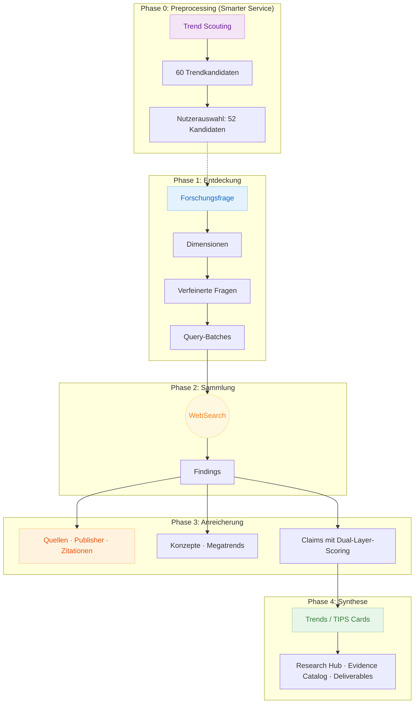

# Thought Leadership Insights

*Lösungskomponente im InsightWave Portfolio von Smarter Service*

---

## 1. Lösungsübersicht

**Thought Leadership Insights** ermöglicht quellenbasiertes, glaubwürdiges Thought Leadership für B2B-Positionierung — powered by einem 13-Phasen-Research-Pipeline mit durchgängiger Beweiskette.

### Einordnung im InsightWave Portfolio

InsightWave von Smarter Service kombiniert drei Lösungsbausteine für datengetriebene B2B-Vertriebsintelligenz:

| Baustein | Funktion |
|----------|----------|
| **Human-In-the-Loop Insights** | Expertennetzwerk aus relevanten Kunden und Beratern, augmentiert mit KI, als integraler Bestandteil aller Prozesse — von der Trendvalidierung bis zum Relevanz-Scoring |
| **Thought Leadership Insights** | KI-gestützte Multi-Dimensionen-Research-Pipeline für Markttrends, Zukunftsthemen und strategische Positionierung — mit lückenloser Beweiskette von der Forschungsfrage über Suchergebnisse und Quellenverifizierung bis zur Synthese |
| **B2B Portfolio and Proposal Insights** | KI-gestützter, quellenbasierter Workflow von der Portfolioplanung bis zum kundenspezifischen Proposal — für Vertrieb und Marketing |

### Was diese Lösung leistet

Thought Leadership Insights ist kein Prompt an einen Chatbot. Die Lösung ist eine methodengestützte Multi-Agenten-Research-Pipeline mit 13 Phasen, 17 Anti-Halluzinationskontrollen und lückenloser Quellenattribution. Sie besteht aus zwei Fähigkeitsebenen:

- **Research-Engine:** Systematische Analyse — von der Forschungsfrage über MECE-Dimensionsplanung, parallele Web-Recherche und Wissensextraktion bis zur quellenverifizierten Synthese mit Confidence-Scoring auf Einzelaussagenebene
- **Deliverable-Generierung:** Konkrete, einsatzbereite Artefakte für Thought Leadership und strategische Planung — interaktive HTML-Dashboards, RAG-Exporte für konversationellen Wissenszugang, Trend-Radar-Visualisierungen und Obsidian-integrierte Wissensgraphen

### Thought Leadership das zu Ihrem Portfolio einzahlt

Die Research-Engine funktioniert für beliebige Forschungsfragen — von Technologietrends über Marktanalysen bis zu regulatorischen Themen. Im spezialisierten Modus "Smarter Service" verbindet sie Research-Erkenntnisse zusätzlich direkt mit dem Service-Portfolio des Anwenders. Jeder Trend wird über eine TIPS Card (Trend, Implications, Possibilities, Solutions) aufbereitet und mit konkreten Portfolio-Angeboten verknüpft — über ein 8-Dimensionen B2B-ICT-Mapping mit 57 Service-Kategorien. Das Ergebnis ist kein abstraktes Whitepaper, sondern Thought Leadership, das in jeder Aussage den Bogen zum eigenen Lösungsangebot schlägt. Kunden erhalten Marktintelligenz und Handlungsempfehlungen — der Anbieter positioniert sich als kompetenter Lösungspartner, nicht als generischer Kommentator.

### Lückenlose Beweiskette statt Black-Box-Synthese

Jede Aussage im finalen Research-Report lässt sich über eine vollständige Beweiskette zurückverfolgen: Forschungsfrage → Suchergebnis → Quelle → Claim → Trend → Synthese. 17 Anti-Halluzinationskontrollen — davon 8 technische und 9 verhaltensbasierte — machen Fabrication strukturell schwierig statt nur verboten. Quantitative Aussagen werden automatisch mit Dual-Layer-Scoring bewertet (Quellenzuverlässigkeit und Aussagequalität) und nicht verifizierbare Angaben gekennzeichnet.

### Zielgruppe

B2B-Unternehmen, die glaubwürdiges Thought Leadership als Differenzierungsinstrument nutzen — insbesondere Marketing, Corporate Strategy, Product Management und Consulting-Funktionen in der ICT-Service- und Digitalisierungsbranche sowie angrenzenden B2B-Märkten.

---

## 2. Herausforderungen im Thought Leadership

B2B-Unternehmen, die sich über Thought Leadership positionieren wollen, stehen vor drei Problemclustern, die sich gegenseitig verstärken.

### KI-generierte Inhalte sind nicht glaubwürdig und zu generisch

- **Oberflächliche Synthese statt echter Analyse:** Generische KI-Tools liefern zusammenfassende Texte auf Basis von Trainingsdaten — ohne aktuelle Recherche, ohne Quellenangaben, ohne Tiefe. Das Ergebnis klingt plausibel, hält aber keiner kritischen Prüfung stand.
- **Zu kurz und zu allgemein für Entscheider:** KI-generierte Inhalte bleiben an der Oberfläche — weder die Komplexität eines Themas noch branchenspezifische Nuancen werden erfasst. Entscheider erkennen generischen Content sofort und ordnen ihn als irrelevant ein.
- **Halluzinationsrisiko zerstört Vertrauen:** Fabricierte Statistiken, erfundene Quellen und falsche Zusammenhänge sind in KI-generiertem Content nicht von echten Erkenntnissen unterscheidbar. Ein einziger enttarnter Fehler diskreditiert die gesamte Publikation — und die Marke dahinter.
- **Alle klingen gleich:** Wenn jeder Wettbewerber denselben Chatbot nutzt, entsteht inhaltliche Konvergenz. Thought Leadership, das wie alle anderen klingt, ist kein Leadership — es ist Rauschen.
- **Keine Rückverfolgbarkeit:** Leser fragen "Woher stammt diese Zahl?" — und es gibt keine Antwort. Ohne nachvollziehbare Quellen ist KI-generierter Content für seriöse B2B-Kommunikation nicht einsetzbar.

### Research-Agenturen sind zu langsam und zu teuer

- **Wochen bis Monate für einen Trend-Report:** Klassische Research-Agenturen liefern qualitativ hochwertige Analysen, aber der Zeitraum von Briefing bis Lieferung beträgt typischerweise 4-12 Wochen. In schnelllebigen Märkten sind die Erkenntnisse bei Veröffentlichung bereits veraltet.
- **Hohe Kosten pro Studie:** Professionelle Markt- und Trendstudien kosten fünfstellige Beträge. Für die meisten B2B-Marketingbudgets sind regelmäßige, themenspezifische Tiefenanalysen damit nicht wirtschaftlich darstellbar.
- **Starre Formate und eingeschränkte Nachnutzung:** Agenturergebnisse kommen als statische PDFs — nicht als durchsuchbare, filterbare oder konversationell abfragbare Wissensbasis. Follow-up-Fragen erfordern ein neues Briefing, nicht eine Abfrage auf den vorhandenen Daten.
- **Keine kumulative Wissensbasis:** Jede neue Studie startet bei null. Es gibt keinen strukturierten Mechanismus, der auf den Erkenntnissen vorheriger Analysen aufbaut. Wissen wird nicht akkumuliert, sondern jedes Mal neu erhoben.
- **Begrenzte Skalierbarkeit:** Die Kapazität einer Agentur ist durch ihre Analysten begrenzt. Mehrere parallele Forschungsprojekte zu unterschiedlichen Themen gleichzeitig durchzuführen ist entweder nicht möglich oder multipliziert die Kosten.

### Keine Beweiskette von der Frage bis zur Synthese

- **Black-Box-Ergebnisse:** Weder bei KI-Tools noch bei vielen Agenturen ist nachvollziehbar, wie eine Erkenntnis zustande gekommen ist. Der Weg von der Forschungsfrage über die Suchstrategie, die gefundenen Quellen und die extrahierten Fakten bis zur finalen Aussage ist nicht dokumentiert.
- **Quellenangaben als Feigenblatt:** Wenn Quellen genannt werden, fehlt die Prüfung: Existiert die URL? Steht die zitierte Zahl tatsächlich in der Originalquelle? Stimmt der Kontext? Ohne Verifizierung sind Quellenangaben Dekoration, nicht Evidenz.
- **Kein Confidence-Scoring:** Alle Aussagen werden gleich behandelt — ob sie auf einer peer-reviewed Studie, einem Blogpost oder einer Halluzination basieren. Entscheidern fehlt die Information, welche Erkenntnisse belastbar sind und welche mit Vorsicht zu verwenden sind.
- **Fehlende methodische Struktur:** Ohne systematische Dimensionsplanung werden Themen nicht vollständig und überschneidungsfrei (MECE) abgedeckt. Das Ergebnis hat blinde Flecken, die erst auffallen, wenn ein Kunde die richtigen Fragen stellt.
- **Keine Entitätsstruktur:** Erkenntnisse, Quellen, Trends und Behauptungen existieren als unstrukturierter Fließtext — nicht als verknüpfte, einzeln adressierbare Wissenseinheiten. Damit ist weder maschinelle Weiterverarbeitung noch granulare Qualitätssicherung möglich.

---

## 3. Lösungsskizze

### 3.1 Pipeline-Architektur

Thought Leadership Insights transformiert Forschungsfragen über eine 13-Phasen-Pipeline in quellenverifizierte Synthesen. Vier Hauptblöcke bilden die durchgängige Beweiskette — im Smarter-Service-Modus ergänzt durch eine vorgelagerte Trend-Scouting-Phase:

| Block | Phasen | Was passiert |
|-------|--------|--------------|
| **Entdeckung** | 0–2.5 | Forschungsfrage → MECE-Dimensionen → PICOT/FINER-verfeinerte Sub-Fragen → optimierte Suchstrategie. Quality Gates mit Nutzerfreigabe nach jeder Phase. |
| **Sammlung** | 3 | Parallele Web-Recherche über spezialisierte Agenten. 100–200 Findings mit vollständiger Quellenattribution — bilinguale Abfragen (DE/EN) maximieren die Abdeckung. |
| **Anreicherung** | 4–7 | Quellen-Validierung, Konzept-Extraktion, Megatrend-Clustering, Fact-Checking mit Dual-Layer-Scoring. Jede Quelle wird klassifiziert, jeder Claim einzeln bewertet. |
| **Synthese** | 8–13 | Trend-Generierung, Dimensions-Synthese, Research Hub mit McKinsey-Pyramid-Struktur, Evidence Catalog mit konsolidiertem Quellenverzeichnis. |

### 3.2 Entitätsmodell: 13 verknüpfte Wissenseinheiten

Die Pipeline erzeugt keine monolithischen Textdokumente, sondern 13 distinkte Entitätstypen — einzeln adressierbar, bidirektional verknüpft und maschinell verarbeitbar:

| # | Entität | Rolle in der Beweiskette |
|---|---------|--------------------------|
| 00 | Ausgangsfrage | Forschungsauftrag mit Kontext, Scope und Zielgruppe |
| 01 | Dimensionen | MECE-validierte Analyseperspektiven (2–10) |
| 02 | Verfeinerte Fragen | PICOT/FINER-strukturierte, recherchierbare Sub-Fragen |
| 03 | Query-Batches | Suchkonfigurationen pro Frage (4–7 Profile, bilingual DE/EN) |
| 04 | Findings | Extrahierte Informationen mit vollständiger Quellenattribution |
| 05 | Domänenkonzepte | Fachterminologie-Glossar, synthetisiert aus Findings |
| 06 | Megatrends | Dimensionsübergreifende thematische Cluster mit Evidenzstärke |
| 07 | Quellen | Validierte URL-Metadaten (Domain, Datum, Zuverlässigkeitsstufe) |
| 08 | Publisher | Institutionelle Autorität und Herausgeberklassifikation |
| 09 | Zitationen | APA-konforme Referenzen mit Publisher-Profilen |
| 10 | Claims | Atomare, verifizierte Einzelaussagen mit Dual-Layer-Scoring |
| 11 | Trends | Strategische Schlussfolgerungen aus verifizierten Claims |
| 12 | Synthese | Dimensionsberichte, Research Hub und Evidence Catalog |

Jede Entität verlinkt bidirektional zu Vorgängern und Nachfolgern. Die vollständige Beweiskette ist durchgängig navigierbar: **Trend → Claims → Findings → Quellen → Original-URL.**

### 3.3 Vertrauensarchitektur

Die 17 Anti-Halluzinations-Kontrollen (8 technische, 9 verhaltensbasierte) sind nicht nachgelagerte Prüfungen, sondern in jede Phase der Pipeline eingebaut:

**Strukturelle Kontrollen:** Entitäten werden ausschließlich über validierte Prozesse erstellt — kein direktes Schreiben in die Wissensbasis. Jede Entität erfordert Mindest-Evidenz: Claims brauchen Findings, Trends mindestens 3 Claims mit Konfidenz >0,75, Megatrends mindestens 3 Findings. Verwaiste Entitäten ohne Rückverweise werden automatisch abgelehnt. Wikilink-Validierung blockiert tote Referenzen und halluzinierte Entity-IDs.

**Quellenverifizierung:** Web-URLs werden auf Erreichbarkeit und Inhaltsübereinstimmung geprüft. Eine 4-stufige Quellenhierarchie klassifiziert die Zuverlässigkeit: akademisch/peer-reviewed (Stufe 1) → Branchenreports und etablierte Medien (Stufe 2) → Fachpublikationen (Stufe 3) → allgemeines Web (Stufe 4, erfordert Korroboration). LLM-generiertes Wissen wird explizit als solches gekennzeichnet — transparent statt maskiert. Hedge-Wörter aus Originalquellen werden exakt beibehalten.

**Dual-Layer-Scoring auf Einzelaussagenebene:**

| Schicht | Kriterien |
|---------|-----------|
| **Evidenzzuverlässigkeit** | Quellenqualitätsstufe, Anzahl stützender Quellen, Kreuzvalidierung, Aktualität, Domänenexpertise der Quelle |
| **Aussagequalität** | Atomizität (eine Aussage pro Claim), Quellentreue, Dekontextualisierbarkeit, sprachliche Klarheit |

Claims unter Schwellwert werden für menschliche Prüfung markiert — bevor sie in Trends oder Deliverables fließen. Konfidenzlevel werden im Forschungsoutput explizit angegeben: 0,90+ (hohe Konfidenz), 0,75–0,89 (gute Konfidenz, belastbar für Entscheidungen), 0,50–0,74 (moderate Konfidenz, als Richtung verwenden), unter 0,50 (zur Überprüfung markiert).

### 3.4 Zwei Research-Modi

Die Pipeline unterstützt zwei Modi auf derselben Architektur:

**Generischer Modus** — für beliebige Forschungsfragen (Technologietrends, Marktanalysen, Regulierung, Wettbewerb). Dimensionen werden aus der Forschungsfrage abgeleitet (2–10, MECE-validiert). Trends werden als quellenbasierte strategische Schlussfolgerungen synthetisiert.

**Smarter Service Modus** — spezialisiert auf portfolioverknüpftes Thought Leadership, mit drei Erweiterungen gegenüber dem generischen Modus:

| Erweiterung | Was sich ändert |
|-------------|----------------|
| **Phase 0: Trend Scouting** | Vor der Research-Pipeline identifiziert ein interaktiver Scouting-Workflow 60 Trendkandidaten über bilinguale Web-Recherche und Multi-Framework-Scoring (Impact, Probability, Strategic Fit, CRAAP Source Quality, Signal Strength). Der Anwender wählt 52 Kandidaten — die Pipeline forscht gezielt statt explorativ. |
| **4 feste Dimensionen** | Statt abgeleiteter Dimensionen nutzt der Modus vier vordefinierte, konzentrische Perspektiven: Externe Effekte (außen) → Neue Horizonte (strategisch) → Digitale Wertetreiber (Wertschöpfung) → Digitales Fundament (innen). Kombiniert mit 3 Planungshorizonten (Act 0–2 J. / Plan 2–5 J. / Observe 5+ J.) entsteht ein 4×3-Raster mit 52 TIPS Cards. |
| **TIPS-Format + Portfolio** | Jeder Trend wird als TIPS Card (Trend → Implications → Possibilities → Solutions) aufbereitet und über ein 8-Dimensionen B2B-ICT-Mapping mit 57 Service-Kategorien direkt mit dem Portfolio des Anwenders verknüpft — vom Markttrend zur konkreten Handlungsempfehlung mit Lösungsbezug. |

---

## 4. Kernfähigkeiten: Research-Engine

### 4.1 Systematische Research-Planung

Die Lösung ersetzt unstrukturiertes Brainstorming durch einen methodengestützten Planungsprozess. Von der initialen Forschungsfrage bis zur ausführungsbereiten Suchstrategie durchlaufen Anwender einen geführten Workflow — statt Freitext-Eingabe an einen Chatbot.

**MECE-Dimensionsplanung:** Jede Forschungsfrage wird systematisch in 2-10 überschneidungsfreie Analysedimensionen zerlegt (Mutually Exclusive, Collectively Exhaustive). Damit wird sichergestellt, dass das Forschungsfeld vollständig abgedeckt wird — ohne blinde Flecken und ohne Redundanz.

**Verfeinerte Forschungsfragen:** Pro Dimension werden spezifische Sub-Fragen generiert, validiert nach PICOT-Framework (Population, Intervention, Comparison, Outcome, Time) und FINER-Kriterien (Feasible, Interesting, Novel, Ethical, Relevant). Der Anwender prüft und steuert die Forschungsrichtung bevor eine einzige Suche ausgeführt wird.

**Optimierte Suchstrategie:** Für jede verfeinerte Frage wird ein Batch aus 4-7 Suchkonfigurationen erstellt — allgemein, akademisch, branchenspezifisch, lokalisiert und technisch. Bilinguale Abfragen (DE/EN) maximieren die Abdeckung deutschsprachiger und internationaler Quellen.

**Quality Gates mit Nutzerfreigabe:** Nach der Planungsphase prüft und genehmigt der Anwender Dimensionen, Fragen und Suchstrategie. Kein automatischer Durchlauf ohne menschliche Kontrolle — der Experte steuert die Forschungsrichtung.

### 4.2 Parallele Recherche und Wissensextraktion

Die Lösung parallelisiert die Informationsgewinnung über spezialisierte Agenten. 20 Forschungsfragen werden gleichzeitig bearbeitet — mit der Ausführungszeit der langsamsten Einzelfrage, nicht der Summe aller.

**Parallele Web-Recherche:** Für jede verfeinerte Frage recherchiert ein dedizierter Agent bilingual (DE/EN) in Web-, Akademie- und Branchenquellen. 100-200 Einzelergebnisse (Findings) werden mit vollständiger Quellenattribution extrahiert — URL, Publikationsdatum, Zitat und Relevanzkontext. Damit entsteht pro Pipeline-Durchlauf in Minuten eine Evidenzbasis, die manuell Tage erfordern würde. Ein vollständiges Research-Projekt mit mehreren Pipeline-Durchläufen und Human-in-the-Loop-Freigaben ist in wenigen Tagen abgeschlossen — statt Wochen bei klassischen Agenturen.

**Strikte Abdeckungskontrolle:** Ein Coverage Gate validiert, dass jede verfeinerte Frage mindestens ein Finding erzeugt hat. Fehlende Fragen werden in einem dedizierten Nachrecherche-Batch automatisch nachgeholt. Die nächste Phase wird erst freigegeben, wenn 100% Abdeckung erreicht ist.

**Konzept-Extraktion:** Domänenspezifische Fachbegriffe und Konzepte werden automatisch identifiziert, definiert und als eigenständige Wissenseinheiten gespeichert. Das Ergebnis ist ein strukturiertes Glossar, das konsistente Terminologie über den gesamten Research-Output sicherstellt.

**Megatrend-Clustering:** Findings werden dimensionsübergreifend zu thematischen Clustern (Megatrends) verdichtet — mit Evidenzstärke-Rating und Backlinks zu den zugrunde liegenden Einzelergebnissen. Damit erkennt die Lösung übergeordnete Muster, die innerhalb einzelner Dimensionen nicht sichtbar wären.

### 4.3 Quellenverifizierung und Confidence-Scoring

Die Lösung integriert eine mehrstufige Quellenverifizierung, die in die Pipeline fest eingebaut ist — kein optionales Add-on, sondern Bestandteil jeder Research-Durchführung.

**Quellen-Validierung:** Jede zitierte URL wird geprüft — existiert die Seite, stimmt der Inhalt mit dem zitierten Kontext überein? Quellen-Metadaten (Domain, Publikationsdatum, Autorenschaft, DOI/PMID bei akademischen Quellen) werden extrahiert und als eigenständige Entitäten gespeichert. Damit ist jede Quelle einzeln adressierbar und prüfbar.

**4-stufige Quellenhierarchie:** Quellen werden nach Zuverlässigkeit klassifiziert — akademisch/peer-reviewed (höchste Gewichtung), Branchenreports und etablierte Medien, Fachpublikationen und Unternehmensblogs, allgemeine Webquellen (niedrigste Gewichtung, erfordert Korroboration). Damit wissen Anwender, welche Erkenntnisse auf belastbaren Quellen basieren.

**Fact-Checking mit Dual-Layer-Scoring:** Quantitative Aussagen werden automatisch identifiziert und auf zwei Ebenen bewertet: Zuverlässigkeit der zitierten Quelle und Qualität der Behauptung selbst (Spezifität, Kontextpassung, logische Konsistenz). Claims unter dem Schwellwert werden für menschliche Prüfung markiert — bevor sie in Deliverables fließen.

**Claim-Atomizität:** Jede verifizierte Aussage wird als einzelne Wissenseinheit gespeichert — eine Behauptung pro Entität. Das verhindert zusammengesetzte Claims, bei denen ein Teil stimmt und ein anderer nicht, und ermöglicht granulare Qualitätssicherung auf Einzelaussagenebene.

**Formale Zitationen:** APA-konforme Zitationen werden automatisch generiert — mit Publisher-Profilen, institutioneller Autoritätsbewertung und Backlinks zu den zugehörigen Findings und Claims. Das Ergebnis ist ein akademisch zitierbarer Evidence Catalog.

### 4.4 Trend-Synthese

Die Lösung verdichtet die verifizierten Einzelergebnisse zu einer kohärenten Gesamtanalyse — von Einzelbefunden über Trends bis zum finalen Research-Report.

**Dimensionsweise Trend-Generierung:** Pro Analysedimension werden Trends identifiziert, mit Planungshorizont klassifiziert (Act/Plan/Observe) und als TIPS Cards (Trend, Implications, Possibilities, Solutions) aufbereitet. Jeder Trend ist mit den zugrunde liegenden Claims, Findings und Quellen verknüpft — die Beweiskette bleibt durchgängig.

**Dimensions-Synthese:** Pro Dimension entsteht ein eigenständiges Synthesedokument, das Trends, Konzepte und Megatrends zu einer zusammenhängenden Analyse verdichtet. Damit können Anwender sowohl die Gesamtperspektive als auch einzelne Dimensionen gezielt kommunizieren.

**Research Hub:** Der finale Research-Report integriert alle Dimensions-Synthesen zu einem kohärenten Gesamtbericht — mit Executive Summary, dimensionsübergreifenden Erkenntnissen, konsolidierten Quellenverweisen und Inline-Zitationen. Das Ergebnis folgt dem McKinsey-Pyramid-Prinzip: Kernaussage zuerst, stützende Argumente darunter, vollständige Evidenz am Ende.

**Evidence Catalog:** Ein konsolidierter Quellen- und Zitationskatalog dokumentiert die Verteilung nach Quellenzuverlässigkeit, institutioneller Autorität und Evidenzhierarchie. Damit erhalten Anwender nicht nur den Research-Output, sondern auch eine Qualitätsbewertung der Datenbasis.

### 4.5 Kumulative Wissensakkumulation

Die Lösung baut Wissen inkrementell auf — statt jede Analyse bei null zu beginnen.

**Multi-Sprint-Workflow:** Research-Projekte können in mehreren Durchläufen vertieft werden. Sprint 1 liefert die Erstanalyse, Sprint 2 vertieft einzelne Dimensionen, Sprint 3 ergänzt Cross-Referenzen zu anderen Projekten. Entitäten aus vorherigen Sprints werden automatisch dedupliziert und wiederverwendet — keine Redundanz, vollständiger Audit-Trail.

**Entitäts-Deduplizierung:** Bei mehrfacher Recherche zum gleichen Themenfeld werden semantisch identische Quellen, Konzepte und Publisher erkannt und zusammengeführt. Metadaten und Backlinks werden konsolidiert, sodass ein konsistentes Gesamtbild entsteht.

**Projektübergreifende Referenzen:** Erkenntnisse aus verschiedenen Research-Projekten können über Wikilinks verknüpft werden. Damit entsteht ein wachsender Wissensgraph, der institutionelles Wissen über mehrere Forschungsvorhaben hinweg akkumuliert.

### 4.6 Competitive Intelligence

Die Lösung bietet spezialisierte Research-Typen für Wettbewerbs- und Marktanalysen.

**Portfolio-Mapping:** Die Lösung analysiert, welche IT-Services ein Unternehmen anbietet — über automatisierte Web-Recherche werden Subsidiary-Marken entdeckt und 57 ICT-Service-Kategorien in 8 Dimensionen gemappt (Cloud, Security, Data, AI/ML, Workplace, Network, Consulting, Managed Services). Das Ergebnis ist ein strukturiertes Wettbewerbsprofil mit USPs, Pricing-Modellen, Partnerkonstellationen und Branchenfokus.

**Trend Scouting:** Ein industriefokussiertes Trend-Scouting identifiziert 60 Trendkandidaten mit Multi-Framework-Scoring (TIPS-Dimensionen, Ansoff-Intensität, Rogers-Diffusion, CRAAP-Quellqualität). Bilingual (DE/EN) werden Web-Signale erhoben und mit Branchen-Taxonomie kontextualisiert — für branchenspezifische statt generische Trendanalysen.

### 4.7 TIPS Cards und Portfolio-Integration

Die Lösung bietet mit dem Research-Typ "Smarter Service" einen spezialisierten Modus, der Trend-Research direkt mit dem Service-Portfolio des Anwenders verbindet — Thought Leadership, das nicht abstrakt bleibt, sondern in konkreten Lösungsangeboten mündet.

**TIPS-Card-Format:** TIPS steht für **T**rend, **I**mplications, **P**ossibilities, **S**olutions — ein vierteiliges Analyseformat, das jeden Trend von der Marktbeobachtung über die geschäftliche Bewertung und strategische Optionen bis zur konkreten Handlungsempfehlung durchdekliniert. Jeder Trend wird als strukturierte TIPS Card aufbereitet:

| Abschnitt | Leitfrage | Inhalt |
|-----------|-----------|--------|
| **Trend** | Was passiert? | Beobachtbares Marktsignal mit Claim-Zitaten und Quellennachweis |
| **Implications** | Was bedeutet das? | Geschäftliche Auswirkungen, differenziert nach Stakeholder-Perspektive |
| **Possibilities** | Was könnten wir tun? | Strategische Optionen mit quantifizierten Chancen und Risiken |
| **Solutions** | Was sollten wir tun? | Implementierungsschritte, Technology Enablement und Portfolio-Verknüpfung |

Jede TIPS Card umfasst 950-1.450 Wörter — genug Tiefe für fundierte Entscheidungen, kompakt genug für Entscheider.

**4x3 Dimensionsraster:** Im Smarter-Service-Modus werden 52 TIPS Cards in einem vorvalidierten Framework erzeugt — 4 Dimensionen (Externe Effekte, Neue Horizonte, Digitale Wertetreiber, Digitales Fundament) mal 3 Planungshorizonte (Act/Plan/Observe). Die Verteilung (5-5-3 pro Dimension) stellt sicher, dass kurzfristiger Handlungsbedarf stärker gewichtet wird als langfristige Beobachtungsthemen. Das Ergebnis ist eine vollständige, MECE-validierte Landkarte der digitalen Transformation — kein zufälliges Sammelsurium einzelner Trends.

**Quantifizierte Chancen und Risiken:** TIPS Cards im Act-Horizont (0-6 Monate) erfordern quantifizierte Chance/Risiko-Bewertungen mit konkreten Metriken — Prozentsätze, Geldbeträge, Zeiträume. Damit erhalten Entscheider nicht nur qualitative Einschätzungen, sondern belastbare Zahlen für Business Cases und Investitionsentscheidungen.

**Portfolio-Verknüpfung über 8-Dimensionen B2B-ICT-Mapping:** Jede TIPS Card enthält eine Technology-Enablement-Tabelle, die alle 8 B2B-ICT-Dimensionen (Cloud, Security, Data, AI/ML, Workplace, Network, Consulting, Managed Services) mit 57 Service-Kategorien abdeckt. Für jede Dimension wird die relevanteste Kategorie identifiziert und mit konkreten Portfolio-Angeboten des Anwenders verknüpft — inklusive Links und kontextueller Begründung, wie das jeweilige Angebot die Trend-Implementierung unterstützt.

**Vom Trend zum Angebot:** Das Ergebnis ist eine durchgängige Argumentationskette: Markttrend → geschäftliche Auswirkung → strategische Empfehlung → konkretes Service-Angebot. Damit wird Thought Leadership zum Vertriebsinstrument — jede Publikation positioniert den Anbieter nicht nur als Experten, sondern als Lösungspartner für die identifizierten Herausforderungen.

---

## 5. Kernfähigkeiten: Deliverable-Generierung

### 5.1 Interaktives Research-Dashboard

Die Lösung generiert ein interaktives HTML-Dashboard als selbstständiges Dokument ohne externe Abhängigkeiten. Das Dashboard konsolidiert Trends, Quellen und Evidenz auf einen Blick und dient als zentrale Kommunikationsgrundlage für Management, Marketing und Strategy.

**Progressive Disclosure nach McKinsey-Pyramid:** Das Dashboard folgt dem Prinzip "Kernaussage zuerst, Evidenz auf Anfrage" — Executive Summary ist immer sichtbar, stützende Argumente sind aufklappbar, vollständige Zitationen expandierbar. Damit können Entscheider auf der Ebene lesen, die ihrem Informationsbedarf entspricht.

**Trend-Grid mit Dimensionsstruktur:** Trends werden in einem dimensionsbasierten Grid dargestellt — mit Planungshorizont (Act/Plan/Observe), Confidence-Indikatoren und Quellenanzahl. Interaktive Filterung ermöglicht unterschiedliche Nutzungskontexte: Strategieplanung (nach Horizont), Themenrecherche (nach Dimension), Qualitätsprüfung (nach Evidenzstärke).

**Hover-Previews für Entitäten:** Findings, Claims und Quellen werden bei Mouse-over als Vorschau angezeigt — ohne Navigation in separate Detailseiten. Damit können Anwender die Evidenzbasis eines Trends prüfen, ohne den Kontext zu verlieren.

**Quellennachweis mit Inline-Zitationen:** Konsolidierte Referenzen mit Footnote-Navigation stellen sicher, dass jede Aussage im Dashboard auf ihre Primärquelle rückverfolgbar ist. Keine Black-Box-Daten — vollständige Transparenz für Management-Reviews und Kundengespräche.

**Theme-Support und Brand-Integration:** Unternehmensspezifische Farbschemata, Typografie und visuelle Identität werden aus bestehenden Theme-Definitionen oder Corporate-Design-Vorgaben übernommen. Themes können aus bestehenden Websites oder PowerPoint-Vorlagen extrahiert werden — Primär- und Akzentfarben, Schriftarten und Layout-Konventionen werden automatisch erkannt und auf alle HTML-Exporte angewendet.

**Website-Integration:** Die generierten HTML-Artefakte — Dashboard, Trend-Cards und Research-Report — sind als eigenständige Komponenten konzipiert, die in bestehende Websitestrukturen eingebettet werden können. Selbstständige HTML-Dokumente ohne externe Abhängigkeiten ermöglichen die direkte Einbindung als Landingpage, Microsite oder eingebettete Sektion — inklusive responsivem Layout und barrierefreier Navigation. Damit wird Thought Leadership nicht nur als PDF verteilt, sondern als interaktives Web-Erlebnis im eigenen Digital-Auftritt publiziert.

### 5.2 TIPS Card Dashboard

Im Smarter-Service-Modus generiert die Lösung ein spezialisiertes Dashboard, das die 52 TIPS Cards in ihrem 4x3-Dimensionsraster präsentiert — als interaktive Webseite im Corporate Design des Anwenders.

**4x3 Grid-Navigation:** Das Dashboard stellt alle 52 TIPS Cards in einer Matrix dar — 4 Dimensionen (Spalten) mal 3 Planungshorizonte (Zeilen). Anwender navigieren visuell durch die gesamte Trendlandkarte und erkennen Muster über Dimensionen und Horizonte hinweg. Jede Card ist anklickbar und öffnet die vollständige TIPS-Analyse.

**Portfolio-Referenzen in jeder Card:** TIPS Cards enthalten direkte Links zu den verknüpften Portfolio-Angeboten des Anwenders — mit kontextueller Begründung, wie das jeweilige Angebot die Trend-Implementierung unterstützt. Damit wird das Dashboard zum Sales-Tool: Kunden sehen nicht nur Trends, sondern direkt die passenden Lösungen.

**Einzelne TIPS Cards als eigenständige HTML-Seiten:** Jede der 52 Cards wird als eigenständige HTML-Seite generiert — teilbar, verlinkbar und einbettbar. Damit können einzelne Trends gezielt in Kundengesprächen, Social-Media-Posts oder Kampagnen-Landingpages eingesetzt werden, ohne das gesamte Dashboard teilen zu müssen.

### 5.3 Research-Report (HTML)

Die Lösung generiert einen vollständigen Research-Report als selbstständiges HTML-Dokument — den Research Hub als teilbares, offline-fähiges Artefakt.

**Komplett-Report in einer Datei:** Der gesamte Research Hub — Executive Summary, Dimensions-Synthesen, Trend-Analysen, Evidence Catalog und Quellenverzeichnis — als einzelnes HTML-Dokument ohne externe Abhängigkeiten. Damit erhalten Anwender ein druckfertiges, teilbares Dokument für interne Entscheidungsprozesse und Kundenkommunikation.

**Strukturierter Aufbau:** Das Dokument folgt dem Argumentationsfluss der Research-Synthese — von der Forschungsfrage über Kernergebnisse und Dimensions-Analysen bis zu Methodik und Quellenverzeichnis. Der Leser wird durch die Erkenntnisse geführt, nicht mit Rohdaten konfrontiert.

### 5.4 RAG-Export für konversationellen Wissenszugang

Die Lösung exportiert Research-Ergebnisse in ein Format, das für Retrieval-Augmented Generation (RAG) optimiert ist — für den Einsatz in Claude Projects oder vergleichbaren Plattformen.

**Flache Dateistruktur mit semantischen Dateinamen:** Statt verschachtelter Verzeichnisse und kryptischer IDs erhalten alle Entitäten beschreibende Dateinamen (z.B. `trend-agile-strategy.md` statt `abc123.md`). Metadaten (Typ, Projekt, Confidence, Tags) werden als Inline-Header integriert. Damit optimiert der Export die Retrieval-Qualität bei konversationellen Abfragen.

**Bidirektionale Entitätsbeziehungen:** Jede exportierte Entität enthält eine "Related Entities"-Sektion mit Vorwärts- und Rückwärtsreferenzen. Wenn ein Nutzer nach einem Trend fragt, kann die RAG-Plattform automatisch die zugehörigen Quellen, Claims und Findings einbeziehen — quellenattribuierte Antworten statt kontextloser Zusammenfassungen.

**Konversationeller Wissenszugang:** Sales- und Marketingteams können Research-Ergebnisse im Dialog abfragen — "Was haben wir über KI-Adoption in der Fertigungsindustrie herausgefunden?" — und erhalten quellenbasierte Antworten mit Entity-Referenzen. Wissen wird konversationell zugänglich, nicht in Dokumenten eingesperrt.

### 5.5 TIPS Trend-Radar

Die Lösung generiert Daten für eine interaktive Radar-Visualisierung, die Trends über Dimensionen und Planungshorizonte hinweg darstellt.

**Interaktive Radar-Visualisierung:** Trends werden auf einem Radar dargestellt — segmentiert nach Analysedimensionen und Planungshorizont (Act/Plan/Observe). Drag-and-Drop-Funktionalität ermöglicht das schnelle Laden verschiedener Research-Projekte.

**Vollständige Entitätsbeziehungen:** Jeder Trend im Radar ist mit seinen Findings, Quellen, Claims, Megatrends und Konzepten verknüpft. Damit können Anwender von der visuellen Übersicht direkt in die Evidenzbasis navigieren.

**Vergleichende Analyse:** Mehrere Research-Projekte können im selben Radar übereinandergelegt werden — für Zeitreihenvergleiche, Branchenvergleiche oder die Identifikation konvergierender Trends über verschiedene Forschungsvorhaben hinweg.

### 5.6 Obsidian-integrierter Wissensgraph

Die gesamte Research-Ausgabe ist nativ für Obsidian strukturiert — als verknüpfter Wissensgraph mit vollständiger Wikilink-Integration.

**13 Entitätstypen als verknüpfte Wissensbasis:** Von der initialen Forschungsfrage über Findings, Quellen und Claims bis zu Trends und Synthese — jede Entität ist über Wikilinks mit ihren Vorgängern und Nachfolgern verknüpft. Die Obsidian Graph View visualisiert die Beweiskette als navigierbares Netzwerk.

**Validierte Wikilinks:** Automatische Wikilink-Validierung stellt sicher, dass keine toten Referenzen existieren — jeder Link zeigt auf eine reale Entität im Wissensgraphen. Broken Links werden automatisch erkannt und repariert.

**FAIR-konforme Metadaten:** Alle Entitäten folgen Dublin-Core-Metadatenstandards (Findable, Accessible, Interoperable, Reusable) mit JSON-LD-Exportmöglichkeit. Damit sind Research-Ergebnisse nicht nur in Obsidian nutzbar, sondern maschinenlesbar und in externe Wissensmanagementsysteme integrierbar.

---

## 6. Anwendungsszenarien

### 6.1 Trend-Report für Branchenpositionierung

Ein mittelständischer IT-Dienstleister will sich als Thought Leader im Bereich Digitale Transformation positionieren. Statt einen generischen KI-Text zu publizieren oder eine Agentur für einen sechsstelligen Betrag zu beauftragen, liefert die Research-Pipeline in wenigen Tagen einen vollständigen Trend-Report: 52 TIPS Cards im 4x3-Dimensionsraster, jede mit Quellennachweis und Confidence-Scoring. Der HTML-Export im Corporate Design wird als Microsite publiziert — jede TIPS Card verlinkt auf die eigenen Service-Angebote. Das Ergebnis ist Thought Leadership, das Kompetenz demonstriert und gleichzeitig die eigene Lösungskompetenz sichtbar macht.

### 6.2 Wettbewerbsanalyse für Markteintrittsstrategie

Die Geschäftsführung eines Cloud-Service-Anbieters plant den Eintritt in den Healthcare-IT-Markt. Das Portfolio-Mapping erstellt zunächst ein strukturiertes Profil der etablierten Wettbewerber — welche Services sie in welchen ICT-Dimensionen anbieten, mit welchen USPs und Pricing-Modellen. Anschließend liefert ein gezieltes Research-Projekt die Trendlandkarte des Zielmarkts — mit quellenbasierten Erkenntnissen zu regulatorischen Anforderungen, Technologietrends und Kundenbedarfen. Das Ergebnis ist eine datengestützte Entscheidungsgrundlage für die Geschäftsführung, nicht eine generische Marktübersicht.

### 6.3 Whitepaper-Fundament mit Beweiskette

Das Marketingteam eines Systemintegrators soll ein Whitepaper zu "KI in der Fertigungsindustrie" veröffentlichen. Statt wochenlanger manueller Recherche oder KI-generiertem Content ohne Quellennachweis liefert die Pipeline ein vollständiges Research-Fundament: Dimensionen (Technologie, Markt, Regulierung, Adoption), 100+ verifizierte Findings, Trend-Synthese und Evidence Catalog. Das Marketingteam nutzt die Ergebnisse als Basis für das Whitepaper — mit durchgängig nachweisbaren Quellen und Confidence-Bewertungen. Über den RAG-Export können Kollegen die Research-Ergebnisse im Dialog abfragen, ohne den Vollreport lesen zu müssen.

### 6.4 Technologie-Radar für Innovationsplanung

Ein Corporate-Strategy-Team will für den Vorstand einen Technologie-Radar erstellen. Die Research-Pipeline liefert Trends mit Planungshorizont-Klassifizierung (Act/Plan/Observe) und TIPS-Struktur. Der TIPS-Radar-Export visualisiert die Ergebnisse als interaktives Radar — segmentiert nach Dimensionen und Horizont. Der Vorstand erhält eine navigierbare Übersicht mit Drill-down bis auf Einzelquellen-Ebene. Durch Multi-Sprint-Vertiefung kann das Strategy-Team den Radar quartalsweise aktualisieren, ohne jedes Mal bei null zu beginnen.

### 6.5 Kundenspezifisches Research für Advisory

Ein Consulting-Team bereitet einen Strategy-Workshop für einen Großkunden vor. Statt generische Branchenanalysen vorzutragen, liefert ein gezieltes Research-Projekt kundenspezifische Erkenntnisse: Branchentrends des Kunden, technologische Herausforderungen in seinem Marktsegment und quellenbasierte Handlungsempfehlungen. Die TIPS Cards bilden die Grundlage für den Workshop — jede Empfehlung ist mit Evidenz unterlegt und die Portfolio-Verknüpfung zeigt direkt, mit welchen eigenen Services die identifizierten Herausforderungen adressiert werden können.

### 6.6 Input für Portfolio- und Proposal-Erstellung

Research-Ergebnisse dienen als Inputdokumente für das cogni-sales Plugin (B2B Portfolio and Proposal Insights). Trend-Reports und TIPS Cards werden als Quelldokumente in die Portfolioerstellung importiert — tiefe Marktanalysen werden zur Grundlage für IS-DOES-MEANS Capabilities und Why-Change Value Stories. Damit entsteht ein durchgängiger Workflow: Thought Leadership Research → Portfolio-Definition → Kunden-Proposal. Erkenntnisse aus der Research-Phase fließen direkt in die Vertriebsargumentation — mit nachvollziehbarer Quellenattribution.

---

## 7. Marktkontext

### KI-generiertes Thought Leadership und die Glaubwürdigkeitskrise

Der Einsatz von KI-Tools für Content-Erstellung wächst im B2B-Bereich deutlich. Gleichzeitig sinkt das Vertrauen in KI-generierte Inhalte: Leser und Entscheider erkennen generischen, halluzinationsgefährdeten Content zunehmend und ordnen ihn als nicht vertrauenswürdig ein. Die größte Barriere für KI-gestütztes Thought Leadership ist nicht die Erstellungsgeschwindigkeit, sondern die Glaubwürdigkeit — Unternehmen suchen nach Lösungen, die KI-Geschwindigkeit mit nachweisbarer Evidenz verbinden.

### Research-Agenturen unter Anpassungsdruck

Klassische Research- und Beratungsagenturen stehen unter doppeltem Druck: Kunden erwarten schnellere Lieferzeiten bei sinkenden Budgets, gleichzeitig erodieren generische KI-Tools den wahrgenommenen Wert oberflächlicher Analysen. Agenturen, die ihren Mehrwert nicht über proprietäre Methodik, Tiefe und Quellenverifizierung differenzieren, verlieren Marktanteile an kostengünstigere Alternativen. Der Markt bewegt sich von statischen Einmalstudien hin zu kontinuierlicher, werkzeuggestützter Research-Intelligence.

### Wettbewerbslandschaft

Generische KI-Tools (ChatGPT, Copilot, Gemini) liefern unstrukturierten Content ohne Methodik, Beweiskette und Quellenverifizierung. Spezialisierte Research-Plattformen (Gartner, Forrester, CB Insights) bieten hochwertige Analysen, aber zu hohen Kosten, in starren Formaten und ohne Portfolio-Integration. Content-Intelligence-Plattformen (Contently, NewsCred) fokussieren auf Content-Management und -Distribution, nicht auf evidenzbasierte Research-Erstellung. Thought Leadership Insights adressiert die Lücke zwischen generischem KI-Chat und hochpreisigen Analystenreports — mit methodenbasierter Research-Pipeline, durchgängiger Beweiskette und direkter Verknüpfung zum Service-Portfolio des Anwenders.

### Thought Leadership wird messbare Vertriebsintelligenz

Thought Leadership entwickelt sich im B2B-Bereich von einer reinen Branding-Maßnahme zu einem messbaren Vertriebsinstrument. Unternehmen, die Trends nicht nur kommentieren, sondern mit konkreten Lösungsangeboten verbinden, generieren qualifiziertere Leads und kürzere Sales-Cycles. Der Markt bewegt sich von "Wir haben eine Meinung" zu "Wir haben Evidenz und die passende Lösung" — und genau diese Verbindung leistet die Portfolio-Integration der TIPS Cards.

---

## 8. Bereitstellung & Integration

### Plattform

Thought Leadership Insights ist ein Claude Code Plugin und läuft als lokale Anwendung auf dem Rechner des Anwenders. Die Verarbeitung erfolgt über die Anthropic API — sensible Forschungsdaten und Geschäftsstrategien werden nicht auf externen Servern gespeichert.

### Voraussetzungen

- Claude Code Installation
- Anthropic API-Zugang
- Internetzugang für Web-Recherche und Quellenverifizierung

### Datenhoheit

Alle generierten Artefakte — Research-Projekte, TIPS Cards, Dashboards, Trend-Radars, Wissensgraphen — liegen lokal im Dateisystem des Anwenders. Es erfolgt keine Speicherung auf externen Servern. Der Anwender behält die volle Kontrolle über seine Research-Daten, Wettbewerbsanalysen und strategischen Erkenntnisse.

### Integration mit InsightWave

Die Lösung ist als Baustein im InsightWave Portfolio konzipiert und kann mit den anderen Bausteinen zusammenwirken:

- **Human-In-the-Loop Insights:** Research-Ergebnisse können durch das Expertennetzwerk validiert und angereichert werden — Trend-Insights und Branchensignale aus der Expertenbefragung fließen als zusätzliche Evidenz in die Research-Pipeline ein. Experten-Scoring ergänzt das algorithmische Confidence-Scoring um qualitative Markteinschätzungen.
- **B2B Portfolio and Proposal Insights:** Research-Ergebnisse und TIPS Cards dienen als Inputdokumente für die Portfolioerstellung und Proposal-Generierung. Trend-Analysen werden zur Grundlage für IS-DOES-MEANS Capabilities, Why-Change Value Stories und kundenspezifische Business Cases — mit durchgängiger Quellenattribution von der Research-Erkenntnis bis zum Kundenartefakt.
