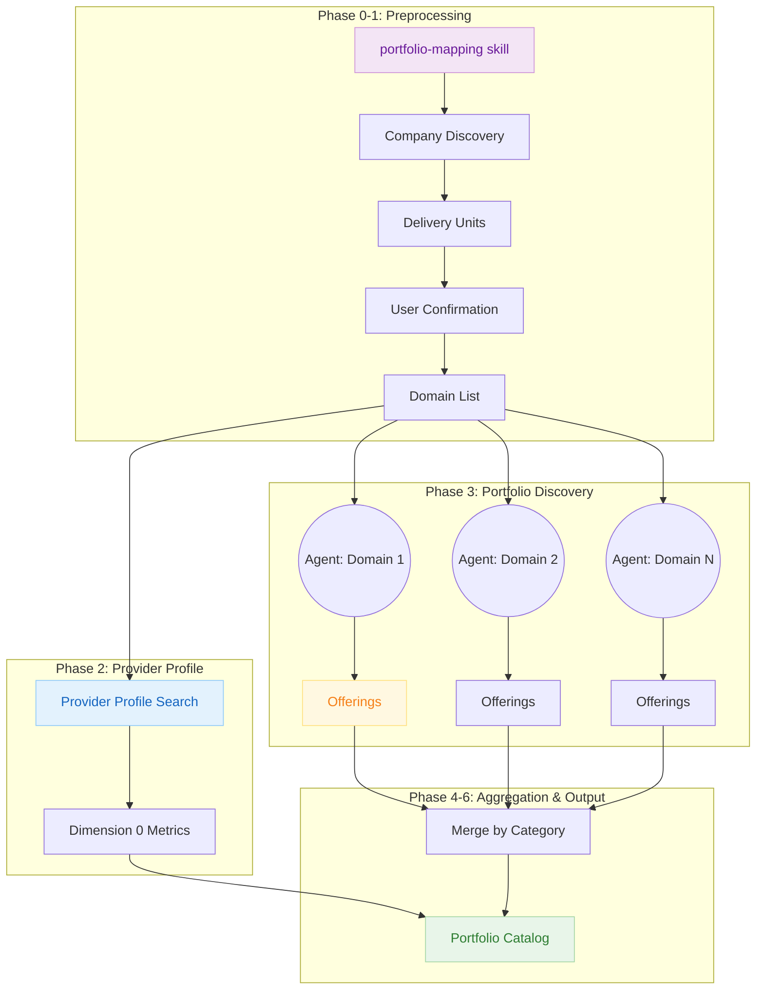

# B2B ICT Portfolio Research Methodology

How portfolio analysis builds a verified service catalog with evidence chains across 8 dimensions and 57 categories.

---

## Overview

B2B ICT Portfolio research produces a **comprehensive service catalog** for an ICT provider, covering 8 dimensions (provider profile + 7 service domains) and 57 standard categories. Every discovered offering traces back to actual web sources with verifiable URLs.

**What makes this different from generic research:**

- **Phase 0-1 Preprocessing:** Company discovery identifies all delivery units (subsidiaries, brands) before research
- **Fixed Taxonomy:** 8 dimensions, 57 predefined categories (not domain-derived)
- **Parallel Execution:** Multiple domains researched simultaneously by specialized agents
- **Full Entity Schema:** 11 fields per offering (Name, Description, USP, Pricing, Partners, etc.)
- **Service Horizons:** Current/Emerging/Future classification for market maturity

---

## The Complete Evidence Chain



---

## Phase 0: Project Initialization

**What it is:** Captures the target company and creates the project structure before any research begins.

**What it does:**

1. Captures target company name from user
2. Generates semantic project slug (e.g., `portfolio-deutsche-telekom-a1b2c3d4`)
3. Creates project directory in `COGNI_RESEARCH_ROOT/portfolios/`
4. Initializes metadata files for tracking

**Trust Factor:**

- User explicitly provides target company
- Project structure is validated before proceeding
- Existing projects are detected to prevent accidental overwrites

---

## Phase 1: Company Discovery (Preprocessing)

**What it is:** Discovers all delivery units (subsidiaries, brands, business units) that provide B2B ICT services for the target company.

**What it does:**

Web searches identify the company's service delivery structure:

```text
WebSearch: "<company name>" subsidiaries affiliates brands "ICT services"
WebSearch: "<company name>" group companies divisions business units
WebSearch: "<company name>" consulting advisory subsidiary
WebSearch: "<company name>" "managed services" OR "onsite services" subsidiary
```

**Delivery Unit Classification:**

| Entity Type | Examples | Why Include |
|-------------|----------|-------------|
| ICT Delivery | T-Systems, Infosys | Core portfolio scope |
| Consulting | Detecon, Capgemini Invent | IT Strategy, Architecture services |
| Field Services | T-Systems Onsite | On-site IT support |
| Industry Vertical | Telekom Healthcare | Vertical-specific ICT |
| Regional Delivery | T-Systems Hungary | Specialized regional offerings |
| Digital Brand | Telekom MMS | Application services |

**Phase 1.5: User Confirmation**

Before proceeding, discovered entities are presented to the user:

- User reviews the delivery unit list
- Can add missing subsidiaries/brands
- Confirms when complete
- Iteration continues until user is satisfied

**Phase 1.6: Domain Handoff Validation**

Validates all entities have corresponding domains:

- Consulting subsidiaries included (often missed)
- On-site/field services entities included
- Technical documentation subdomains identified
- No orphan discoveries from Phase 1

**Trust Factor:**

- Human-in-the-loop confirmation prevents missing entities
- User can add entities not found by web search
- Validation checklist ensures completeness
- Every domain traces back to a discovered entity

---

## Phase 2: Provider Profile Discovery (Dimension 0)

**What it is:** Researches business KPIs and market positioning for the provider before analyzing service offerings.

**The 6 Profile Categories:**

| ID | Category | Search Focus |
|----|----------|--------------|
| 0.1 | Financial Scale | Revenue, turnover, market cap, growth trends |
| 0.2 | Workforce Capacity | Employee count, IT specialists, regional distribution |
| 0.3 | Geographic Presence | HQ, delivery centers, service countries, data centers |
| 0.4 | Market Position | Rankings, analyst ratings, reference clients |
| 0.5 | Certifications & Accreditations | ISO certs, industry accreditations, compliance |
| 0.6 | Partnership Ecosystem | Hyperscaler tiers, strategic alliances |

**Trust Factor:**

- Searches restricted to discovered company domains
- Current year included in financial searches for recency
- All metrics link to source pages

---

## Phase 3: Portfolio Discovery (Parallel Execution)

**What it is:** Specialized `portfolio-web-researcher` agents search each domain across all 51 service categories (Dimensions 1-7) in parallel.

**How it works:**

```text
For each domain in DOMAINS:
  → portfolio-web-researcher agent
    → 51 searches (7 dimensions × categories)
    → Returns compact JSON + detailed log file
```

**Search Pattern per Category:**

```text
# Marketing content
site:<domain> "<category keywords>" OR "<synonyms>"

# Technical documentation
site:docs.<domain> "<product names>" OR "<service names>"
```

**Context Efficiency:**

| Metric | Sequential | Parallel |
|--------|-----------|----------|
| 3 domains × 51 searches | ~45 min | ~8 min |
| Context usage | 80K tokens | 600 tokens |

**Agent Response Format:**

```json
{
  "ok": true,
  "d": "t-systems.com",
  "u": "T-Systems",
  "s": {"ex": 51, "ok": 48},
  "o": {"tot": 56, "cur": 45, "emg": 8, "fut": 3},
  "log": ".logs/portfolio-web-research-t-systems-com.json"
}
```

**Trust Factor:**

- Every offering has a source URL (Link field required)
- Log files preserve full research data
- Failed searches are logged, not fabricated
- Per-domain retry on failures

---

## The 8 Dimensions (57 Categories)

### Dimension 0: Provider Profile Metrics (6 categories)

Business KPIs, scale, and market positioning.

### Dimension 1: Connectivity Services (7 categories)

| ID | Category |
|----|----------|
| 1.1 | WAN Services |
| 1.2 | SASE |
| 1.3 | Internet & Cloud Connect |
| 1.4 | 5G & IoT Connectivity |
| 1.5 | Voice Services |
| 1.6 | LAN/WLAN Services |
| 1.7 | Network-as-a-Service |

### Dimension 2: Security Services (10 categories)

| ID | Category |
|----|----------|
| 2.1 | Security Operations (SOC/SIEM) |
| 2.2 | Identity & Access Management |
| 2.3 | Zero Trust Architecture |
| 2.4 | Cloud Security |
| 2.5 | Endpoint Security |
| 2.6 | Network Security |
| 2.7 | Vulnerability Management |
| 2.8 | Security Awareness |
| 2.9 | Compliance & GRC |
| 2.10 | Data Protection & Privacy |

### Dimension 3: Digital Workplace Services (7 categories)

| ID | Category |
|----|----------|
| 3.1 | Unified Communications |
| 3.2 | Modern Workplace / M365 |
| 3.3 | Device Management |
| 3.4 | Virtual Desktop & DaaS |
| 3.5 | IT Support Services |
| 3.6 | Digital Employee Experience |
| 3.7 | IT Asset Management |

### Dimension 4: Cloud Services (8 categories)

| ID | Category |
|----|----------|
| 4.1 | Managed Hyperscaler Services |
| 4.2 | Multi-Cloud Management |
| 4.3 | Private Cloud |
| 4.4 | Hybrid Cloud |
| 4.5 | Cloud Migration Services |
| 4.6 | Cloud-Native Platform |
| 4.7 | Sovereign Cloud |
| 4.8 | Enterprise Platforms on Cloud |

### Dimension 5: Managed Infrastructure Services (7 categories)

| ID | Category |
|----|----------|
| 5.1 | Data Center Services |
| 5.2 | Managed Compute & Storage |
| 5.3 | Backup & Disaster Recovery |
| 5.4 | Infrastructure Monitoring |
| 5.5 | IT Outsourcing (ITO) |
| 5.6 | Database Administration |
| 5.7 | Infrastructure Automation |

### Dimension 6: Application Services (7 categories)

| ID | Category |
|----|----------|
| 6.1 | Custom Application Development |
| 6.2 | Application Modernization |
| 6.3 | Enterprise Platform Services |
| 6.4 | System Integration & API |
| 6.5 | Low-Code/No-Code Platforms |
| 6.6 | AI, Data & Analytics |
| 6.7 | DevOps & Platform Engineering |

### Dimension 7: Consulting Services (5 categories)

| ID | Category |
|----|----------|
| 7.1 | IT Strategy & Architecture |
| 7.2 | Digital Transformation |
| 7.3 | Business & Industry Consulting |
| 7.4 | Program & Project Management |
| 7.5 | Vendor & Contract Management |

---

## Phase 4: Offering Aggregation

**What it is:** Combines offerings from all domain agents into a unified catalog, grouped by category.

**Cross-Category Entity Resolution:**

Some offerings legitimately span multiple categories:

| Pattern | Primary | Secondary | Trigger |
|---------|---------|-----------|---------|
| RISE with SAP | 6.3 | 4.8 | Name contains "RISE with SAP" |
| SAP on Cloud | 4.8 | 6.3 | SAP + cloud infrastructure |
| Sovereign Cloud | 4.7 | 2.10 | Data sovereignty + privacy |
| Managed SOC + ITO | 2.1 | 5.5 | SOC/SIEM + IT outsourcing |
| Cloud-Native + DevOps | 4.6 | 6.7 | Kubernetes + CI/CD/DevOps |

**Trust Factor:**

- Cross-category assignments are logged for transparency
- Original category preserved as `cross_category_source`
- All 11 entity fields copied unchanged

---

## Phase 5: Discovery Status Assignment

For each of 57 categories, assign a status:

| Status | Meaning |
|--------|---------|
| **Confirmed** | Provider offers this service (evidence found) |
| **Not Offered** | No evidence found for this category |
| **Emerging** | Announced or pilot status (not yet GA) |
| **Extended** | Provider-specific variant beyond standard taxonomy |

---

## Phase 6: Output Generation

**Portfolio Entity Schema (11 fields):**

| Field | Description |
|-------|-------------|
| Name | Service/product name as marketed |
| Description | 1-2 sentence summary |
| Domain | Source domain where found |
| Link | Direct URL to source page |
| USP | Unique selling proposition |
| Provider Unit | Business unit offering service |
| Pricing Model | subscription, usage-based, project-based |
| Delivery Model | Onshore, nearshore, offshore, hybrid |
| Technology Partners | Key partnerships and certifications |
| Industry Verticals | Target industries |
| Service Horizon | Current, Emerging, Future |

**Service Horizons:**

| Horizon | Timeframe | Indicators |
|---------|-----------|------------|
| **Current** | 0-1 years | "available", "deploy", "production", GA status |
| **Emerging** | 1-3 years | "beta", "pilot", "preview", "coming soon" |
| **Future** | 3+ years | "roadmap", "planned", "research", "announced" |

**Output File Structure:**

```markdown
# <Company Name> ICT Portfolio

> Portfolio mapping generated on <date>
> Analyzed domains: domain1.com, domain2.com, domain3.com

## 0. Provider Profile Metrics
### 0.1 Financial Scale [Status: Confirmed]
| Name | Description | Domain | Link | ... |

## 1. Connectivity Services
### 1.1 WAN Services [Status: Confirmed]
| Name | Description | Domain | Link | ... |

...

## Cross-Cutting Attributes
### Industry Verticals
### Delivery Locations
### Partner Ecosystem
```

---

## Integration with Smarter-Service Research

Portfolio files can be linked to smarter-service research to connect TIPS trends to concrete service capabilities.

**Integration Flow:**

```text
portfolio-mapping → <company>-portfolio.md → human review → smarter-service research
```

**Usage in TIPS Trends:**

Each TIPS trend can include a **B2B ICT Service Enablement** section:

- **Dimension Bridge:** Maps trend to B2B ICT dimensions (0-7)
- **Portfolio Links:** `[Service Name](url)` format from portfolio
- **Service Horizon:** Alignment with Current/Emerging/Future

---

## Output Structure

```text
${COGNI_RESEARCH_ROOT}/portfolios/
└── portfolio-{company}-{hash}/
    ├── {company-slug}-portfolio.md      # Main portfolio output
    ├── README.md                        # Auto-generated README
    └── .metadata/
        ├── portfolio-mapping-output.json # Execution metadata
        └── .logs/
            ├── portfolio-web-research-domain1-com.json
            ├── portfolio-web-research-domain2-com.json
            └── portfolio-web-research-domain3-com.json
```

---

## How to Read This Research

### Following the Evidence Chain

When you encounter a portfolio offering:

1. **From Offering to Source:** Click the Link column to visit the original page
2. **From Category to Dimension:** Each offering is classified in the taxonomy
3. **From Log to Search:** Full research data preserved in `.logs/` files

### Understanding Service Horizons

- **Current (0-1 years):** Production-ready, proven deployments, established pricing
- **Emerging (1-3 years):** Pilot/beta, limited availability, early adopter pricing
- **Future (3+ years):** Announced, conceptual, R&D phase

### Interpreting Discovery Status

- **Confirmed:** Strong evidence the provider offers this
- **Not Offered:** No evidence found (may still exist)
- **Emerging:** Provider has announced but not generally available
- **Extended:** Provider-specific offering beyond standard taxonomy

### Verifying Offerings

1. Navigate to the offering's Link URL
2. Confirm the service exists on the provider's site
3. Check the Domain matches the provider unit
4. Note the Service Horizon for market maturity

---

## Related Documentation

- [[research-methodology]] — Core evidence chain (generic)
- [[research-methodology-smarter-service]] — TIPS trend methodology
- [b2b-ict-portfolio.md](../../references/research-types/b2b-ict-portfolio.md) — Framework definition
- [portfolio-mapping SKILL.md](../../skills/portfolio-mapping/SKILL.md) — Workflow details
