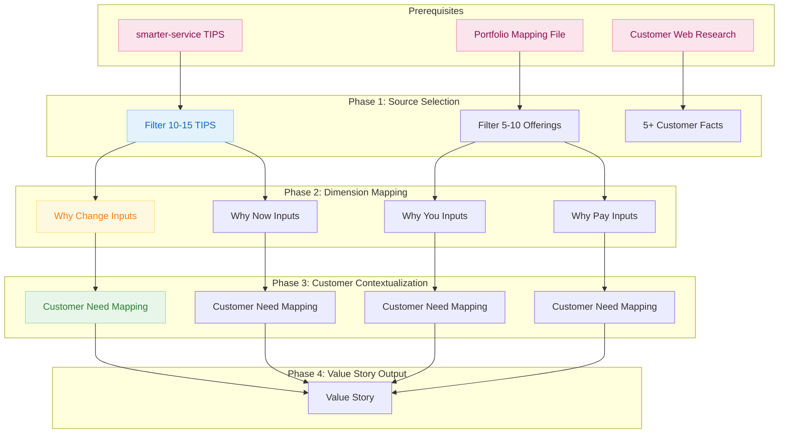

# Customer Value Mapping Research Methodology

How customer value mapping synthesizes existing TIPS research and portfolio offerings into customer-specific value propositions.

---

## Overview

Customer Value Mapping research produces **customer-specific value propositions** organized across 4 dimensions aligned to Corporate Visions' Value Story methodology. Unlike other research types, this methodology **requires prior research** — it synthesizes existing TIPS trends and portfolio offerings into targeted sales content.

**What makes this different from other research types:**

- **Prerequisites Required:** Needs existing smarter-service research + portfolio mapping file
- **4 Value Story Dimensions:** Why Change, Why Now, Why You, Why Pay
- **Synthesis Focus:** Selects and contextualizes existing research for a specific customer
- **Sales Output:** Feeds directly into `value-story-creator` for PPTX generation

---

## The Complete Evidence Chain



---

## Prerequisites (Required)

**This research type cannot run without:**

1. **Existing smarter-service project** matching customer industry
2. **Portfolio mapping file** for the solution provider

### Why Prerequisites?

Customer Value Mapping doesn't discover new trends — it contextualizes existing research:

| Research Type | Discovery Mode | Synthesis Mode |
|---------------|----------------|----------------|
| smarter-service | New TIPS trends | Industry-wide |
| b2b-ict-portfolio | New service offerings | Provider-wide |
| **customer-value-mapping** | **None** | **Customer-specific** |

### Integration Flow

```text
smarter-service   →  52 TIPS trends  →  human review  →
                                                        →  customer-value-mapping
portfolio-mapping →  portfolio.md    →  human review  →
```

**Trust Factor:**

- TIPS trends already validated through evidence chain
- Portfolio offerings already web-researched with source URLs
- Customer facts gathered fresh for this specific engagement

---

## Phase 1: Source Selection

**What it is:** Filters and loads relevant content from existing research projects.

### From smarter-service (52 TIPS)

| Selection Filter | Criteria |
|------------------|----------|
| **Horizon** | Act (primary), Plan (secondary), exclude Observe |
| **Dimension Priority** | externe-effekte, digitale-wertetreiber first |
| **Keyword Match** | Content matches customer pain points |
| **Portfolio Links** | Prefer TIPS with populated `portfolio_refs[]` |
| **Load Target** | 10-15 trends (~30-40%) |

### From Portfolio Mapping File

| Selection Filter | Criteria |
|------------------|----------|
| **Industry Vertical** | Matches customer industry |
| **Service Domain** | Matches solution category from customer needs |
| **Service Horizon** | Current offerings preferred |
| **Load Target** | 5-10 offerings matching customer needs |

### Customer Web Research

| Research Focus | Target |
|----------------|--------|
| Company overview | Annual reports, investor relations |
| Pain points | News, press releases, earnings calls |
| Strategic initiatives | Digital transformation announcements |
| Technology stack | Job postings, tech blog |
| **Minimum** | **5+ verifiable customer facts** |

**Trust Factor:**

- TIPS already have full evidence chains
- Portfolio offerings have source URLs
- Customer research produces fresh, verifiable facts

---

## The 4 Value Story Dimensions

### 1. Why Change Inputs

**Stage Alignment:** Disrupt Status Quo

**Core Question:** *"What unconsidered needs, hidden risks, and industry forces should compel this customer to change?"*

**Input Sources:**

| Source | TIPS Component | Focus |
|--------|----------------|-------|
| smarter-service | Trend (T) | External forces, industry pressures |
| smarter-service | Implications (I) | Business impact, hidden costs |
| Customer research | — | Customer-specific context |

**Purpose:** Create urgency by revealing problems the customer hasn't fully considered.

---

### 2. Why Now Inputs

**Stage Alignment:** Create Timing Urgency

**Core Question:** *"What timing pressures, costs of delay, and forcing functions make immediate action critical?"*

**Input Sources:**

| Source | TIPS Component | Focus |
|--------|----------------|-------|
| smarter-service | Implications (I) | Quantified impacts, cost of inaction |
| smarter-service | Possibilities (P) | Time-sensitive opportunities |
| Customer research | — | Deadlines, budget cycles |

**Purpose:** Convert awareness into action with temporal pressure.

---

### 3. Why You Inputs

**Stage Alignment:** Differentiate Solution

**Core Question:** *"How do our portfolio solutions uniquely address this customer's unconsidered needs?"*

**Input Sources:**

| Source | Component | Focus |
|--------|-----------|-------|
| smarter-service | Solutions (S) | Capability recommendations |
| Portfolio file | Offerings | Specific services, USPs |
| Customer research | — | Fit with customer needs |

**Purpose:** Position your solutions as uniquely suited to the customer's newly discovered needs.

---

### 4. Why Pay Inputs

**Stage Alignment:** Justify Economics

**Core Question:** *"What ROI evidence and value metrics justify the investment?"*

**Input Sources:**

| Source | Component | Focus |
|--------|-----------|-------|
| smarter-service | Implications (I) | Quantified benefits |
| Portfolio file | Offerings | Pricing models |
| Industry benchmarks | — | ROI data, payback timelines |

**Purpose:** Provide economic justification that makes the decision defensible.

---

## Phase 2: Dimension-to-Source Mapping

| Value Story Dimension | Primary TIPS Source | Secondary Sources |
|-----------------------|---------------------|-------------------|
| Why Change | externe-effekte (T), digitale-wertetreiber (I) | Customer web research |
| Why Now | All dimensions (Act horizon) | Regulatory calendars, market timing |
| Why You | digitales-fundament (S), neue-horizonte (P) | Portfolio mapping file |
| Why Pay | digitale-wertetreiber (I quantified) | Portfolio pricing, ROI benchmarks |

---

## Phase 3: Customer Need Mapping (Entity Type)

**What it is:** Captures chain-of-thought reasoning from customer pain → TIPS trend → Portfolio solution.

**Entity Contents:**

| Field | Description |
|-------|-------------|
| Customer Context | Why this need is relevant to this specific customer |
| COT Reasoning | 2-step mapping (Need → TIPS → Portfolio) |
| Dimension | Which Value Story stage (why-change, why-now, why-you, why-pay) |
| tips_trend_ref | Wikilink to source TIPS trend |
| portfolio_refs | Links to portfolio offerings |
| Confidence Score | 0-1 score based on evidence quality |

**Trust Factor:**

- Every mapping includes explicit reasoning
- TIPS references are wikilinks to validated trends
- Portfolio links point to web-researched offerings
- Confidence scores based on evidence chain quality

---

## Phase 4: Value Story Output

### Minimum Entity Counts

| Dimension | Minimum Entities | Slide Coverage |
|-----------|------------------|----------------|
| Why Change | 3 | Slides 2-5 |
| Why Now | 2 | Slides 6-9 |
| Why You | 3 | Slides 10-13 |
| Why Pay | 2 | Slides 14-16 |
| **Total** | **10** | 13-17 slides |

### Quality Gates

**Discovery Gates:**

- Minimum 1 matching smarter-service project found
- Minimum 5 verifiable customer facts from web research

**Entity Quality Gates:**

- Each need-mapping entity references at least 1 TIPS trend
- Each Why You/Why Pay entity has portfolio linkage
- Confidence score ≥ 0.70 for all mappings
- COT reasoning is explicit and traceable

**Coverage Gates:**

- All 4 dimensions have minimum entity counts
- At least 1 quantified metric per dimension
- Customer name appears in all entity contexts

---

## Output Structure

```text
{PROJECT_PATH}/
├── .metadata/
│   ├── sprint-log.json              # Workflow state
│   └── source-projects.json         # Links to prerequisite projects
├── 01-initial-question/
│   └── initial-question.md          # Customer + value story question
├── 02-refined-questions/
│   └── data/                        # 4 dimension questions
├── 04-findings/
│   └── data/                        # Customer web research findings
├── 10-claims/
│   └── data/                        # Customer-specific claims
└── 11-trends/
    └── data/                        # Customer need mapping entities
```

---

## Integration with value-story-creator

After customer-value-mapping completes, invoke `value-story-creator` to generate the final PPTX:

```text
customer-value-mapping → 11-trends/data/*.md → value-story-creator → value-story.pptx
```

The value-story-creator uses the customer need mapping entities to populate:

- **Slides 2-5:** Why Change content
- **Slides 6-9:** Why Now urgency
- **Slides 10-13:** Why You differentiation
- **Slides 14-16:** Why Pay justification

---

## How to Read This Research

### Following the Evidence Chain

When you encounter a customer need mapping:

1. **From Mapping to TIPS:** Click `tips_trend_ref` wikilink to see full TIPS trend
2. **From TIPS to Claims:** Each TIPS trend shows supporting claims
3. **From Claim to Findings:** Claims link to original research findings
4. **From Finding to Source:** Findings include original web URLs

### Understanding Dimension Relationships

```text
Why Change ──► Why Now ──► Why You ──► Why Pay
     │            │           │           │
     ▼            ▼           ▼           ▼
  Problem      Urgency    Solution    Economics
```

**Flow:**

1. **Why Change** establishes the problem the customer didn't know they had
2. **Why Now** creates temporal urgency to act immediately
3. **Why You** positions your solution as uniquely suited
4. **Why Pay** provides economic justification

### Verifying Mappings

1. Check the TIPS trend reference exists and is relevant
2. Verify portfolio offerings exist in the mapping file
3. Confirm customer context is specific to this customer
4. Review COT reasoning for logical coherence

---

## Use Cases

**When to use customer-value-mapping:**

- Preparing for a sales presentation
- Creating customer-specific proposals
- Building account-based marketing content
- Developing solution briefs

**Prerequisites needed:**

- Completed smarter-service research for the customer's industry
- Completed portfolio-mapping for your company

---

## Related Documentation

- [[research-methodology]] — Core evidence chain (generic)
- [[research-methodology-smarter-service]] — TIPS trend methodology (prerequisite)
- [[research-methodology-b2b-ict-portfolio]] — Portfolio mapping (prerequisite)
- [customer-value-mapping.md](../../references/research-types/customer-value-mapping.md) — Framework definition
