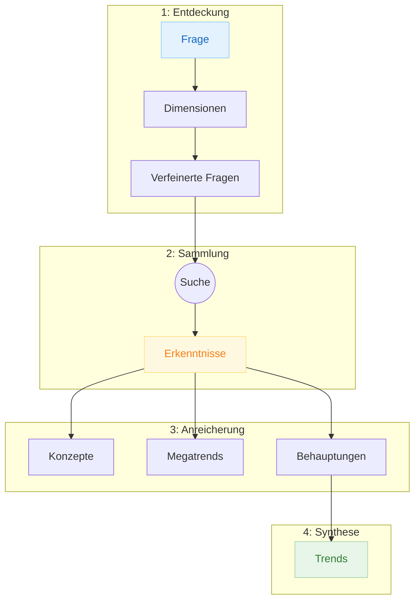

# Forschungsmethodik

Woher wissen Sie, dass diese Forschung echt ist?

Large Language Models verfügen über umfangreiches Wissen aus ihren Trainingsdaten, was sie zu leistungsfähigen Forschungsassistenten macht. Aber der Einsatz von LLMs für Forschung birgt spezifische Risiken:

- **Gefälschte Referenzen** - LLMs können Quellen zitieren, die legitim klingen, aber gar nicht existieren
- **Vorgetäuschte Quellenangaben** - LLMs können Inhalte so formatieren, als stammten sie aus externen Quellen, während sie tatsächlich aus ihrem Trainingswissen schöpfen
- **Erfundene Fakten und Zahlen** - Statistiken, Prozentangaben und Datenpunkte können erfunden werden, um glaubwürdig zu klingen

Diese Risiken werden zusammenfassend als "Halluzination" bezeichnet - die KI behauptet selbstbewusst Dinge, die schlichtweg falsch sind.

Diese Forschung verwendet einen anderen Ansatz. Jede Erkenntnis, die Sie lesen, lässt sich durch eine Beweiskette bis zu tatsächlichen Quellen zurückverfolgen. Wenn Webquellen verwendet werden, sind die URLs überprüfbar. Wenn LLM-Wissen absichtlich eingesetzt wird, wird das Modell selbst als Quelle zitiert - transparent statt verborgen. Jede Behauptung wird aus echten Erkenntnissen extrahiert, nach Konfidenz bewertet und markiert, wenn die Evidenz schwach ist. Die Methodik generiert nicht nur Forschung - sie erstellt einen nachvollziehbaren Evidenzgraphen, den Sie verifizieren können.

Dieses Dokument erklärt wie. Für jeden Entitätstyp erfahren Sie:

- **Was es ist** - Die Rolle der Entität im Forschungsprozess
- **Was es tut** - Wie es zu den finalen Erkenntnissen beiträgt
- **Wie es erstellt wird** - Der Prozess, der es generiert
- **Vertrauensfaktor** - Die spezifischen Schutzmaßnahmen gegen Fabrikation

Das Ziel: Nach der Lektüre dieses Dokuments sollten Sie genau verstehen, warum Sie jedem Teil dieser Forschung vertrauen können (oder ihn angemessen hinterfragen sollten).

---

## Die Beweiskette

Forschung durchläuft vier Phasen, wobei jede auf der vorherigen aufbaut:

**Phase 1: Entdeckung** - Ihre Forschungsfrage wird in Dimensionen (distinkte Untersuchungswinkel) und verfeinerte Fragen (spezifische, recherchierbare Fragen) zerlegt.

**Phase 2: Sammlung** - Jede verfeinerte Frage generiert optimierte Suchanfragen. Websuchen liefern Erkenntnisse - tatsächliche Informationen aus echten Quellen.

**Phase 3: Anreicherung** - Erkenntnisse werden analysiert, um Domänenkonzepte (Terminologie), Megatrends (thematische Cluster) und Behauptungen (verifizierte faktische Aussagen) zu extrahieren.

**Phase 4: Synthese** - Behauptungen werden zu Trends synthetisiert - den strategischen Schlussfolgerungen, die im Forschungsbericht erscheinen.

Jede Entität verlinkt zurück zu ihren Eltern. Sie können jeden Trend durch Behauptungen, durch Erkenntnisse bis zu den ursprünglichen Webquellen zurückverfolgen.

---

## Entitätstypen

### Ausgangsfrage

**Was es ist:** Der Ausgangspunkt aller Forschung - Ihre ursprüngliche Frage, erfasst mit ihrem Kontext, Umfang und beabsichtigten Publikum.

**Was es tut:** Verankert den gesamten Forschungsprozess. Jede Dimension, Frage, Erkenntnis und jeder Trend lässt sich auf diese Frage zurückführen. Es stellt sicher, dass die Forschung auf das fokussiert bleibt, was Sie tatsächlich gefragt haben.

**Wie es erstellt wird:** Sie stellen die Frage. Das System erfasst sie zusammen mit Metadaten: welche Art von Forschung dies ist, welche Sprache verwendet werden soll und etwaige Einschränkungen des Umfangs.

**Vertrauensfaktor:** Die Frage kommt direkt von Ihnen, nicht von der KI generiert. Schema-Validierung stellt sicher, dass alle erforderlichen Kontextinformationen erfasst werden, bevor die Forschung beginnt.

---

### Dimension

**Was es ist:** Ein distincter Blickwinkel oder eine Linse zur Erkundung Ihrer Forschungsfrage. Dimensionen zerlegen eine breite Frage in 3-9 sich gegenseitig ausschließende Perspektiven.

**Was es tut:** Gewährleistet umfassende Abdeckung. Anstatt Ihre Frage nur aus einem Blickwinkel zu beantworten, erzwingen Dimensionen die Untersuchung aus mehreren Perspektiven - Marktkräfte, Technologiefähigkeiten, regulatorische Faktoren und so weiter.

**Wie es erstellt wird:** Ein KI-Planer analysiert Ihre Frage und schlägt Dimensionen unter Verwendung zweier Frameworks vor:

- **MECE** (Mutually Exclusive, Collectively Exhaustive) - aus der Unternehmensberatung übernommen, stellt sicher, dass Dimensionen sich nicht überschneiden und zusammen den vollen Umfang abdecken
- **PICOT** strukturiert jede Dimension spezifisch: Wer ist betroffen (Population), welche Maßnahme oder Veränderung (Intervention), verglichen mit welcher Alternative (Comparison), welches Ergebnis ist wichtig (Outcome), über welchen Zeitraum (Time)

**Vertrauensfaktor:** MECE-Validierung erkennt überlappende Dimensionen (lehnt alle ab, bei denen die KI-Analyse mehr als 20% inhaltliche Überschneidung findet). Das Framework selbst verhindert Lücken - wenn Dimensionen nicht kollektiv erschöpfend sind, schlägt die Validierung fehl.

---

### Verfeinerte Frage

**Was es ist:** Eine spezifische, recherchierbare Frage innerhalb einer Dimension. Während Dimensionen breite Linsen sind, sind verfeinerte Fragen präzise Anfragen, die durch Forschung beantwortet werden können.

**Was es tut:** Übersetzt abstrakte Forschungswinkel in konkrete Fragen, die Websuchen beantworten können. Jede verfeinerte Frage zielt auf ein spezifisches Wissensstück ab, das für die Forschung benötigt wird.

**Wie es erstellt wird:** Für jede Dimension generiert der Planer verfeinerte Fragen unter Verwendung strukturierter Frameworks:

- **PICOT** strukturiert Fragen spezifisch: Wer ist betroffen (Population), welche Maßnahme oder Veränderung (Intervention), verglichen mit welcher Alternative (Comparison), welches Ergebnis ist wichtig (Outcome), über welchen Zeitraum (Time)
- **FINER** bewertet, ob Fragen verfolgenswert sind: Ist sie beantwortbar (Feasible), ist sie relevant (Interesting), fügt sie neues Wissen hinzu (Novel), ist sie angemessen zu erforschen (Ethical), verbindet sie sich mit dem Forschungsziel (Relevant)

**Vertrauensfaktor:** Fragen müssen mindestens 10/15 Punkte bei den FINER-Kriterien erreichen - das stellt sicher, dass nur bedeutungsvolle, beantwortbare Fragen weiterverfolgt werden. Verwaiste Fragen (ohne übergeordnete Dimension) werden abgelehnt. Jede Frage lässt sich auf eine validierte Dimension zurückführen.

---

### Query-Batch

**Was es ist:** Eine Sammlung websuchoptimierter Anfragen für eine einzelne verfeinerte Frage. Jeder Batch enthält 4-7 verschiedene Suchkonfigurationen, die darauf ausgelegt sind, relevante Ergebnisse zu maximieren.

**Was es tut:** Transformiert verfeinerte Fragen in tatsächliche Suchanfragen, die für Websuchmaschinen optimiert sind. Verschiedene Suchprofile zielen auf unterschiedliche Quellentypen ab - wissenschaftliche Arbeiten, Branchenberichte, Nachrichtenartikel, regionale Quellen.

**Wie es erstellt wird:** Jede verfeinerte Frage generiert mehrere Suchanfragen mit verschiedenen Profilen:

- **Allgemein:** Breite Webabdeckung
- **Akademisch:** Wissenschaftliche Quellen und peer-reviewte Forschung
- **Branche:** Fachpublikationen und Unternehmensberichte
- **Lokalisiert:** Regionalspezifische Ergebnisse
- **Technisch:** Dokumentation und technische Quellen

**Vertrauensfaktor:** Query-Syntax wird vor der Ausführung validiert. Doppelte Anfragen über Batches hinweg werden erkannt und entfernt. Mehrere Profile gewährleisten diverse Quellentypen.

---

### Erkenntnis (Finding)

**Was es ist:** Ein Stück Forschungsinformation mit seiner Quellenattribution. Erkenntnisse enthalten den tatsächlichen Inhalt, Schlüsselerkenntnisse und vollständige Herkunft - ob aus Webquellen oder LLM-Wissen.

**Was es tut:** Bringt Evidenz in die Forschung. Erkenntnisse sind das Rohmaterial, aus dem Konzepte, Megatrends und Behauptungen extrahiert werden. Jede Erkenntnis repräsentiert etwas, das aus einer nachvollziehbaren Quelle gelernt wurde.

**Wie es erstellt wird:** Spezialisierte Erkenntniserzeuger handhaben verschiedene Quellentypen:

- **Web-Erkenntnisse:** Suchanfragen werden gegen das Web ausgeführt. Für jedes relevante Ergebnis ruft das System den tatsächlichen Inhalt von der Original-URL ab - nicht nur den Suchausschnitt. Aus diesem abgerufenen Inhalt extrahiert es Hauptinhalt (150-300 Wörter), Schlüsselerkenntnisse (3-6 Aufzählungspunkte), Methodik und Datenpunkte, Relevanzbeurteilung und vollständige Quellenattribution mit URL.

- **LLM-Erkenntnisse:** Wenn Modellwissen angemessen ist, werden Fragen direkt an das LLM gestellt. Die Erkenntnis enthält die genaue Modellkennung (z.B. "claude-3-opus"), das Wissens-Stichtag-Datum und explizite Kennzeichnung als LLM-abgeleitet - was die Quelle transparent statt verborgen macht.

**Vertrauensfaktor:** Web-Erkenntnisse müssen aus tatsächlichen Suchergebnissen stammen - URLs müssen echt und zugänglich sein. Wenn keine relevanten Ergebnisse existieren, wird eine "keine Ergebnisse"-Erkenntnis erstellt, anstatt Daten zu erfinden. LLM-Erkenntnisse zitieren explizit das Modell als Quelle, was das Problem der "vorgetäuschten Quellenangabe" verhindert, bei dem LLM-Wissen als externe Forschung maskiert wird. Qualitätsbewertung (0-1) bewertet thematische Relevanz, Inhaltsvollständigkeit, Quellenzuverlässigkeit, Beweiswert und Aktualität. Erkenntnisse unter 0,50 Qualitätsschwelle werden markiert.

---

### Domänenkonzept

**Was es ist:** Ein technischer Begriff oder eine Phrase, die wiederholt in der Forschung erscheint, mit einer aus den Erkenntnissen synthetisierten Definition.

**Was es tut:** Erstellt ein Glossar domänenspezifischer Terminologie. Konzepte helfen Lesern, technische Sprache zu verstehen und gewährleisten konsistente Verwendung von Begriffen in der gesamten Forschung.

**Wie es erstellt wird:** Das System analysiert alle Erkenntnisse, um Begriffe zu identifizieren, die in mindestens zwei verschiedenen Erkenntnissen erscheinen. Definitionen werden aus der Verwendung des Begriffs über Erkenntnisse hinweg synthetisiert - nicht unabhängig erfunden.

**Vertrauensfaktor:** Definitionen stammen ausschließlich aus den geladenen Erkenntnissen. Ein Konzept kann nicht ohne mindestens zwei Erkenntnisse existieren, die es erwähnen. Verwaiste Konzepte (ohne Erkenntnisrückverweise) werden abgelehnt. Jedes Konzept zeigt genau, welche Erkenntnisse seine Definition stützen.

---

### Megatrend

**Was es ist:** Ein thematischer Cluster, der verwandte Erkenntnisse gruppiert. Megatrends repräsentieren die großen Themen, die aus der Forschung hervorgehen.

**Was es tut:** Offenbart Muster über einzelne Erkenntnisse hinweg. Während Erkenntnisse atomare Informationsstücke sind, zeigen Megatrends das größere Bild - welche Themen immer wieder auftauchen, welche Trends entstehen.

**Wie es erstellt wird:** Megatrends werden durch einen hybriden Ansatz erstellt, der Top-Down- und Bottom-Up-Methoden kombiniert:

- **Gesetzte Megatrends (Top-Down):** LLM-Wissen schlägt potenzielle Megatrends vor, die für die Forschungsdomäne relevant sind. Diese Seeds bieten Struktur und stellen sicher, dass wichtige Themen nicht übersehen werden.
- **Geclusterte Megatrends (Bottom-Up):** Erkenntnisse werden nach semantischer Ähnlichkeit gruppiert, sodass unerwartete Muster aus den Daten selbst entstehen können.
- **Hybride Validierung:** Gesetzte Megatrends müssen durch tatsächliche Erkenntnisse gestützt werden, um zu überleben. Bottom-Up-Cluster werden gegen Domänenwissen auf Kohärenz geprüft.

Megatrends erfordern mindestens 3 Erkenntnisse zur Bildung. Jeder Megatrend enthält:

- Eine strategische Narrative, die den Megatrend erklärt
- Evidenzstärke-Rating (stark/moderat/schwach/Hypothese)
- Planungshorizont (sofortige Aktion, mittelfristige Planung, langfristige Beobachtung)
- Konfidenzscore basierend auf stützender Evidenz

**Vertrauensfaktor:** Megatrends können nicht mit weniger als 3 stützenden Erkenntnissen existieren - keine einzelne Erkenntnis kann einen Trend definieren. Konfidenzscores reflektieren tatsächliche Evidenzstärke. Megatrends, die als "Hypothese" (schwache Evidenz) gekennzeichnet sind, werden klar von gut gestützten Trends unterschieden.

---

### Quelle

**Was es ist:** Metadaten darüber, woher Informationen stammen - entweder eine Webressource (URL, Domain, Titel, Zugriffsdatum) oder ein LLM-Modell (Modellkennung, Wissens-Stichtag-Datum).

**Was es tut:** Pflegt die Herkunft für jedes Informationsstück. Für Webquellen können Sie die tatsächliche Seite besuchen. Für LLM-Quellen wissen Sie genau, welches Modellwissen verwendet wurde und wann dieses Wissen aktuell war.

**Wie es erstellt wird:** Für jede Erkenntnis werden Quellenmetadaten extrahiert und validiert:

- **Webquellen:** URL-Verifizierung (muss zugänglich sein), Domain-Extraktion, Publikationsdatum, Zuverlässigkeitsstufe
- **LLM-Quellen:** Modellkennung (z.B. "claude-3-opus"), Wissens-Stichtag-Datum, explizite Kennzeichnung als modellabgeleitet

**Vertrauensfaktor:** Web-URLs werden validiert - tote Links werden erkannt. LLM-Quellen werden explizit gekennzeichnet statt versteckt, sodass Sie immer wissen, wann Informationen aus Modellwissen versus externer Verifizierung stammen. Zuverlässigkeitsstufen klassifizieren die Glaubwürdigkeit von Webquellen:

- **Stufe 1:** Peer-reviewte Zeitschriften, Regierungsstatistiken (Primärdaten, rigorose Methodik)
- **Stufe 2:** Branchenberichte, etablierte Nachrichten (Sekundäranalyse, redaktionelle Standards)
- **Stufe 3:** Fachpublikationen, Unternehmensblogs (Domänenexpertise, potenzielle Voreingenommenheit)
- **Stufe 4:** Allgemeines Web, nutzergeneriert (ungeprüft, erfordert Bestätigung)

---

### Herausgeber

**Was es ist:** Informationen über die Organisation, die eine Quelle veröffentlicht hat - ihr Name, Typ und ihre institutionelle Autorität.

**Was es tut:** Fügt Kontext zur Bewertung der Quellenglaubwürdigkeit hinzu. Eine Erkenntnis aus einer peer-reviewten Zeitschrift hat anderes Gewicht als eine aus einem anonymen Blog.

**Wie es erstellt wird:** Herausgeberinformationen werden aus Quellen extrahiert. Das System klassifiziert Herausgeber nach Typ:

- **Akademisch:** Universitäten, Forschungseinrichtungen, Zeitschriften
- **Nachrichten:** Etablierte Medienorganisationen
- **Regierung:** Offizielle Regierungsbehörden
- **Branche:** Branchenverbände, Beratungsfirmen
- **Multilateral:** Internationale Organisationen (UN, OECD usw.)

**Vertrauensfaktor:** Herausgeber werden nur aus tatsächlichen Quellen erstellt - niemals erfunden. Domain-Verifizierung und Abgleich mit einer Datenbank bekannter Herausgeber bestätigen die Legitimität. Wenn die Herausgeberidentität unsicher ist, verwendet das System den Domainnamen, anstatt einen Herausgeber zu erfinden.

---

### Zitat

**Was es ist:** Ein formeller Verweis auf eine Quelle, formatiert nach akademischen Standards (APA 7. Auflage).

**Was es tut:** Ermöglicht korrekte Attribution und macht Quellen auffindbar. Zitate verbinden die Forschung mit verifizierbaren externen Quellen in einem standardisierten Format.

**Wie es erstellt wird:** Für jede Quelle wird ein Zitat generiert mit:

- Formatiertem Zitattext (APA-Stil)
- Link zur Quellenentität
- Link zur Herausgeberentität
- Verwendeter Abgleichsstrategie (wie der Herausgeber identifiziert wurde)

**Vertrauensfaktor:** APA-Format-Validierung stellt sicher, dass Zitate korrekt strukturiert sind. Wenn kein Herausgeberabgleich gefunden wird, verwendet das System eine Domain-Fallback-Strategie, anstatt Herausgeberinformationen zu erfinden. DOI-Auflösung wird wenn verfügbar verifiziert.

---

### Behauptung

**Was es ist:** Eine verifizierte faktische Aussage, die aus Erkenntnissen extrahiert wurde. Behauptungen sind atomare, testbare Aussagen mit expliziten Konfidenzscores.

**Was es tut:** Überbrückt Erkenntnisse und Trends. Während Erkenntnisse reichen Kontext enthalten, destillieren Behauptungen spezifische Fakten, die verifiziert und zu höherstufigen Schlussfolgerungen kombiniert werden können.

**Wie es erstellt wird:** Jede Erkenntnis wird analysiert, um atomare Behauptungen zu extrahieren. Jede Behauptung wird mit zwei Schichten bewertet:

**Schicht 1 - Evidenzzuverlässigkeit:**

- Quellenqualitätsstufe
- Anzahl der stützenden Quellen
- Kreuzvalidierung über Quellen
- Aktualität der Publikation
- Übereinstimmung der Quellendomänenexpertise

**Schicht 2 - Behauptungsqualität:**

- Atomizität: Ist dies eine einzelne, testbare Aussage?
- Flüssigkeit: Ist sie klar ausgedrückt?
- Dekontextualisierung: Ist sie ohne Quellenkontext verständlich?
- Treue: Repräsentiert sie die Quelle genau?

**Vertrauensfaktor:** Dies ist der rigoroseste Anti-Halluzinations-Checkpoint. Behauptungen erfordern Konfidenzscores über 0,75, um Trends zu informieren. Behauptungen werden zur Überprüfung markiert, wenn die Evidenzzuverlässigkeit unter 0,5 liegt oder eine Qualitätsdimension unter 0,7. Hedge-Wörter aus Quellen werden exakt beibehalten - wenn eine Quelle sagt "könnte verbessern", sagt die Behauptung "könnte verbessern", nicht "verbessert".

---

### Trend

**Was es ist:** Eine strategische Schlussfolgerung, die aus mehreren verifizierten Behauptungen synthetisiert wurde. Trends sind die finalen Forschungsausgaben, die in Ihrem Bericht erscheinen.

**Was es tut:** Beantwortet Ihre Forschungsfrage mit evidenzgestützten Schlussfolgerungen. Trends kombinieren einzelne Fakten zu umsetzbarer strategischer Orientierung.

**Wie es erstellt wird:** Trends werden aus Behauptungen synthetisiert und erfordern:

- Mindestens 3 verifizierte Behauptungen pro Trend
- Nur Behauptungen mit Konfidenz über 0,75
- Klare Nachvollziehbarkeit zur stützenden Evidenz
- Qualitätsscores für Evidenzstärke, strategische Relevanz, Umsetzbarkeit und Neuheit

Jeder Trend enthält:

- Kontext, der den Hintergrund erklärt
- Evidenzanalyse mit Behauptungszitaten
- Spannungen und Limitationen
- Strategische, operative und technische Implikationen
- Vollständige Liste der stützenden Behauptungen

**Vertrauensfaktor:** Kein Trend kann ohne mindestens 3 verifizierte Behauptungen existieren, die ihn stützen. Jeder Trend zeigt seine Beweiskette - Sie können jede Schlussfolgerung durch Behauptungen, Erkenntnisse und Quellen bis zum ursprünglichen Webinhalt zurückverfolgen. Evidenzaktualität wird verfolgt, damit Sie wissen, ob Schlussfolgerungen auf aktuellen oder veralteten Informationen beruhen.

---

## Wie Sie diese Forschung lesen

### Der Beweiskette folgen

Wenn Sie einer Behauptung oder einem Trend im Forschungsbericht begegnen, können Sie diese bis zu ihren Quellen zurückverfolgen:

1. **Von Trend zu Behauptungen** - Jeder Trend listet seine stützenden Behauptungen mit Links
2. **Von Behauptung zu Erkenntnissen** - Jede Behauptung referenziert die Erkenntnisse, aus denen sie extrahiert wurde
3. **Von Erkenntnis zu Quelle** - Jede Erkenntnis enthält die Original-URL und Quellenmetadaten

### Konfidenzlevel verstehen

Die Forschung verwendet explizite Konfidenzbewertung:

- **0,90+** - Hohe Konfidenz, gut gestützt durch mehrere Qualitätsquellen
- **0,75-0,89** - Gute Konfidenz, ausreichende Evidenz für strategische Entscheidungen
- **0,50-0,74** - Moderate Konfidenz, als Richtung statt definitiv behandeln
- **Unter 0,50** - Niedrige Konfidenz, zur Überprüfung markiert, mit Vorsicht verwenden

### Quellenstufen interpretieren

Nicht alle Quellen haben gleiches Gewicht:

- **Stufe 1** Quellen (akademisch, Regierung) liefern die stärkste Evidenz
- **Stufe 2** Quellen (Branchenberichte, große Nachrichten) bieten solide Sekundäranalyse
- **Stufe 3** Quellen (Fachpublikationen) liefern Domänenkontext, können aber voreingenommen sein
- **Stufe 4** Quellen (allgemeines Web) erfordern Bestätigung aus anderen Quellen

### Limitationen erkennen

Die Forschung macht ihre Limitationen explizit:

- **Hypothesenebene Megatrends** zeigen entstehende Muster ohne starke Evidenz an
- **Markierte Behauptungen** heben Aussagen hervor, die zusätzliche Verifizierung benötigen (diese sind in den Daten enthalten, aber von Trends ausgeschlossen, bis sie verifiziert sind)
- **Evidenzaktualität** zeigt, ob Schlussfolgerungen auf aktuellen oder veralteten Quellen beruhen
- **Hedge-Wörter** werden beibehalten - "kann", "könnte", "deutet darauf hin" signalisieren Unsicherheit in den Quellen

### Behauptungen verifizieren

Sie können jede Behauptung in der Forschung verifizieren:

1. Navigieren Sie zur Behauptungsentität über ihren Link (dargestellt als `[[entity-name]]` in den Forschungsdateien)
2. Überprüfen Sie die Erkenntnisreferenzen, die in dieser Behauptung aufgeführt sind
3. Folgen Sie Quell-URLs zum ursprünglichen Webinhalt
4. Prüfen Sie die Zuverlässigkeitsstufe und das Zugriffsdatum

Diese Nachvollziehbarkeit ist der Kernwert der Methodik - nichts wird auf Vertrauen angenommen.
