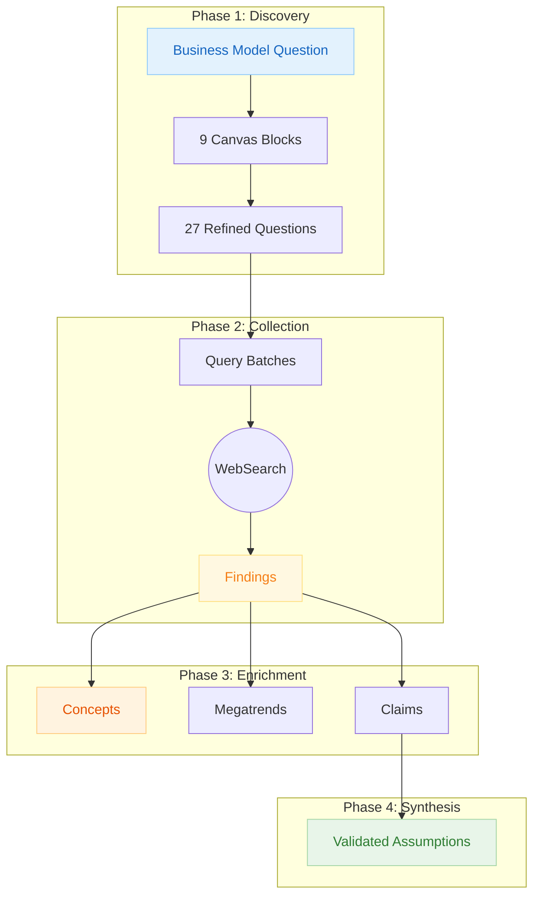

# Lean Canvas Research Methodology

How lean-canvas research validates business model assumptions through systematic evidence gathering across 9 blocks.

---

## Overview

Lean Canvas research produces **evidence-based business model validation** organized across 9 blocks from Ash Maurya's methodology. Each assumption traces back through a chain of evidence to actual sources, ensuring you can verify every claim about problem-solution fit.

**What makes this different from generic research:**

- **Fixed 9-Block Structure:** Problem, Customer Segments, UVP, Solution, Channels, Revenue, Costs, Metrics, Unfair Advantage
- **No Preprocessing Required:** Research begins directly with the business model question
- **Assumption Validation Focus:** Every finding tests a specific business assumption
- **MVP-Oriented:** Research informs minimum viable product scope

---

## The Evidence Chain (No Preprocessing)



---

## Phase 1: Discovery (9 Fixed Blocks)

**What it is:** Unlike generic research where dimensions are derived from the question, lean-canvas uses 9 fixed blocks representing the critical business model components.

**The 9 Blocks (Dimensions):**

| Block | Focus | Key Questions |
|-------|-------|---------------|
| **1. Problem** | Customer pain points | What are top 3 problems? How painful? Existing alternatives? |
| **2. Customer Segments** | Target markets | Who are the targets? Who are early adopters? |
| **3. Unique Value Proposition** | Differentiation | Single clear message? Why different? High-level concept? |
| **4. Solution** | Features addressing problems | Top 3 features? Map to problems? MVP scope? |
| **5. Channels** | Paths to customers | How will they find you? Inbound vs outbound? |
| **6. Revenue Streams** | Monetization | Revenue model? Pricing strategy? Lifetime value? |
| **7. Cost Structure** | Fixed and variable costs | Fixed costs? Variable costs? Burn rate? |
| **8. Key Metrics** | Success indicators | What to measure? Leading indicators? Success definition? |
| **9. Unfair Advantage** | Sustainable moats | What can't be copied? Barriers? Network effects? |

**MECE Validation:**

The 9 blocks are pre-validated for MECE compliance:

- **Problem Space:** Blocks 1-2 (Problem, Customer Segments)
- **Solution Space:** Blocks 3-4 (UVP, Solution)
- **Go-to-Market:** Blocks 5, 9 (Channels, Unfair Advantage)
- **Financial:** Blocks 6-8 (Revenue, Costs, Metrics)

**Refined Questions:**

Each block generates 3 refined questions targeting specific assumptions. Total: 27 refined questions covering all critical business model assumptions.

**Trust Factor:**

- Blocks are pre-validated for completeness (Ash Maurya methodology)
- No dimension overlap possible with fixed structure
- Every question maps to a specific block

---

## Phase 2: Collection

**What it is:** Query batches are generated for each refined question to gather evidence about business model assumptions.

**Search Profiles:**

| Profile | Target | Use Case |
|---------|--------|----------|
| General | Broad market research | Problem validation |
| Industry | Trade publications, analyst reports | Market sizing |
| Academic | Research papers | Methodology validation |
| Competitor | Competitive analysis | Alternative solutions |
| Customer | Forums, reviews, social | Pain point validation |

**Trust Factor:**

- 4-7 optimized queries per question ensure diverse evidence
- Multiple search profiles capture different perspectives
- Every finding links back to its query batch and block

---

## Phase 3: Enrichment

**What it is:** Findings are analyzed to extract concepts, patterns, and claims that inform business model validation.

**Block-Specific Analysis:**

| Block | Enrichment Focus |
|-------|------------------|
| Problem | Pain point severity, frequency, existing workarounds |
| Customer Segments | Market size, early adopter characteristics |
| UVP | Competitive positioning, messaging effectiveness |
| Solution | Feature validation, MVP priorities |
| Channels | Customer acquisition costs, channel effectiveness |
| Revenue | Pricing benchmarks, willingness to pay |
| Costs | Industry benchmarks, cost drivers |
| Metrics | Leading indicators, success benchmarks |
| Unfair Advantage | Defensibility, competitive moats |

**Trust Factor:**

- Claims require confidence >0.75 to inform synthesis
- All extractions trace back to specific findings
- Patterns require minimum 2 findings for validation

---

## Phase 4: Synthesis (Business Model Validation)

**What it is:** Claims are synthesized into validated or invalidated assumptions about the business model.

**Output per Block:**

Each block produces:

- **Validated Assumptions:** Claims supported by evidence
- **Invalidated Assumptions:** Claims contradicted by evidence
- **Open Questions:** Areas needing more research
- **Recommendations:** Actions based on evidence

**Assumption Confidence Levels:**

| Level | Evidence Requirement |
|-------|---------------------|
| **Validated** | 3+ supporting claims, confidence >0.75 |
| **Likely** | 2 supporting claims, confidence >0.60 |
| **Uncertain** | Mixed or insufficient evidence |
| **Invalidated** | 2+ contradicting claims |

**Trust Factor:**

- Every validation traces back to specific claims
- Claims link to findings with source URLs
- Contradictory evidence is surfaced, not hidden

---

## Block Relationships

The 9 blocks form logical dependencies:

```text
Problem ──────► Solution ──────► Revenue
   │               │                │
   ▼               ▼                ▼
Customer        UVP             Metrics
Segments           │                │
                   ▼                ▼
              Channels ◄────── Costs
                   │
                   ▼
            Unfair Advantage
```

**Reading Order for Validation:**

1. **Problem → Customer Segments:** Is the problem real for this audience?
2. **Problem → Solution → UVP:** Does the solution address the problem uniquely?
3. **UVP → Channels → Revenue:** Can you reach customers profitably?
4. **Revenue → Costs → Metrics:** Is the business model viable?
5. **All → Unfair Advantage:** Is this defensible?

---

## Output Structure

```text
{PROJECT_PATH}/
├── .metadata/
│   └── sprint-log.json              # Workflow state
├── 01-initial-question/
│   └── initial-question.md          # Business model question
├── 02-refined-questions/
│   └── data/                        # 27 block-specific questions
├── 03-query-batches/
│   └── data/                        # 4-7 queries per question
├── 04-findings/
│   └── data/                        # Market research findings
├── 05-domain-concepts/
│   └── data/                        # Business terminology
├── 06-megatrends/
│   └── data/                        # Market patterns
├── 07-sources/
│   └── data/                        # Source metadata
├── 08-publishers/
│   └── data/                        # Publisher information
├── 09-citations/
│   └── data/                        # APA-formatted citations
├── 10-claims/
│   └── data/                        # Verified assertions
└── 11-trends/
    └── data/                        # Block validation summaries
```

---

## How to Read This Research

### Following the Evidence Chain

When you encounter a validated assumption:

1. **From Validation to Claims:** Each block shows supporting/contradicting claims
2. **From Claim to Findings:** Each claim references source findings
3. **From Finding to Source:** Each finding includes the original URL

### Understanding Block Relationships

- Start with **Problem** and **Customer Segments** — these anchor everything
- **Solution** and **UVP** should directly address validated problems
- **Revenue**, **Costs**, and **Metrics** determine viability
- **Unfair Advantage** determines long-term defensibility

### Interpreting Validation Status

- **Validated:** Proceed with confidence
- **Likely:** Proceed with monitoring
- **Uncertain:** Run experiments to validate
- **Invalidated:** Pivot or abandon this assumption

---

## Use Cases

**When to use lean-canvas research:**

- Validating a new business idea
- Assessing market entry opportunities
- Evaluating startup investments
- Planning product pivots
- Competitive business model analysis

**Output feeds:**

- Business model canvas documents
- Investment pitch decks
- Strategic planning sessions
- MVP feature prioritization

---

## Related Documentation

- [[research-methodology]] — Core evidence chain (generic)
- [lean-canvas.md](../../references/research-types/lean-canvas.md) — Framework definition
