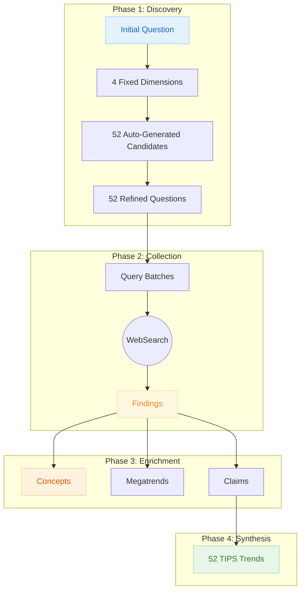

# Smarter Service Research Methodology

How smarter-service research builds traceable, evidence-based trend intelligence using the TIPS framework.

---

## Overview

Smarter Service research produces **52 TIPS trends** organized across 4 dimensions and 3 action horizons. Each trend traces back through a chain of evidence to actual sources, ensuring you can verify every conclusion.

**What makes this different from generic research:**

- **Auto-Generated Candidates:** The dimension-planner generates 52 trend candidates during Phase 2
- **Fixed Structure:** 4 dimensions (not domain-derived), 3 horizons (Act/Plan/Observe)
- **TIPS Format:** Every trend includes Trend, Implications, Possibilities, Solutions
- **Portfolio Integration:** Optional linking to B2B ICT portfolio offerings

---

## The Complete Evidence Chain



---

## Phase 1: Discovery (4 Fixed Dimensions)

**What it is:** Unlike generic research where dimensions are derived from the question, smarter-service uses 4 fixed dimensions organized as concentric layers.

**The 4 Dimensions:**

| Layer | Dimension | Core Question |
|-------|-----------|---------------|
| Outer | **Externe Effekte** | What external forces are impacting the organization? |
| Strategic | **Neue Horizonte** | What will the company be paid for in the future? |
| Value | **Digitale Wertetreiber** | Where do we create value through digital means? |
| Inner | **Digitales Fundament** | What digital competencies must exist? |

**Action Horizons:**

| Horizon | Timeframe | Action Type | Candidates |
|---------|-----------|-------------|------------|
| **Act** | 0-2 years | Immediate implementation | 5 per dimension |
| **Plan** | 2-5 years | Strategic preparation | 5 per dimension |
| **Observe** | 5+ years | Monitor emerging trends | 3 per dimension |

**1:1 Candidate-to-Question Mapping:**

Each of the 52 auto-generated candidates maps to exactly one refined question. The dimension-planner validates:

- All 52 candidates have corresponding questions
- PICOT structure aligns with candidate keywords

**Trust Factor:**

- Dimensions are pre-validated for MECE (Mutually Exclusive, Collectively Exhaustive)
- No dimension overlap possible with fixed structure
- Every question traces back to a specific trend candidate

---

## Phase 2: Collection (TIPS-Enhanced)

**What it is:** Query batches are generated for each refined question, optimized using the candidate's keywords and research hints.

**Query Optimization:**

The batch-creator uses candidate metadata to enhance searches:

- **Keywords:** Directly from candidate's keyword array
- **Research Hint:** 20-30 word investigation guidance
- **Source URL:** If from web research, similar sources are targeted
- **Bilingual Queries:** EN + DE variants for DACH coverage

**Search Profiles:**

| Profile | Target | When Used |
|---------|--------|-----------|
| General | Broad web coverage | All questions |
| Localized | DACH regional sources | German-language candidates |
| Industry | Trade publications | Industry-specific trends |
| Academic | Scholarly sources | Research-backed candidates |
| Technical | Documentation, specs | Technology trends |

**Trust Factor:**

- 4-7 optimized queries per question ensure diverse source coverage
- Candidate keywords prevent drift from original trend topic
- Bilingual strategy captures German and English sources
- Every finding links back to its query batch and original candidate

---

## Phase 3: Enrichment

**What it is:** Findings are analyzed to extract domain concepts, megatrends, and claims. This phase follows the standard evidence chain (see [[research-methodology]]).

**TIPS-Specific Enhancements:**

- **Megatrends:** Cluster findings by the 4 dimensions
- **Claims:** Extract with dimension and horizon tagging
- **Concepts:** Build TIPS-aware glossary

**Trust Factor:**

- Megatrends require minimum 3 findings
- Claims need confidence >0.75 to inform trends
- All extractions trace back to specific findings

---

## Phase 4: Synthesis (TIPS Structure)

**What it is:** Claims are synthesized into TIPS trends — the strategic conclusions that appear in your research report.

**TIPS Components:**

Each trend contains 4 sections:

| Component | Focus | Content |
|-----------|-------|---------|
| **Trend (T)** | What's happening | External forces, market shifts |
| **Implications (I)** | What it means | Impact on organization |
| **Possibilities (P)** | What could be done | Strategic opportunities |
| **Solutions (S)** | How to do it | Implementation approaches |

**Dimension-Component Alignment:**

While each trend gets full TIPS expansion, dimensions have primary affinities:

| Dimension | Primary TIPS Component |
|-----------|----------------------|
| Externe Effekte | Trend (T) — external forces |
| Neue Horizonte | Possibilities (P) — strategic options |
| Digitale Wertetreiber | Implications (I) — value impact |
| Digitales Fundament | Solutions (S) — capabilities needed |

**Trust Factor:**

- Every trend requires minimum 3 verified claims
- Each TIPS component links to supporting evidence
- Action horizon validated against claim freshness
- Full traceability: Trend → Claims → Findings → Sources

---

## Portfolio Integration (Optional)

**What it is:** Smarter-service trends can link to B2B ICT portfolio offerings, connecting strategic insights to concrete service capabilities.

**Setup:**

1. Run `portfolio-mapping` skill to create `<company>-portfolio.md`
2. Review and refine the portfolio mapping
3. Provide portfolio file path during research initialization
4. trends-creator links TIPS to portfolio offerings

**Integration in Trends:**

Each TIPS trend includes a **B2B ICT Service Enablement** section:

- **Dimension Bridge:** Maps trend to 8 B2B ICT dimensions (0-7)
- **Portfolio Links:** Direct links to relevant services
- **Service Horizon:** Current/Emerging/Future alignment

**Trust Factor:**

- Portfolio offerings are web-researched with source URLs
- Links are validated against actual portfolio file content
- No fabricated service mappings

---

## Output Structure

```text
{PROJECT_PATH}/
├── .metadata/
│   └── sprint-log.json              # Workflow state
├── 01-initial-question/
│   └── initial-question.md          # Research question with context
├── 02-refined-questions/
│   └── data/                        # 52 PICOT-structured questions
├── 03-query-batches/
│   └── data/                        # 4-7 queries per question
├── 04-findings/
│   └── data/                        # Web research findings
├── 05-domain-concepts/
│   └── data/                        # Extracted terminology
├── 06-megatrends/
│   └── data/                        # Thematic clusters
├── 07-sources/
│   └── data/                        # Source metadata
├── 08-publishers/
│   └── data/                        # Publisher information
├── 09-citations/
│   └── data/                        # APA-formatted citations
├── 10-claims/
│   └── data/                        # Verified factual assertions
└── 11-trends/
    └── data/                        # 52 TIPS trend entities
```

---

## How to Read This Research

### Following the Evidence Chain

When you encounter a TIPS trend:

1. **From Trend to Claims:** Each TIPS component lists supporting claims
2. **From Claim to Findings:** Each claim references its source findings
3. **From Finding to Source:** Each finding includes the original URL
4. **From Candidate to Trend:** The original trend candidate is linked

### Understanding Horizon Classifications

- **Act (0-2 years):** Validated readiness, immediate ROI potential
- **Plan (2-5 years):** Capability building required, strategic positioning
- **Observe (5+ years):** Emerging signals, scenario planning

### Interpreting TIPS Scores

Each trend inherits scoring from its originating candidate:

- **Score (0-1):** Composite of impact, probability, fit, quality, strength
- **Confidence Tier:** HIGH/MEDIUM/LOW/UNCERTAIN based on triangulation
- **Signal Intensity (1-5):** Ansoff weak signal theory level

---

## Related Documentation

- [[research-methodology]] — Core evidence chain (generic)
- [[research-methodology-b2b-ict-portfolio]] — Portfolio mapping methodology
- [smarter-service.md](../../references/research-types/smarter-service.md) — Framework definition
