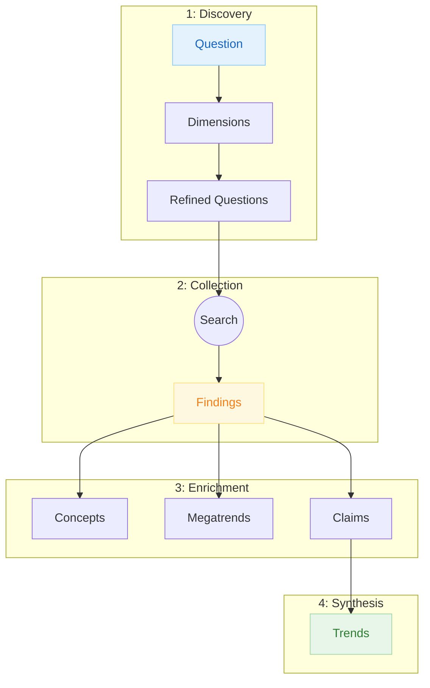

# Research Methodology

How do you know this research is real?

Large language models have vast knowledge from their training data, making them powerful research assistants. But using LLMs for research carries specific risks:

- **Fake references** - LLMs can cite sources that sound legitimate but don't actually exist
- **Pretend sourcing** - LLMs may format content as if it came from external sources while actually drawing from their training knowledge
- **Fabricated facts and numbers** - Statistics, percentages, and data points can be invented to sound credible

These risks are collectively known as "hallucination" - the AI confidently states things that are simply false.

This research uses a different approach. Every trend you read traces back through a chain of evidence to actual sources. When web sources are used, URLs are verifiable. When LLM knowledge is used intentionally, the model itself is cited as the source - making it transparent rather than hidden. Every claim is extracted from real findings, scored for confidence, and flagged when evidence is weak. The methodology doesn't just generate research - it builds a traceable evidence graph that you can verify.

This document explains how. For each type of research entity, you'll learn:

- **What it is** - The entity's role in the research process
- **What it does** - How it contributes to the final trend entities
- **How it's created** - The process that generates it
- **Trust Factor** - The specific safeguards preventing fabrication

The goal: You should finish this document understanding exactly why you can trust (or appropriately question) every part of this research.

---

## The Evidence Chain

Research flows through four phases, each building on the previous:

**Phase 1: Discovery** - Your research question is decomposed into dimensions (distinct angles of inquiry) and refined questions (specific, searchable questions).

**Phase 2: Collection** - Each refined question generates optimized search queries. Web searches return findings - actual information from real sources.

**Phase 3: Enrichment** - Findings are analyzed to extract domain concepts (terminology), megatrends (thematic clusters), and claims (verified factual assertions).

**Phase 4: Synthesis** - Claims are synthesized into trends - the strategic conclusions that appear in the research report.

Every entity links back to its parents. You can trace any trend through claims, through findings, to the original web sources.

---

## Entity Types

### Initial Question

**What it is:** The starting point of all research - your original question captured with its context, scope, and intended audience.

**What it does:** Anchors the entire research process. Every dimension, question, finding, and trend traces back to this question. It ensures the research stays focused on what you actually asked.

**How it's created:** You provide the question. The system captures it along with metadata: what type of research this is, what language to use, and any constraints on scope.

**Trust Factor:** The question comes directly from you, not generated by AI. Schema validation ensures all required context is captured before research begins.

---

### Dimension

**What it is:** A distinct angle or lens for exploring your research question. Dimensions break a broad question into 3-9 mutually exclusive perspectives.

**What it does:** Ensures comprehensive coverage. Instead of answering your question from one angle, dimensions force examination from multiple perspectives - market forces, technology capabilities, regulatory factors, and so on.

**How it's created:** An AI planner analyzes your question and proposes dimensions using two frameworks:

- **MECE** (Mutually Exclusive, Collectively Exhaustive) - borrowed from management consulting, ensures dimensions don't overlap and together cover the full scope
- **PICOT** structures each dimension to be specific: Who is affected (Population), what action or change (Intervention), compared to what alternative (Comparison), what outcome matters (Outcome), over what timeframe (Time)

**Trust Factor:** MECE validation catches overlapping dimensions (rejecting any where AI analysis finds more than 20% content overlap). The framework itself prevents gaps - if dimensions aren't collectively exhaustive, validation fails.

---

### Refined Question

**What it is:** A specific, searchable question within a dimension. Where dimensions are broad lenses, refined questions are precise queries that can be answered through research.

**What it does:** Translates abstract research angles into concrete questions that web searches can answer. Each refined question targets a specific piece of knowledge needed for the research.

**How it's created:** For each dimension, the planner generates refined questions using structured frameworks:

- **PICOT** structures questions to be specific: Who is affected (Population), what action or change (Intervention), compared to what alternative (Comparison), what outcome matters (Outcome), over what timeframe (Time)
- **FINER** scores whether questions are worth pursuing: Is it answerable (Feasible), does it matter (Interesting), is it adding new knowledge (Novel), is it appropriate to research (Ethical), does it connect to the research goal (Relevant)

**Trust Factor:** Questions must score at least 10/15 on FINER criteria - ensuring only meaningful, answerable questions proceed. Orphan questions (those without a parent dimension) are rejected. Every question traces back to a validated dimension.

---

### Query Batch

**What it is:** A collection of web-search-optimized queries for a single refined question. Each batch contains 4-7 different search configurations designed to maximize relevant results.

**What it does:** Transforms refined questions into actual search queries optimized for web search engines. Different search profiles target different source types - academic papers, industry reports, news articles, regional sources.

**How it's created:** Each refined question generates multiple search queries with different profiles:

- **General:** Broad web coverage
- **Academic:** Scholarly sources and peer-reviewed research
- **Industry:** Trade publications and company reports
- **Localized:** Region-specific results
- **Technical:** Documentation and technical sources

**Trust Factor:** Query syntax is validated before execution. Duplicate queries across batches are detected and removed. Multiple profiles ensure diverse source types.

---

### Finding

**What it is:** A piece of research information with its source attribution. Findings contain the actual content, key trends, and complete provenance - whether from web sources or LLM knowledge.

**What it does:** Brings evidence into the research. Findings are the raw material from which concepts, megatrends, and claims are extracted. Each finding represents something learned from a traceable source.

**How it's created:** Specialized findings-creators handle different source types:

- **Web findings:** Search queries execute against the web. For each relevant result, the system fetches the actual content from the original source URL - not just the search snippet. From this fetched content, it extracts main content (150-300 words), key trends (3-6 bullets), methodology and data points, relevance assessment, and complete source attribution with URL.

- **LLM findings:** When model knowledge is appropriate, questions are posed directly to the LLM. The finding includes the exact model identifier (e.g., "claude-3-opus"), knowledge cutoff date, and explicit marking as LLM-derived - making the source transparent rather than hidden.

**Trust Factor:** Web findings must originate from actual search results - URLs must be real and accessible. When no relevant results exist, a "no-results" finding is created instead of fabricating data. LLM findings explicitly cite the model as source, preventing the "pretend sourcing" problem where LLM knowledge masquerades as external research. Quality scoring (0-1) assesses topical relevance, content completeness, source reliability, evidentiary value, and freshness. Findings below 0.50 quality threshold are flagged.

---

### Domain Concept

**What it is:** A technical term or phrase that appears repeatedly in the research, with a definition synthesized from the findings.

**What it does:** Builds a glossary of domain-specific terminology. Concepts help readers understand technical language and ensure consistent use of terms throughout the research.

**How it's created:** The system analyzes all findings to identify terms that appear in at least two different findings. Definitions are synthesized from how the term is used across findings - not invented independently.

**Trust Factor:** Definitions come exclusively from the loaded findings. A concept cannot exist without at least two findings mentioning it. Orphan concepts (without finding backlinks) are rejected. Each concept shows exactly which findings support its definition.

---

### Megatrend

**What it is:** A thematic cluster grouping related findings. Megatrends represent the major themes that emerge from the research.

**What it does:** Reveals patterns across individual findings. While findings are atomic pieces of information, megatrends show the bigger picture - what themes keep appearing, what trends are emerging.

**How it's created:** Megatrends are created through a hybrid approach combining top-down and bottom-up methods:

- **Seeded megatrends (top-down):** LLM knowledge suggests potential megatrends relevant to the research domain. These seeds provide structure and ensure important themes aren't missed.
- **Clustered megatrends (bottom-up):** Findings are grouped by semantic similarity, allowing unexpected patterns to emerge from the data itself.
- **Hybrid validation:** Seeded megatrends must be supported by actual findings to survive. Bottom-up clusters are checked against domain knowledge for coherence.

Megatrends require at least 3 findings to form. Each megatrend includes:

- A strategic narrative explaining the theme
- Evidence strength rating (strong/moderate/weak/hypothesis)
- Planning horizon (immediate action, medium-term planning, long-term observation)
- Confidence score based on supporting evidence

**Trust Factor:** Megatrends cannot exist with fewer than 3 supporting findings - no single finding can define a trend. Confidence scores reflect actual evidence strength. Megatrends flagged as "hypothesis" (weak evidence) are clearly distinguished from well-supported trends.

---

### Source

**What it is:** Metadata about where information came from - either a web resource (URL, domain, title, access date) or an LLM model (model identifier, knowledge cutoff date).

**What it does:** Maintains provenance for every piece of information. For web sources, you can visit the actual page. For LLM sources, you know exactly which model's knowledge was used and when that knowledge was current.

**How it's created:** For each finding, source metadata is extracted and validated:

- **Web sources:** URL verification (must be accessible), domain extraction, publication date, reliability tier
- **LLM sources:** Model identifier (e.g., "claude-3-opus"), knowledge cutoff date, explicit marking as model-derived

**Trust Factor:** Web URLs are validated - dead links are detected. LLM sources are explicitly labeled rather than hidden, so you always know when information comes from model knowledge versus external verification. Reliability tiers classify web source credibility:

- **Tier 1:** Peer-reviewed journals, government statistics (primary data, rigorous methodology)
- **Tier 2:** Industry reports, established news (secondary analysis, editorial standards)
- **Tier 3:** Trade publications, company blogs (domain expertise, potential bias)
- **Tier 4:** General web, user-generated (unverified, requires corroboration)

---

### Publisher

**What it is:** Information about the organization that published a source - their name, type, and institutional authority.

**What it does:** Adds context for evaluating source credibility. A finding from a peer-reviewed journal carries different weight than one from an anonymous blog.

**How it's created:** Publisher information is extracted from sources. The system classifies publishers by type:

- **Academic:** Universities, research institutions, journals
- **News:** Established media organizations
- **Government:** Official government agencies
- **Industry:** Trade associations, consulting firms
- **Multilateral:** International organizations (UN, OECD, etc.)

**Trust Factor:** Publishers are only created from actual sources - never fabricated. Domain verification and known-publisher database cross-reference confirm legitimacy. When publisher identity is uncertain, the system uses the domain name rather than inventing a publisher.

---

### Citation

**What it is:** A formal reference to a source, formatted according to academic standards (APA 7th edition).

**What it does:** Enables proper attribution and makes sources findable. Citations connect the research to verifiable external sources in a standardized format.

**How it's created:** For each source, a citation is generated with:

- Formatted citation text (APA style)
- Link to source entity
- Link to publisher entity
- Match strategy used (how publisher was identified)

**Trust Factor:** APA format validation ensures citations are properly structured. When no publisher match is found, the system uses a domain fallback strategy rather than fabricating publisher information. DOI resolution is verified when available.

---

### Claim

**What it is:** A verified factual assertion extracted from findings. Claims are atomic, testable statements with explicit confidence scores.

**What it does:** Bridges findings and trends. While findings contain rich context, claims distill specific facts that can be verified and combined into higher-level conclusions.

**How it's created:** Each finding is analyzed to extract atomic claims. Each claim is scored using two layers:

**Layer 1 - Evidence Reliability:**

- Source quality tier
- Number of supporting sources
- Cross-validation across sources
- Publication recency
- Source domain expertise

**Layer 2 - Claim Quality:**

- Atomicity: Is this a single, testable statement?
- Fluency: Is it clearly expressed?
- Decontextualization: Does it stand alone without source context?
- Faithfulness: Does it accurately represent the source?

**Trust Factor:** This is the most rigorous anti-hallucination checkpoint. Claims require confidence scores above 0.75 to inform trends. Claims are flagged for review when evidence reliability is below 0.5 or any quality dimension is below 0.7. Hedge words from sources are preserved exactly - if a source says "may improve," the claim says "may improve," not "improves."

---

### Trend

**What it is:** A strategic conclusion synthesized from multiple verified claims. Trends are the final research outputs that appear in your report.

**What it does:** Answers your research question with evidence-backed conclusions. Trends combine individual facts into actionable strategic guidance.

**How it's created:** Trends are synthesized from claims, requiring:

- Minimum 3 verified claims per trend
- Only claims with confidence above 0.75
- Clear traceability to supporting evidence
- Quality scores for evidence strength, strategic relevance, actionability, and novelty

Each trend includes:

- Context explaining the background
- Evidence analysis with claim quotes
- Tensions and limitations
- Strategic, operational, and technical implications
- Complete list of supporting claims

**Trust Factor:** No trend can exist without at least 3 verified claims supporting it. Every trend shows its evidence chain - you can trace any conclusion back through claims, findings, and sources to the original web content. Evidence freshness is tracked so you know if conclusions rest on current or dated information.

---

## How to Read This Research

### Following the Evidence Chain

When you encounter a claim or a trend in the research report, you can trace it back to its sources:

1. **From Trends to Claims** - Each trend lists its supporting claims with links
2. **From Claim to Findings** - Each claim references the findings it was extracted from
3. **From Finding to Source** - Each finding includes the original URL and source metadata

### Understanding Confidence Levels

The research uses explicit confidence scoring:

- **0.90+** - High confidence, well-supported by multiple quality sources
- **0.75-0.89** - Good confidence, sufficient evidence for strategic decisions
- **0.50-0.74** - Moderate confidence, treat as directional rather than definitive
- **Below 0.50** - Low confidence, flagged for review, use with caution

### Interpreting Source Tiers

Not all sources carry equal weight:

- **Tier 1** sources (academic, government) provide the strongest evidence
- **Tier 2** sources (industry reports, major news) offer solid secondary analysis
- **Tier 3** sources (trade publications) provide domain context but may have bias
- **Tier 4** sources (general web) require corroboration from other sources

### Recognizing Limitations

The research explicitly surfaces its limitations:

- **Hypothesis-level megatrends** indicate emerging patterns without strong evidence
- **Flagged claims** highlight assertions that need additional verification (these are included in the data but excluded from trends until verified)
- **Evidence freshness** shows whether conclusions rest on current or dated sources
- **Hedge words** are preserved - "may," "might," "suggests" signal uncertainty in sources

### Verifying Claims

You can verify any claim in the research:

1. Navigate to the claim entity via its link (shown as `[[entity-name]]` in the research files)
2. Review the finding references listed in that claim
3. Follow source URLs to the original web content
4. Check the reliability tier and access date

This traceability is the core value of the methodology - nothing is taken on faith.

---

## Research Type Variants

This document describes the generic evidence chain. For research-type-specific methodology including preprocessing phases, see:

- [[research-methodology-smarter-service]] — Trend scouting + TIPS synthesis (4 dimensions, 52 trends)
- [[research-methodology-b2b-ict-portfolio]] — Company discovery + portfolio catalog (8 dimensions, 57 categories)
- [[research-methodology-lean-canvas]] — Business model validation (9 canvas blocks)
- [[research-methodology-customer-value-mapping]] — Value story synthesis (requires prior research)
