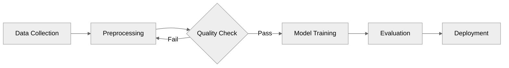

# Diagram Generation Reference

## Overview

Optional inline diagram generation for research reports using Mermaid code blocks. When enabled, the writer agent embeds Mermaid diagrams directly in the report markdown. Mermaid renders natively in Obsidian, GitHub, and HTML exports — no external API or image files needed.

## Activation

Diagram generation activates when `generate_diagrams` is `true` in project-config.json. Default: `false`.

Backward compatibility: `generate_images: true` is treated as `generate_diagrams: true`.

When to suggest enabling:
- Detailed or deep reports (enough content to warrant diagrams)
- Topics with processes, architectures, comparisons, or hierarchies
- User explicitly requests diagrams, visuals, or "make it visual"

## Configuration

| Field | Type | Default | Description |
|-------|------|---------|-------------|
| `generate_diagrams` | bool | false | Enable Mermaid diagram generation |
| `max_diagrams` | int | 3 | Maximum diagrams per report |
| `diagram_style` | string | "mermaid" | Rendering approach: `mermaid` (inline code blocks), `excalidraw` (upgrade at export), `hybrid` (both) |

## Supported Mermaid Diagram Types

| Type | Keyword | Best For |
|------|---------|----------|
| Flowchart | `flowchart LR` or `flowchart TD` | Process flows, decision trees, workflows |
| Sequence | `sequenceDiagram` | Interaction protocols, API flows, communication patterns |
| Class | `classDiagram` | Component relationships, system architecture |
| State | `stateDiagram-v2` | Lifecycle states, status transitions |
| Mindmap | `mindmap` | Topic decomposition, concept hierarchies |
| Pie | `pie` | Market share, distribution data, proportional comparisons |
| Timeline | `timeline` | Historical progressions, roadmaps, milestones |

## Content-to-Diagram Mapping

Use this table to select the right diagram type based on research content:

| Research Content Pattern | Diagram Type | Example |
|-------------------------|--------------|---------|
| Process descriptions, step-by-step workflows | Flowchart | Software deployment pipeline |
| Multi-party interactions, request/response | Sequence | API authentication flow |
| Component relationships, system structure | Class | Microservices architecture |
| Status transitions, lifecycle stages | State | Order processing states |
| Topic breakdown, categorical hierarchy | Mindmap | Research landscape overview |
| Proportional data, market shares | Pie | Cloud provider adoption |
| Chronological events, evolution over time | Timeline | Technology adoption milestones |
| Comparative analysis (non-proportional) | Flowchart (comparison layout) | Feature comparison across vendors |

## Mermaid Syntax Guidelines

Apply these guidelines when generating Mermaid code blocks:

### Theme Directive
Always start with the neutral theme for clean rendering across light/dark backgrounds:
```
%%{init: {'theme':'neutral'}}%%
```

### Node Count
Keep diagrams under **15 nodes** for readability. Complex systems should be simplified to their most important components — a diagram that needs scrolling defeats its purpose.

### Label Length
Node labels should be 2-5 words. Use abbreviations or short phrases. If a concept needs more explanation, put it in the caption text, not the diagram.

### Caption Format
Every diagram must be followed by an italicized caption on its own line:
```markdown
*Figure N: Description of what the diagram shows and why it matters.*
```

### Complete Example

````markdown

*Figure 1: Machine learning pipeline showing the iterative data quality loop that ensures training data meets minimum thresholds before model training begins.*
````

## Provider Hierarchy

1. **Mermaid inline code blocks** (always available) — the writer embeds ` ```mermaid ` fenced code blocks directly in the draft. Works everywhere: Obsidian, GitHub, HTML (with CDN), and most modern markdown renderers.

2. **Excalidraw MCP upgrade** (at export time) — when `diagram_style` is `excalidraw` or `hybrid`, the enrich-report skill converts Mermaid blocks to editable Excalidraw diagrams via `mcp__excalidraw__create_from_mermaid`, then exports as PNG/SVG. Produces hand-drawn-style diagrams that match the report's visual theme.

3. **Placeholder markers** (fallback for non-diagram visuals) — for content that cannot be represented as Mermaid (photographs, artistic illustrations, data visualizations requiring specific chart libraries), the writer may still insert:
   ```markdown
   <!-- IMAGE: Description of desired illustration. Style: infographic|illustration -->
   ```
   These are informational markers for the user to replace manually. They are NOT processed automatically.

## Diagram Planning (Phase 3.5)

Before the writer begins, the orchestrator analyzes the aggregated research context to plan which concepts deserve diagrams. This prevents random or forced visual placement — diagrams should emerge naturally from the content.

The orchestrator writes `.metadata/diagram-plan.json`:

```json
{
  "diagrams": [
    {
      "id": "diag-01",
      "concept": "Cloud provider comparison of WebAssembly support",
      "diagram_type": "pie",
      "target_section": "Cloud Provider Adoption",
      "description": "Market share of Wasm support across major cloud providers",
      "data_sources": ["ctx-cloud-providers-abc123"]
    }
  ]
}
```

The writer receives this plan and generates accurate Mermaid code blocks at the planned positions, using data from the referenced context entities.

## Export Handling

### Markdown
Mermaid code blocks are preserved as-is. Obsidian, GitHub, and most modern tools render them natively.

### HTML
The enrich-report skill (cogni-visual) injects the Mermaid CDN script into the HTML when Mermaid blocks are detected:
```html
<script src="https://cdn.jsdelivr.net/npm/mermaid@11/dist/mermaid.min.js"></script>
<script>mermaid.initialize({startOnLoad: true, theme: 'neutral'});</script>
```
Fenced ` ```mermaid ` code blocks are converted to `<pre class="mermaid">` elements (not `<code>` — Mermaid.js expects `<pre class="mermaid">`).

### PDF / DOCX (pre-rendering required)
Mermaid must be pre-rendered to SVG or PNG before conversion:
1. **mermaid-cli** (`mmdc`): `mmdc -i diagram.mmd -o diagram.svg -t neutral` — fastest, best quality
2. **Excalidraw MCP**: `mcp__excalidraw__create_from_mermaid` + `mcp__excalidraw__export_to_image` — produces hand-drawn style
3. **Fallback**: Leave as styled code blocks with a note recommending `npm install -g @mermaid-js/mermaid-cli`

## Visual Upgrade Path

Mermaid diagrams provide basic inline visualization during report writing. For richer visual treatment after the report is complete:

**`cogni-visual:enrich-report`** — Post-processes the finished `output/report.md` into themed HTML with:
- Interactive Chart.js charts (bar, doughnut, radar, line, scatter) extracted from the report's numeric data, comparison tables, and statistical clusters
- Excalidraw SVG concept diagrams for process flows, relationship maps, and abstract concepts
- Themed design with CSS custom properties from cogni-workspace themes
- Navigation sidebar and responsive layout

This is complementary to Mermaid: enrich-report analyzes the entire report structure using content-pattern detection to identify data-rich sections that warrant interactive visualization, going beyond the planned diagrams from Phase 3.5. It works regardless of research topic — the enrichment intelligence is driven by content patterns (data tables, comparison structures, statistical clusters, process descriptions), not domain-specific keywords.

To trigger: Run `/enrich-report` after the report is finalized at `output/report.md`.

## Limitations

- Mermaid diagrams are text-based — they cannot represent photographs, artistic illustrations, or complex data visualizations
- Very complex diagrams (>20 nodes) become unreadable in report context
- Mermaid rendering may vary slightly between renderers (Obsidian vs GitHub vs CDN)
- For outline and resource report types, diagrams are skipped (these formats are too concise)
