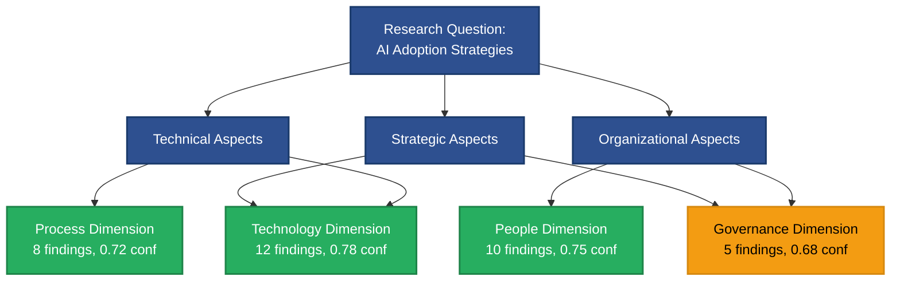
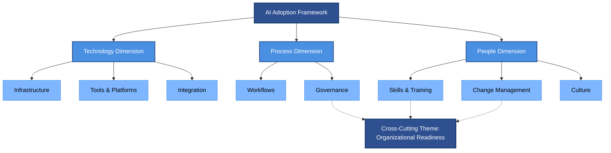
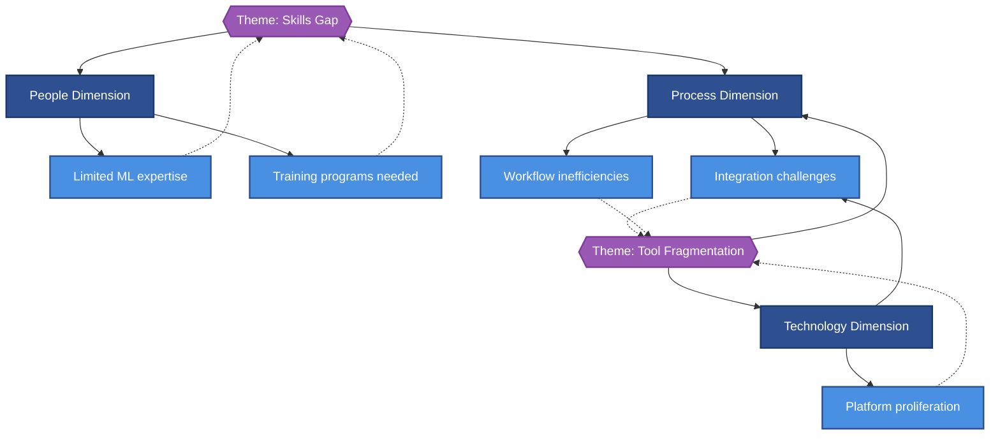

# Key Dimensions Analysis

This section analyzes research findings organized by the key dimensions identified during research planning.

## Overview

| Dimension | Findings | Avg Confidence | Key Theme |
|-----------|----------|----------------|-----------|
| [[{dimension-1-id}|{Dimension 1 Name}]] | {N} | {0.XX} | {1-2 word theme} |
| [[{dimension-2-id}|{Dimension 2 Name}]] | {N} | {0.XX} | {1-2 word theme} |
| [[{dimension-3-id}|{Dimension 3 Name}]] | {N} | {0.XX} | {1-2 word theme} |
| [[{dimension-4-id}|{Dimension 4 Name}]] | {N} | {0.XX} | {1-2 word theme} |

---

## {Dimension 1 Name}

{3-4 sentence summary of this dimension's relevance to the research question. Explain what aspect of the question this dimension addresses.}

### Key Findings

- [[{finding-uuid}|{Finding title}]] - {One sentence summary} (Confidence: {0.XX})
- [[{finding-uuid}|{Finding title}]] - {One sentence summary} (Confidence: {0.XX})
- [[{finding-uuid}|{Finding title}]] - {One sentence summary} (Confidence: {0.XX})
- [[{finding-uuid}|{Finding title}]] - {One sentence summary} (Confidence: {0.XX})

{Continue for all findings in this dimension}

### Synthesis

{2-3 paragraph analytical synthesis (NOT just bullet list):
- Paragraph 1: What patterns emerge across findings?
- Paragraph 2: How do findings relate to each other?
- Paragraph 3: What does this dimension reveal about the research question?}

### Domain Concepts Referenced

This dimension involves: [[concept-{name}|{Display}]], [[concept-{name}|{Display}]], [[concept-{name}|{Display}]]

### Deep Dive

For detailed analysis of findings in this dimension:
- [[research-hub#{dimension-section-anchor}|Jump to detailed findings]]
- [[09-citations/README|View supporting evidence]]

---

## {Dimension 2 Name}

{3-4 sentence summary of this dimension}

### Key Findings

- [[{finding-uuid}|{Finding title}]] - {One sentence summary} (Confidence: {0.XX})
- [[{finding-uuid}|{Finding title}]] - {One sentence summary} (Confidence: {0.XX})
- [[{finding-uuid}|{Finding title}]] - {One sentence summary} (Confidence: {0.XX})

### Synthesis

{2-3 paragraph analytical synthesis}

### Domain Concepts Referenced

This dimension involves: [[concept-{name}|{Display}]], [[concept-{name}|{Display}]]

### Deep Dive

For detailed analysis: [[research-hub#{dimension-section-anchor}]]

---

{Repeat structure for remaining dimensions}

---

## Cross-Cutting Themes

Themes that emerge across multiple dimensions:

### Theme 1: {Theme Name}

{2-3 sentence explanation of how this theme appears across dimensions}

**Relevant Dimensions**: [[{dimension-1}|{Name}]], [[{dimension-2}|{Name}]], [[{dimension-3}|{Name}]]

**Key Findings**:
- [[{finding-uuid}|{Finding title}]]
- [[{finding-uuid}|{Finding title}]]

### Theme 2: {Theme Name}

{2-3 sentence explanation}

**Relevant Dimensions**: [[{dimension-1}|{Name}]], [[{dimension-2}|{Name}]]

**Key Findings**:
- [[{finding-uuid}|{Finding title}]]
- [[{finding-uuid}|{Finding title}]]

{Continue for 3-5 cross-cutting themes}

---

## Dimension Comparison

### Confidence by Dimension

| Dimension | High Conf (>0.75) | Moderate Conf (0.60-0.75) | Avg Confidence |
|-----------|-------------------|---------------------------|----------------|
| {Dimension 1} | {N} findings | {M} findings | {0.XX} |
| {Dimension 2} | {N} findings | {M} findings | {0.XX} |
| {Dimension 3} | {N} findings | {M} findings | {0.XX} |
| {Dimension 4} | {N} findings | {M} findings | {0.XX} |

### Source Coverage by Dimension

| Dimension | Total Sources | Academic | Industry | Professional |
|-----------|---------------|----------|----------|--------------|
| {Dimension 1} | {N} | {N} | {N} | {N} |
| {Dimension 2} | {N} | {N} | {N} | {N} |
| {Dimension 3} | {N} | {N} | {N} | {N} |

---

## Dimensional Trends

> [!success] Strongest Dimension
> **{Dimension Name}** has the highest confidence ({0.XX avg) and most comprehensive source coverage ({N} sources, {M}% academic).

> [!warning] Research Gaps
> **{Dimension Name}** has moderate confidence ({0.XX avg) and may benefit from additional research, particularly in {specific area}.

> [!info] Balanced Coverage
> Research findings are well-distributed across dimensions, with {N}% in {dimension 1}, {N}% in {dimension 2}, etc.

---

## Visual Enhancement (Optional)

### When to Use Diagrams

Dimensional analysis benefits from diagrams when validating MECE completeness, showing hierarchical dimension relationships, or visualizing cross-cutting themes. Diagrams are particularly valuable when presenting 4+ dimensions with overlapping themes, or when demonstrating how dimensions interact to address different aspects of the research question. Consider adding diagrams when stakeholders need to understand dimensional coverage or when cross-cutting themes span multiple dimensions.

### Recommended Diagram Types

1. **Coverage Heatmap** - MECE validation showing dimension completeness across research aspects, demonstrating that dimensions are mutually exclusive and collectively exhaustive
2. **Relationship Tree** - Dimensional hierarchy and cross-cutting themes, illustrating how dimensions relate to each other and to overarching research framework
3. **Pattern Network** - Cross-dimensional theme visualization, showing how specific themes emerge across multiple dimensions and connect findings

### Generation Workflow

Use Mermaid code blocks for inline diagrams. Wrap in collapsible details tags for diagrams longer than 20 lines.

### Examples

#### Example 1: Coverage Heatmap for MECE Validation

Click to expand diagram

**What It Shows:** MECE validation demonstrating that 4 dimensions comprehensively cover technical, organizational, and strategic aspects of the research question without significant overlap

**Data Source:** Extracted from Overview table (dimension names, finding counts, confidence scores) mapped to research question aspects

#### Example 2: Relationship Tree for Dimensional Hierarchy

Click to expand diagram

**What It Shows:** Hierarchical structure of dimensions and their sub-components, with dotted lines showing cross-cutting theme linkages that span multiple dimensions

**Data Source:** Extracted from dimension synthesis paragraphs and Cross-Cutting Themes section, showing how organizational readiness emerges across people and process dimensions

#### Example 3: Pattern Network for Cross-Dimensional Themes

Click to expand diagram

**What It Shows:** Cross-dimensional themes (skills gap, tool fragmentation) and their manifestation across multiple dimensions, with specific findings supporting each theme

**Data Source:** Extracted from Cross-Cutting Themes section, mapping themes to dimensions and their constituent findings

### Integration with Obsidian

- Use collapsible `
` tags for diagrams longer than 20 lines to maintain document readability
- Ensure Mermaid code blocks use proper syntax with triple backticks and `mermaid` language identifier
- Test rendering in Obsidian preview mode before finalizing
- Keep diagrams under complexity limits (≤25 nodes, ≤40 edges) for optimal rendering performance
- Use dotted lines (`-.->`) to distinguish cross-cutting relationships from hierarchical parent-child relationships
- Apply success/caution colors to dimension nodes based on confidence scores (green for ≥0.75, orange for 0.60-0.74)

## Navigation

- ⬆️ **Research Report**: [[research-hub]] for complete synthesis
- 📚 **Evidence**: [[09-citations/README]] for source catalog
- 🗺️ **Navigation**: [[README]] for synthesis guide

---

*This dimensional analysis synthesizes {N} findings across {M} dimensions with average confidence {0.XX}. For detailed findings, see [[research-hub]].*
