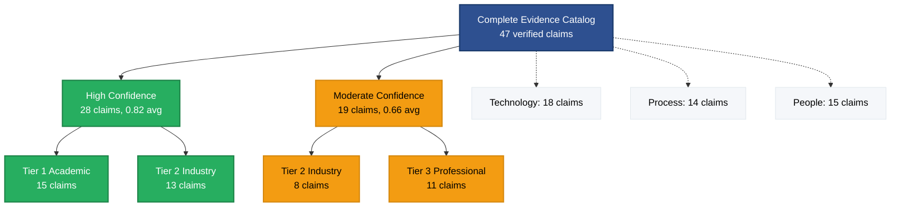
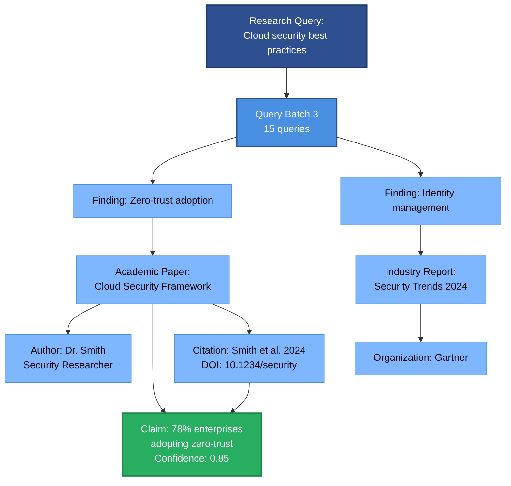
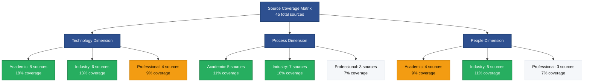

# Supporting Evidence

This section provides the complete evidence chain for all findings, including claims catalog, source catalog, author expertise, and citation provenance.

## Overview

**Total Claims**: {N}
**Total Sources**: {M}
**Total Authors**: {P}
**Total Citations**: {Q}

---

## Complete Claims Catalog

All verified claims with confidence ≥0.60, organized by confidence tier.

### High Confidence Claims (>0.75)

| Claim | Confidence | Sources | Verification |
|-------|-----------|---------|--------------|
| [[{claim-uuid}|{Claim text truncated to 50 chars}]] | {0.XX} | [[{source-uuid}|{Source}]] | Verified |
| [[{claim-uuid}|{Claim text truncated}]] | {0.XX} | [[{source-uuid}|{Source}]], [[{source-uuid}|{Source}]] | Verified |
| [[{claim-uuid}|{Claim text truncated}]] | {0.XX} | [[{source-uuid}|{Source}]] | Verified |

{Continue for all high-confidence claims}

**Total High Confidence**: {N} claims

---

### Moderate Confidence Claims (0.60-0.75)

| Claim | Confidence | Sources | Verification |
|-------|-----------|---------|--------------|
| [[{claim-uuid}|{Claim text}]] | {0.XX} | [[{source-uuid}|{Source}]] | Verified |
| [[{claim-uuid}|{Claim text}]] | {0.XX} | [[{source-uuid}|{Source}]] | Verified |

{Continue for all moderate-confidence claims}

**Total Moderate Confidence**: {N} claims

> [!info] Confidence Threshold
> Claims with confidence <0.60 were excluded from synthesis. Excluded: {N} claims.

---

## Source Catalog

Complete listing of all sources with reliability tiers and metadata.

### Tier 1: Academic Sources

| Source | Type | Authors | Year | Citations |
|--------|------|---------|------|-----------|
| [[{source-uuid}|{Title}]] | Journal | [[{author-uuid}|{Name}]] | {YYYY} | [[{cite-uuid}|Cite]] |
| [[{source-uuid}|{Title}]] | Conference | [[{author-uuid}|{Name}]], [[{author-uuid}|{Name}]] | {YYYY} | [[{cite-uuid}|Cite]] |

**Total Tier 1**: {N} sources

---

### Tier 2: Industry Sources

| Source | Type | Organization | Year | Citations |
|--------|------|--------------|------|-----------|
| [[{source-uuid}|{Title}]] | Whitepaper | {Org name} | {YYYY} | [[{cite-uuid}|Cite]] |
| [[{source-uuid}|{Title}]] | Report | {Org name} | {YYYY} | [[{cite-uuid}|Cite]] |

**Total Tier 2**: {N} sources

---

### Tier 3: Professional Sources

| Source | Type | Publisher | Year | Citations |
|--------|------|-----------|------|-----------|
| [[{source-uuid}|{Title}]] | Article | {Publisher} | {YYYY} | [[{cite-uuid}|Cite]] |

**Total Tier 3**: {N} sources

---

### Tier 4: Community Sources

| Source | Type | Platform | Year | Citations |
|--------|------|----------|------|-----------|
| [[{source-uuid}|{Title}]] | Documentation | {Platform} | {YYYY} | [[{cite-uuid}|Cite]] |

**Total Tier 4**: {N} sources

---

## Source Quality Analysis

### Reliability Distribution

| Tier | Count | Percentage | Primary Use |
|------|-------|------------|-------------|
| Tier 1 (Academic) | {N} | {XX}% | High-confidence claims |
| Tier 2 (Industry) | {N} | {XX}% | Moderate-confidence claims |
| Tier 3 (Professional) | {N} | {XX}% | Supporting claims |
| Tier 4 (Community) | {N} | {XX}% | Contextual information |

### Temporal Coverage

| Year Range | Sources | Percentage |
|------------|---------|------------|
| 2024-2025 | {N} | {XX}% |
| 2023 | {N} | {XX}% |
| 2022 | {N} | {XX}% |
| 2021 and earlier | {N} | {XX}% |

---

## Author Expertise Summaries

Key experts and researchers contributing to this research.

### {Author 1 Name}

**Profile**: [[{author-uuid}|{Full Name}]]
**Affiliation**: {Institution/Organization}
**Expertise**: {Domain areas}
**Contributions**: {N} sources

**Key Sources**:
- [[{source-uuid}|{Source title}]]
- [[{source-uuid}|{Source title}]]

**Reliability Assessment**: {Brief assessment of author's expertise and credibility}

---

### {Author 2 Name}

{Same structure}

---

{Continue for 10-15 most prominent authors}

---

## Citation Provenance

Complete formal citations with provenance chains.

### Academic Citations

**[1]** [[{citation-uuid}|{Citation title}]]

**Full Citation**: {APA-formatted citation}

**Source**: [[{source-uuid}|{Source title}]]
**Authors**: [[{author-uuid}|{Name}]], [[{author-uuid}|{Name}]]
**DOI**: {DOI if available}
**Reliability**: Tier 1 (Academic)

**Claims Supported**:
- [[{claim-uuid}|{Claim text}]] (Confidence: {0.XX})
- [[{claim-uuid}|{Claim text}]] (Confidence: {0.XX})

**Findings Derived**:
- [[{finding-uuid}|{Finding title}]]

**Provenance Chain**:
Query [[{query-uuid}|{Query text}]] → Finding [[{finding-uuid}|{Title}]] → Claim [[{claim-uuid}|{Text}]] → Verified {timestamp}

---

**[2]** [[{citation-uuid}|{Citation title}]]

{Same structure}

---

{Continue for all citations}

---

## Methodological Notes

### Research Execution

**Search Strategy**:
- {N} total queries across academic, industry, technical, and news sources
- Query batches: {N} batches with {M} queries per batch
- Search domains: {List primary domains searched}

**Extraction Process**:
- Findings extracted: {N}
- Megatrends clustered: {M} clusters
- Concepts identified: {P} domain concepts

**Verification Process**:
- Claims verified: {N}
- Confidence scoring: Multi-factor analysis (source reliability, claim specificity, evidence strength)
- Threshold: Claims with confidence ≥0.60 included

### Quality Assurance

**Source Reliability**:
- Tier classification based on source type, peer review, authority
- Academic sources prioritized for high-confidence claims
- Multi-source verification for key claims

**Confidence Calibration**:
- Expected Calibration Error (ECE) methodology
- Confidence adjusted based on source reliability and claim specificity
- High confidence (>0.75): Multiple tier-1 sources or single authoritative source
- Moderate confidence (0.60-0.75): Industry sources or single academic source
- Low confidence (<0.60): Excluded from synthesis

**Anti-Hallucination Protocol**:
- 100% entity-based sourcing (no unsupported claims)
- Complete provenance chains (query → finding → claim → verification)
- Citation completeness (all assertions linked to sources)

---

## Provenance Chain Examples

### Example 1: High-Confidence Claim

**Claim**: [[{claim-uuid}|{Claim text}]] (Confidence: {0.87})

**Full Provenance**:
1. **Query**: [[{query-uuid}|{Query text}]] (Batch {N})
2. **Finding**: [[{finding-uuid}|{Finding title}]] extracted from web search
3. **Source**: [[{source-uuid}|{Source title}]] (Tier 1, Academic)
4. **Author**: [[{author-uuid}|{Author name}]] ({Institution})
5. **Citation**: [[{citation-uuid}|{Citation}]] (APA format)
6. **Claim**: Created from finding with confidence {0.87}
7. **Verification**: {Timestamp}

**Evidence Strength**: Multiple supporting findings, tier-1 source, high author expertise

---

### Example 2: Moderate-Confidence Claim

{Similar structure}

---

## Research Limitations

### Identified Limitations

1. **Temporal Constraint**: Research current as of {date}. Rapidly evolving field may have newer developments.

2. **Source Coverage**: Primarily English-language sources. May miss non-English research.

3. **Domain Scope**: Focused on {specific aspects}. Adjacent areas not comprehensively covered.

4. **Confidence Calibration**: Confidence scores based on multi-factor analysis but subjective elements remain.

### Recommendations for Future Research

1. **Longitudinal Updates**: Re-run research quarterly to capture new developments
2. **Expanded Sources**: Include non-English academic sources
3. **Deeper Analysis**: Conduct systematic literature reviews on highest-confidence findings
4. **Expert Validation**: Consult domain experts to validate key claims

---

## Statistics Summary

### Entity Counts

| Entity Type | Count |
|-------------|-------|
| Claims (≥0.60 confidence) | {N} |
| Claims (excluded <0.60) | {N} |
| Sources (Tier 1) | {N} |
| Sources (Tier 2) | {N} |
| Sources (Tier 3) | {N} |
| Sources (Tier 4) | {N} |
| Authors | {N} |
| Citations | {N} |
| Findings | {N} |
| Megatrends | {N} |
| Concepts | {N} |

### Confidence Distribution

| Range | Claims | Percentage |
|-------|--------|------------|
| 0.90-1.00 | {N} | {XX}% |
| 0.80-0.89 | {N} | {XX}% |
| 0.75-0.79 | {N} | {XX}% |
| 0.70-0.74 | {N} | {XX}% |
| 0.60-0.69 | {N} | {XX}% |
| <0.60 (excluded) | {N} | {XX}% |

---

## Visual Enhancement (Optional)

### When to Use Diagrams

Evidence catalogs benefit from diagrams when visualizing confidence tier distributions, complete provenance chains, or source coverage patterns. Diagrams are particularly valuable when presenting 30+ claims with varying confidence levels, or when demonstrating the complete evidence chain from query to verified claim. Consider adding diagrams when stakeholders need to assess evidence quality at scale, understand citation provenance, or validate source distribution across dimensions and tiers.

### Recommended Diagram Types

1. **Evidence Hierarchy** - Confidence tier visualization showing distribution of high versus moderate confidence claims, illustrating overall research strength and reliability patterns
2. **Relationship Tree** - Complete provenance chain structure from research queries through findings to verified claims, demonstrating full traceability
3. **Coverage Heatmap** - Source distribution across dimensions and reliability tiers, validating comprehensive coverage and identifying potential gaps

### Generation Workflow

Use Mermaid code blocks for inline diagrams. Wrap in collapsible details tags for diagrams longer than 20 lines.

### Examples

#### Example 1: Evidence Hierarchy for Confidence Tier Distribution

Click to expand diagram

**What It Shows:** Two-tier confidence distribution (high ≥0.75, moderate 0.60-0.74) with source tier breakdown, plus dimensional distribution context via dotted lines

**Data Source:** Extracted from Complete Claims Catalog section, aggregating claims by confidence tier and source reliability tier, with dimension mapping from findings

#### Example 2: Relationship Tree for Provenance Chain

Click to expand diagram

**What It Shows:** Complete end-to-end provenance chain from research query through batch execution, finding extraction, source identification, author attribution, to final verified claim with citation

**Data Source:** Extracted from Provenance Chain Examples section, mapping the complete entity graph for a representative high-confidence claim

#### Example 3: Coverage Heatmap for Source Distribution

Click to expand diagram

**What It Shows:** Heatmap of source distribution across 3 dimensions and 3 reliability tiers (Academic, Industry, Professional), with color coding showing coverage strength (green ≥15%, orange 10-14%, gray <10%)

**Data Source:** Extracted from Source Catalog section and Reliability Distribution table, cross-referencing source tier classification with dimensional assignment from findings

### Integration with Obsidian

- Use collapsible `
` tags for diagrams longer than 20 lines to maintain document readability
- Ensure Mermaid code blocks use proper syntax with triple backticks and `mermaid` language identifier
- Test rendering in Obsidian preview mode before finalizing
- Keep diagrams under complexity limits (≤25 nodes, ≤40 edges) for optimal rendering performance
- Use dotted lines (`-.->`) to show dimensional distribution context without cluttering primary provenance chains
- Apply tiered color coding (success green for high confidence/Tier 1, caution orange for moderate confidence/Tier 2-3, background gray for low coverage)
- For provenance chains, use hierarchical layout (top-to-bottom) to show query → finding → claim flow clearly
- Consider creating separate coverage heatmaps for each dimension if source count exceeds 60 total sources

## Navigation

- ⬆️ **Research Report**: [[research-hub]] for complete synthesis
- 🗺️ **Navigation**: [[README]] for synthesis guide

---

*This evidence catalog documents {N} claims from {M} sources with complete provenance chains and confidence scoring. All claims are grounded in verified entities with multi-factor confidence assessment.*
