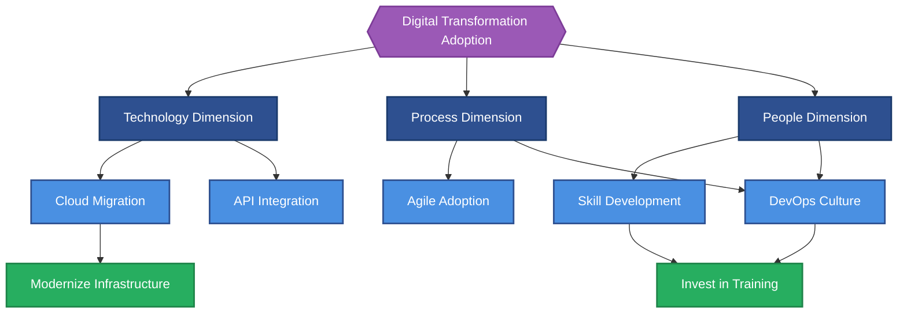
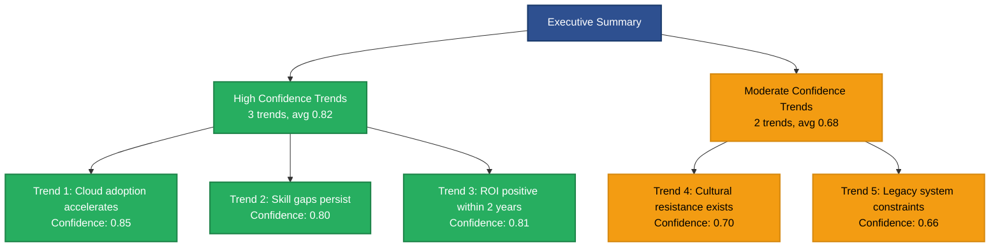
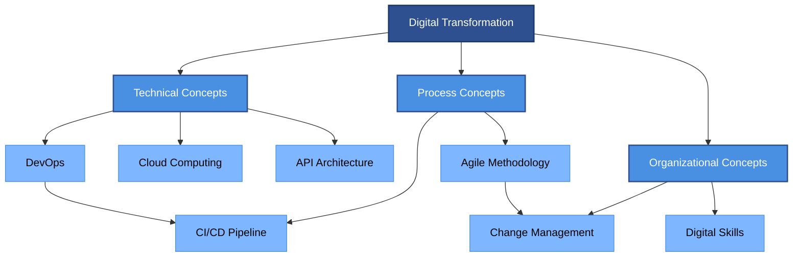

# Executive Summary

## Research Question

{Full research question text}

## Direct Answer

{2-3 paragraph synthesized answer addressing the research question directly. First paragraph answers "what", second paragraph explains "why it matters", third paragraph highlights implications.}

## Key Trends

> [!success] Key Trend 1
> {First major finding with wikilink to supporting claim}
> **Confidence**: {confidence score}

> [!success] Key Trend 2
> {Second major finding with wikilink to supporting claim}
> **Confidence**: {confidence score}

> [!success] Key Trend 3
> {Third major finding with wikilink to supporting claim}
> **Confidence**: {confidence score}

{Optional 4-5 trends if available}

**Source Analysis:**
- [[dimension-analysis-{primary-dimension}]] - {relevance to key trends}
- [[dimension-findings-{supporting-dimension}]] - {relevance to key trends}

## Strategic Recommendations

Based on the research findings, we recommend:

1. **{Recommendation 1 title}**: {Description with rationale}
2. **{Recommendation 2 title}**: {Description with rationale}
3. **{Recommendation 3 title}**: {Description with rationale}

**Source Analysis:**
- [[dimension-analysis-{strategic-dimension}]] - {relevance to recommendations}
- [[dimension-findings-{operational-dimension}]] - {relevance to recommendations}

## Research Scope & Methodology

**Entities Analyzed**: {Total entity count}
- {N} findings from {M} sources
- {P} verified claims with confidence ≥0.60
- {Q} megatrend clusters
- {R} domain concepts

**Source Quality**:
- Tier 1 (Academic): {N} sources
- Tier 2 (Industry): {M} sources
- Tier 3 (Professional): {P} sources
- Tier 4 (Community): {Q} sources

**Average Confidence**: {avg_confidence}

{If avg confidence < 0.65, add warning:}
> [!warning] Confidence Note
> This synthesis includes findings with moderate confidence levels. Further research may be needed for critical decisions.

## Confidence Assessment

| Dimension | Findings | Avg Confidence | Reliability |
|-----------|----------|----------------|-------------|
| {Dimension 1} | {N} | {0.XX} | {High/Moderate} |
| {Dimension 2} | {N} | {0.XX} | {High/Moderate} |
| {Dimension 3} | {N} | {0.XX} | {High/Moderate} |

## Domain Concepts Glossary

Key terminology used throughout this research:

- **[[concept-{name}|{Display Name}]]**: {Brief definition (1 sentence)}
- **[[concept-{name}|{Display Name}]]**: {Brief definition (1 sentence)}
- **[[concept-{name}|{Display Name}]]**: {Brief definition (1 sentence)}
- **[[concept-{name}|{Display Name}]]**: {Brief definition (1 sentence)}
- **[[concept-{name}|{Display Name}]]**: {Brief definition (1 sentence)}

{Continue for 10-15 most common concepts}

> [!info] Full Concept Definitions
> For complete definitions and context, see individual concept entities in `05-domain-concepts/data/`

## Visual Enhancement (Optional)

### When to Use Diagrams

Executive summaries benefit from diagrams when presenting cross-dimensional trends, confidence distributions, or complex domain relationships. Visualizations help decision-makers quickly grasp patterns across multiple findings and assess evidence quality at a glance. Consider adding diagrams when the synthesis includes 3+ key trends with cross-dimensional linkages or when explaining domain concepts to non-specialist audiences.

### Recommended Diagram Types

1. **Pattern Network** - Visualize cross-dimensional trends connecting key findings across multiple dimensions, showing how strategic themes emerge from dimensional analysis
2. **Evidence Hierarchy** - Show confidence distribution across 3-5 key trends, illustrating the strength of evidence supporting strategic recommendations
3. **Concept Map** - Illustrate domain concepts glossary relationships, clarifying terminology and conceptual dependencies for readers unfamiliar with the domain

### Generation Workflow

Use Mermaid code blocks for inline diagrams. Wrap in collapsible details tags for diagrams longer than 20 lines.

### Examples

#### Example 1: Pattern Network for Cross-Dimensional Trends

Click to expand diagram

**What It Shows:** Cross-dimensional pattern linking technology, process, and people dimensions to demonstrate how findings converge to support strategic recommendations

**Data Source:** Extracted from wikilinks connecting key trends (section: Key Trends) to dimensional analyses and strategic recommendations

#### Example 2: Evidence Hierarchy for Confidence Distribution

Click to expand diagram

**What It Shows:** Distribution of key trends by confidence level, helping readers quickly assess which findings are most strongly supported by evidence

**Data Source:** Extracted from Key Trends section confidence scores and grouped by tier (high ≥0.75, moderate 0.60-0.74)

#### Example 3: Concept Map for Domain Glossary

Click to expand diagram

**What It Shows:** Hierarchical relationships among domain concepts from the glossary, illustrating how technical, process, and organizational concepts interconnect within the research domain

**Data Source:** Extracted from Domain Concepts Glossary wikilink structure, grouped by conceptual category

### Integration with Obsidian

- Use collapsible `
` tags for diagrams longer than 20 lines to maintain document readability
- Ensure Mermaid code blocks use proper syntax with triple backticks and `mermaid` language identifier
- Test rendering in Obsidian preview mode before finalizing
- Keep diagrams under complexity limits (≤25 nodes, ≤40 edges) for optimal rendering performance
- Use professional color schemes from mermaid-styling.md (primary blues for concepts, success green for high confidence, caution orange for moderate confidence)

## Next Steps

For deeper exploration:

- 📊 **Full Report**: See [[research-hub]] for complete synthesis
- 📚 **Supporting Evidence**: See [[09-citations/README]] for source catalog and provenance
- 🗺️ **Navigation**: Return to [[README]] for navigation guide

---

*This executive summary synthesizes findings from {N} entities with average confidence {0.XX}. All claims are grounded in verified sources with complete provenance chains.*
