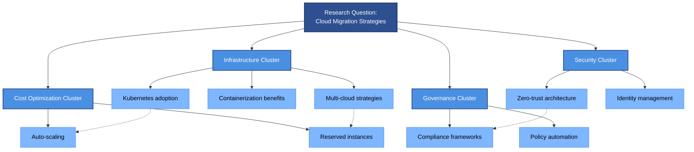
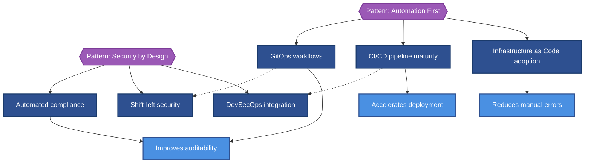
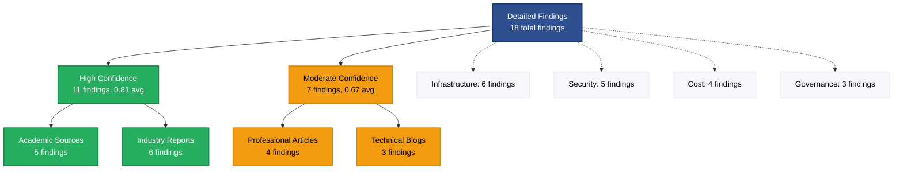

# Detailed Findings

This section presents complete research findings organized by megatrend clusters, with full evidence chains and domain concept integration.

## Overview

**Total Findings**: {N}
**Megatrend Clusters**: {M}
**Average Confidence**: {0.XX}
**Concepts Referenced**: {P}

---

## {Megatrend Cluster 1 Name}

**Relevance Score**: {0.XX}
**Findings**: {N}
**Related Dimension**: [[{dimension-id}|{Dimension Name}]]

{2-3 sentence introduction to this megatrend cluster and its relevance to research question}

### {Finding 1 Title}

**Source**: [[{source-uuid}|{Source title}]]
**Authors**: [[{author-uuid}|{Author name}]], [[{author-uuid}|{Author name}]]
**Confidence**: {0.XX}

{3-4 sentence summary of finding. Include key trends, methodology (if relevant), and connection to research question.}

> [!check] High Confidence Finding
> This finding is supported by [[{source-uuid}|{tier 1 academic source}]] with confidence {0.XX}.

**Key Claims**:
- [[{claim-uuid}|{Claim text truncated}]] (Confidence: {0.XX})
- [[{claim-uuid}|{Claim text truncated}]] (Confidence: {0.XX})

**Domain Concepts**: This finding involves [[{concept-uuid}|{Concept name}]], [[{concept-uuid}|{Concept name}]]

**Evidence Table**:

| Claim | Confidence | Source Type | Reliability |
|-------|-----------|-------------|-------------|
| [[{claim-uuid}|{Truncated claim}]] | {0.XX} | Academic | Tier 1 |
| [[{claim-uuid}|{Truncated claim}]] | {0.XX} | Industry | Tier 2 |

**Related Megatrends**: [[{megatrend-uuid}|{Megatrend name}]], [[{megatrend-uuid}|{Megatrend name}]]

---

### {Finding 2 Title}

**Source**: [[{source-uuid}|{Source title}]]
**Authors**: [[{author-uuid}|{Author name}]]
**Confidence**: {0.XX}

{3-4 sentence summary}

{If confidence 0.60-0.70:}
> [!warning] Moderate Confidence
> This finding has moderate confidence ({0.XX}). Consider additional verification for critical applications.

**Key Claims**:
- [[{claim-uuid}|{Claim text}]] (Confidence: {0.XX})
- [[{claim-uuid}|{Claim text}]] (Confidence: {0.XX})

**Domain Concepts**: [[{concept-uuid}|{Concept name}]]

**Evidence**: See [[synthesis-evidence#{finding-anchor}]] for complete provenance

---

{Continue for all findings in megatrend cluster}

---

## {Megatrend Cluster 2 Name}

**Relevance Score**: {0.XX}
**Findings**: {N}
**Related Dimension**: [[{dimension-id}|{Dimension Name}]]

{2-3 sentence introduction}

### {Finding 1 Title}

{Same structure as above}

---

{Continue for all megatrend clusters}

---

## TIPS Format (Strategic Trend Analysis)

**When to Use:** This format activates when ANY of these conditions are met:

1. `research_type: "smarter-service"` - Always uses TIPS for strategic analysis
2. `organizing_concept` contains: "Trends", "Innovationen", "Entwicklungen", "Tendencies", "Innovations"

It provides deeper strategic analysis with expanded word counts (550-625 words per theme vs standard 350-500).

### TIPS Section Template

```markdown
## {Name} - {Trend Title}

**Relevance Score**: {0.XX}
**Findings**: {N}
**Related Dimension**: [[{dimension-id}|{Dimension Name}]]

### Trend (50-75 words)

{Observation-level description of the trend. Derived from megatrend entities and associated findings. Focus on what is happening, not interpretation.}

> [!info] Evidence Base
> This trend is supported by {N} findings with average confidence {0.XX}.

**Key Evidence**:
- [[{finding-uuid}|{Finding title}]] (Confidence: {0.XX})
- [[{finding-uuid}|{Finding title}]] (Confidence: {0.XX})

### Implications (150-200 words)

{Analysis of what this trend means and who is affected. Ground all assertions in claim confidence scores. Use confidence stratification (High ≥0.80, Moderate 0.65-0.79, Emerging <0.65).}

**Affected Stakeholders**:
| Stakeholder | Impact | Confidence |
|-------------|--------|------------|
| {Group 1} | {Impact description} | {0.XX} |
| {Group 2} | {Impact description} | {0.XX} |

**Supporting Claims**:
- [[{claim-uuid}|{Claim text}]] (Confidence: {0.XX})
- [[{claim-uuid}|{Claim text}]] (Confidence: {0.XX})
- [[{claim-uuid}|{Claim text}]] (Confidence: {0.XX})

### Possibilities (150-200 words)

{Exploration of future scenarios and opportunities. Base ONLY on cross-dimensional patterns present in loaded data. No speculation beyond evidence.}

**Scenario Analysis**:

> [!success] Opportunity Scenario
> {Description of positive trajectory supported by evidence}
> **Evidence**: [[{finding-uuid}|{Finding}]], [[{finding-uuid}|{Finding}]]

> [!warning] Risk Scenario
> {Description of risk trajectory supported by evidence}
> **Evidence**: [[{finding-uuid}|{Finding}]], [[{finding-uuid}|{Finding}]]

**Cross-Dimensional Connections**: [[{dimension-id}|{Name}]], [[{dimension-id}|{Name}]]

### Solutions (150-200 words)

{Actionable recommendations grounded in high-confidence findings (≥0.75). Include specific implementation guidance from domain-concepts.}

**Recommended Actions**:

| Priority | Action | Evidence | Confidence |
|----------|--------|----------|------------|
| Immediate | {Action 1} | [[{finding-uuid}|{Finding}]] | {0.XX} |
| Short-term | {Action 2} | [[{finding-uuid}|{Finding}]] | {0.XX} |
| Medium-term | {Action 3} | [[{finding-uuid}|{Finding}]] | {0.XX} |

**Domain Concepts Applied**: [[{concept-uuid}|{Concept name}]], [[{concept-uuid}|{Concept name}]]

**Success Metrics**:
- {Metric 1 with target}
- {Metric 2 with target}
- {Metric 3 with target}
```

### TIPS Word Count Summary

| Section | Target | Min Citations |
|---------|--------|---------------|
| Name | 3-10 words | N/A |
| Trend | 50-75 words | 2 |
| Implications | 150-200 words | 3 |
| Possibilities | 150-200 words | 3 |
| Solutions | 150-200 words | 3 |
| **Total** | **550-625 words** | **11** |

### TIPS vs Standard Format Comparison

| Aspect | Standard Thematic | TIPS Format |
|--------|-------------------|-------------|
| Trigger | Default | smarter-service OR trend concepts |
| Word count | 350-500 | 550-625 |
| Structure | Context → Evidence → Implications | Trend → Implications → Possibilities → Solutions |
| Focus | Evidence synthesis | Strategic analysis |
| Future projection | Limited | Dedicated section |
| Recommendations | Inline | Dedicated section |

---

## Megatrend Cluster Analysis

### Cluster Comparison

| Megatrend Cluster | Findings | Avg Confidence | Primary Dimension | Concepts |
|---------------|----------|----------------|-------------------|----------|
| [[{megatrend-uuid}|{Cluster 1}]] | {N} | {0.XX} | [[{dim-id}|{Name}]] | {N} |
| [[{megatrend-uuid}|{Cluster 2}]] | {N} | {0.XX} | [[{dim-id}|{Name}]] | {N} |
| [[{megatrend-uuid}|{Cluster 3}]] | {N} | {0.XX} | [[{dim-id}|{Name}]] | {N} |

### Most Referenced Concepts

| Concept | References | Definition |
|---------|-----------|------------|
| [[{concept-uuid}|{Name}]] | {N} findings | {Brief definition} |
| [[{concept-uuid}|{Name}]] | {N} findings | {Brief definition} |
| [[{concept-uuid}|{Name}]] | {N} findings | {Brief definition} |

### Source Quality Distribution

| Megatrend Cluster | Academic | Industry | Professional | Community |
|---------------|----------|----------|--------------|-----------|
| {Cluster 1} | {N}% | {N}% | {N}% | {N}% |
| {Cluster 2} | {N}% | {N}% | {N}% | {N}% |
| {Cluster 3} | {N}% | {N}% | {N}% | {N}% |

---

## Key Patterns Across Findings

### Pattern 1: {Pattern Name}

{2-3 sentence description of pattern observed across multiple findings}

**Affected Findings**:
- [[{finding-uuid}|{Finding title}]]
- [[{finding-uuid}|{Finding title}]]
- [[{finding-uuid}|{Finding title}]]

**Implications**: {1-2 sentence explanation of what this pattern means for research question}

### Pattern 2: {Pattern Name}

{Similar structure}

---

## Contradictions & Tensions

{If contradictions exist:}

### Contradiction: {Brief Description}

**Finding A**: [[{finding-uuid}|{Title}]] suggests {summary}
**Finding B**: [[{finding-uuid}|{Title}]] suggests {contradictory summary}

**Resolution**: {1-2 sentence explanation - e.g., different contexts, methodologies, or temporal factors}

---

## Research Gaps Identified

Based on analysis of findings:

1. **Gap 1**: {Description of what's missing or underexplored}
   - **Affected Dimension**: [[{dimension-id}|{Name}]]
   - **Recommendation**: {Suggestion for future research}

2. **Gap 2**: {Description}
   - **Affected Dimension**: [[{dimension-id}|{Name}]]
   - **Recommendation**: {Suggestion}

---

## Visual Enhancement (Optional)

### When to Use Diagrams

Detailed findings benefit from diagrams when illustrating megatrend cluster relationships, finding interdependencies, or source quality distributions. Diagrams are particularly valuable when presenting 5+ megatrend clusters with complex interconnections, or when demonstrating how findings within and across clusters relate to each other. Consider adding diagrams when readers need to understand conceptual relationships, identify patterns across findings, or assess evidence quality distributions.

### Recommended Diagram Types

1. **Concept Map** - Megatrend cluster relationships and connections, showing how clusters relate thematically and how individual findings connect across cluster boundaries
2. **Pattern Network** - Finding interdependencies and patterns, illustrating how specific findings support or contradict each other and revealing emergent patterns
3. **Evidence Hierarchy** - Source quality distribution across findings, demonstrating confidence levels and source tier distribution to assess overall research strength

### Generation Workflow

Use Mermaid code blocks for inline diagrams. Wrap in collapsible details tags for diagrams longer than 20 lines.

### Examples

#### Example 1: Concept Map for Megatrend Cluster Relationships

<details>
<summary>Click to expand diagram</summary>



</details>

**What It Shows:** Hierarchical structure of megatrend clusters with constituent findings, plus dotted lines showing cross-cluster connections (e.g., Kubernetes adoption enables auto-scaling)

**Data Source:** Extracted from Megatrend Cluster Analysis section, mapping clusters to findings and identifying cross-references mentioned in synthesis paragraphs

#### Example 2: Pattern Network for Finding Interdependencies

<details>
<summary>Click to expand diagram</summary>



</details>

**What It Shows:** Two emergent patterns (Automation First, Security by Design) with supporting findings and their downstream benefits, demonstrating pattern interdependencies

**Data Source:** Extracted from Key Patterns Across Findings section, mapping patterns to findings and identifying supporting evidence from synthesis text

#### Example 3: Evidence Hierarchy for Source Quality Distribution

<details>
<summary>Click to expand diagram</summary>



</details>

**What It Shows:** Distribution of findings by confidence tier and source type, with dotted lines showing megatrend cluster distribution for context

**Data Source:** Extracted from Source Quality Distribution table, aggregating findings by confidence tier and source type from individual finding metadata

### Integration with Obsidian

- Use collapsible `<details>` tags for diagrams longer than 20 lines to maintain document readability
- Ensure Mermaid code blocks use proper syntax with triple backticks and `mermaid` language identifier
- Test rendering in Obsidian preview mode before finalizing
- Keep diagrams under complexity limits (≤25 nodes, ≤40 edges) for optimal rendering performance
- Use dotted lines (`-.->`) to show cross-cluster relationships or supporting evidence connections distinct from hierarchical structure
- Apply color coding by confidence level (success green for high confidence ≥0.75, caution orange for moderate 0.60-0.74)
- Consider creating separate diagrams for each megatrend cluster if total findings exceed 20 nodes

## Navigation

- ⬆️ **Research Report**: [[research-hub]] for complete synthesis
- ⬇️ **Evidence**: [[09-citations/README]] for source catalog and provenance
- 🗺️ **Navigation**: [[README]] for synthesis guide

---

*This detailed findings section presents {N} findings across {M} megatrend clusters with average confidence {0.XX}. For complete evidence chains, see [[09-citations/README]].*
