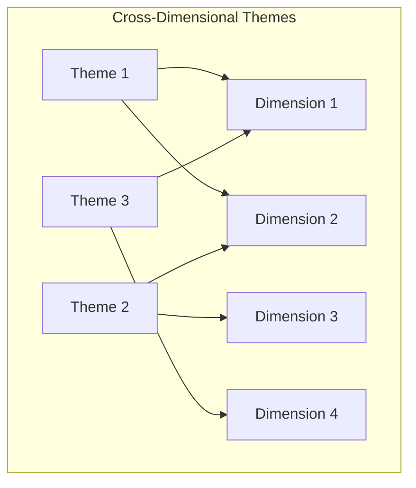

# Research Synthesis Report: {project-name}

## 1. Management Summary

### Kernbotschaft

[Provide 2-3 paragraphs with key strategic message answering the research question directly. Include citations[N](path) to support claims.]

### Strategic Imperatives

1. **[Imperative 1]** - [Describe strategic imperative with citation[N](path)]
2. **[Imperative 2]** - [Describe strategic imperative with citation[N](path)]
3. **[Imperative 3]** - [Describe strategic imperative with citation[N](path)]

### Action Priorities

| Priority | Timeframe | Key Action |
|----------|-----------|------------|
| Act Now | 0-6 months | [Specify immediate action] |
| Plan | 6-18 months | [Specify medium-term action] |
| Observe | 18+ months | [Specify long-term monitoring item] |

## 1.5 Research Methodology

### Research Framework

This synthesis is based on a systematic research approach using {N} MECE-validated dimensions and {M} refined research questions. The framework ensures comprehensive coverage of the problem space while maintaining analytical rigor.

### Dimension Structure

| Dimension | Focus Area | Questions | Rationale |
|-----------|------------|-----------|-----------|
| {Dimension 1} | {Coverage scope} | {N} | {Brief rationale} |
| {Dimension 2} | {Coverage scope} | {N} | {Brief rationale} |
| {Dimension 3} | {Coverage scope} | {N} | {Brief rationale} |
| {Dimension 4} | {Coverage scope} | {N} | {Brief rationale} |
| {Dimension 5} | {Coverage scope} | {N} | {Brief rationale} |

### MECE Validation

The research dimensions were validated for:

- **Mutual Exclusivity:** Each dimension addresses distinct aspects without overlap
- **Collective Exhaustiveness:** Together, dimensions cover all relevant aspects of the research question

### Key Research Questions

For each dimension, specific research questions were formulated using PICOT methodology:

#### {Dimension 1} Questions

1. **{Question title}** - {Brief question text}
2. **{Question title}** - {Brief question text}

#### {Dimension 2} Questions

1. **{Question title}** - {Brief question text}
2. **{Question title}** - {Brief question text}

[Continue for remaining dimensions...]

## 2. Dimensions Overview

### Research Architecture

| Dimension | Focus | Findings | Key Theme |
|-----------|-------|----------|-----------|
| [Dimension 1] | [Focus area] | {N} | [Primary theme] |
| [Dimension 2] | [Focus area] | {N} | [Primary theme] |
| [Dimension 3] | [Focus area] | {N} | [Primary theme] |
| [Dimension 4] | [Focus area] | {N} | [Primary theme] |
| [Dimension 5] | [Focus area] | {N} | [Primary theme] |

### Dimension Summaries

#### 2.1 {Dimension 1}

**Haupterkenntnis:** [Articulate core trend with citation[N](path)]

| Key Metric | Value | Confidence |
|------------|-------|------------|
| [Metric name] | [Value] | [High/Medium/Low] |
| [Metric name] | [Value] | [High/Medium/Low] |

**[[dimension-findings-{dim-slug}|Full Analysis]]**

#### 2.2 {Dimension 2}

**Haupterkenntnis:** [Articulate core trend with citation[N](path)]

| Key Metric | Value | Confidence |
|------------|-------|------------|
| [Metric name] | [Value] | [High/Medium/Low] |
| [Metric name] | [Value] | [High/Medium/Low] |

**[[dimension-findings-{dim-slug}|Full Analysis]]**

#### 2.3 {Dimension 3}

**Haupterkenntnis:** [Articulate core trend with citation[N](path)]

| Key Metric | Value | Confidence |
|------------|-------|------------|
| [Metric name] | [Value] | [High/Medium/Low] |
| [Metric name] | [Value] | [High/Medium/Low] |

**[[dimension-findings-{dim-slug}|Full Analysis]]**

#### 2.4 {Dimension 4}

**Haupterkenntnis:** [Articulate core trend with citation[N](path)]

| Key Metric | Value | Confidence |
|------------|-------|------------|
| [Metric name] | [Value] | [High/Medium/Low] |
| [Metric name] | [Value] | [High/Medium/Low] |

**[[dimension-findings-{dim-slug}|Full Analysis]]**

#### 2.5 {Dimension 5}

**Haupterkenntnis:** [Articulate core trend with citation[N](path)]

| Key Metric | Value | Confidence |
|------------|-------|------------|
| [Metric name] | [Value] | [High/Medium/Low] |
| [Metric name] | [Value] | [High/Medium/Low] |

**[[dimension-findings-{dim-slug}|Full Analysis]]**

## 3. Cross-Dimensional Patterns

### Convergence Points

### Thematic Connections

[Describe themes appearing across 3+ dimensions with citations[N](path). Explain convergence patterns and their strategic significance.]

### Abdeckungsanalyse

| Megatrend | Dimensions | Depth |
|-----------|------------|-------|
| [Megatrend 1] | {N}/{N} | Deep/Medium/Thin |
| [Megatrend 2] | {N}/{N} | Deep/Medium/Thin |
| [Megatrend 3] | {N}/{N} | Deep/Medium/Thin |

## 4. Strategic Recommendations

### Act (0-6 months)

[Specify immediate actions with citations[N](path). Focus on high-confidence, high-impact initiatives requiring urgent attention.]

### Plan (6-18 months)

[Specify medium-term initiatives with citations[N](path). Include projects requiring preparation and resource allocation.]

### Observe (18+ months)

[Specify long-term monitoring items with citations[N](path). Include emerging trends requiring continued observation before action.]

## 5. Navigation

### Detailed Dimension Analyses

- [[dimension-findings-{dim-1-slug}|{Dimension 1} - Full Analysis]]
- [[dimension-findings-{dim-2-slug}|{Dimension 2} - Full Analysis]]
- [[dimension-findings-{dim-3-slug}|{Dimension 3} - Full Analysis]]
- [[dimension-findings-{dim-4-slug}|{Dimension 4} - Full Analysis]]
- [[dimension-findings-{dim-5-slug}|{Dimension 5} - Full Analysis]]

## Appendix: Research Metrics

### Evidence Quality

| Metric | Value |
|--------|-------|
| Dimensions analyzed | {N} |
| Total findings | {N} |
| High-confidence claims | {N} ({X}%) |
| Medium-confidence claims | {N} ({X}%) |
| Low-confidence claims | {N} ({X}%) |
| Sources | {N} |

### Source Distribution

| Tier | Count | Percentage |
|------|-------|------------|
| Tier 1 (Academic) | {N} | {X}% |
| Tier 2 (Industry) | {N} | {X}% |
| Tier 3 (Web) | {N} | {X}% |

## References

1. [Citation 1 - format: Author (Year). Title. Source. URL]
2. [Citation 2 - format: Author (Year). Title. Source. URL]
3. [Citation 3 - format: Author (Year). Title. Source. URL]
