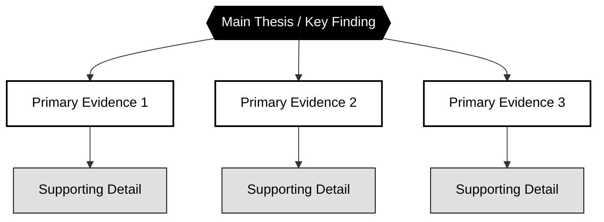
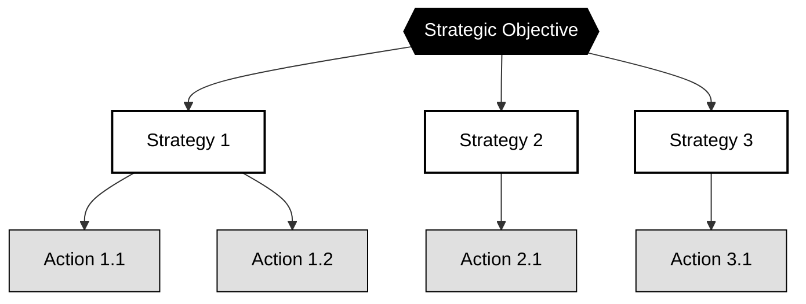
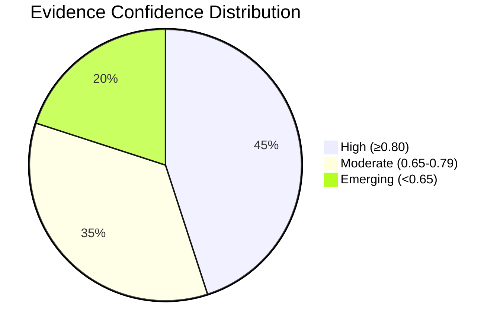
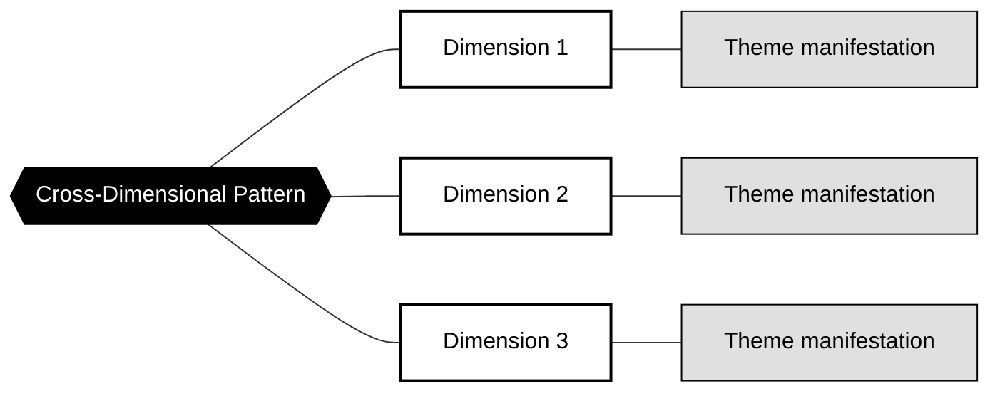

# Visual Elements for Synthesis Documents

Required visual elements to enhance comprehensiveness of research deliverables.

## Overview

Visual elements transform dense research into scannable, executive-friendly deliverables. Each synthesis document type has specific visual requirements.

## Mermaid Diagrams

Synthesis documents use inline Mermaid diagrams for visual elements. These are rendered by Obsidian's built-in Mermaid support.

**Guidelines:**
- Maximum 20 nodes per diagram for readability
- Use black/white/gray color scheme for print compatibility
- Embed directly in markdown (no external file dependencies)

## Required Visuals by Document Type

| Document | Required Elements | Purpose |
|----------|-------------------|---------|
| research-hub.md | Key metrics tables, Mermaid diagrams, confidence callouts | Comprehensive synthesis with visual support |
| 09-citations/README.md | Source tier distribution, institutional authority mapping | Evidence quality visualization |

---

## Template 1: Key Metrics Table

Use in executive summaries and dimension syntheses to highlight quantitative findings.

```markdown
| Key Metric | Value | Evidence | Confidence |
|------------|-------|----------|------------|
| [Metric name] | [Specific value] | <sup>[N](path)</sup> | High/Moderate |
| [Metric name] | [Specific value] | <sup>[N](path)</sup> | High/Moderate |
| [Metric name] | [Specific value] | <sup>[N](path)</sup> | High/Moderate |
```

**Example:**

| Key Metric | Value | Evidence | Confidence |
|------------|-------|----------|------------|
| Skills gap prevalence | 78% of SMEs | <sup>[1](../04-findings/data/finding-skills-gap.md)</sup> | High |
| Training adoption | 70% internal programs | <sup>[2](../10-claims/data/claim-training-adoption.md)</sup> | High |
| ROI timeline | 18-24 months | <sup>[3](../04-findings/data/finding-roi-timeline.md)</sup> | Moderate |

---

## Template 2: Evidence Hierarchy Diagram

Use to visualize how evidence supports key claims. Black/white design for print compatibility.

```markdown


**Usage notes:**

- Maximum 15 nodes for readability
- Use `{{double braces}}` for hexagon (main thesis)
- Primary evidence in white with black border
- Supporting details in gray

---

## Template 3: Cross-Dimensional Comparison Matrix

Use in research-hub.md to enable dimension comparison at a glance.

```markdown
| Dimension | Findings | High-Conf Claims | Coverage | Key Theme |
|-----------|----------|------------------|----------|-----------|
| [Dimension 1] | N | N (X%) | Complete | [Theme] |
| [Dimension 2] | N | N (X%) | Partial | [Theme] |
| [Dimension 3] | N | N (X%) | Complete | [Theme] |
| [Dimension 4] | N | N (X%) | Gaps | [Theme] |
```

**Column definitions:**

- **Findings**: Count of findings processed for this dimension
- **High-Conf Claims**: Claims with confidence ≥0.80 and percentage of total
- **Coverage**: MECE assessment (Complete/Partial/Gaps)
- **Key Theme**: Primary trend from dimension

---

## Template 4: Confidence-Stratified Callouts

Use Obsidian callout syntax to visually distinguish evidence quality.

### High Confidence (≥0.80)

```markdown
> [!success] [Finding Title]
> [Claim text with specific data points]<sup>[N](path)</sup>
> **Confidence:** 0.XX | **Sources:** N independent | **Cross-dimensional:** Yes/No
```

### Moderate Confidence (0.65-0.79)

```markdown
> [!info] [Finding Title]
> [Claim with appropriate hedging language]<sup>[N](path)</sup>
> **Confidence:** 0.XX | **Caveat:** [Known limitation]
```

### Emerging/Low Confidence (<0.65)

```markdown
> [!warning] Tentative: [Finding Title]
> [Preliminary evidence requiring validation]<sup>[N](path)</sup>
> **Confidence:** 0.XX | **Recommendation:** Validate before action
```

---

## Template 5: Strategic Framework Diagram

Use in research-hub.md to show strategic positioning or decision framework.

```markdown


---

## Template 6: Quality Metrics Summary

Use at end of research-hub.md to provide transparency on research quality.

```markdown
## Synthesis Quality Metrics

| Metric | Value | Assessment |
|--------|-------|------------|
| Dimensions analyzed | N | - |
| Cross-dimensional themes | N | - |
| Total findings processed | N | - |
| High-confidence claims (≥0.80) | N (X%) | Strong/Moderate/Limited |
| Total citations | N | - |
| Source diversity | N sources across X tiers | Good/Limited |
| Entity utilization | X% | ≥80% required |

### Confidence Distribution



### Coverage Gaps Identified

1. **[Gap area 1]**: [N] findings - recommend additional research
2. **[Gap area 2]**: Single source - requires validation
```

---

## Template 7: Cross-Dimensional Pattern Network

Use in research-hub.md to show how themes connect across dimensions.

```markdown


---

## Color Scheme (Print-Ready)

All Mermaid diagrams use black/white/gray for print compatibility:

| Element | Fill | Stroke | Text |
|---------|------|--------|------|
| Emphasis (main thesis) | #000000 (black) | #000000 | white |
| Primary (key evidence) | #FFFFFF (white) | #000000 (2px) | black |
| Secondary (supporting) | #E0E0E0 (light gray) | #000000 (1px) | black |

---

## Validation Checklist

Before finalizing synthesis documents, verify:

- [ ] Key metrics table present in executive summary
- [ ] Evidence hierarchy diagram for major claims
- [ ] Comparison matrix in research-hub.md
- [ ] Confidence callouts use correct Obsidian syntax
- [ ] All Mermaid diagrams under 20 nodes for readability
- [ ] Print-ready color scheme applied to all Mermaid diagrams
- [ ] Mermaid syntax valid (test in preview)
