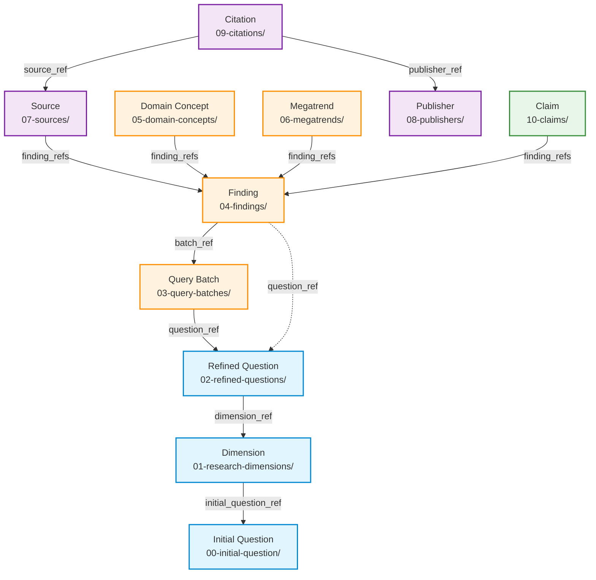

# Entity Linking Architecture

**Version:** 3.3
**Date:** 2025-12-08
**Pattern:** Upstream-Only Linking
**Status:** Authoritative

---

## Purpose

This document is the **authoritative reference** for entity relationships in the deeper-research plugin. When field names, linking patterns, or relationship rules conflict between documents, this document takes precedence.

**Use this document for:**
- Understanding how entities connect to each other
- Determining which fields link upstream vs downstream
- Validating entity relationship compliance
- Resolving relationship questions

**See also:**
- [README.md](README.md) - Schema overview and validation standards
- [INTEGRATION.md](INTEGRATION.md) - Practical code integration patterns

---

## Overview

This document defines the entity linking architecture for the deeper-research plugin. All entities follow the **upstream-only pattern**: entities link ONLY to their immediate parent entities using forward wikilinks. No skip-level or lateral links are permitted.

---

## Entity Hierarchy



**Legend:**
- **Solid arrows (→):** Required forward links
- **Dashed arrows (-.->):** Optional/redundant link (Path A findings include question_ref for safety; Path B findings use question_ref exclusively)
- **Blue:** Planning entities (Phases 1-2)
- **Orange:** Research entities (Phases 3-4)
- **Purple:** Source entities (Phases 5-6)
- **Green:** Synthesis entities (Phase 7)

---

## Entity Relationships

### Primary Research Chain

```
Initial Question → Dimensions → Refined Questions → Query Batches → Findings
```

### Secondary Entity Links

```
Findings ← Sources (finding_refs array)
Findings ← Domain Concepts (finding_refs array)
Findings ← Megatrends (finding_refs array)
Findings ← Claims (finding_refs array)
```

### Citation Chain

```
Sources ← Citations (source_ref)
Publishers ← Citations (publisher_ref)
```

---

## Forward Links by Entity

| Entity | Links To | Field Name | Type | Description |
|--------|----------|------------|------|-------------|
| **Dimension** | Initial Question | `initial_question_ref` | Wikilink | Parent question |
| **Refined Question** | Dimension | `dimension_ref` | Wikilink | Parent dimension |
| **Query Batch** | Refined Question | `question_ref` | Wikilink | Parent question |
| **Finding** (Path A) | Query Batch | `batch_ref` | Wikilink | Required via findings-creator |
| **Finding** (Path A) | Refined Question | `question_ref` | Wikilink | Redundant safety link (optional) |
| **Finding** (Path B) | Refined Question | `question_ref` | Wikilink | Via findings-creator-llm (no batch) |
| **Source** | Findings | `finding_refs` | Array | Findings that reference this source |
| **Domain Concept** | Findings | `finding_refs` | Array | Findings that contain this concept |
| **Megatrend** | Findings | `finding_refs` | Array | Findings in this megatrend cluster |
| **Citation** | Source | `source_ref` | Wikilink | Source being cited |
| **Citation** | Publisher | `publisher_ref` | Wikilink | Publisher of source |
| **Claim** | Findings | `finding_refs` | Array | Supporting findings |

---

## Key Principles

### 1. Upstream-Only Pattern

Entities link ONLY to their immediate upstream (parent) entities:

✅ **Allowed:**
- Finding → Query Batch (immediate parent)
- Query Batch → Refined Question (immediate parent)
- Refined Question → Dimension (immediate parent)

❌ **Prohibited:**
- Finding → Dimension (skip-level link)
- Finding → Refined Question (skip-level link when using Path A)
- Claim → Sources (skip-level link)

### 2. Two-Path Finding Creation

Findings can be created via two paths:

**Path A (findings-creator):** Finding → batch_ref → Query Batch → question_ref → Refined Question → dimension_ref → Dimension

**Path B (findings-creator-llm):** Finding → question_ref → Refined Question → dimension_ref → Dimension

Both paths maintain the upstream-only pattern but Path B skips the query batch layer.

### 3. Array vs Single Links

- **Single Wikilink:** Used for required 1:1 upstream relationships (e.g., `dimension_ref`)
- **Array of Wikilinks:** Used for 1:N relationships (e.g., `finding_refs` in sources)

### 4. Linking Constraints

The `finding-entity.schema.json` enforces these constraints:

**Path A (findings-creator):**
- `batch_ref` is REQUIRED
- `question_ref` is OPTIONAL (redundant safety link to maintain question connection if batch has issues)

**Path B (findings-creator-llm):**
- `question_ref` is REQUIRED
- `batch_ref` is PROHIBITED (no query batch exists for LLM-generated findings)

**Rationale for redundant linking in Path A:** If the batch entity is not created properly (empty file, missing wikilink, validation failure), findings would become orphaned with no way to trace back to their refined question. The `question_ref` provides a direct backup link.

---

## Schema Validation

All entity relationships are validated by JSON schemas in this directory:

- `finding-entity.schema.json` - Validates `batch_ref` (with optional `question_ref`) OR `question_ref` alone (Path B)
- `source-entity.schema.json` - Requires `finding_refs` array and `publisher_id` (wikilink)
- `claim-entity.schema.json` - Requires `finding_refs` array
- `citation-entity.schema.json` - Requires both `source_ref` AND `publisher_ref`
- `dimension-entity.schema.json` - Requires `initial_question_ref`
- `refined-question-entity.schema.json` - Requires `dimension_ref`
- `query-batch-entity.schema.json` - Requires `question_ref`
- `megatrend-entity.schema.json` - Uses `finding_refs` array
- `publisher-entity.schema.json` - No upstream links (terminal entity)

### Field Naming Note

**Inconsistency**: The `source-entity.schema.json` uses `publisher_id` (with wikilink pattern) instead of `publisher_ref` for historical reasons. This is the one exception to the `_id` vs `_ref` convention:
- `publisher_id` in source entities → wikilink (should be `publisher_ref`)
- `publisher_ref` in citation entities → wikilink (correct naming)

This naming will be addressed in a future schema version update.

---

## Navigation Patterns

### Upstream Navigation (Forward Links)

To trace an entity back to the root question, follow forward links:

```
Claim → finding_refs → Finding → batch_ref → Query Batch → question_ref → Refined Question → dimension_ref → Dimension → initial_question_ref → Initial Question
```

This path works for ANY entity in the system since all entities eventually link upstream to the Initial Question.

### Downstream Navigation (Backlinks)

To find all children of an entity, backlinks are needed (currently most are missing):

```
Initial Question → (missing: dimension_ids backlink) → Dimensions
Dimension → refined_question_ids (✅ exists) → Refined Questions
Refined Question → query_batch_refs (✅ exists) → Query Batches
Query Batch → (missing: finding_ids backlink) → Findings
```

**Note:** Backlinks are optional navigation aids. The upstream-only pattern ensures complete provenance via forward links.

---

## Changes from Previous Architecture

### Removed Links

❌ **Skip-Level Links Removed:**
- Finding → Dimension (`dimension_id`)
- Finding → Refined Question (`refined_question_id` when using Path A)
- Claim → Dimension (`dimension_id`)
- Claim → Refined Questions (`refined_question_ids`)
- Claim → Megatrends (`megatrend_ids`)
- Claim → Sources (`source_ids`)
- Claim → Citations (`citation_refs`)
- Megatrend → Dimension (`dimension_id`)
- Domain Concept → Dimension (`dimension_id`)

❌ **Lateral Links Reversed:**
- Finding → Source became Source → Finding (`finding_refs`)

### Added Links

✅ **New Required Links:**
- Citation → Publisher (`publisher_ref` - both sources AND publishers are immediate upstreams)

✅ **Alternative Paths:**
- Finding → Refined Question (`question_ref` for findings-creator-llm path)

---

## Cross-Project Links (Optional)

Trends can optionally link to entities in external research projects, specifically to portfolio entities from `b2b-ict-portfolio` projects.

### Portfolio Link Configuration (Source)

The cross-project portfolio link is configured at project initialization and stored in the initial question entity:

| Entity | Field Name | Type | Description |
|--------|------------|------|-------------|
| **Initial Question** | `linked_portfolio` | Wikilink | Optional link to b2b-ict-portfolio project (smarter-service only) |
| **Initial Question** | `linked_b2b_research` | Wikilink | Optional link to B2B research project for context (smarter-service only) |

**Configuration Flow:**

1. **Phase 1 (deeper-research-1):** User asked about portfolio linking in Step 3.5
2. **Storage:** `linked_portfolio: "[[project-name]]"` written to question entity frontmatter
3. **Phase 2 (dimension-planner):** Extracted to set `PORTFOLIO_LINKING_ENABLED` flag
4. **Phase 8 (deeper-synthesis):** Extracted and resolved to absolute path, passed to trends-creator agents

**Wikilink Format (Configuration):**

- Pattern: `[[{project-slug}]]`
- Example: `[[telekom-portfolio-2024]]`

### Trend → Portfolio Relationship (Output)

| Entity | Links To | Field Name | Type | Description |
|--------|----------|------------|------|-------------|
| **Trend** | Portfolio (external) | `portfolio_refs` | Array | Wikilinks to b2b-ict-portfolio project entities |

**Cross-Project Wikilink Format (References):**

- Pattern: `[[{project-slug}/11-trends/{portfolio-id}]]`
- Example: `[[telekom-portfolio-2024/11-trends/portfolio-managed-cloud-a1b2c3d4]]`

**Usage:**

- Cross-project links are **optional** and only populated when `portfolio_project_path` is provided to deeper-synthesis
- The `portfolio_project_path` is derived from `linked_portfolio` in the initial question entity
- Trends reference portfolios that can implement their recommended solutions
- Portfolio entities remain in their source project (no duplication)
- Business value statements extracted from claims accompany portfolio links

**Validation:**

- Cross-project wikilinks are NOT validated at entity creation time (external project may not be accessible)
- Validation occurs at report generation when portfolio project is explicitly loaded
- Missing portfolio references result in empty `portfolio_refs: []` array (graceful degradation)

---

## Version History

- **v3.3 (2025-12-08):** Documented portfolio link configuration source (Initial Question → `linked_portfolio`, `linked_b2b_research`)
- **v3.2 (2025-12-07):** Added cross-project portfolio links (Trend → Portfolio via `portfolio_refs`)
- **v3.1 (2025-11-26):** Implemented upstream-only pattern, removed skip-level links, added mutual exclusivity for finding paths
- **v3.0 (2025-11-15):** Previous architecture with mixed linking patterns (deprecated)

---

## Related Documentation

- [README.md](README.md) - Schema overview and entity types
- [INTEGRATION.md](INTEGRATION.md) - Schema integration guidelines for scripts and agents
- [MIGRATION-NOTES.md](MIGRATION-NOTES.md) - Migration status and rollout plan
- `../skills/*/SKILL.md` - Skill documentation referencing entity relationships
- `../skills/*/references/` - Workflow implementations using these schemas
