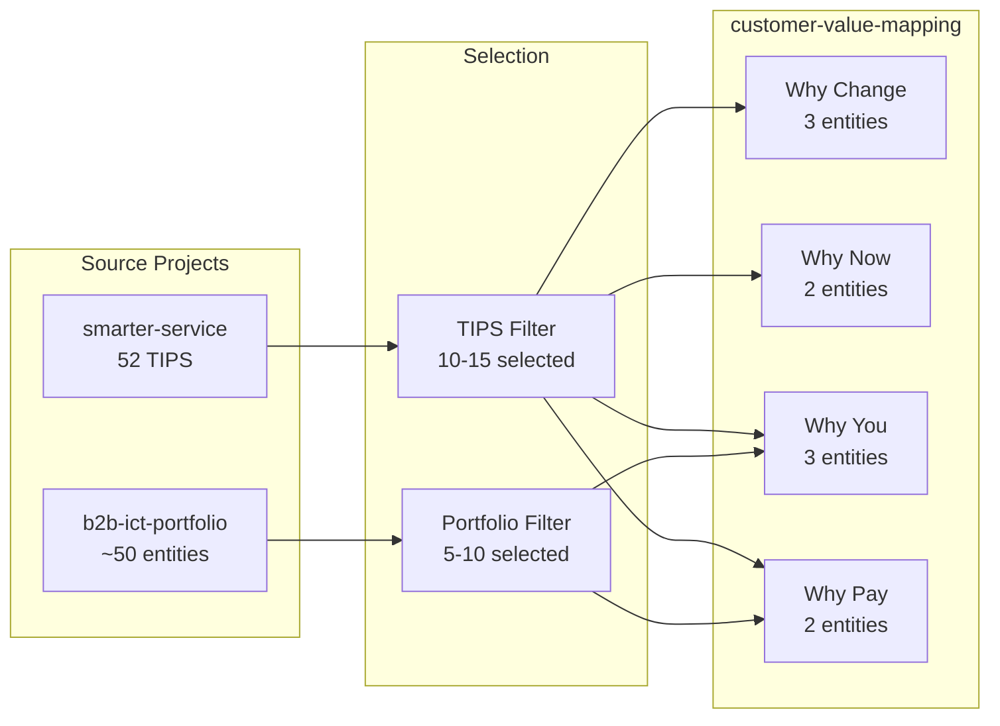

# Phase 2: Analysis (customer-value-mapping)

<!-- COMPILATION METADATA -->
<!-- Source WHAT: research-types/customer-value-mapping.md v1.0 -->
<!-- Compiled Date: 2025-12-07 -->
<!-- Compiled By: Sprint 440 - Customer Value Mapping Implementation -->
<!-- Propagation: When source WHAT files change, regenerate this file using PROPAGATION-PROTOCOL.md -->

**Research Type:** `customer-value-mapping` | **Framework:** Corporate Visions Value Story

**Reference Checksum:** `sha256:2a-cvm-v1-valuestory`

**Verification Protocol:** After reading, confirm complete load:

```text
Reference Loaded: phase-2-analysis-customer-value-mapping.md | Checksum: 2a-cvm-v1-valuestory
```

---

## Objective

Apply the embedded customer-value-mapping framework (4 fixed Value Story dimensions) to:

1. Map each dimension to its Value Story stage and primary TIPS components
2. Discover source projects (smarter-service + b2b-ict-portfolio)
3. Extract customer context through web research
4. Define minimum entity requirements per dimension
5. Prepare cross-project loading for Phase 3

**Expected Duration:** 90-120 seconds of actual work.

---

## Value Story Framework Quick Reference

| Dimension | Value Story Stage | Persuasion Goal | Slide Coverage |
|-----------|-------------------|-----------------|----------------|
| **Why Change** | Disrupt Status Quo | Expose unconsidered needs | Slides 2-5 |
| **Why Now** | Create Urgency | Quantify cost of delay | Slides 6-9 |
| **Why You** | Differentiate | Connect needs to solutions | Slides 10-13 |
| **Why Pay** | Justify Economics | Prove ROI/value exchange | Slides 14-16 |

---

## ⛔ Phase Entry Verification

**Before proceeding:**

1. Verify Phase 1 todos marked complete in TodoWrite
2. Verify Phase 1 outputs exist:
   - RESEARCH_TYPE variable set to `customer-value-mapping`
   - DIMENSIONS_MODE variable set to `research-type-specific`
   - CUSTOMER_NAME extracted from input
   - Mode detection logged

**If any output missing:** STOP. Return to Phase 1. Complete missing steps.

---

## Step 0.5: Initialize Phase 2 TodoWrite

Add step-level todos for Phase 2. Update TodoWrite to add 8 todos: Steps 1-8 with Step 1 marked as `in_progress` and Steps 2-8 as `pending`.

---

## Embedded Framework Definition

**Source:** Corporate Visions Value Story Methodology (Why Change → Why Now → Why You → Why Pay)

**Architecture:** Customer contextualization layer on top of pre-linked smarter-service TIPS (with `portfolio_refs[]`)

This phase file contains all framework content pre-compiled. No runtime loading of external files required.

---

## Step 1: Apply Dimensions with Value Story Mapping

### Four Fixed Dimensions with TIPS Source Mapping

Each dimension aligns to a Value Story stage and maps to primary TIPS components from source smarter-service projects:

### Dimension 1: Why Change

**Slug:** `why-change` | **Value Story Stage:** Disrupt Status Quo

**Core Question:** *"What unconsidered needs, hidden risks, and industry forces should compel this customer to change?"*

**Focus:** Unconsidered needs, hidden costs, industry pressures, competitive gaps

**MECE Role:** External and internal factors that CREATE the need for change

**Primary TIPS Sources:**

- **T**rend from smarter-service `externe-effekte` dimension
- **I**mplications showing business impact from `digitale-wertetreiber`

**Slide Coverage:** Slides 2-5 (Anchor, Expose Risks, Reframe Success, Evidence)

**Minimum Entities:** 3

**Search Keywords (Customer Context):** {customer_name} challenges, {customer_industry} disruption, {customer_name} competitive pressure, unconsidered risks {customer_industry}

---

### Dimension 2: Why Now

**Slug:** `why-now` | **Value Story Stage:** Create Timing Urgency

**Core Question:** *"What timing pressures, costs of delay, and forcing functions make immediate action critical for this customer?"*

**Focus:** Cost of inaction, regulatory deadlines, competitive windows, compounding benefits

**MECE Role:** Temporal factors that CREATE urgency for action

**Primary TIPS Sources:**

- **I**mplications (quantified impacts) from Act horizon TIPS
- **P**ossibilities (time-sensitive opportunities) from `neue-horizonte`

**Slide Coverage:** Slides 6-9 (Cost of Inaction, Inflection Points, Compounding Benefits, Competitor Activity)

**Minimum Entities:** 2

**Search Keywords (Customer Context):** {customer_name} budget cycle, {customer_industry} regulatory deadline 2024 2025, {customer_name} competitors, cost of delay {customer_industry}

---

### Dimension 3: Why You

**Slug:** `why-you` | **Value Story Stage:** Differentiate Solution

**Core Question:** *"How do our portfolio solutions uniquely address this customer's unconsidered needs better than alternatives?"*

**Focus:** Need-solution mappings, capability differentiation, proof points, methodology advantages

**MECE Role:** Solution factors that CREATE differentiation

**Primary TIPS Sources:**

- **S**olutions from smarter-service `digitales-fundament` dimension
- **P**ossibilities from `neue-horizonte`
- `portfolio_refs[]` entities from b2b-ict-portfolio project

**Slide Coverage:** Slides 10-13 (Connect to Needs, Distinct Capabilities, Business Outcomes, Evidence)

**Minimum Entities:** 3

**Search Keywords (Customer Context):** {customer_name} IT strategy, {customer_name} digital transformation, {customer_industry} solution requirements, {customer_name} vendor selection criteria

---

### Dimension 4: Why Pay

**Slug:** `why-pay` | **Value Story Stage:** Justify Economics

**Core Question:** *"What ROI evidence, value metrics, and economic comparisons justify the investment for this customer?"*

**Focus:** ROI projections, TCO comparisons, value exchange framing, payback timelines

**MECE Role:** Economic factors that CREATE investment justification

**Primary TIPS Sources:**

- **I**mplications (quantified benefits) from `digitale-wertetreiber`
- Portfolio pricing models via `portfolio_refs[]`
- Industry benchmark data

**Slide Coverage:** Slides 14-16 (Value Exchange, Contrast Frame, Next Steps)

**Minimum Entities:** 2

**Search Keywords (Customer Context):** {customer_name} IT budget, {customer_industry} ROI benchmarks, {customer_name} technology spend, TCO {customer_industry}

---

### MANDATORY: Thinking Block Template

You MUST fill out this thinking block with actual analysis:

<thinking>
**Step 1 Execution: Apply Dimensions with Value Story Mapping**

Analyzing the 4 fixed Value Story dimensions:

1. Dimension: why-change
   - Value Story stage: [FILL IN]
   - Core question focus: [FILL IN]
   - Primary TIPS sources: [FILL IN - which smarter-service dimensions]
   - Customer context needed: [FILL IN]

2. Dimension: why-now
   - Value Story stage: [FILL IN]
   - Core question focus: [FILL IN]
   - Primary TIPS sources: [FILL IN - which smarter-service dimensions]
   - Customer context needed: [FILL IN]

3. Dimension: why-you
   - Value Story stage: [FILL IN]
   - Core question focus: [FILL IN]
   - Primary TIPS sources: [FILL IN - which smarter-service dimensions + portfolio]
   - Customer context needed: [FILL IN]

4. Dimension: why-pay
   - Value Story stage: [FILL IN]
   - Core question focus: [FILL IN]
   - Primary TIPS sources: [FILL IN - which smarter-service dimensions + portfolio]
   - Customer context needed: [FILL IN]

Verification:
- Total dimensions: [COUNT]
- All dimensions map to Value Story stages: [YES/NO]
- Minimum entity targets defined: [3, 2, 3, 2] = 10 total
</thinking>

### Variable Assignment

```bash
# Phase start logging
log_phase "Phase 2: Analysis (customer-value-mapping)" "start"
log_conditional INFO "[customer-value-mapping] Applying Value Story dimension definitions"

# Fixed dimension structure with Value Story mapping
DIMENSION_COUNT=4
DIMENSION_SLUGS="why-change why-now why-you why-pay"

# Value Story stage mapping
DIMENSION_VALUE_STORY_MAP=(
  "why-change:disrupt-status-quo"
  "why-now:create-urgency"
  "why-you:differentiate"
  "why-pay:justify-economics"
)

# TIPS source mapping (dimension:primary_tips_sources)
DIMENSION_TIPS_SOURCE_MAP=(
  "why-change:T,I:externe-effekte,digitale-wertetreiber"
  "why-now:I,P:act-horizon,neue-horizonte"
  "why-you:S,P:digitales-fundament,neue-horizonte,portfolio_refs"
  "why-pay:I:digitale-wertetreiber,portfolio_refs"
)

# Minimum entity counts per dimension
DIMENSION_MIN_ENTITIES=(
  "why-change:3"
  "why-now:2"
  "why-you:3"
  "why-pay:2"
)
MIN_TOTAL_ENTITIES=10

# Store dimension metadata
DIMENSION_SPECS=(
  "why-change:Why Change:Disrupt Status Quo:Slides 2-5:3"
  "why-now:Why Now:Create Urgency:Slides 6-9:2"
  "why-you:Why You:Differentiate:Slides 10-13:3"
  "why-pay:Why Pay:Justify Economics:Slides 14-16:2"
)

log_conditional INFO "[customer-value-mapping] DIMENSION_COUNT=4 (fixed, embedded)"
log_conditional INFO "[customer-value-mapping] Value Story stages: Disrupt→Urgency→Differentiate→Justify"
log_conditional INFO "[customer-value-mapping] Minimum entities: 3+2+3+2=10"
```

Update TodoWrite: Mark Step 1 completed, mark Step 2 as in_progress.

---

## Step 2: Discover Source Projects

### Source Project Requirements

This research type requires existing projects to load from:

| Source Type | Research Type | Required | Minimum Entities |
|-------------|---------------|----------|------------------|
| **TIPS Project** | `smarter-service` | Yes | 52 TIPS trends |
| **Portfolio Project** | `b2b-ict-portfolio` | Yes | ~50 portfolio entities |

### Discovery Process

<thinking>
1. Search for smarter-service projects matching customer industry:
   - Check for industry vertical in project metadata
   - Verify project has 52+ TIPS trends
   - Verify TIPS have `portfolio_refs[]` populated

2. Search for b2b-ict-portfolio project:
   - Check for provider matching our solution offerings
   - Verify project has portfolio entities with service/product coverage
   - Verify industry vertical coverage
</thinking>

### Variable Assignment

```bash
# Source project discovery
SOURCE_SMARTER_SERVICE_PATH=$(discover_project "smarter-service" "$CUSTOMER_INDUSTRY")
SOURCE_PORTFOLIO_PATH=$(discover_project "b2b-ict-portfolio" "$SOLUTION_PROVIDER")

# Validate source projects exist
if [ -z "$SOURCE_SMARTER_SERVICE_PATH" ]; then
  return_error "No matching smarter-service project found for industry: $CUSTOMER_INDUSTRY"
fi

if [ -z "$SOURCE_PORTFOLIO_PATH" ]; then
  return_error "No b2b-ict-portfolio project found for provider: $SOLUTION_PROVIDER"
fi

# Count source entities
TIPS_COUNT=$(count_entities "$SOURCE_SMARTER_SERVICE_PATH/11-trends" "trend-*.md")
PORTFOLIO_COUNT=$(count_entities "$SOURCE_PORTFOLIO_PATH/11-trends" "portfolio-*.md")

log_conditional INFO "[customer-value-mapping] Source TIPS project: $SOURCE_SMARTER_SERVICE_PATH ($TIPS_COUNT trends)"
log_conditional INFO "[customer-value-mapping] Source portfolio project: $SOURCE_PORTFOLIO_PATH ($PORTFOLIO_COUNT entities)"

# Validate minimum counts
if [ "$TIPS_COUNT" -lt 30 ]; then
  log_conditional WARNING "[customer-value-mapping] TIPS count below recommended minimum (30), found: $TIPS_COUNT"
fi

if [ "$PORTFOLIO_COUNT" -lt 20 ]; then
  log_conditional WARNING "[customer-value-mapping] Portfolio count below recommended minimum (20), found: $PORTFOLIO_COUNT"
fi
```

Update TodoWrite: Mark Step 2 completed, mark Step 3 as in_progress.

---

## Step 3: Extract Customer Context

### Customer Context Requirements

**Minimum 5 verifiable customer facts** must be gathered through web research:

| Fact Category | Example | Search Strategy |
|---------------|---------|-----------------|
| **Industry Position** | Market share, ranking, size | "{customer_name} market position" |
| **Strategic Priorities** | Published initiatives, annual report themes | "{customer_name} strategy 2024 2025" |
| **Technology Landscape** | Current vendors, platforms, initiatives | "{customer_name} IT landscape technology" |
| **Competitive Pressure** | Named competitors, market dynamics | "{customer_name} competitors" |
| **Financial Context** | Budget cycles, investment areas, fiscal year | "{customer_name} IT budget fiscal year" |

### MANDATORY: Thinking Block Template

<thinking>
**Step 3 Execution: Extract Customer Context**

Customer: {CUSTOMER_NAME}
Industry: {CUSTOMER_INDUSTRY}

Gathering verifiable facts:

1. Industry Position:
   - Fact: [FILL IN from web research]
   - Source: [URL or publication]
   - Relevance to Value Story: [EXPLAIN]

2. Strategic Priorities:
   - Fact: [FILL IN from web research]
   - Source: [URL or publication]
   - Relevance to Value Story: [EXPLAIN]

3. Technology Landscape:
   - Fact: [FILL IN from web research]
   - Source: [URL or publication]
   - Relevance to Value Story: [EXPLAIN]

4. Competitive Pressure:
   - Fact: [FILL IN from web research]
   - Source: [URL or publication]
   - Relevance to Value Story: [EXPLAIN]

5. Financial Context:
   - Fact: [FILL IN from web research]
   - Source: [URL or publication]
   - Relevance to Value Story: [EXPLAIN]

Verification:
- Total verifiable facts: [COUNT - must be ≥5]
- All facts sourced: [YES/NO]
- Facts cover all 4 dimensions: [YES/NO]
</thinking>

### Variable Assignment

```bash
# Customer context storage
CUSTOMER_NAME="${CUSTOMER_NAME}"
CUSTOMER_INDUSTRY="${CUSTOMER_INDUSTRY}"
CUSTOMER_FACTS_COUNT=0

# Store verified facts (array of fact:source:dimension_relevance)
CUSTOMER_FACTS=()

# Add each verified fact
add_customer_fact() {
  local fact="$1"
  local source="$2"
  local dimension="$3"
  CUSTOMER_FACTS+=("$fact:$source:$dimension")
  ((CUSTOMER_FACTS_COUNT++))
}

# Validate minimum facts
if [ "$CUSTOMER_FACTS_COUNT" -lt 5 ]; then
  return_error "Insufficient customer facts. Found: $CUSTOMER_FACTS_COUNT, Required: 5"
fi

log_conditional INFO "[customer-value-mapping] Customer context extracted: $CUSTOMER_FACTS_COUNT facts"
log_conditional INFO "[customer-value-mapping] Customer: $CUSTOMER_NAME ($CUSTOMER_INDUSTRY)"
```

Update TodoWrite: Mark Step 3 completed, mark Step 4 as in_progress.

---

## Step 4: Define TIPS Selection Filters

### TIPS Selection Criteria

Select 15-20 TIPS trends (~30-40% of available 52) using these filters:

| Filter | Criteria | Priority |
|--------|----------|----------|
| **Horizon** | Act (primary), Plan (secondary), exclude Observe | High |
| **Dimension Priority** | externe-effekte, digitale-wertetreiber first | High |
| **Keyword Match** | Content matches customer pain points | Medium |
| **Portfolio Links** | Prefer TIPS with populated `portfolio_refs[]` | High |

### Dimension-to-TIPS Source Mapping

| Value Story Dimension | Primary TIPS Dimensions | Secondary Sources |
|-----------------------|-------------------------|-------------------|
| Why Change | externe-effekte (T), digitale-wertetreiber (I) | Customer web research |
| Why Now | All dimensions (Act horizon) | Regulatory calendars, market timing |
| Why You | digitales-fundament (S), neue-horizonte (P) | portfolio_refs[] entities |
| Why Pay | digitale-wertetreiber (I quantified) | Portfolio pricing, ROI benchmarks |

### Variable Assignment

```bash
# TIPS selection filters
TIPS_SELECTION_FILTERS=(
  "horizon:act,plan"
  "exclude_horizon:observe"
  "dimension_priority:externe-effekte,digitale-wertetreiber,digitales-fundament,neue-horizonte"
  "require_portfolio_refs:preferred"
  "keyword_match:customer_context"
)

# Target counts
TIPS_LOAD_TARGET_MIN=10
TIPS_LOAD_TARGET_MAX=15
TIPS_LOAD_PERCENTAGE="30-40%"

log_conditional INFO "[customer-value-mapping] TIPS selection: Act+Plan horizons, exclude Observe"
log_conditional INFO "[customer-value-mapping] TIPS load target: $TIPS_LOAD_TARGET_MIN-$TIPS_LOAD_TARGET_MAX trends"
```

Update TodoWrite: Mark Step 4 completed, mark Step 5 as in_progress.

---

## Step 5: Define Portfolio Selection Filters

### Portfolio Selection Criteria

Select 5-10 portfolio entities (~10-20% of available ~50) using these filters:

| Filter | Criteria | Priority |
|--------|----------|----------|
| **Service Horizon** | Current Offerings (primary), Emerging (secondary) | High |
| **Industry Vertical** | Matches customer industry | High |
| **Service Domain** | Matches solution category from customer needs | Medium |
| **Referenced by TIPS** | Appears in selected TIPS `portfolio_refs[]` | High |

### Variable Assignment

```bash
# Portfolio selection filters
PORTFOLIO_SELECTION_FILTERS=(
  "service_horizon:current,emerging"
  "exclude_horizon:future"
  "industry_vertical:$CUSTOMER_INDUSTRY"
  "referenced_by_tips:preferred"
)

# Target counts
PORTFOLIO_LOAD_TARGET_MIN=5
PORTFOLIO_LOAD_TARGET_MAX=10
PORTFOLIO_LOAD_PERCENTAGE="10-20%"

log_conditional INFO "[customer-value-mapping] Portfolio selection: Current+Emerging, industry=$CUSTOMER_INDUSTRY"
log_conditional INFO "[customer-value-mapping] Portfolio load target: $PORTFOLIO_LOAD_TARGET_MIN-$PORTFOLIO_LOAD_TARGET_MAX entities"
```

Update TodoWrite: Mark Step 5 completed, mark Step 6 as in_progress.

---

## Step 6: Prepare Cross-Project Loading

### Cross-Project Reference Structure



### Variable Assignment

```bash
# Cross-project loading configuration
CROSS_PROJECT_LOADING_ENABLED=true

# Source paths
SOURCE_TIPS_PATH="$SOURCE_SMARTER_SERVICE_PATH/11-trends"
SOURCE_PORTFOLIO_PATH_TRENDS="$SOURCE_PORTFOLIO_PATH/11-trends"

# Loading strategy
LOADING_STRATEGY="selective"  # selective | full
TIPS_TO_LOAD=()
PORTFOLIOS_TO_LOAD=()

log_conditional INFO "[customer-value-mapping] Cross-project loading: ENABLED"
log_conditional INFO "[customer-value-mapping] TIPS source: $SOURCE_TIPS_PATH"
log_conditional INFO "[customer-value-mapping] Portfolio source: $SOURCE_PORTFOLIO_PATH_TRENDS"
```

Update TodoWrite: Mark Step 6 completed, mark Step 7 as in_progress.

---

## Step 7: Validate Completeness

### Validation Checks

1. **Dimension count valid:** Must be exactly 4

   ```bash
   if [ "$DIMENSION_COUNT" -ne 4 ]; then
     return_error "Customer-value-mapping must have exactly 4 dimensions (found: $DIMENSION_COUNT)"
   fi
   ```

2. **Source projects discovered:**

   ```bash
   if [ -z "$SOURCE_SMARTER_SERVICE_PATH" ] || [ -z "$SOURCE_PORTFOLIO_PATH" ]; then
     return_error "Source projects not discovered"
   fi
   ```

3. **Customer context sufficient:**

   ```bash
   if [ "$CUSTOMER_FACTS_COUNT" -lt 5 ]; then
     return_error "Insufficient customer facts (found: $CUSTOMER_FACTS_COUNT, required: 5)"
   fi
   ```

4. **Selection filters defined:**

   ```bash
   if [ "${#TIPS_SELECTION_FILTERS[@]}" -eq 0 ] || [ "${#PORTFOLIO_SELECTION_FILTERS[@]}" -eq 0 ]; then
     return_error "Selection filters not defined"
   fi
   ```

5. **All required variables set:**

   ```bash
   for var in DIMENSION_COUNT DIMENSION_SLUGS CUSTOMER_NAME CUSTOMER_INDUSTRY SOURCE_SMARTER_SERVICE_PATH SOURCE_PORTFOLIO_PATH CROSS_PROJECT_LOADING_ENABLED; do
     if [ -z "${!var}" ]; then
       return_error "Required variable not set: $var"
     fi
   done
   ```

Update TodoWrite: Mark Step 7 completed, mark Step 8 as in_progress.

---

## Step 8: Mark Phase 2 Complete

### Success Criteria (Customer-Value-Mapping)

- [ ] DIMENSION_COUNT = 4 (from embedded definitions)
- [ ] All 4 dimension slugs set (why-change, why-now, why-you, why-pay)
- [ ] Value Story stage mapping complete
- [ ] TIPS source mapping defined per dimension
- [ ] Source smarter-service project discovered and validated
- [ ] Source b2b-ict-portfolio project discovered and validated
- [ ] Customer context extracted (≥5 verifiable facts)
- [ ] TIPS selection filters defined
- [ ] Portfolio selection filters defined
- [ ] Cross-project loading configured
- [ ] Minimum entity targets defined (3+2+3+2=10)
- [ ] All variables logged

### Logging

```bash
log_conditional INFO "[customer-value-mapping] Phase 2 Complete: Value Story Analysis"
log_conditional INFO "[customer-value-mapping] 4 dimensions: Why Change→Why Now→Why You→Why Pay"
log_conditional INFO "[customer-value-mapping] Customer: $CUSTOMER_NAME ($CUSTOMER_INDUSTRY)"
log_conditional INFO "[customer-value-mapping] Customer facts: $CUSTOMER_FACTS_COUNT verified"
log_conditional INFO "[customer-value-mapping] Source TIPS: $SOURCE_SMARTER_SERVICE_PATH ($TIPS_COUNT trends)"
log_conditional INFO "[customer-value-mapping] Source portfolio: $SOURCE_PORTFOLIO_PATH ($PORTFOLIO_COUNT entities)"
log_conditional INFO "[customer-value-mapping] TIPS load target: $TIPS_LOAD_TARGET_MIN-$TIPS_LOAD_TARGET_MAX"
log_conditional INFO "[customer-value-mapping] Portfolio load target: $PORTFOLIO_LOAD_TARGET_MIN-$PORTFOLIO_LOAD_TARGET_MAX"
log_conditional INFO "[customer-value-mapping] Minimum entities: 10 (3+2+3+2)"
log_phase "Phase 2: Analysis (customer-value-mapping)" "complete"
```

---

## ⛔ Final Verification Gate

Before marking Phase 2 complete, verify execution evidence:

### Execution Evidence Checklist

1. **Thinking blocks:** Did you fill out both thinking blocks (Steps 1, 3) with all placeholders replaced? ✅ YES / ❌ NO
2. **TodoWrite calls:** Did you call TodoWrite 8 times (Step 0.5 + Steps 1-7)? ✅ YES / ❌ NO
3. **Variable assignments:** Are all code blocks present with variables set? ✅ YES / ❌ NO
4. **Value Story mapping:** All 4 dimensions mapped to Value Story stages? ✅ YES / ❌ NO
5. **Source discovery:** Both smarter-service and b2b-ict-portfolio projects found? ✅ YES / ❌ NO
6. **Customer context:** At least 5 verifiable customer facts gathered? ✅ YES / ❌ NO
7. **TIPS filters:** Selection criteria defined for TIPS loading? ✅ YES / ❌ NO
8. **Portfolio filters:** Selection criteria defined for portfolio loading? ✅ YES / ❌ NO
9. **Cross-project loading:** Configuration prepared for Phase 3? ✅ YES / ❌ NO

⛔ **IF ANY NO:** STOP. Return to incomplete step. Provide execution evidence.

⛔ **IF ALL YES:** Mark Phase 2 todo as completed in TodoWrite. Proceed to Phase 3.

---

## Next Phase

Proceed to [phase-3-planning-customer-value-mapping.md](phase-3-planning-customer-value-mapping.md) when all criteria met.

**Next step:** Phase 3 - Value Story PICOT Generation with Cross-Project Source Selection

Phase 3 will use:

- DIMENSION_VALUE_STORY_MAP for Value Story-aligned question generation
- TIPS_SELECTION_FILTERS for selective TIPS loading
- PORTFOLIO_SELECTION_FILTERS for portfolio entity selection
- CUSTOMER_FACTS for customer-contextualized research questions
- SOURCE_SMARTER_SERVICE_PATH and SOURCE_PORTFOLIO_PATH for cross-project entity loading

---

## Error Handling

| Scenario | Response |
|----------|----------|
| Dimension count ≠ 4 | Exit 1, embedded definitions corrupted |
| No matching smarter-service project | Exit 1, log industry mismatch |
| No b2b-ict-portfolio project | Exit 1, log provider not found |
| Customer facts < 5 | Exit 1, log insufficient context |
| TIPS count < 30 | Log warning, proceed with available |
| Portfolio count < 20 | Log warning, proceed with available |
| Variable not set | Exit 1, log missing variable |

---

**Size: ~8.5KB** | Self-contained (no runtime file loading) | Value Story Framework
