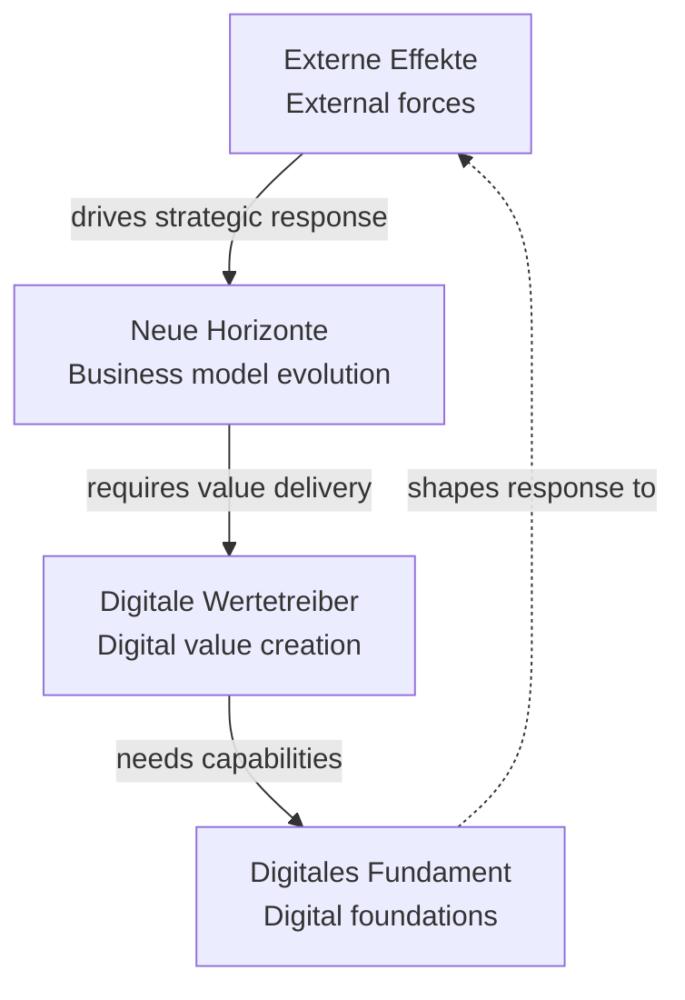

# Phase 2: Analysis (smarter-service)

<!-- COMPILATION METADATA -->
<!-- Source WHAT: research-types/smarter-service.md v3.0, tips-framework.md v3.0 -->
<!-- Compiled Date: 2025-12-22 -->
<!-- Compiled By: Sprint 442 - Corrected: Dimensions scout trends, each trend gets full TIPS expansion -->
<!-- Propagation: When source WHAT files change, regenerate this file using PROPAGATION-PROTOCOL.md -->

**Research Type:** `smarter-service` | **Framework:** TIPS with Action Horizons | **Candidates:** 52 (1:1 TIPS)

**Reference Checksum:** `sha256:2a-smarter-v6-candidates`

**Verification Protocol:** After reading, confirm complete load:

```text
Reference Loaded: phase-2-analysis-smarter-service.md | Checksum: 2a-smarter-v6-candidates
```

---

## Objective

Apply the embedded smarter-service framework (4 fixed dimensions) with **TIPS-optimized analysis** to:

1. Scout trends across all 4 dimensions (each dimension contains multiple trends)
2. Define quantified evidence requirements per dimension
3. Detect momentum indicators with action horizon classification
4. **Plan 52 trend candidates (horizon-specific: 5+5+3 per dimension) — each trend gets full T→I→P→S expansion**
5. Prepare cross-dimensional linkages for Phase 3 PICOT generation

**Important:** Dimensions are used to *scout* trends. Each trend identified in any dimension is then analyzed through the complete TIPS framework (Trend → Implications → Possibilities → Solutions).

**Expected Duration:** 90-120 seconds of actual work (includes trend candidate COT).

---

## TIPS Framework Quick Reference

| Component | Question | Evidence Type | Confidence Threshold |
|-----------|----------|---------------|---------------------|
| **T**rend | "What is happening?" | Quantified patterns, adoption rates | Observable data |
| **I**mplications | "What does it mean?" | Impact analysis, stakeholder effects | Stratified by confidence |
| **P**ossibilities | "What could we do?" | Scenarios, cross-dimensional patterns | Synthesis-based |
| **S**olutions | "What should we do?" | Recommendations, implementation guidance | ≥0.75 confidence |

---

## ⛔ Phase Entry Verification

**Before proceeding:**

1. Verify Phase 1 todos marked complete in TodoWrite
2. Verify Phase 1 outputs exist:
   - RESEARCH_TYPE variable set to `smarter-service`
   - DIMENSIONS_MODE variable set to `research-type-specific`
   - Mode detection logged

**If any output missing:** STOP. Return to Phase 1. Complete missing steps.

---

## Step 0: Check for Linked Portfolio

Check if user configured portfolio linking in Phase 1 Step 3.5:

```bash
# Extract linked_portfolio from question frontmatter
QUESTION_FILE=$(ls {project_path}/00-initial-question/data/question-*.md | head -1)
LINKED_PORTFOLIO=$(grep -A1 "^linked_portfolio:" "$QUESTION_FILE" | tail -1 | sed 's/linked_portfolio: *//' | tr -d '"' || echo "")

if [ -n "$LINKED_PORTFOLIO" ] && [ "$LINKED_PORTFOLIO" != "null" ] && [ "$LINKED_PORTFOLIO" != "" ]; then
  # Check if it's an absolute path (starts with /)
  if [ "$LINKED_PORTFOLIO" == /* ]; then
    # Already an absolute path - use directly
    PORTFOLIO_PROJECT_PATH="$LINKED_PORTFOLIO"
    PORTFOLIO_PROJECT_NAME=$(basename "$LINKED_PORTFOLIO")
  else
    # Resolve wikilink to project path
    PORTFOLIO_PROJECT_NAME=$(echo "$LINKED_PORTFOLIO" | sed 's/\[\[//' | sed 's/\]\]//')
    PORTFOLIO_PROJECT_PATH="${COGNI_RESEARCH_ROOT}/${PORTFOLIO_PROJECT_NAME}"
  fi

  # Validate portfolio project exists
  if [ -d "$PORTFOLIO_PROJECT_PATH" ]; then
    PORTFOLIO_ENTITIES_COUNT=$(find "$PORTFOLIO_PROJECT_PATH/11-trends" -maxdepth 1 -name "portfolio-*.md" 2>/dev/null | wc -l | tr -d ' ')
    log_conditional INFO "[smarter-service] Linked portfolio: $PORTFOLIO_PROJECT_NAME ($PORTFOLIO_ENTITIES_COUNT entities)"
    PORTFOLIO_LINKING_ENABLED=true
  else
    log_conditional WARNING "[smarter-service] Linked portfolio not found: $PORTFOLIO_PROJECT_PATH"
    PORTFOLIO_LINKING_ENABLED=false
  fi
else
  log_conditional INFO "[smarter-service] No linked portfolio - standalone research mode"
  PORTFOLIO_LINKING_ENABLED=false
fi
```

**Variables set:**

- `PORTFOLIO_LINKING_ENABLED`: `true` if valid portfolio project linked, `false` otherwise
- `PORTFOLIO_PROJECT_PATH`: Path to linked portfolio project (if enabled)
- `PORTFOLIO_ENTITIES_COUNT`: Number of portfolio entities available for reference suggestions

**Impact on Step 4.5:** If `PORTFOLIO_LINKING_ENABLED=true`, trend candidate COT templates will include portfolio reference suggestions.

---

## Step 0.5: Initialize Phase 2 TodoWrite

Add step-level todos for Phase 2. Update TodoWrite to add 8 todos: Steps 1-4, 4.5, 5-7 with Step 1 marked as `in_progress` and remaining steps as `pending`.

---

## Embedded Framework Definition

**Source:** Trendbook Kompass für die Multikrise (2023), Page 14 - Trendradar

This phase file contains all framework content pre-compiled. No runtime loading of external files required.

---

## Step 1: Apply Dimensions for Trend Scouting

### Four Fixed Dimensions for Trend Discovery

Each dimension provides a distinct lens for identifying trends. All trends discovered in any dimension are subsequently analyzed through the complete TIPS framework (T→I→P→S):

### Dimension 1: Externe Effekte (External Effects)

**Slug:** `externe-effekte`

**Core Question:** *"Welche externen Kräfte wirken von außen auf das Unternehmen ein?"*
*(What external forces are impacting the organization from outside?)*

**Layer:** Outer ring - External environment analysis

**Focus:** Forces beyond the organization's control — economic disruptions, regulatory shifts, societal changes

**MECE Role:** External forces acting ON the organization (outside-in perspective)

**Trend Scouting Focus:** External signals, regulatory changes, market shifts — trends discovered here get full TIPS analysis

**PICOT (P):** Organizations, industries, market segments affected by external forces

**Search Keywords:** EU AI Act impact, CSR-D compliance, digital transformation drivers, sustainability regulations, demographic trends, supply chain resilience, net-zero transitions, regulatory compliance, compliance acceleration, policy adoption curves

**Readiness Classification:**

- **Act (0-2y):** Published regulations with deadlines, immediate competitive pressures, >70% demographic adoption, mature compliance infrastructure
- **Plan (2-5y):** Draft regulations in consultation, accelerating trends with uncertain timeline, <50% adoption, emerging approaches
- **Observe (5+y):** Early policy debate, speculative scenarios, academic research phase, undefined compliance

---

### Dimension 2: Neue Horizonte (New Horizons)

**Slug:** `neue-horizonte`

**Core Question:** *"Wofür wird das Unternehmen in Zukunft bezahlt?"*
*(What will the company be paid for in the future?)*

**Layer:** Strategic business model layer

**Focus:** Strategic reinvention — business model evolution, leadership approaches, governance structures

**MECE Role:** Strategic responses BY the organization (direction-setting)

**Trend Scouting Focus:** Business model innovations, strategic pivots — trends discovered here get full TIPS analysis

**PICOT (P):** Organizations, leadership teams, strategic business units

**Search Keywords:** business agility, open leadership, sustainability strategy, resilience framework, trends-driven, predictive governance, purpose-driven transformation, operational excellence, strategic momentum indicators, agility adoption rates, leadership transformation velocity

**Readiness Classification:**

- **Act (0-2y):** Proven implementation case studies, validated ROI, documented methodologies/tools
- **Plan (2-5y):** Early adopter validation, pilot results, emerging best practices, limited deployments
- **Observe (5+y):** Academic/consulting discussion, conceptual models, theoretical approaches

---

### Dimension 3: Digitale Wertetreiber (Digital Value Drivers)

**Slug:** `digitale-wertetreiber`

**Core Question:** *"Wo und wie schaffen wir mit digitalen Mitteln Wert für Kunden und Geschäft?"*
*(Where and how do we create value for customers and business through digital means?)*

**Layer:** Value creation and delivery layer

**Focus:** Value creation mechanisms — customer experience, products/services, business processes

**MECE Role:** Value creation THROUGH digital means (delivery mechanisms)

**Trend Scouting Focus:** Digital value creation trends, technology adoption — trends discovered here get full TIPS analysis

**PICOT (P):** Customer segments, business processes, product lines

**Search Keywords:** digital twin ROI, omnichannel effectiveness, hyperautomation benefits, smart manufacturing, customer experience digital, metaverse business applications, smartification, digital twin adoption curves, hyperautomation scaling, ecosystem growth rates

**Readiness Classification:**

- **Act (0-2y):** Mature products, competitive ecosystem, <18mo ROI payback, >15% market adoption, documented methods, 3-6mo skill development
- **Plan (2-5y):** Second-gen products, 18-36mo ROI, 5-15% adoption with early success, 6-12mo skill gaps
- **Observe (5+y):** Prototype/POC stage, speculative ROI, <5% adoption, undefined methods, rare skills

---

### Dimension 4: Digitales Fundament (Digital Foundation)

**Slug:** `digitales-fundament`

**Core Question:** *"Welche digitalen Kompetenzen müssen vorhanden sein, um die digitale Realität der nächsten zehn Jahre zu bewältigen?"*
*(What digital competencies must exist to master the digital reality of the next ten years?)*

**Layer:** Foundational capabilities and enablers (inner ring)

**Focus:** Enabling capabilities — culture, workforce, technology infrastructure

**MECE Role:** Capabilities SUPPORTING transformation (enablers)

**Trend Scouting Focus:** Capability trends, workforce evolution, infrastructure changes — trends discovered here get full TIPS analysis

**PICOT (P):** Organizations, workforce segments, IT departments

**Search Keywords:** data culture transformation, digital workplace, upskilling programs, cyber security maturity, data platform architecture, Industry 4.0 cloud, new work models, data culture adoption, upskilling acceleration, security maturity progression, workforce transformation momentum

**Readiness Classification:**

- **Act (0-2y):** Validated adoption frameworks, proven training programs, established standards/support, documented change management
- **Plan (2-5y):** Early transformation results, pilot training validation, TRL 6-7 technologies, developing methodologies
- **Observe (5+y):** Research/early experimentation, programs not designed, TRL <6 technologies, unclear implications

---

### MANDATORY: Thinking Block Template

You MUST fill out this thinking block with actual analysis:

<thinking>
**Step 1 Execution: Apply Dimensions for Trend Scouting**

Analyzing the 4 fixed dimensions (each scouts trends that get full TIPS expansion):

1. Dimension: externe-effekte
   - English name: [FILL IN]
   - Core question focus: [FILL IN]
   - Trend scouting focus: [FILL IN - what types of trends does this dimension identify?]

2. Dimension: neue-horizonte
   - English name: [FILL IN]
   - Core question focus: [FILL IN]
   - Trend scouting focus: [FILL IN - what types of trends does this dimension identify?]

3. Dimension: digitale-wertetreiber
   - English name: [FILL IN]
   - Core question focus: [FILL IN]
   - Trend scouting focus: [FILL IN - what types of trends does this dimension identify?]

4. Dimension: digitales-fundament
   - English name: [FILL IN]
   - Core question focus: [FILL IN]
   - Trend scouting focus: [FILL IN - what types of trends does this dimension identify?]

Verification:
- Total dimensions: [COUNT]
- Each dimension scouts trends: [YES/NO]
- Each trend gets full T→I→P→S expansion: [YES/NO]
</thinking>

### Variable Assignment

```bash
# Phase start logging
log_phase "Phase 2: Analysis (smarter-service)" "start"
log_conditional INFO "[smarter-service] Applying dimension-based trend scouting"

# Fixed dimension structure for trend scouting
DIMENSION_COUNT=4
DIMENSION_SLUGS="externe-effekte neue-horizonte digitale-wertetreiber digitales-fundament"

# Store dimension metadata (slug:english_name:german_name)
# Note: Each dimension scouts trends; each trend gets full T→I→P→S expansion
DIMENSION_SPECS=(
  "externe-effekte:External Effects:Externe Effekte"
  "neue-horizonte:New Horizons:Neue Horizonte"
  "digitale-wertetreiber:Digital Value Drivers:Digitale Wertetreiber"
  "digitales-fundament:Digital Foundation:Digitales Fundament"
)

log_conditional INFO "[smarter-service] DIMENSION_COUNT=4 (fixed, embedded)"
log_conditional INFO "[smarter-service] Each dimension scouts trends → each trend gets full TIPS expansion"
```

Update TodoWrite: Mark Step 1 completed, mark Step 2 as in_progress.

---

## Step 2: Define Evidence Requirements per Dimension

### Evidence Quantification Standards for Trend Scouting

Each dimension has specific evidence types that help identify and validate trends. Once a trend is identified, it gets full TIPS expansion with evidence gathered across all four components:

| Dimension | Trend Discovery Evidence | Example Evidence |
|-----------|-------------------------|------------------|
| **Externe Effekte** | Dates, percentages, adoption rates, regulatory timelines | "EU AI Act effective 2024-08, 67% companies unprepared" |
| **Neue Horizonte** | Case counts, adoption %, pilot data, strategic pivots | "23% of DAX companies piloting, 5+ documented cases" |
| **Digitale Wertetreiber** | ROI metrics, cost/benefit ratios, market % | "42% cost reduction, 18-month payback, 15% market penetration" |
| **Digitales Fundament** | Maturity levels, training hours, certification rates | "Level 3 maturity requires 120h upskilling, 85% completion rate" |

**Note:** Each trend discovered in any dimension then requires evidence for all TIPS components (T→I→P→S).

### MANDATORY: Thinking Block Template

You MUST fill out this thinking block with actual analysis:

<thinking>
**Step 2 Execution: Define Evidence Requirements for Trend Discovery**

For each dimension, analyzing evidence needed to identify and validate trends:

1. externe-effekte:
   - Trend discovery evidence: [SPECIFY - dates/percentages/rates/regulations]
   - Example evidence type: [PROVIDE EXAMPLE]
   - How this helps scout trends: [EXPLAIN]

2. neue-horizonte:
   - Trend discovery evidence: [SPECIFY - case counts/pilot data/strategic shifts]
   - Example evidence type: [PROVIDE EXAMPLE]
   - How this helps scout trends: [EXPLAIN]

3. digitale-wertetreiber:
   - Trend discovery evidence: [SPECIFY - ROI/cost-benefit/market %]
   - Example evidence type: [PROVIDE EXAMPLE]
   - How this helps scout trends: [EXPLAIN]

4. digitales-fundament:
   - Trend discovery evidence: [SPECIFY - maturity/training/frameworks]
   - Example evidence type: [PROVIDE EXAMPLE]
   - How this helps scout trends: [EXPLAIN]

Verification:
- All 4 dimensions have evidence standards for trend discovery: [YES/NO]
- Each discovered trend will get full T→I→P→S expansion: [YES/NO]
- Evidence types are measurable: [YES/NO]
</thinking>

### Variable Assignment

```bash
# Evidence requirements set for trend discovery
EVIDENCE_REQUIREMENTS_SET=true
# Evidence types per dimension for discovering trends (each trend then gets full TIPS)
DIMENSION_EVIDENCE_TYPES=(
  "externe-effekte:dates,percentages,adoption_rates,regulatory_timelines"
  "neue-horizonte:case_counts,pilot_data,adoption_percentage,strategic_pivots"
  "digitale-wertetreiber:ROI,cost_benefit,market_penetration"
  "digitales-fundament:maturity_levels,training_hours,frameworks"
)

log_conditional INFO "[smarter-service] Evidence requirements defined for trend discovery in all 4 dimensions"
```

Update TodoWrite: Mark Step 2 completed, mark Step 3 as in_progress.

---

## Step 3: Detect Momentum with Action Horizon Classification

### TIPS-Aware Momentum Analysis

<thinking>
Analyze the original research question for trend velocity indicators.
For each detected indicator:
1. MAP to TIPS component (T/I/P/S)
2. CLASSIFY action horizon (Act/Plan/Observe)
3. IDENTIFY evidence gaps for that TIPS component
4. FLAG cross-dimensional implications
</thinking>

### Velocity Language Detection

| Velocity | German Terms | English Terms | Action Horizon |
|----------|--------------|---------------|----------------|
| **Accelerating** | "beschleunigt", "rasante Verbreitung", "exponentiell" | "surge", "rapid adoption", "exponential" | Act (0-2y) |
| **Emerging** | "aufkommend", "neue", "im Entstehen" | "emerging", "nascent", "new" | Plan (2-5y) |
| **Static/Mature** | "etabliert", "stabil", "konsolidiert" | "established", "stable", "mature" | Act (validated) |
| **Speculative** | "möglicherweise", "könnte", "Potenzial" | "potentially", "might", "future" | Observe (5+y) |

### Momentum-to-TIPS Mapping

| Momentum Type | Primary TIPS Impact | Search Enhancement |
|---------------|--------------------|--------------------|
| **Accelerating** | Trend (T) urgency | Add "2024", "rapid", "surge" to queries |
| **Emerging** | Possibilities (P) breadth | Add "pilot", "early adopter", "case study" |
| **Static** | Solutions (S) validation | Add "best practice", "framework", "methodology" |
| **Speculative** | Implications (I) scenarios | Add "forecast", "projection", "scenario" |

### Variable Assignment

```bash
# Momentum detection
ORGANIZING_CONCEPT=$(extract_organizing_concept "$QUESTION_TEXT")
TREND_VELOCITY=$(detect_velocity_language "$QUESTION_TEXT")  # accelerating | emerging | static | speculative
PRIMARY_ACTION_HORIZON=$(map_velocity_to_horizon "$TREND_VELOCITY")
TIPS_URGENCY_MAP=$(map_momentum_to_tips "$TREND_VELOCITY")

log_conditional INFO "[smarter-service] Organizing concept: ${ORGANIZING_CONCEPT}"
log_conditional INFO "[smarter-service] Trend velocity: ${TREND_VELOCITY} → ${PRIMARY_ACTION_HORIZON}"
log_conditional INFO "[smarter-service] TIPS urgency: ${TIPS_URGENCY_MAP}"
```

Update TodoWrite: Mark Step 3 completed, mark Step 4 as in_progress.

---

## Step 4: Map Case Studies to TIPS Roles

### Case Study TIPS Role Matrix

<thinking>
Analyze question for evidence specificity.
Map each case study requirement to its TIPS component role.
</thinking>

| Case Study Type | TIPS Component | Purpose | Detection Trigger |
|-----------------|----------------|---------|-------------------|
| **Implementation cases** | Solutions (S) | Validate recommendations | "how to", "implementation", "Umsetzung" |
| **Impact studies** | Implications (I) | Quantify consequences | "impact", "effect", "Auswirkung" |
| **Adoption curves** | Trend (T) | Evidence patterns | "adoption", "Verbreitung", "market share" |
| **Scenario analyses** | Possibilities (P) | Explore options | "scenarios", "options", "Szenarien" |

### Variable Assignment

```bash
# Case study requirements with TIPS mapping
CASE_STUDY_REQ=$(detect_case_study_requirement "$QUESTION_TEXT")  # required | recommended | none
CASE_STUDY_COUNT=$(extract_case_study_count "$QUESTION_TEXT")  # e.g., "3-5" or empty
CASE_STUDY_TIPS_ROLE=$(map_case_study_to_tips "$QUESTION_TEXT")  # T | I | P | S | mixed

log_conditional INFO "[smarter-service] Case study: ${CASE_STUDY_REQ} (count: ${CASE_STUDY_COUNT})"
log_conditional INFO "[smarter-service] Case study TIPS role: ${CASE_STUDY_TIPS_ROLE}"
```

Update TodoWrite: Mark Step 4 completed, mark Step 4.5 as in_progress.

---

## Step 4.5: Trend Candidate Planning (52 Candidates = 52 TIPS)

Candidates are always auto-generated during this step using COT reasoning.

**Token Efficiency:** Use COMPACT tabular format. Do NOT list each candidate verbosely - use short trend names (2-4 words) and abbreviated keywords.

### 52 TIPS Deliverable Planning (Auto-Generation Mode)

The smarter-service research type requires **52 TIPS** as the final deliverable. Plan **52 trend candidates** (horizon-specific: 5+5+3 per dimension) mapping 1:1 to 52 TIPS.

### 52-Candidate Planning Matrix (Horizon-Specific)

| Dimension | Act (0-2y) | Plan (2-5y) | Observe (5+y) | Total |
|-----------|------------|-------------|---------------|-------|
| externe-effekte | 5 candidates | 5 candidates | 3 candidates | 13 |
| neue-horizonte | 5 candidates | 5 candidates | 3 candidates | 13 |
| digitale-wertetreiber | 5 candidates | 5 candidates | 3 candidates | 13 |
| digitales-fundament | 5 candidates | 5 candidates | 3 candidates | 13 |
| **TOTAL** | **20** | **20** | **12** | **52** |

### MANDATORY: Trend Candidate COT (Single Consolidated Block)

Use ONE thinking block with a compact table. Do NOT use 4 separate blocks.

<thinking>
**52 Trend Candidates Planning (4 dimensions × horizon-specific: 5 ACT + 5 PLAN + 3 OBSERVE)**

| Dim | Hz | # | Trend (2-4 words) | Keywords (3) |
|-----|-----|---|-------------------|--------------|
| EE | Act | 1 | [name] | kw1, kw2, kw3 |
| EE | Act | 2 | [name] | kw1, kw2, kw3 |
| EE | Act | 3 | [name] | kw1, kw2, kw3 |
| EE | Act | 4 | [name] | kw1, kw2, kw3 |
| EE | Act | 5 | [name] | kw1, kw2, kw3 |
| EE | Plan | 1-5 | ... | ... |
| EE | Obs | 1-5 | ... | ... |
| NH | Act | 1-5 | ... | ... |
| NH | Plan | 1-5 | ... | ... |
| NH | Obs | 1-5 | ... | ... |
| DW | Act | 1-5 | ... | ... |
| DW | Plan | 1-5 | ... | ... |
| DW | Obs | 1-5 | ... | ... |
| DF | Act | 1-5 | ... | ... |
| DF | Plan | 1-5 | ... | ... |
| DF | Obs | 1-5 | ... | ... |

**Legend:** EE=externe-effekte, NH=neue-horizonte, DW=digitale-wertetreiber, DF=digitales-fundament
**Horizons:** Act=0-2y, Plan=2-5y, Obs=5+y

**Cross-Links (4):**

- EE→NH: [trend#] causal
- NH→DW: [trend#] dependency
- DW→DF: [trend#] enablement
- DF→EE: [trend#] feedback
</thinking>

### Variable Assignment

```bash
# 52 trend candidates (horizon-specific: 5+5+3 per dimension), 1:1 mapping to 52 TIPS
TREND_CANDIDATES_TARGET=52
TIPS_FINAL_TARGET=52
CANDIDATES_PER_DIMENSION=13
# Horizon-specific: ACT=5, PLAN=5, OBSERVE=3

# Store candidates with keywords (format: dimension:horizon:trend_name:keywords)
TREND_CANDIDATES=(
  # Populate from COT thinking blocks above
  # Example: "externe-effekte:act:EU AI Act compliance acceleration:eu ai act,compliance deadline,ai regulation"
)

log_conditional INFO "[smarter-service] TREND_CANDIDATES_TARGET=52 (horizon-specific: 5+5+3 per dimension)"
log_conditional INFO "[smarter-service] TIPS_FINAL_TARGET=52 (1:1 mapping)"
log_conditional INFO "[smarter-service] Trend candidates planned: ${#TREND_CANDIDATES[@]}"
```

Update TodoWrite: Mark Step 4.5 completed, mark Step 5 as in_progress.

---

## Step 5: Prepare Cross-Dimensional Linkages

### Cross-Dimensional Trend Linkage Pattern

The 4 dimensions form a logical flow for trend discovery and analysis. Trends discovered in one dimension often have implications for others:



**Note:** Each dimension scouts trends. Each trend (from any dimension) is then analyzed through the complete TIPS framework (T→I→P→S).

### Variable Assignment

```bash
# Cross-dimensional linkage flags (for trend relationships, not TIPS mapping)
LINKAGE_POTENTIAL=(
  "externe-effekte→neue-horizonte:causal"
  "neue-horizonte→digitale-wertetreiber:dependency"
  "digitale-wertetreiber→digitales-fundament:enablement"
  "digitales-fundament→externe-effekte:feedback"
)

# Flag for Phase 3 cross-referencing
CROSS_DIMENSIONAL_SYNTHESIS_ENABLED=true

log_conditional INFO "[smarter-service] Cross-dimensional trend linkages prepared for Phase 3"
log_conditional INFO "[smarter-service] Each trend gets full TIPS expansion: T→I→P→S"
```

Update TodoWrite: Mark Step 5 completed, mark Step 6 as in_progress.

---

## Step 6: Validate Completeness

### Validation Checks

1. **Dimension count valid:** Must be exactly 4

   ```bash
   if [ "$DIMENSION_COUNT" -ne 4 ]; then
     return_error "Smarter-service must have exactly 4 dimensions (found: $DIMENSION_COUNT)"
   fi
   ```

2. **Dimension specs complete:** All 4 dimensions defined

   ```bash
   if [ "${#DIMENSION_SPECS[@]}" -ne 4 ]; then
     return_error "Dimension specs incomplete"
   fi
   ```

3. **Evidence requirements set:**

   ```bash
   if [ "$EVIDENCE_REQUIREMENTS_SET" != "true" ]; then
     return_error "Evidence requirements not defined"
   fi
   ```

4. **All required variables set:**

   ```bash
   for var in DIMENSION_COUNT DIMENSION_SLUGS TREND_VELOCITY CASE_STUDY_REQ CROSS_DIMENSIONAL_SYNTHESIS_ENABLED; do
     if [ -z "${!var}" ]; then
       return_error "Required variable not set: $var"
     fi
   done
   ```

5. **Trend candidates planned (52 total):**

   ```bash
   if [ "${#TREND_CANDIDATES[@]}" -ne 52 ]; then
     return_error "52 trend candidates required for 52 TIPS deliverable (found: ${#TREND_CANDIDATES[@]})"
   fi
   ```

6. **Per-dimension distribution valid (horizon-specific: 5+5+3):**

   ```bash
   for dim in externe-effekte neue-horizonte digitale-wertetreiber digitales-fundament; do
     for horizon in act plan; do
       count=$(printf '%s\n' "${TREND_CANDIDATES[@]}" | grep -c "^${dim}:${horizon}:")
       if [ "$count" -ne 5 ]; then
         return_error "Cell ${dim}:${horizon} needs 5 candidates (found: $count)"
       fi
     done
     observe_count=$(printf '%s\n' "${TREND_CANDIDATES[@]}" | grep -c "^${dim}:observe:")
     if [ "$observe_count" -ne 3 ]; then
       return_error "Cell ${dim}:observe needs 3 candidates (found: $observe_count)"
     fi
   done
   ```

Update TodoWrite: Mark Step 6 completed, mark Step 7 as in_progress.

---

## Step 7: Mark Phase 2 Complete

### Success Criteria (Smarter-Service Trend Scouting)

- [ ] DIMENSION_COUNT = 4 (from embedded definitions)
- [ ] All 4 dimension slugs set (unique, no duplicates)
- [ ] Dimension specs complete (each dimension defined for trend scouting)
- [ ] Evidence requirements defined per dimension for trend discovery
- [ ] Core questions available for all 4 dimensions (embedded)
- [ ] PICOT patterns available for all 4 dimensions (embedded)
- [ ] Readiness classification available for all 4 dimensions (embedded)
- [ ] Momentum detected with action horizon classification
- [ ] Case study requirements mapped to TIPS roles
- [ ] **52 trend candidates planned (horizon-specific: 5+5+3 per dimension) with concrete names and keywords**
- [ ] Cross-dimensional linkages prepared for Phase 3
- [ ] All variables logged

### Logging

```bash
log_conditional INFO "[smarter-service] Phase 2 Complete: Dimension-Based Trend Scouting"
log_conditional INFO "[smarter-service] 4 dimensions for trend discovery (each trend gets full T→I→P→S expansion)"
log_conditional INFO "[smarter-service] Evidence requirements: quantified per dimension for trend discovery"
log_conditional INFO "[smarter-service] Action horizons: Act (0-2y), Plan (2-5y), Observe (5+y)"
log_conditional INFO "[smarter-service] Momentum: ${TREND_VELOCITY} → ${PRIMARY_ACTION_HORIZON}"
log_conditional INFO "[smarter-service] Case study TIPS role: ${CASE_STUDY_TIPS_ROLE}"
log_conditional INFO "[smarter-service] Trend candidates: ${#TREND_CANDIDATES[@]} planned (52 trends, each gets TIPS expansion)"
log_conditional INFO "[smarter-service] Cross-dimensional synthesis: ENABLED"
log_phase "Phase 2: Analysis (smarter-service)" "complete"
```

---

## ⛔ Final Verification Gate

Before marking Phase 2 complete, verify execution evidence:

### Execution Evidence Checklist

1. **Thinking blocks:** Did you fill out all thinking blocks (Steps 1-2 + trend COT in Step 4.5) with all placeholders replaced? ✅ YES / ❌ NO
2. **TodoWrite calls:** Did you call TodoWrite 8 times (Step 0.5 + Steps 1-4, 4.5, 5-6)? ✅ YES / ❌ NO
3. **Variable assignments:** Are all code blocks present with variables set? ✅ YES / ❌ NO
4. **Dimension specs:** All 4 dimensions defined for trend scouting? ✅ YES / ❌ NO
5. **Evidence requirements:** Quantification standards defined for trend discovery in all 4 dimensions? ✅ YES / ❌ NO
6. **Momentum detection:** Trend velocity and action horizon classified? ✅ YES / ❌ NO
7. **Case study mapping:** Requirements mapped to TIPS roles? ✅ YES / ❌ NO
8. **Trend candidates:** 52 candidates planned (horizon-specific: 5+5+3 per dimension) with concrete names and keywords? ✅ YES / ❌ NO
9. **Linkage preparation:** Cross-dimensional trend linkages prepared? ✅ YES / ❌ NO

⛔ **IF ANY NO:** STOP. Return to incomplete step. Provide execution evidence.

⛔ **IF ALL YES:** Mark Phase 2 todo as completed in TodoWrite. Proceed to Phase 3.

---

## Next Phase

Proceed to [phase-3-planning-smarter-service.md](phase-3-planning-smarter-service.md) when all criteria met.

**Next step:** Phase 3 - TIPS-Enhanced PICOT Generation with Action Horizon Classification

Phase 3 will use:

- DIMENSION_SPECS for focused question generation across all 4 dimensions
- DIMENSION_EVIDENCE_TYPES for evidence-specific search queries
- LINKAGE_POTENTIAL for cross-dimensional PICOT synthesis
- CASE_STUDY_TIPS_ROLE for targeted case collection
- **TREND_CANDIDATES for question-to-candidate coverage validation (ensure all 52 trends have research coverage)**
- Each trend will be expanded through full TIPS framework (T→I→P→S)

---

## Error Handling

| Scenario | Response |
|----------|----------|
| Dimension count ≠ 4 | Exit 1, embedded definitions corrupted |
| Dimension specs incomplete | Exit 1, regenerate from template |
| Variable not set | Exit 1, log missing variable |
| Momentum detection failed | Log warning, default to "static" with Plan horizon |
| Case study detection failed | Log warning, default to "recommended" with mixed TIPS role |
| Trend candidates ≠ 60 | Exit 1, return to Step 4.5 for COT completion |
| Per-cell distribution invalid | Exit 1, return to Step 4.5 for rebalancing |
| Linkage preparation failed | Log warning, disable cross-dimensional synthesis |

---

**Size: ~9.5KB** | Self-contained (no runtime file loading) | Trend Scouting with 60 Candidates (each gets full TIPS expansion)
