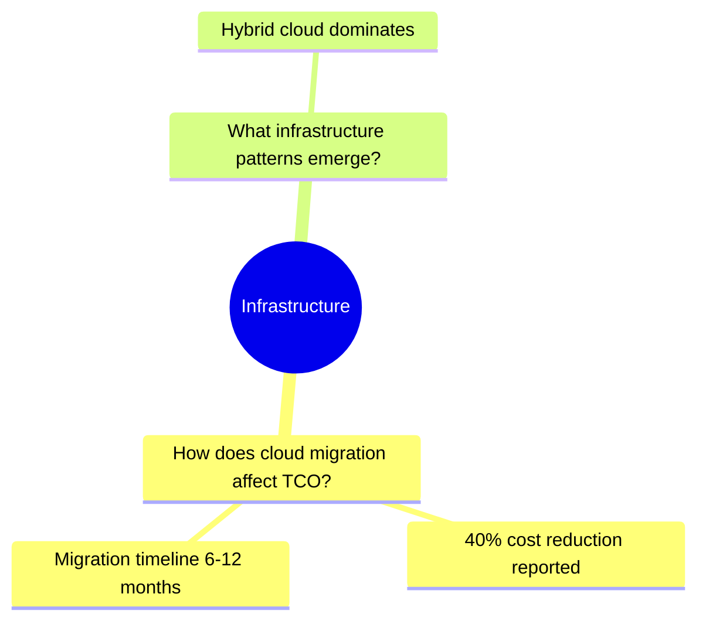
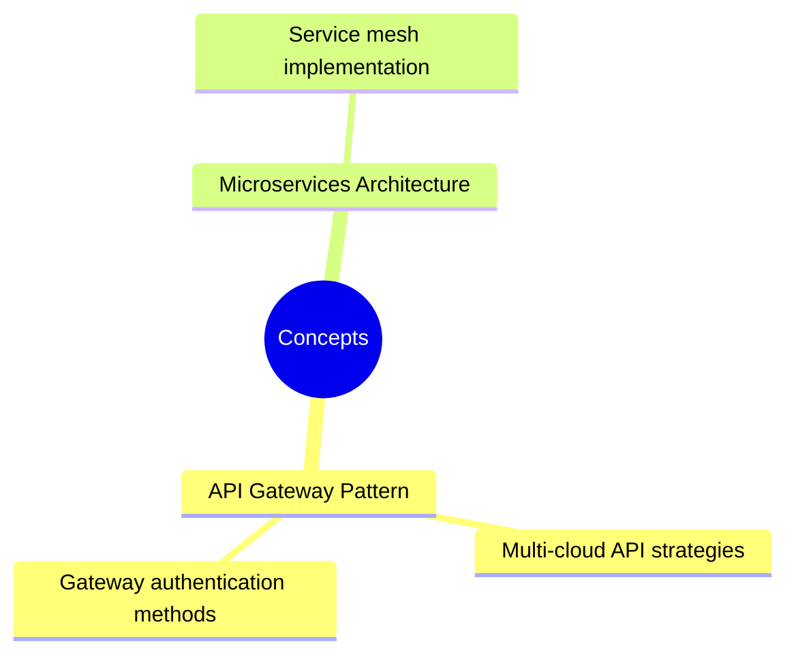
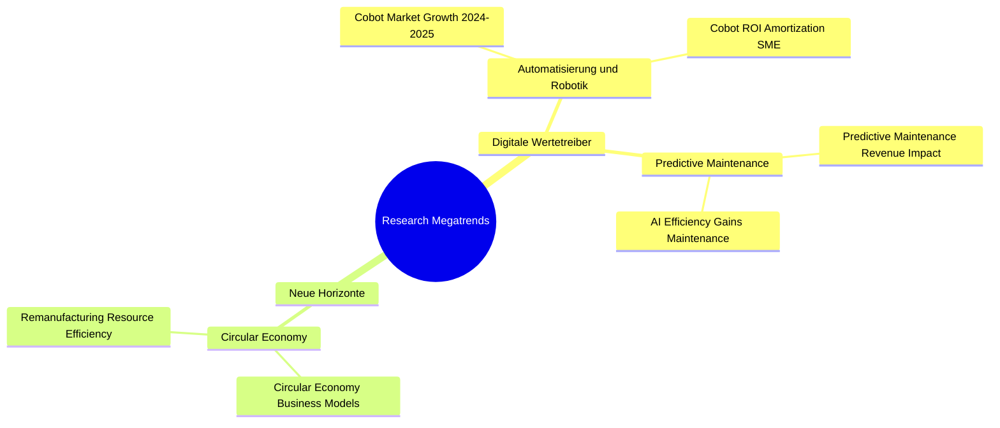

# Phase 7: README Generation

Generate README files for entity folders with hierarchical provenance chain mindmaps.

**Checksum:** `phase-7-readme-generation-v1.6.0-root-readme`

Output this checksum after reading to confirm reference loading.

---

## Overview

| Folder | Mindmap Structure | Generated By |
|--------|-------------------|--------------|
| `${DIMENSIONS_DIR}/` | question → dimensions | dimension-planner |
| `${REFINED_QUESTIONS_DIR}/` | question → dimensions → questions | dimension-planner |
| `${QUERY_BATCHES_DIR}/` | question → dimensions → questions → batches | findings-creator |
| `${FINDINGS_DIR}/` (per-dimension) | dimension → questions → findings | **knowledge-extractor** |
| `${DOMAIN_CONCEPTS_DIR}/` | concepts → findings | **knowledge-extractor** |
| `${MEGATRENDS_DIR}/` | megatrends → findings | **knowledge-extractor** |

**Scope:** This phase generates READMEs for `${FINDINGS_DIR}/` (per-dimension), `${DOMAIN_CONCEPTS_DIR}/`, and `${MEGATRENDS_DIR}/` only. Other READMEs are generated by their respective skills during entity creation.

**NOTE:** README files are placed in entity root directories (e.g., `${FINDINGS_DIR}/README.md`), while entity files remain in `/data/` subdirectories (e.g., `${FINDINGS_DIR}/data/finding-*.md`).

---

## Step 0.1: Load Project Language

Read project language from sprint-log.json and load translation map:

```bash
PROJECT_LANGUAGE=$(jq -r '.project_language // "en"' "${PROJECT_PATH}/.metadata/sprint-log.json")
log_conditional INFO "Project language: ${PROJECT_LANGUAGE}"
```

### Language Translation Map

Use this map to translate all README headings and labels to the project language:

| English (en) | German (de) | Dutch (nl) | French (fr) |
|--------------|-------------|------------|-------------|
| Findings | Erkenntnisse | Bevindingen | Résultats |
| Statistics | Statistiken | Statistieken | Statistiques |
| Mindmap | Mindmap | Mindmap | Carte mentale |
| Entity Index | Entitätsindex | Entiteitsindex | Index des entités |
| Provenance Chain | Herkunftskette | Herkomst keten | Chaîne de provenance |
| Research Methodology | Forschungsmethodik | Onderzoeksmethodologie | Méthodologie de recherche |
| Key Discoveries | Wichtige Erkenntnisse | Belangrijke ontdekkingen | Découvertes clés |
| Type | Typ | Type | Type |
| Entity | Entität | Entiteit | Entité |
| Link | Link | Link | Lien |
| Domain Concepts Overview | Übersicht Domänenkonzepte | Overzicht domeinconcepten | Aperçu des concepts de domaine |
| Concepts | Konzepte | Concepten | Concepts |
| Megatrends | Megatrends | Megatrends | Mégatendances |
| Research Topics | Forschungsthemen | Onderzoeksonderwerpen | Sujets de recherche |
| Hierarchical view of | Hierarchische Ansicht von | Hiërarchische weergave van | Vue hiérarchique de |
| Metric | Metrik | Metriek | Métrique |
| Value | Wert | Waarde | Valeur |
| Count | Anzahl | Aantal | Nombre |
| Refined Questions | Verfeinerte Fragen | Verfijnde vragen | Questions affinées |
| Avg Quality Score | Durchschn. Qualität | Gem. kwaliteitsscore | Score de qualité moyen |
| Finding References | Verweise auf Erkenntnisse | Bevindingsreferenties | Références aux résultats |
| Generated by | Erstellt von | Gegenereerd door | Généré par |
| dimension | Dimension | Dimensie | Dimension |

**CRITICAL:** All README content (headings, descriptions, table headers, labels) MUST be generated in `PROJECT_LANGUAGE`. Only filenames, YAML keys, and wikilink paths remain in English.

---

## Entry Gate

Verify Phase 6 complete and entity data available:

```bash
test ${concepts_created:-0} -ge 0
test ${megatrends_created:-0} -ge 0
FINDING_COUNT=$(find "${PROJECT_PATH}/${FINDINGS_DIR}" -name "finding-*.md" 2>/dev/null | wc -l)
```

**IF** no concepts AND no megatrends AND no findings: Skip README generation, proceed to JSON response.

---

## Step 0.5: TodoWrite Expansion

Add step-level todos:

| Todo | Status |
|------|--------|
| Phase 7.0: Build finding-question-dimension mapping | in_progress |
| Phase 7.0.4: Initialize DIMENSION_SLUGS array | pending |
| Phase 7.0.5: Generate per-dimension findings READMEs | pending |
| Phase 7.0.6: Verify per-dimension findings READMEs | pending |
| Phase 7.1: Collect concepts and finding references | pending |
| Phase 7.2: Collect megatrends and finding references | pending |
| Phase 7.3: Generate concepts README with mindmap | pending |
| Phase 7.4: Generate megatrends README with mindmap | pending |
| Phase 7.5: Verify README creation | pending |

---

## Step 0: Build Finding-Question-Dimension Mapping

Build hierarchical mapping of findings organized by dimension and refined question.

### 0.1 Load Dimensions

Read all dimension files from `${PROJECT_PATH}/${DIMENSIONS_DIR}/data/`:

| Field | Source |
|-------|--------|
| `dimension_name` | `dimension:` field in frontmatter |
| `dimension_slug` | Filename without `.md` extension |

### 0.2 Trace Findings to Dimensions

For each finding file in `${FINDINGS_DIR}/data/`:

1. **Extract provenance reference:**
   - Path A (findings-creator): `batch_ref: [[${QUERY_BATCHES_DIR}/data/{question-id}-batch]]`
   - Path B (findings-creator-llm): `question_ref: [[${REFINED_QUESTIONS_DIR}/data/question-{slug}]]`

2. **Resolve to question:**
   - Path A: Read query batch → extract `question_ref` → get question slug
   - Path B: Use `question_ref` directly

3. **Resolve to dimension:**
   - Read refined question → extract `dimension_ref` → get dimension slug

4. **Extract finding metadata:**
   - `dc:title` for mindmap label (truncate to 40 chars)
   - `quality_score` for statistics (optional)

### 0.3 Build Hierarchical Mapping

Structure findings by dimension and question:

```yaml
dimension_findings:
  {dimension_key}:
    dimension_name: "Infrastructure & Architecture"
    dimension_slug: "dimension-infrastructure-abc123"
    questions:
      - question_name: "How does cloud migration affect TCO?"
        question_slug: "question-cloud-migration-def456"
        findings:
          - title: "40% cost reduction reported"
            slug: "finding-cost-reduction-ghi789"
            quality_score: 0.85
```

### 0.4 Initialize DIMENSION_SLUGS Array

**⛔ MANDATORY:** After building mapping, explicitly initialize iteration array:

```bash
DIMENSION_SLUGS=()
for dimension_key in $(keys of dimension_findings); do
  DIMENSION_SLUGS+=("${dimension_findings[$dimension_key].dimension_slug}")
done
log_conditional INFO "Initialized ${#DIMENSION_SLUGS[@]} dimensions: ${DIMENSION_SLUGS[*]}"
```

**Validation:**

| Check | Action on Failure |
|-------|-------------------|
| `${#DIMENSION_SLUGS[@]} -gt 0` | Log warning, skip Step 0.5 |
| Each slug exists in `${DIMENSIONS_DIR}/data/` | Log warning per missing slug, continue |

**Mark 7.0 complete.**

---

## Step 0.5: Generate Per-Dimension Findings READMEs

For each dimension with findings, generate a README with hierarchical mindmap.

### 0.5.1 Build Mermaid Mindmap

Structure: `dimension (root) → refined questions → findings`



**Node formatting:**

- Root: `root(({Dimension Name}))` (double parentheses)
- Questions: 4-space indent, max 40 chars
- Findings: 6-space indent, max 40 chars

### 0.5.2 Build Entity Index Table

Create wikilinked index:

```markdown
| Type | Entity | Link |
|------|--------|------|
| Dimension | Infrastructure & Architecture | [[${DIMENSIONS_DIR}/data/dimension-infrastructure-abc123]] |
| Question | How does cloud migration affect TCO? | [[${REFINED_QUESTIONS_DIR}/data/question-cloud-migration-def456]] |
| Finding | 40% cost reduction reported | [[${FINDINGS_DIR}/data/finding-cost-reduction-ghi789]] |
```

### 0.5.3 Assemble and Write README

**Output Path:** `${PROJECT_PATH}/${FINDINGS_DIR}/README-{short-slug}.md`

**Naming:** Extract short slug from dimension slug (use hyphen to match 11-trends pattern):

- `dimension-infrastructure-abc123` → `README-infrastructure.md`

**NOTE:** README is placed in entity root (`${FINDINGS_DIR}/`), not in `/data/` subdirectory.

**Template:**

**IMPORTANT:** All text in this template MUST be translated to `PROJECT_LANGUAGE` using the Language Translation Map from Step 0.1.

```markdown
---
title: "{{FINDINGS_LABEL}} - {Dimension Name}"
generated_by: knowledge-extractor
generated_at: {{ISO_TIMESTAMP}}
dimension: "{{DIMENSION_SLUG}}"
finding_count: {{FINDING_COUNT}}
question_count: {{QUESTION_COUNT}}
avg_quality: {{AVG_QUALITY}}
project_language: {{PROJECT_LANGUAGE}}
---

# {{FINDINGS_LABEL}}: {Dimension Name}

{{HIERARCHICAL_VIEW_LABEL}} **{Dimension Name}** {{DIMENSION_LABEL}}.

## {{STATISTICS_LABEL}}

| {{METRIC_LABEL}} | {{VALUE_LABEL}} |
|--------|-------|
| {{REFINED_QUESTIONS_LABEL}} | {{QUESTION_COUNT}} |
| {{FINDINGS_LABEL}} | {{FINDING_COUNT}} |
| {{AVG_QUALITY_LABEL}} | {{AVG_QUALITY}} |

## {{MINDMAP_LABEL}}

```mermaid
mindmap
  root(({Dimension Name}))
{{QUESTION_FINDING_NODES}}
```

## {{ENTITY_INDEX_LABEL}}

| {{TYPE_LABEL}} | {{ENTITY_LABEL}} | {{LINK_LABEL}} |
|------|--------|------|
{{ENTITY_ROWS}}

## {{PROVENANCE_CHAIN_LABEL}}

### {{RESEARCH_METHODOLOGY_LABEL}}

{{METHODOLOGY_SYNTHESIS}}

[LLM generates ~100 words describing:
- How this dimension's findings were extracted from refined questions
- The query batch → finding extraction → quality scoring workflow
- Number of sources analyzed for this dimension]

### {{KEY_DISCOVERIES_LABEL}}

{{KEY_FINDINGS_SYNTHESIS}}

[LLM generates ~150-200 words summarizing:
- 3-5 most significant findings in this dimension
- Key patterns or relationships discovered
- Strategic implications for the research question]

---
*{{GENERATED_BY_LABEL}} knowledge-extractor Phase 7*
```

Use **Write tool** to create each README.

**Mark 7.0.5 complete.**

---

## Step 0.6: Verify Per-Dimension READMEs

| Check | Requirement | Action on Failure |
|-------|-------------|-------------------|
| File exists | `${FINDINGS_DIR}/README-{slug}.md` | Log warning, continue |
| File size | >300 bytes | Log warning, continue |
| Mermaid block | Contains ` ```mermaid ` | Log warning, continue |
| Question hierarchy | ≥1 question node | Log warning, continue |

Log results:

```bash
log_conditional INFO "Created ${findings_readmes_created}/${findings_readmes_expected} per-dimension findings READMEs"
```

**Mark 7.0.6 complete.**

---

## Step 1: Collect Concept Data

Gather all concept entities and finding references.

### 1.1 List Entities

Read all files matching `${PROJECT_PATH}/${DOMAIN_CONCEPTS_DIR}/data/concept-*.md`

### 1.2 Extract Metadata

For each concept file:

| Field | Source |
|-------|--------|
| `concept_name` | `concept:` field in frontmatter |
| `concept_slug` | Filename without `.md` |
| `finding_refs` | `finding_refs:` array in frontmatter |

### 1.3 Resolve Finding Titles

For each finding reference:

1. Parse wikilink to extract finding slug
2. Read finding file from `${FINDINGS_DIR}/data/`
3. Extract `dc:title` from frontmatter
4. Truncate to 50 chars if needed

**Mark 7.1 complete.**

---

## Step 2: Collect Megatrend Data

Same process as Step 1 for megatrend entities.

### 2.1-2.3 Extract Metadata

Read from `${PROJECT_PATH}/${MEGATRENDS_DIR}/data/megatrend-*.md`:

| Field | Source |
|-------|--------|
| `megatrend_name` | `megatrend_name:` field in frontmatter |
| `megatrend_slug` | Filename without `.md` |
| `finding_refs` | `finding_refs:` array in frontmatter |

Resolve finding titles per Step 1.3.

**Mark 7.2 complete.**

---

## Step 3: Generate Concepts README

**Output Path:** `${PROJECT_PATH}/${DOMAIN_CONCEPTS_DIR}/README.md`

**NOTE:** README is placed in entity root, not in `/data/` subdirectory.

### 3.1 Build Mermaid Mindmap

Structure: `concepts (root) → concept → findings`



### 3.2 Build Entity Index

Create wikilinked table with all concepts and their metadata.

**Implementation:**
1. Collect all concept files from `${DOMAIN_CONCEPTS_DIR}/data/concept-*.md`
2. For each concept, extract:
   - Name from `concept:` field (e.g., "3GPP NTN Standards")
   - Category from `category:` field
   - Confidence from `confidence:` field
   - Finding count from `finding_refs:` array length
   - File path for wikilink
3. Format each row as: `Concept Name [[path/to/file]] | Category | Confidence | Finding Count`
4. Sort by concept name alphabetically

**⚠️ ANTI-HALLUCINATION:** Extract ALL data from actual concept entity files. DO NOT invent concept names or categories. Read each file's frontmatter using the Read tool.

### 3.3 Assemble and Write

**Template:**

**IMPORTANT:** All text in this template MUST be translated to `PROJECT_LANGUAGE` using the Language Translation Map from Step 0.1.

```markdown
---
title: "{{DOMAIN_CONCEPTS_OVERVIEW_LABEL}}"
generated_by: knowledge-extractor
generated_at: {{ISO_TIMESTAMP}}
concept_count: {{CONCEPT_COUNT}}
project_language: {{PROJECT_LANGUAGE}}
---

# {{DOMAIN_CONCEPTS_OVERVIEW_LABEL}}

{{VISUAL_OVERVIEW_CONCEPTS_DESCRIPTION}}

## {{STATISTICS_LABEL}}

| {{METRIC_LABEL}} | {{COUNT_LABEL}} |
|--------|-------|
| {{CONCEPTS_LABEL}} | {{CONCEPT_COUNT}} |
| {{FINDING_REFERENCES_LABEL}} | {{FINDING_REF_COUNT}} |

## {{MINDMAP_LABEL}}

```mermaid
mindmap
  root(({{CONCEPTS_LABEL}}))
{{CONCEPT_NODES}}
```

## {{ENTITY_INDEX_LABEL}}

| {{CONCEPT_LABEL}} | {{CATEGORY_LABEL}} | {{CONFIDENCE_LABEL}} | {{FINDINGS_LABEL}} |
|---------|----------|------------|----------|
| AI Governance Framework [[${DOMAIN_CONCEPTS_DIR}/data/concept-ai-governance-framework-b2c3d4e5]] | Framework | 0.94 | 21 |
| Agentic AI [[${DOMAIN_CONCEPTS_DIR}/data/concept-agentic-ai-f6g7h8i9]] | Technique | 0.92 | 8 |

*{{NOTE_FULL_LIST_IN_DATA_LABEL}}*

## {{PROVENANCE_CHAIN_LABEL}}

### {{RESEARCH_METHODOLOGY_LABEL}}

{{METHODOLOGY_SYNTHESIS}}

[LLM generates ~100 words describing:
- How domain concepts were extracted from research findings
- The semantic clustering and deduplication process
- Connection to research dimensions and refined questions]

### {{KEY_DISCOVERIES_LABEL}}

{{KEY_CONCEPTS_SYNTHESIS}}

[LLM generates ~150-200 words summarizing:
- 3-5 most significant domain concepts discovered
- Key relationships between concepts
- How concepts connect to the original research question]

---
*{{GENERATED_BY_LABEL}} knowledge-extractor Phase 7*
```

Use **Write tool** to create README.

**Mark 7.3 complete.**

---

## Step 4: Generate Megatrends README

**Output Path:** `${PROJECT_PATH}/${MEGATRENDS_DIR}/README.md`

**NOTE:** README is placed in entity root, not in `/data/` subdirectory.

### 4.1 Build Mermaid Mindmap

Structure: `root → dimensions → megatrends → finding titles`



**Node formatting:**

- Root: `root((Research Megatrends))`
- Dimensions: 4-space indent, dimension name
- Megatrends: 6-space indent, **megatrend_name from frontmatter**
- Findings: 8-space indent, **finding title from body H1** (max 40 chars)

### 4.2 Build Entity Index

Create table with wikilinks, finding counts, and dimension mapping.

### 4.3 Assemble and Write

**Template:**

**IMPORTANT:** All text in this template MUST be translated to `PROJECT_LANGUAGE` using the Language Translation Map from Step 0.1.

```markdown
---
title: "{{RESEARCH_MEGATRENDS_LABEL}}"
generated_by: knowledge-extractor
generated_at: {{ISO_TIMESTAMP}}
megatrend_count: {{MEGATREND_COUNT}}
project_language: {{PROJECT_LANGUAGE}}
---

# {{RESEARCH_MEGATRENDS_LABEL}}

{{VISUAL_OVERVIEW_MEGATRENDS_DESCRIPTION}}

## {{STATISTICS_LABEL}}

| {{METRIC_LABEL}} | {{COUNT_LABEL}} |
|--------|-------|
| {{MEGATRENDS_LABEL}} | {{MEGATREND_COUNT}} |
| {{FINDING_REFERENCES_LABEL}} | {{FINDING_REF_COUNT}} |
| {{DIMENSIONS_LABEL}} | {{DIMENSION_COUNT}} |

## {{MINDMAP_LABEL}}

```mermaid
mindmap
  root(({{RESEARCH_MEGATRENDS_LABEL}}))
{{DIMENSION_TOPIC_NODES}}
```

## {{ENTITY_INDEX_LABEL}}

| {{TYPE_LABEL}} | {{ENTITY_LABEL}} | {{DIMENSION_LABEL}} | {{FINDINGS_LABEL}} | {{LINK_LABEL}} |
|------|--------|-----------|----------|------|
{{ENTITY_ROWS}}

## {{PROVENANCE_CHAIN_LABEL}}

### {{RESEARCH_METHODOLOGY_LABEL}}

{{METHODOLOGY_SYNTHESIS}}

[LLM generates ~100 words describing:
- How megatrends were clustered from research findings
- The semantic grouping methodology
- Connection to dimensions and research questions]

### {{KEY_DISCOVERIES_LABEL}}

{{KEY_MEGATRENDS_SYNTHESIS}}

[LLM generates ~150-200 words summarizing:
- 3-5 most significant megatrend clusters discovered
- Key thematic patterns across dimensions
- How megatrends relate to the original research question]

---
*{{GENERATED_BY_LABEL}} knowledge-extractor Phase 7*
```

Use **Write tool** to create README.

**Mark 7.4 complete.**

---

## Step 5: Verify README Creation

### 5.1 Validation Checks

| Check | Requirement |
|-------|-------------|
| Concepts README exists | `${DOMAIN_CONCEPTS_DIR}/README.md` |
| Megatrends README exists | `${MEGATRENDS_DIR}/README.md` |
| File size | >300 bytes |
| Mermaid block | Contains ` ```mermaid ` |

### 5.2 Log Results

```bash
log_phase "Phase 7: README Generation" "complete"
```

**Mark 7.5 complete.**

---

## Self-Verification Questions

Answer YES to all before proceeding:

1. Did I load PROJECT_LANGUAGE from sprint-log.json? YES/NO
2. Did I build the finding-question-dimension mapping? YES/NO
3. **Did I explicitly initialize DIMENSION_SLUGS array?** YES/NO
4. Did I generate per-dimension findings READMEs? YES/NO
5. Did I collect ALL concept entities from `${DOMAIN_CONCEPTS_DIR}/data/`? YES/NO
6. Did I collect ALL megatrend entities from `${MEGATRENDS_DIR}/data/`? YES/NO
7. Did I resolve finding titles from actual files? YES/NO
8. Did I use wikilinks in Entity Index tables? YES/NO
9. Did I use Write tool (not bash echo) to create READMEs? YES/NO
10. Did I truncate long names for mindmap readability? YES/NO
11. **Did I translate ALL headings and labels to PROJECT_LANGUAGE?** YES/NO
12. **Did I generate Provenance Chain synthesis (200-300 words) for each README?** YES/NO

**⛔ IF ANY NO:** Return to incomplete step.

---

## Phase Completion Checklist

- [ ] Finding-question-dimension mapping built
- [ ] **DIMENSION_SLUGS array explicitly initialized**
- [ ] Per-dimension findings READMEs written with mindmaps
- [ ] All concept entities collected with finding refs
- [ ] All megatrend entities collected with finding refs
- [ ] Concepts README written with mindmap
- [ ] Megatrends README written with mindmap
- [ ] All READMEs contain Entity Index with wikilinks
- [ ] All step todos completed

---

## Error Handling

Phase 7 is **non-blocking**. Log warnings but continue:

| Error | Action |
|-------|--------|
| No concepts created | Skip concepts README, log info |
| No megatrends created | Skip megatrends README, log info |
| Write tool failure | Log error, continue to JSON response |
| Finding file not found | Use slug as title fallback |

---

## Output

Update JSON response with README stats:

```json
{
  "success": true,
  "readme_generation": {
    "findings_readmes": {
      "created": 4,
      "dimensions": ["infrastructure", "security", "cost-optimization", "compliance"],
      "total_findings": 47,
      "avg_quality": 0.76
    },
    "concepts_readme": true,
    "megatrends_readme": true,
    "concepts_in_mindmap": 12,
    "megatrends_in_mindmap": 5
  }
}
```

If skipped:

```json
{
  "readme_generation": {
    "findings_readmes": { "created": 0, "skip_reason": "No findings created" },
    "concepts_readme": false,
    "megatrends_readme": false,
    "skip_reason": "No concepts or megatrends created"
  }
}
```

---

## Anti-Hallucination Protocol

| Rule | Enforcement |
|------|-------------|
| No fabricated entities | Only reference entities from Phases 4-5 |
| No fabricated findings | Only reference files in `${FINDINGS_DIR}/data/` |
| Accurate counts | Statistics from actual entity files |
| Valid wikilinks | All links point to existing files |

**Reference:** [../patterns/anti-hallucination.md](../patterns/anti-hallucination.md)
