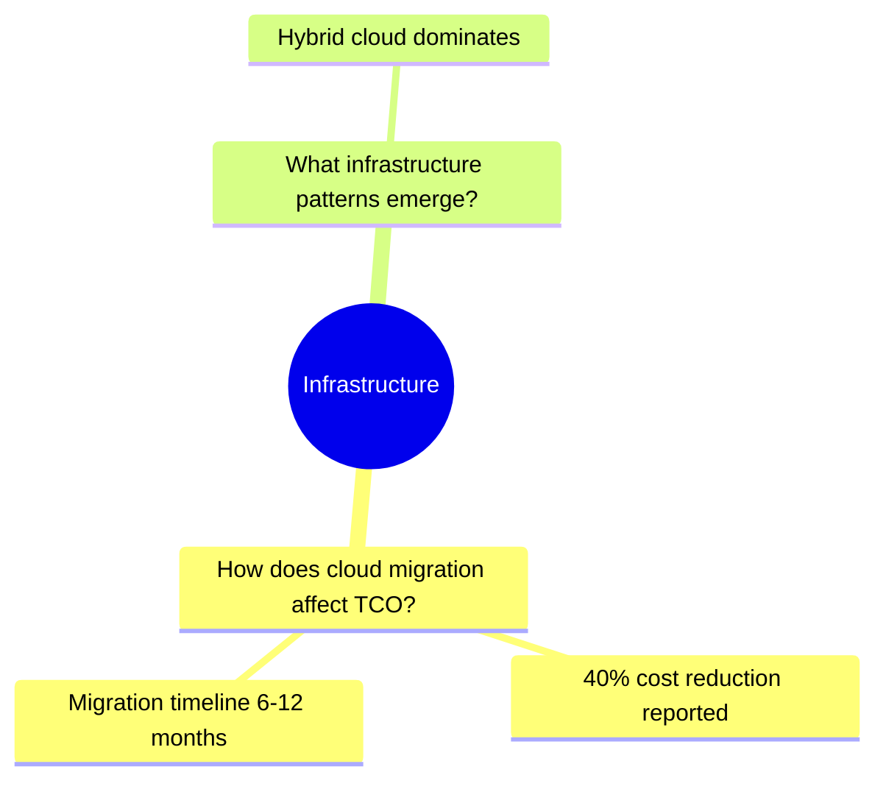

# Phase 5: README Generation

Generate README files with mermaid mindmaps for findings (per-dimension), concepts, and megatrends.

---

## ⛔ Entry Gate

```bash
test -d "${PROJECT_PATH}/05-domain-concepts" || { echo "Concepts directory missing"; exit 1; }
```

---

## Step 0.1: Load Project Language

Read project language from sprint-log.json and load translation map:

**⚠️ ZSH COMPATIBILITY:** Command substitution with jq should work inline, but wrap for consistency.

```bash
cat > /tmp/km-phase5-lang.sh << 'SCRIPT_EOF'
#!/usr/bin/env bash
set -eo pipefail
PROJECT_PATH="$1"
LOG_FILE="${PROJECT_PATH}/.metadata/knowledge-merger-execution-log.txt"

PROJECT_LANGUAGE=$(jq -r '.project_language // "en"' "${PROJECT_PATH}/.metadata/sprint-log.json" 2>/dev/null || echo "en")
echo "[$(date -u +%Y-%m-%dT%H:%M:%SZ)] [INFO] Project language: ${PROJECT_LANGUAGE}" >> "$LOG_FILE"
echo "PROJECT_LANGUAGE=${PROJECT_LANGUAGE}"
SCRIPT_EOF
chmod +x /tmp/km-phase5-lang.sh && bash /tmp/km-phase5-lang.sh "${PROJECT_PATH}"
```

### Language Translation Map

Use this map to translate all README headings and labels to the project language:

| English (en) | German (de) | Dutch (nl) | French (fr) |
|--------------|-------------|------------|-------------|
| Domain Concepts | Domänenkonzepte | Domeinconcepten | Concepts de domaine |
| Megatrends | Megatrends | Megatrends | Mégatendances |
| Concept Map | Konzeptkarte | Conceptkaart | Carte conceptuelle |
| Megatrend Map | Megatrendkarte | Megatrendkaart | Carte des mégatendances |
| Entity Index | Entitätsindex | Entiteitsindex | Index des entités |
| Provenance Chain | Herkunftskette | Herkomst keten | Chaîne de provenance |
| Research Methodology | Forschungsmethodik | Onderzoeksmethodologie | Méthodologie de recherche |
| Key Discoveries | Wichtige Erkenntnisse | Belangrijke ontdekkingen | Découvertes clés |
| Concept | Konzept | Concept | Concept |
| Category | Kategorie | Categorie | Catégorie |
| Confidence | Konfidenz | Vertrouwen | Confiance |
| Findings | Erkenntnisse | Bevindingen | Résultats |
| Dimension | Dimension | Dimensie | Dimension |
| Generated by | Erstellt von | Gegenereerd door | Généré par |
| Statistics | Statistiken | Statistieken | Statistiques |
| Mindmap | Mindmap | Mindmap | Carte mentale |
| Metric | Metrik | Metriek | Métrique |
| Value | Wert | Waarde | Valeur |
| Refined Questions | Verfeinerte Fragen | Verfijnde vragen | Questions affinées |
| Avg Quality Score | Durchschn. Qualität | Gem. kwaliteitsscore | Score de qualité moyen |
| Hierarchical view of | Hierarchische Ansicht von | Hiërarchische weergave van | Vue hiérarchique de |
| Type | Typ | Type | Type |
| Entity | Entität | Entiteit | Entité |
| Link | Link | Link | Lien |
| This directory contains | Dieses Verzeichnis enthält | Deze map bevat | Ce répertoire contient |
| domain concepts extracted from | Domänenkonzepte extrahiert aus | domeinconcepten geëxtraheerd uit | concepts de domaine extraits de |
| research findings | Forschungserkenntnissen | onderzoeksbevindingen | résultats de recherche |
| megatrend clusters identified across | Themencluster identifiziert über | onderwerpenclusters geïdentificeerd over | clusters thématiques identifiés dans |

**CRITICAL:** All README content (headings, descriptions, table headers, labels) MUST be generated in `PROJECT_LANGUAGE`. Only filenames, YAML keys, and wikilink paths remain in English.

---

## Step 0.5: TodoWrite Expansion

```markdown
ADD to TodoWrite:
- Phase 5.0: Generate per-dimension findings READMEs [in_progress]
- Phase 5.0.6: Generate root findings README [pending]
- Phase 5.1: Generate concepts README [pending]
- Phase 5.2: Generate megatrends README [pending]
- Phase 5.3: Return final response [pending]
```

---

## Step 0: Generate Per-Dimension Findings READMEs

Create `04-findings/README-{dimension-slug}.md` for each dimension with findings.

**NOTE:** README files use hyphen naming (`README-{slug}.md`) to match 11-trends pattern.

### 0.1 Build Finding-Question-Dimension Mapping

Build hierarchical mapping of findings organized by dimension and refined question.

#### 0.1.1 Load Dimensions

Read all dimension files from `${PROJECT_PATH}/01-research-dimensions/data/`:

| Field | Source |
|-------|--------|
| `dimension_name` | `dc:title:` field in frontmatter |
| `dimension_slug` | Filename without `.md` extension |

#### 0.1.2 Trace Findings to Dimensions

For each finding file in `04-findings/data/`:

1. **Extract provenance reference:**
   - Path A (findings-creator): `batch_ref: [[03-query-batches/data/{question-id}-batch]]`
   - Path B (findings-creator-llm): `question_ref: [[02-refined-questions/data/question-{slug}]]`

2. **Resolve to question:**
   - Path A: Read query batch → extract `question_ref` → get question slug
   - Path B: Use `question_ref` directly

3. **Resolve to dimension:**
   - Read refined question → extract `dimension_ref` → get dimension slug

4. **Extract finding metadata:**
   - `dc:title` for mindmap label (truncate to 40 chars)
   - `quality_score` for statistics (optional)

#### 0.1.3 Build Hierarchical Mapping

Structure findings by dimension and question:

```yaml
dimension_findings:
  {dimension_key}:
    dimension_name: "Infrastructure & Architecture"
    dimension_slug: "dimension-infrastructure-abc123"
    questions:
      - question_name: "How does cloud migration affect TCO?"
        question_slug: "question-cloud-migration-def456"
        findings:
          - title: "40% cost reduction reported"
            slug: "finding-cost-reduction-ghi789"
            quality_score: 0.85
```

#### 0.1.4 Initialize DIMENSION_SLUGS Array

**⛔ MANDATORY:** After building mapping, explicitly initialize iteration array:

```bash
DIMENSION_SLUGS=()
for dimension_key in $(keys of dimension_findings); do
  DIMENSION_SLUGS+=("${dimension_findings[$dimension_key].dimension_slug}")
done
log_conditional INFO "Initialized ${#DIMENSION_SLUGS[@]} dimensions for findings READMEs"
```

### 0.2 For Each Dimension: Generate README

For each dimension with findings, generate a README with hierarchical mindmap.

#### 0.2.1 Build Mermaid Mindmap

Structure: `dimension (root) → refined questions → findings`



**Node formatting:**

- Root: `root(({Dimension Name}))` (double parentheses)
- Questions: 4-space indent, max 40 chars
- Findings: 6-space indent, max 40 chars

#### 0.2.2 Build Entity Index Table

Create wikilinked index:

```markdown
| Type | Entity | Link |
|------|--------|------|
| Dimension | Infrastructure & Architecture | [[01-research-dimensions/data/dimension-infrastructure-abc123]] |
| Question | How does cloud migration affect TCO? | [[02-refined-questions/data/question-cloud-migration-def456]] |
| Finding | 40% cost reduction reported | [[04-findings/data/finding-cost-reduction-ghi789]] |
```

#### 0.2.3 Assemble and Write README

**Output Path:** `${PROJECT_PATH}/04-findings/README-{short-slug}.md`

**Naming:** Extract short slug from dimension slug:

- `dimension-infrastructure-abc123` → `README-infrastructure.md`

**NOTE:** README is placed in entity root (`04-findings/`), not in `/data/` subdirectory.

**Template:**

**IMPORTANT:** All text in this template MUST be translated to `PROJECT_LANGUAGE` using the Language Translation Map from Step 0.1.

```markdown
---
title: "{{FINDINGS_LABEL}} - {Dimension Name}"
generated_by: knowledge-merger
generated_at: {{ISO_TIMESTAMP}}
dimension: "{{DIMENSION_SLUG}}"
finding_count: {{FINDING_COUNT}}
question_count: {{QUESTION_COUNT}}
avg_quality: {{AVG_QUALITY}}
project_language: {{PROJECT_LANGUAGE}}
---

# {{FINDINGS_LABEL}}: {Dimension Name}

{{HIERARCHICAL_VIEW_LABEL}} **{Dimension Name}** {{DIMENSION_LABEL}}.

## {{STATISTICS_LABEL}}

| {{METRIC_LABEL}} | {{VALUE_LABEL}} |
|--------|-------|
| {{REFINED_QUESTIONS_LABEL}} | {{QUESTION_COUNT}} |
| {{FINDINGS_LABEL}} | {{FINDING_COUNT}} |
| {{AVG_QUALITY_LABEL}} | {{AVG_QUALITY}} |

## {{MINDMAP_LABEL}}

```mermaid
mindmap
  root(({Dimension Name}))
{{QUESTION_FINDING_NODES}}
```

## {{ENTITY_INDEX_LABEL}}

| {{TYPE_LABEL}} | {{ENTITY_LABEL}} | {{LINK_LABEL}} |
|------|--------|------|
{{ENTITY_ROWS}}

## {{PROVENANCE_CHAIN_LABEL}}

### {{RESEARCH_METHODOLOGY_LABEL}}

{{METHODOLOGY_SYNTHESIS}}

[LLM generates ~100 words describing:
- How this dimension's findings were extracted from refined questions
- The query batch → finding extraction → quality scoring workflow
- Number of sources analyzed for this dimension]

### {{KEY_DISCOVERIES_LABEL}}

{{KEY_FINDINGS_SYNTHESIS}}

[LLM generates ~150-200 words summarizing:
- 3-5 most significant findings in this dimension
- Key patterns or relationships discovered
- Strategic implications for the research question]

---
*{{GENERATED_BY_LABEL}} knowledge-merger Phase 5*
```

Use **Write tool** to create each README.

### 0.3 Verify Per-Dimension Findings READMEs

| Check | Requirement | Action on Failure |
|-------|-------------|-------------------|
| File exists | `04-findings/README-{slug}.md` | Log warning, continue |
| File size | >300 bytes | Log warning, continue |
| Mermaid block | Contains ` ```mermaid ` | Log warning, continue |
| Question hierarchy | ≥1 question node | Log warning, continue |

Log results:

```bash
log_conditional INFO "Created ${findings_readmes_created}/${findings_readmes_expected} per-dimension findings READMEs"
findings_readmes=true
```

**Mark 5.0 complete.**

---

## Step 0.6: Generate Root Findings README

Create `04-findings/README.md` as a navigation hub linking to all per-dimension findings READMEs.

**NOTE:** This is the root README for the findings directory, providing an overview and links to the per-dimension READMEs.

### 0.6.1 Collect Per-Dimension README Statistics

Enumerate all per-dimension findings READMEs created in Step 0:

```bash
cat > /tmp/km-phase5-findings-root.sh << 'SCRIPT_EOF'
#!/usr/bin/env bash
set -eo pipefail
PROJECT_PATH="$1"
LOG_FILE="${PROJECT_PATH}/.metadata/knowledge-merger-execution-log.txt"

FINDINGS_DIR="${PROJECT_PATH}/04-findings"
total_findings=0
dimension_count=0
readme_links=""

# Enumerate all per-dimension READMEs
for readme_file in "${FINDINGS_DIR}"/README-*.md; do
  [ -f "$readme_file" ] || continue
  dimension_count=$((dimension_count + 1))

  # Extract dimension name and finding count from frontmatter
  readme_basename=$(basename "$readme_file" .md)
  dimension_slug="${readme_basename#README-}"
  finding_count=$(grep "^finding_count:" "$readme_file" 2>/dev/null | sed 's/[^0-9]//g' || echo "0")
  total_findings=$((total_findings + finding_count))

  echo "README|${readme_basename}|${dimension_slug}|${finding_count}"
done

echo "[$(date -u +%Y-%m-%dT%H:%M:%SZ)] [INFO] Found ${dimension_count} per-dimension findings READMEs with ${total_findings} total findings" >> "$LOG_FILE"
SCRIPT_EOF
chmod +x /tmp/km-phase5-findings-root.sh && bash /tmp/km-phase5-findings-root.sh "${PROJECT_PATH}"
```

### 0.6.2 Build Root Findings README

**Template:**

**IMPORTANT:** All text in this template MUST be translated to `PROJECT_LANGUAGE` using the Language Translation Map from Step 0.1.

```markdown
---
title: "{{FINDINGS_LABEL}} Overview"
generated_by: knowledge-merger
generated_at: {{ISO_TIMESTAMP}}
dimension_count: {{DIMENSION_COUNT}}
total_findings: {{TOTAL_FINDINGS}}
project_language: {{PROJECT_LANGUAGE}}
---

# {{FINDINGS_LABEL}}

{{DIRECTORY_CONTAINS_LABEL}} research findings organized by dimension.

## {{STATISTICS_LABEL}}

| {{METRIC_LABEL}} | {{VALUE_LABEL}} |
|--------|-------|
| {{DIMENSIONS_LABEL}} | {{DIMENSION_COUNT}} |
| {{TOTAL_FINDINGS_LABEL}} | {{TOTAL_FINDINGS}} |

## {{MINDMAP_LABEL}}

```mermaid
mindmap
  root(({{FINDINGS_LABEL}}))
{{DIMENSION_NODES_WITH_COUNTS}}
```

## {{PER_DIMENSION_READMES_LABEL}}

{{DIMENSION_README_LINKS}}

---
*{{GENERATED_BY_LABEL}} knowledge-merger Phase 5*
```

### 0.6.3 Write Root Findings README

Use **Write tool** to create `${PROJECT_PATH}/04-findings/README.md`.

**⛔ ANTI-HALLUCINATION:** Only include dimensions that have actual README files in `04-findings/`.

### 0.6.4 Verify Root Findings README

| Check | Requirement | Action on Failure |
|-------|-------------|-------------------|
| File exists | `04-findings/README.md` | Log warning, continue |
| File size | >200 bytes | Log warning, continue |
| Links present | Contains links to per-dimension READMEs | Log warning, continue |

```bash
log_conditional INFO "Created root findings README with ${dimension_count} dimension links"
findings_root_readme=true
```

---

## Step 1: Generate Concepts README

Create `05-domain-concepts/README.md` with mermaid mindmap.

**NOTE:** README is placed in entity root directory, not in `/data/` subdirectory.

```bash
log_phase "Phase 5: README Generation" "start"

# NOTE: README is placed in entity root, not in /data/ subdirectory
CONCEPTS_README="${PROJECT_PATH}/05-domain-concepts/README.md"
```

**LLM Execution:** Generate README with structure.

**IMPORTANT:** All text in this template MUST be translated to `PROJECT_LANGUAGE` using the Language Translation Map from Step 0.1.

```markdown
# {{DOMAIN_CONCEPTS_LABEL}}

{{DIRECTORY_CONTAINS_CONCEPTS_DESCRIPTION}}

## {{CONCEPT_MAP_LABEL}}

```mermaid
mindmap
  root(({{CONCEPTS_LABEL}}))
    Concept A
      [[finding-1]]
      [[finding-2]]
    Concept B
      [[finding-3]]
      [[finding-4]]
```

## {{ENTITY_INDEX_LABEL}}

| {{CONCEPT_LABEL}} | {{CATEGORY_LABEL}} | {{CONFIDENCE_LABEL}} | {{FINDINGS_LABEL}} |
|---------|----------|------------|----------|
| AI Governance Framework [[05-domain-concepts/data/concept-ai-governance-framework-abc123]] | Framework | 0.95 | 3 |
| Microservices Architecture [[05-domain-concepts/data/concept-microservices-architecture-def456]] | Technique | 0.92 | 2 |

## {{PROVENANCE_CHAIN_LABEL}}

### {{RESEARCH_METHODOLOGY_LABEL}}

{{METHODOLOGY_SYNTHESIS}}

[LLM generates ~100 words describing:
- How domain concepts were extracted from research findings
- The semantic clustering and deduplication process
- Connection to research dimensions]

### {{KEY_DISCOVERIES_LABEL}}

{{KEY_CONCEPTS_SYNTHESIS}}

[LLM generates ~150-200 words summarizing:
- 3-5 most significant domain concepts discovered
- Key relationships between concepts
- How concepts connect to the research question]

---
*{{GENERATED_BY_LABEL}} knowledge-merger Phase 5*
```

**Implementation:**

1. Collect all concepts from `05-domain-concepts/data/`
2. For each concept, extract:
   - Name (from `concept:` field)
   - Category (from `category:` field)
   - Confidence (from `confidence:` field)
   - Finding refs (from `finding_refs:` array)
3. Generate mermaid mindmap showing concepts and their finding links
4. Generate entity index table with wikilinks
5. Write to README.md

```bash
log_conditional INFO "Generated concepts README with ${concepts_count} concepts"
concepts_readme=true
```

**Mark 5.1 complete.**

---

## Step 2: Generate Megatrends README

Create `06-megatrends/README.md` with mermaid mindmap.

**NOTE:** README is placed in entity root directory, not in `/data/` subdirectory.

### ⛔ Step 2 Entry Gate: Verify Megatrends Exist

**CRITICAL:** Megatrends README can ONLY be generated if actual megatrend files exist. The LLM MUST NOT hallucinate megatrend names.

```bash
cat > /tmp/km-phase5-megatrends-gate.sh << 'SCRIPT_EOF'
#!/usr/bin/env bash
set -eo pipefail
PROJECT_PATH="$1"
LOG_FILE="${PROJECT_PATH}/.metadata/knowledge-merger-execution-log.txt"

# Check if megatrends data directory exists and has megatrend files
MEGATRENDS_DATA_DIR="${PROJECT_PATH}/06-megatrends/data"
if [ ! -d "$MEGATRENDS_DATA_DIR" ]; then
  echo "[$(date -u +%Y-%m-%dT%H:%M:%SZ)] [WARN] Megatrends data directory missing: $MEGATRENDS_DATA_DIR - skipping README" >> "$LOG_FILE"
  echo "MEGATRENDS_EXIST=false"
  echo "MEGATREND_COUNT=0"
  exit 0
fi

# Count actual megatrend files
MEGATREND_COUNT=0
for f in "${MEGATRENDS_DATA_DIR}"/megatrend-*.md; do
  [ -f "$f" ] && MEGATREND_COUNT=$((MEGATREND_COUNT + 1))
done

if [ "$MEGATREND_COUNT" -eq 0 ]; then
  echo "[$(date -u +%Y-%m-%dT%H:%M:%SZ)] [WARN] No megatrend files found in 06-megatrends/data/ - skipping Megatrends README" >> "$LOG_FILE"
  echo "MEGATRENDS_EXIST=false"
  echo "MEGATREND_COUNT=0"
  exit 0
fi

echo "[$(date -u +%Y-%m-%dT%H:%M:%SZ)] [INFO] Found $MEGATREND_COUNT megatrend files - proceeding with README generation" >> "$LOG_FILE"
echo "MEGATRENDS_EXIST=true"
echo "MEGATREND_COUNT=$MEGATREND_COUNT"
SCRIPT_EOF
chmod +x /tmp/km-phase5-megatrends-gate.sh && bash /tmp/km-phase5-megatrends-gate.sh "${PROJECT_PATH}"
```

**⛔ GATE CHECK:** If `MEGATRENDS_EXIST=false`:
- Set `megatrends_readme=false`
- Skip to Step 3 (Return Final Response)
- Do NOT create an empty or placeholder README

**Only proceed if `MEGATRENDS_EXIST=true`.**

### Step 2.1: Set Up Paths

```bash
# NOTE: README is placed in entity root, not in /data/ subdirectory
MEGATRENDS_README="${PROJECT_PATH}/$DIR_MEGATRENDS/README.md"

# Create megatrends directory if needed (should already exist from Phase 3)
mkdir -p "${PROJECT_PATH}/$DIR_MEGATRENDS"
```

**LLM Execution:** Generate README with structure.

**IMPORTANT:** All text in this template MUST be translated to `PROJECT_LANGUAGE` using the Language Translation Map from Step 0.1.

```markdown
# {{MEGATRENDS_LABEL}}

{{DIRECTORY_CONTAINS_MEGATRENDS_DESCRIPTION}}

## {{MEGATREND_MAP_LABEL}}

```mermaid
mindmap
  root(({{MEGATRENDS_LABEL}}))
    Megatrend A
      [[finding-1]]
      [[finding-2]]
      [[finding-3]]
    Megatrend B
      [[finding-4]]
      [[finding-5]]
```

## {{ENTITY_INDEX_LABEL}}

| {{MEGATREND_LABEL}} | {{FINDINGS_LABEL}} | {{DIMENSION_LABEL}} |
|-------|----------|-----------|
| [[megatrend-a]] | 4 | Market Analysis |
| [[megatrend-b]] | 3 | Technology |

## {{PROVENANCE_CHAIN_LABEL}}

### {{RESEARCH_METHODOLOGY_LABEL}}

{{METHODOLOGY_SYNTHESIS}}

[LLM generates ~100 words describing:
- How megatrends were clustered from research findings
- The semantic grouping methodology
- Connection to dimensions and research questions]

### {{KEY_DISCOVERIES_LABEL}}

{{KEY_MEGATRENDS_SYNTHESIS}}

[LLM generates ~150-200 words summarizing:
- 3-5 most significant megatrend clusters discovered
- Key thematic patterns across dimensions
- How megatrends relate to the research question]

---
*{{GENERATED_BY_LABEL}} knowledge-merger Phase 5*
```

**Implementation (MANDATORY - No Hallucination Allowed):**

**⛔ CRITICAL:** You MUST read actual megatrend files. NEVER generate megatrend names, wikilinks, or mermaid content from imagination. All data MUST come from files on disk.

### Step 2.2: Enumerate Actual Megatrend Files

```bash
cat > /tmp/km-phase5-enum-megatrends.sh << 'SCRIPT_EOF'
#!/usr/bin/env bash
set -eo pipefail
PROJECT_PATH="$1"

# Enumerate ALL megatrend files - these are the ONLY megatrends that exist
for megatrend_file in "${PROJECT_PATH}"/06-megatrends/data/megatrend-*.md; do
  [ -f "$megatrend_file" ] || continue

  # Extract ACTUAL data from file
  megatrend_basename=$(basename "$megatrend_file" .md)
  megatrend_name=$(grep "^megatrend_name:" "$megatrend_file" | head -1 | sed 's/^megatrend_name:[[:space:]]*"//' | sed 's/"$//')
  megatrend_structure=$(grep "^megatrend_structure:" "$megatrend_file" | head -1 | sed 's/^megatrend_structure:[[:space:]]*"//' | sed 's/"$//')
  finding_count=$(grep "^finding_count:" "$megatrend_file" | head -1 | sed 's/[^0-9]//g')
  source_type=$(grep "^source_type:" "$megatrend_file" | head -1 | sed 's/^source_type:[[:space:]]*"//' | sed 's/"$//')
  evidence_strength=$(grep "^evidence_strength:" "$megatrend_file" | head -1 | sed 's/^evidence_strength:[[:space:]]*"//' | sed 's/"$//')

  # Output in parseable format (added source_type and evidence_strength)
  echo "TOPIC|${megatrend_basename}|${megatrend_name}|${megatrend_structure}|${finding_count}|${source_type}|${evidence_strength}"
done
SCRIPT_EOF
chmod +x /tmp/km-phase5-enum-megatrends.sh && bash /tmp/km-phase5-enum-megatrends.sh "${PROJECT_PATH}"
```

**⛔ Store this output. You MUST use these exact values for mermaid and entity index.**

**Output Format:** `TOPIC|filename|name|structure|finding_count|source_type|evidence_strength`

### Step 2.3: Build Content From Actual Data

1. **Parse enumeration output** - Each line contains: `TOPIC|filename|name|structure|finding_count|source_type|evidence_strength`
2. **Build mermaid mindmap** using ONLY the `megatrend_name` values from actual files
3. **Build entity index** using ONLY the `megatrend_basename` values for wikilinks
4. **Generate synthesis** based on actual megatrend content

**⛔ Hypothesis Megatrend Styling in Mermaid:**

For megatrends with `source_type="seeded"` (hypothesis megatrends), use special styling:

```mermaid
mindmap
  root((Megatrends))
    Megatrend A
      [[finding-1]]
      [[finding-2]]
    Megatrend B (hypothesis)
      %%{style: stroke-dasharray: 5 5}%%
```

**Styling Rules:**

| source_type | evidence_strength | Mermaid Styling |
|-------------|-------------------|-----------------|
| `clustered` | any | Normal node (solid line) |
| `hybrid` | strong/moderate/weak | Normal node (solid line) |
| `seeded` | hypothesis | Append " (hypothesis)" to name, use dashed connection |

**Entity Index Table Enhancement:**

Add `Source` column to show megatrend provenance:

```markdown
| Megatrend | Findings | Source | Dimension |
|-------|----------|--------|-----------|
| [[megatrend-a]] | 4 | hybrid | Market Analysis |
| [[megatrend-b]] | 0 | hypothesis | Strategy |
```

**⛔ VALIDATION:** Before writing README:
- Verify mermaid contains ONLY megatrend names from enumeration
- Verify wikilinks match EXACTLY the filenames from enumeration
- Verify `megatrend_count` in frontmatter equals count of enumerated files
- Verify hypothesis megatrends are marked with "(hypothesis)" suffix

### Step 2.4: Write README

Write to `${PROJECT_PATH}/06-megatrends/README.md`

### Step 2.5: Post-Write Validation

```bash
cat > /tmp/km-phase5-validate-readme.sh << 'SCRIPT_EOF'
#!/usr/bin/env bash
set -eo pipefail
PROJECT_PATH="$1"
LOG_FILE="${PROJECT_PATH}/.metadata/knowledge-merger-execution-log.txt"

MEGATRENDS_README="${PROJECT_PATH}/06-megatrends/README.md"
validation_passed=true

# Extract all wikilinks from README
while IFS= read -r wikilink; do
  # Convert wikilink to file path
  filepath="${PROJECT_PATH}/${wikilink}.md"
  if [ ! -f "$filepath" ]; then
    echo "[$(date -u +%Y-%m-%dT%H:%M:%SZ)] [ERROR] Broken wikilink in README: [[${wikilink}]] - file does not exist" >> "$LOG_FILE"
    validation_passed=false
  fi
done < <(grep -oE '\[\[06-megatrends/data/megatrend-[^]]+\]\]' "$MEGATRENDS_README" 2>/dev/null | sed 's/\[\[//g;s/\]\]//g')

if [ "$validation_passed" = true ]; then
  echo "[$(date -u +%Y-%m-%dT%H:%M:%SZ)] [INFO] Megatrends README validation PASSED - all wikilinks valid" >> "$LOG_FILE"
  echo "VALIDATION=PASSED"
else
  echo "[$(date -u +%Y-%m-%dT%H:%M:%SZ)] [ERROR] Megatrends README validation FAILED - contains broken wikilinks" >> "$LOG_FILE"
  echo "VALIDATION=FAILED"
fi
SCRIPT_EOF
chmod +x /tmp/km-phase5-validate-readme.sh && bash /tmp/km-phase5-validate-readme.sh "${PROJECT_PATH}"
```

**⛔ If VALIDATION=FAILED:** Delete the README and regenerate from actual megatrend files.

**Megatrend Structure Awareness:**

When generating Key Discoveries synthesis, adapt the narrative based on `megatrend_structure`:

| megatrend_structure | Content Focus |
|-----------------|---------------|
| `tips` | Reference TIPS narrative (Trend/Implication/Possibility/Solution), planning horizons |
| `generic` | Reference domain-based sections (What it is/does/means), use cases |

```bash
log_conditional INFO "Generated megatrends README with ${megatrends_count} megatrends"
megatrends_readme=true
```

**Mark 5.2 complete.**

---

## Step 3: Return Final Response

```bash
log_phase "Phase 5: README Generation" "complete"

# Build final response JSON
response=$(cat <<EOF
{
  "success": true,
  "phase": "merge",
  "concepts_final": ${final_concepts:-0},
  "concepts_deduplicated": ${concepts_deduplicated:-0},
  "megatrends_created": ${megatrends_created:-0},
  "dimensions_updated": ${dimensions_updated:-0},
  "backlinks_added": ${backlinks_added:-0},
  "readme_generation": {
    "findings_readmes": ${findings_readmes:-false},
    "findings_readmes_count": ${findings_readmes_created:-0},
    "findings_root_readme": ${findings_root_readme:-false},
    "concepts_readme": ${concepts_readme:-false},
    "megatrends_readme": ${megatrends_readme:-false}
  }
}
EOF
)

echo "$response"
```

**Mark 5.3 complete.**

---

## Phase 5 Verification

| Check | Status |
|-------|--------|
| PROJECT_LANGUAGE loaded from sprint-log.json | |
| Per-dimension findings READMEs generated | |
| **Root findings README generated (04-findings/README.md)** | |
| Concepts README generated | |
| **⛔ Megatrends Entry Gate passed (megatrends exist in 06-megatrends/data/)** | |
| **⛔ Megatrend files enumerated from disk (no hallucination)** | |
| Megatrends README generated (or skipped if no megatrends) | |
| **⛔ Megatrends README wikilinks validated against actual files** | |
| All headings translated to PROJECT_LANGUAGE | |
| Provenance Chain section with synthesis (200-300 words) | |
| Final response returned | |
| All step todos completed | |

---

## Phase 5 Output

```text
✅ Phase 5 Complete

Findings READMEs: {findings_readmes_created} per-dimension READMEs
Findings Root README: {findings_root_readme}
Concepts README: {concepts_readme}
Megatrends README: {megatrends_readme}

Final Response:
{response JSON}
```

**Mark Phase 5 complete in TodoWrite.**

---

## Wikilink Format Requirements

**CRITICAL:** When generating wikilinks for Entity Index tables, follow these exact rules:

| Requirement | Example |
|-------------|---------|
| Format | `[[directory/data/entity-slug]]` |
| NO trailing backslashes | ❌ `[[05-domain-concepts/data/concept-abc123\]]` |
| NO trailing slashes | ❌ `[[05-domain-concepts/data/concept-abc123/]]` |
| NO spaces in paths | ❌ `[[05-domain-concepts/data/concept abc123]]` |
| NO `.md` extension | ❌ `[[05-domain-concepts/data/concept-abc123.md]]` |
| Correct | ✅ `[[05-domain-concepts/data/concept-abc123]]` |

---

## Self-Verification Questions (Full Workflow)

1. Did Phase 1 validate PROJECT_PATH? YES/NO
2. Did Phase 2 deduplicate concepts? YES/NO
3. Did Phase 3 create megatrend clusters? YES/NO
4. Did Phase 4 update dimension backlinks? YES/NO
5. Did I load PROJECT_LANGUAGE from sprint-log.json? YES/NO
6. **Did I generate per-dimension findings READMEs (README-{slug}.md)?** YES/NO
7. Did Phase 5 generate concepts and megatrends README files? YES/NO
8. **Did I translate ALL headings and labels to PROJECT_LANGUAGE?** YES/NO
9. **Did I generate Provenance Chain synthesis (200-300 words) for each README?** YES/NO
10. Is the final response JSON valid? YES/NO
11. **Did all wikilinks follow format requirements (no trailing backslashes)?** YES/NO
12. **⛔ Did I verify megatrends exist BEFORE generating Megatrends README (Step 2 Entry Gate)?** YES/NO
13. **⛔ Did I enumerate ACTUAL megatrend files and use ONLY their data for mermaid/wikilinks?** YES/NO
14. **⛔ Did Megatrends README post-validation PASS (all wikilinks point to existing files)?** YES/NO

If ANY NO: STOP and complete missing steps.

**⛔ ANTI-HALLUCINATION CHECK:** If you generated ANY megatrend name, wikilink, or mermaid node that was NOT read from an actual file in `06-megatrends/data/`, you have FAILED. Delete the README and regenerate from actual files.
