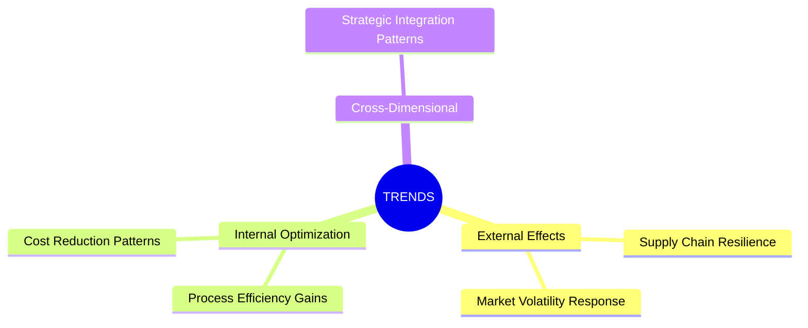
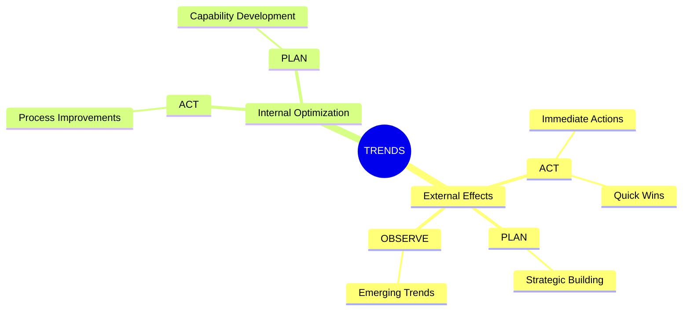
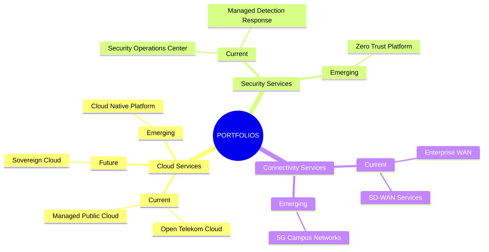

# Phase 5: README Generation

Generate README files for the trends folder with hierarchical provenance chain mindmaps:

| Folder | Mindmap Structure | Generated By |
|--------|-------------------|--------------|
| `11-trends/` | TRENDS → dimensions → trends | trends-creator |
| `11-trends/` (dimension-scoped) | dimension → planning_horizon → trends | trends-creator |
| `11-trends/` (b2b-ict-portfolio) | PORTFOLIOS → dimensions (7) → service_horizon → portfolios | trends-creator |

**NOTE:** README files are placed in entity root directories (e.g., `11-trends/README.md`), while entity files remain in `/data/` subdirectories (e.g., `11-trends/data/trend-*.md`).

**Checksum:** `phase-5-readme-generation-v2.0.0-standardized-template`

Output this checksum after reading to confirm reference loading.

**⚠️ BREAKING CHANGE in v2.0.0:** The README template is now PRESCRIPTIVE with 10 mandatory sections in fixed order. Previous freeform generation has been replaced with strict formatting rules to ensure consistency across all dimension READMEs.

---

## Entry Gate

Verify Phase 4 complete and trend data available:

```bash
# Phase 4 must have completed
test ${trends_created:-0} -ge 0

# Check for trends
TREND_COUNT=$(find "${PROJECT_PATH}/11-trends" -name "trend-*.md" 2>/dev/null | wc -l)
```

**IF no trends created:** Skip README generation, proceed to Phase 6 validation.

---

## Step 0.1: Load Project Language

Read project language from sprint-log.json and load translation map:

```bash
PROJECT_LANGUAGE=$(jq -r '.project_language // "en"' "${PROJECT_PATH}/.metadata/sprint-log.json")
log_conditional INFO "Project language: ${PROJECT_LANGUAGE}"
```

### Language Translation Map

Use this map to translate all README headings and labels to the project language:

| English (en) | German (de) | Dutch (nl) | French (fr) |
|--------------|-------------|------------|-------------|
| Trends | Trends | Trends | Tendances |
| Statistics | Statistiken | Statistieken | Statistiques |
| Mindmap | Mindmap | Mindmap | Carte mentale |
| Entity Index | Entitätsindex | Entiteitsindex | Index des entités |
| Provenance Chain | Herkunftskette | Herkomst keten | Chaîne de provenance |
| Research Methodology | Forschungsmethodik | Onderzoeksmethodologie | Méthodologie de recherche |
| Key Discoveries | Wichtige Erkenntnisse | Belangrijke ontdekkingen | Découvertes clés |
| Type | Typ | Type | Type |
| Entity | Entität | Entiteit | Entité |
| Link | Link | Link | Lien |
| Research Trends Overview | Übersicht Forschungstrends | Overzicht onderzoekstrends | Aperçu des tendances de recherche |
| Dimension Trends | Dimensionstrends | Dimensie-trends | Tendances dimensionnelles |
| Planning Horizon | Planungshorizont | Planningshorizon | Horizon de planification |
| Claims | Behauptungen | Claims | Affirmations |
| Metric | Metrik | Metriek | Métrique |
| Value | Wert | Waarde | Valeur |
| Count | Anzahl | Aantal | Nombre |
| Dimensions Covered | Abgedeckte Dimensionen | Gedekte dimensies | Dimensions couvertes |
| Total Claim References | Gesamte Claim-Referenzen | Totale claimreferenties | Total des références de revendication |
| Avg Claims per Trend | Durchschn. Claims pro Trend | Gem. claims per trend | Moyenne de revendications par tendance |
| Generated by | Erstellt von | Gegenereerd door | Généré par |
| Hierarchical view of trends for | Hierarchische Ansicht der Einsichten für | Hiërarchische weergave van inzichten voor | Vue hiérarchique des perspectives pour |
| No trends generated | Keine Einsichten generiert | Geen inzichten gegenereerd | Aucun aperçu généré |
| Possible Reasons | Mögliche Gründe | Mogelijke redenen | Raisons possibles |
| No trends available | Keine Einsichten verfügbar | Geen inzichten beschikbaar | Aucun aperçu disponible |

**CRITICAL:** All README content (headings, descriptions, table headers, labels) MUST be generated in `PROJECT_LANGUAGE`. Only filenames, YAML keys, and wikilink paths remain in English.

---

## Step 0.5: TodoWrite Expansion

```markdown
ADD to TodoWrite:
- Phase 5.1: Load dimension metadata and trends for THIS dimension [in_progress]
- Phase 5.2: Build mermaid mindmap for this dimension [pending]
- Phase 5.3: Assemble README-{DIMENSION}.md content [pending]
- Phase 5.4: Write README-{DIMENSION}.md using Write tool (BLOCKING) [pending]
- Phase 5.5: Validate README-{DIMENSION}.md exists and has content [pending]
```

---

## Step 0: Build Dimension-Trend Mapping (LLM Task)

Build a hierarchical mapping of trends organized by dimension to enable hierarchical README generation.

### 0.1 Load Trends

```bash
TREND_FILES=()
for file in "${PROJECT_PATH}/11-trends/data/"trend-*.md; do
  [ -f "$file" ] && TREND_FILES+=("$file")
done

log_conditional INFO "Found ${#TREND_FILES[@]} trend entities"
```

For each trend file, extract:

| Field | Source |
|-------|--------|
| `dc:title` | `dc:title:` field in frontmatter |
| `trend_slug` | Filename without .md extension |
| `dimension` | `dimension:` field in frontmatter (dimension-scoped mode) |
| `planning_horizon` | `planning_horizon:` field in frontmatter (smarter-service) |
| `claim_refs` | `claim_refs:` array in frontmatter |

### 0.2 Group by Dimension

For each trend file in `11-trends/data/`:

1. **Read frontmatter** using Read tool
2. **Extract dimension** (if present, else use "cross-dimensional")
3. **Extract planning_horizon** (if present, else null)
4. **Extract metadata:**
   - `dc:title` for mindmap label (truncate to 40 chars)
   - `claim_refs` count for statistics

### 0.25 Load This Agent's Dimension Metadata

**⛔ PARALLEL EXECUTION FIX:** Each agent processes ONLY its assigned dimension.

The `DIMENSION` parameter is passed to this agent via the prompt (e.g., `--dimension externe-effekte`). Load metadata only for this dimension.

```bash
# PARALLEL-SAFE: Load ONLY this agent's assigned dimension metadata
# DIMENSION is extracted from the agent prompt in Phase 1

# Find the dimension file matching this agent's assigned dimension
DIMENSION_FILE=""
for dim_file in "${PROJECT_PATH}/01-research-dimensions/data/"dimension-*.md; do
  if [ -f "$dim_file" ]; then
    filename=$(basename "$dim_file" .md)
    # Extract slug from filename: dimension-{slug}-{hash}.md
    slug=$(echo "$filename" | sed 's/^dimension-//' | sed 's/-[a-f0-9]\{6,8\}$//')
    if [ "$slug" = "${DIMENSION}" ]; then
      DIMENSION_FILE="$dim_file"
      break
    fi
  fi
done

if [ -z "$DIMENSION_FILE" ]; then
  log_conditional ERROR "Dimension file not found for: ${DIMENSION}"
  exit 1
fi

# Extract dimension name from frontmatter
DIMENSION_NAME=$(grep "^dc:title:" "$DIMENSION_FILE" | sed 's/^dc:title:[[:space:]]*//' | tr -d '"')

log_conditional INFO "Loaded dimension metadata: ${DIMENSION} (${DIMENSION_NAME})"
```

**Note:** The orchestrator (`deeper-research-3`) is responsible for ensuring all dimensions get their READMEs by invoking one agent per dimension.

---

### 0.3 Build Hierarchical Mapping

**IMPORTANT:** Initialize ALL dimensions from filesystem first (from Step 0.25), then populate with trend data.

**Data structure:**

```yaml
dimension_trends:
  # STEP 1: Initialize ALL dimensions from filesystem (Step 0.25)
  # This ensures every dimension gets a README, even with 0 trends
  problem:
    dimension_name: "Problem"
    dimension_slug: "dimension-problem-abc123"
    trends: []  # Empty initially - will be populated below
  customer-segments:
    dimension_name: "Customer Segments"
    dimension_slug: "dimension-customer-segments-def456"
    trends: []
  # ... repeat for ALL dimensions from ALL_DIMENSION_SLUGS

  # STEP 2: Populate trends from Step 0.1 data
  # FOR EACH trend loaded in Step 0.1:
  #   dimension = trend.dimension (from frontmatter)
  #   IF dimension exists in dimension_trends:
  #     APPEND trend to dimension_trends[dimension].trends

  # Example after population:
  external-effects:
    dimension_name: "External Effects"
    dimension_slug: "dimension-external-effects-abc123"
    trends:
      - title: "Supply Chain Resilience Patterns"
        slug: "trend-supply-chain-abc123"
        planning_horizon: "act"
        claim_count: 4
      - title: "Market Volatility Response Strategies"
        slug: "trend-market-volatility-def456"
        planning_horizon: "plan"
        claim_count: 3
  internal-optimization:
    dimension_name: "Internal Optimization"
    trends: []  # May remain empty if no trends for this dimension
  cross-dimensional:
    dimension_name: "Cross-Dimensional"
    trends:
      # Trends without dimension tag
```

**Critical difference from previous behavior:** Dimensions with 0 trends will exist in the mapping and receive a README file with empty statistics.

### 0.4 Detect Generation Mode

Check if dimension-scoped mode was used:

```bash
# Check if trends have dimension tags
dimension_scoped=false
for file in "${TREND_FILES[@]}"; do
  if grep -q "^dimension:" "$file"; then
    dimension_scoped=true
    break
  fi
done

# Check if smarter-service (has planning_horizon)
smarter_service=false
for file in "${TREND_FILES[@]}"; do
  if grep -q "^planning_horizon:" "$file"; then
    smarter_service=true
    break
  fi
done

# Check if b2b-ict-portfolio (has entity_type: portfolio)
b2b_ict_portfolio=false
for file in "${TREND_FILES[@]}"; do
  if grep -q "^entity_type: portfolio" "$file"; then
    b2b_ict_portfolio=true
    break
  fi
done

log_conditional INFO "Generation mode: dimension_scoped=${dimension_scoped}, smarter_service=${smarter_service}, b2b_ict_portfolio=${b2b_ict_portfolio}"
```

**Mark 5.0 complete.**

---

## Step 0.5: Generate Per-Dimension README (MANDATORY - BLOCKING)

**⛔ CRITICAL REQUIREMENT - YOU MUST GENERATE THIS README BEFORE PROCEEDING**

This agent is invoked once per dimension. You MUST generate exactly ONE README for your assigned dimension before continuing to Step 1.

**Failure to generate this README is a Phase 5 failure.**

**Output File:** `${PROJECT_PATH}/11-trends/README-${DIMENSION_SLUG}.md`

Example: If `--dimension externe-effekte` → generate `README-externe-effekte.md`

**NOTE:** README is placed in entity root (`11-trends/`), not in `/data/` subdirectory.

### 0.5.1 Build Per-Dimension Mermaid Mindmap

**Structure for smarter-service:** `Dimension (root) -> Horizon -> TIPS`

**Template (smarter-service):**

```markdown
## Dimension Trends Mindmap

```mermaid
mindmap
  root(({Dimension Name}))
    ACT
      {TIPS Title 1}
      {TIPS Title 2}
      {TIPS Title 3}
    PLAN
      {TIPS Title 1}
      {TIPS Title 2}
      {TIPS Title 3}
    OBSERVE
      {TIPS Title 1}
      {TIPS Title 2}
      {TIPS Title 3}
```
```

**Structure for b2b-ict-portfolio:** `dimension (root) -> service_horizon -> portfolios`

**Template (b2b-ict-portfolio):**

```markdown
## Portfolio Catalog Mindmap

```mermaid
mindmap
  root(({Dimension Name}))
    Current
      {Portfolio Name 1}
      {Portfolio Name 2}
    Emerging
      {Portfolio Name 1}
    Future
      {Portfolio Name 1}
```
```

**Structure for other types:** `dimension (root) -> trends`

**Template (standard):**

```markdown
## Dimension Trends Mindmap

```mermaid
mindmap
  root(({Dimension Name}))
    {Trend Title 1}
    {Trend Title 2}
    {Trend Title 3}
```
```

**Node formatting:**

- **Root node:** `root(({Dimension Name}))` - Central node with dimension name
- **Horizon nodes (smarter-service):** Indent 4 spaces, horizon label
- **Trend nodes:** Indent appropriately, trend title (max 40 chars)

### 0.5.2 Build Entity Index Table

Create table with wikilinks for full provenance chain:

**For smarter-service (trends with planning horizons):**

```markdown
## Entity Index

| Type | Entity | Planning Horizon | Claims | Link |
|------|--------|------------------|--------|------|
| Dimension | External Effects | - | - | [[01-research-dimensions/data/dimension-external-effects-abc123]] |
| Trend | Supply Chain Resilience | ACT | 4 | [[11-trends/data/trend-[a-z]upply-chain-abc123]] |
| Trend | Market Volatility Response | PLAN | 3 | [[11-trends/data/trend-[a-z]arket-volatility-def456]] |
```

**For b2b-ict-portfolio (portfolio entities with service horizons):**

```markdown
## Portfolio Entity Index

| Type | Portfolio | Dimension | Service Horizon | Claims | Link |
|------|-----------|-----------|-----------------|--------|------|
| Portfolio | Open Telekom Cloud | Cloud Services | Current | 4 | [[11-trends/data/portfolio-open-telekom-cloud-abc123]] |
| Portfolio | 5G Campus Networks | Connectivity | Emerging | 3 | [[11-trends/data/portfolio-5g-campus-def456]] |
| Portfolio | Sovereign Cloud | Cloud Services | Future | 2 | [[11-trends/data/portfolio-sovereign-cloud-g7h8i9]] |
```

### 0.5.3 Assemble Per-Dimension README

**Output Path:** `${PROJECT_PATH}/11-trends/README-{dimension-slug}.md`

**NOTE:** README is placed in entity root (`11-trends/`), not in `/data/` subdirectory.

**Naming Convention:** Use dimension slug without `dimension-` prefix and hash
- Example: `dimension-external-effects-abc123` → `README-external-effects.md`
- Example: `dimension-problem-a1b2c3d4` → `README-problem.md`

**⚠️ NAMING REQUIREMENT:**

- ✅ CORRECT: `README-problem.md` (hyphen after README)
- ✅ CORRECT: `README-customer-segments.md` (hyphen after README)
- ❌ WRONG: `README_problem.md` (underscore after README)
- ❌ WRONG: `readme-problem.md` (lowercase README)

**Template:**

**IMPORTANT:** All text in this template MUST be translated to `PROJECT_LANGUAGE` using the Language Translation Map from Step 0.1.

**⚠️ STRICT ENFORCEMENT:** This template is PRESCRIPTIVE. Follow it EXACTLY with NO deviations in structure, section order, or table formats.

```markdown
---
title: "Trends: {Dimension Name}"
generated_by: trends-creator
generated_at: {YYYY-MM-DDTHH:MM:SSZ}
dimension: "{dimension-slug}"
trend_count: {N}
research_type: {research_type}
---

# Trends: {Dimension Name}

**Dimension:** {Dimension Name}
**Generated:** {YYYY-MM-DDTHH:MM:SSZ}
**Trends Count:** {N}
**Research Type:** {research_type}

## Overview

This document provides navigation for trends synthesized from the **{Dimension Name}** research dimension. [1-2 sentence description of what this dimension addresses].

## Trend Summary

| Trend | Planning Horizon | Quality | Key Theme |
|-------|------------------|---------|-----------|
| [[11-trends/data/{trend-slug}|{Short Title}]] | {act/plan/observe} | {High/Medium/Low} ({score}) | {15-20 word summary} |
| [[11-trends/data/{trend-slug}|{Short Title}]] | {act/plan/observe} | {High/Medium/Low} ({score}) | {15-20 word summary} |

**Quality Calculation:** `(confidence_score + evidence_quality) / 2`

## Planning Horizon Distribution

```mermaid
mindmap
  root(({Dimension Name}))
    act
      {Trend Title 1}
        {Key metric or fact}
        {Key metric or fact}
        {Key metric or fact}
      {Trend Title 2}
        {Key metric or fact}
        {Key metric or fact}
    plan
      {Trend Title 3}
        {Key metric or fact}
        {Key metric or fact}
    observe
      {Trend Title 4}
        {Key metric or fact}
```

**Mindmap Structure Rules:**
- Root node: `root(({Dimension Name}))`
- Level 1: Planning horizons (act/plan/observe) - lowercase
- Level 2: Trend titles (max 40 chars)
- Level 3: 2-3 key metrics/facts per trend (max 30 chars each)

## Research Questions Addressed

### Question: {Question Title}
- [[11-trends/data/{trend-slug}|{Trend Title}]]
- [[11-trends/data/{trend-slug}|{Trend Title}]]

[Repeat for each refined question that has trends]

## Key Findings Coverage

The trends synthesize evidence from {N} findings and {N} claims specific to this dimension, including:

- {Notable finding or partnership}
- {Notable finding or partnership}
- {Notable finding or partnership}
- {Notable finding or partnership}
- {Notable finding or partnership}

## Evidence Quality

| Metric | Value |
|--------|-------|
| Average Trend Confidence | {0.XX} |
| High-Quality Trends (composite >= 0.75) | {N}/{TOTAL} |
| Claims per Trend (avg) | {N} |
| Evidence Freshness | {Description} |

## Navigation

- **Parent Dimension:** [[01-research-dimensions/data/{dimension-slug}|{Dimension Name}]]
- **Refined Questions:** [[02-refined-questions/data/|View all questions]]
- **Source Findings:** [[04-findings/data/|View all findings]]
- **Claims:** [[10-claims/data/|View all claims]]
```

**MANDATORY SECTIONS (in exact order):**

1. **Frontmatter** - YAML with exact fields shown
2. **H1 Title** - Format: `# Trends: {Dimension Name}`
3. **Metadata Block** - Bold key-value pairs (Dimension, Generated, Trends Count, Research Type)
4. **Overview** - 2-3 sentences describing the dimension
5. **Trend Summary** - Table with Trend/Planning Horizon/Quality/Key Theme columns
6. **Planning Horizon Distribution** - Mermaid mindmap with 3-level hierarchy
7. **Research Questions Addressed** - Grouped by question with wikilinks
8. **Key Findings Coverage** - Paragraph + bullet list of notable evidence
9. **Evidence Quality** - 4-row table with specific metrics
10. **Navigation** - 4 wikilinks to parent/related entities

**FORBIDDEN:**
- ❌ Adding sections not in this template
- ❌ Changing section order
- ❌ Changing table column headers or order
- ❌ Using different mermaid node formats
- ❌ Omitting any mandatory section (except Research Questions if none exist)

**Variable Handling:**
- **Planning Horizon:** Use lowercase: `act`, `plan`, `observe`
- **Quality Score:** Calculate as `(confidence_score + evidence_quality) / 2`, display as `High (0.85)` format
- **Timestamps:** Use ISO 8601 format with timezone: `2026-02-02T14:30:00Z`
- **Dimension Name:** Use full name from dimension entity `dc:title` field
- **dimension-slug:** Use kebab-case from dimension filename (no hash)

### 0.5.3b Empty Dimension README Template

**Use when dimension has 0 trends:**

**IMPORTANT:** All text in this template MUST be translated to `PROJECT_LANGUAGE` using the Language Translation Map from Step 0.1.

**⚠️ STRICT ENFORCEMENT:** This template is PRESCRIPTIVE. Follow it EXACTLY with NO deviations in structure or section order.

```markdown
---
title: "Trends: {Dimension Name}"
generated_by: trends-creator
generated_at: {YYYY-MM-DDTHH:MM:SSZ}
dimension: "{dimension-slug}"
trend_count: 0
research_type: {research_type}
---

# Trends: {Dimension Name}

**Dimension:** {Dimension Name}
**Generated:** {YYYY-MM-DDTHH:MM:SSZ}
**Trends Count:** 0
**Research Type:** {research_type}

## Overview

This document represents the **{Dimension Name}** research dimension. No trends were generated for this dimension during synthesis.

## Trend Summary

*No trends generated.*

## Planning Horizon Distribution

```mermaid
mindmap
  root(({Dimension Name}))
    (No Trends Generated)
```

## Possible Reasons

- Insufficient source data for this dimension
- Claims did not meet minimum threshold (3+ per trend)
- No synthesizable patterns identified from available evidence

## Evidence Quality

| Metric | Value |
|--------|-------|
| Average Trend Confidence | N/A |
| High-Quality Trends (composite >= 0.75) | 0/0 |
| Claims per Trend (avg) | N/A |
| Evidence Freshness | N/A |

## Navigation

- **Parent Dimension:** [[01-research-dimensions/data/{dimension-slug}|{Dimension Name}]]
- **Refined Questions:** [[02-refined-questions/data/|View all questions]]
- **Source Findings:** [[04-findings/data/|View all findings]]
- **Claims:** [[10-claims/data/|View all claims]]
```

**MANDATORY SECTIONS (in exact order):**

1. **Frontmatter** - YAML with exact fields shown
2. **H1 Title** - Format: `# Trends: {Dimension Name}`
3. **Metadata Block** - Bold key-value pairs (Dimension, Generated, Trends Count, Research Type)
4. **Overview** - 1-2 sentences explaining no trends
5. **Trend Summary** - Italic text: `*No trends generated.*`
6. **Planning Horizon Distribution** - Mermaid mindmap with "No Trends Generated" node
7. **Possible Reasons** - 3-bullet list with standard reasons
8. **Evidence Quality** - 4-row table with N/A values
9. **Navigation** - 4 wikilinks to parent/related entities

**FORBIDDEN:**
- ❌ Adding extra sections
- ❌ Changing section order
- ❌ Removing any mandatory section

---

### 0.5.4 Write README File (BLOCKING)

**⛔ PARALLEL EXECUTION FIX:** Write ONLY this agent's assigned dimension README.

Each trends-creator agent is invoked with a specific `--dimension` parameter. To avoid race conditions when multiple agents run in parallel, each agent writes ONLY its own dimension's README file.

**⛔ MANDATORY ACTION - USE WRITE TOOL:**

You MUST use the Claude Code **Write** tool to create the file. Do NOT use bash echo, cat, or heredoc.

```
Write(
  file_path="${PROJECT_PATH}/11-trends/README-${DIMENSION}.md",
  content=<assembled README content from Step 0.5.3 template>
)
```

**File path pattern:**

```bash
README_PATH="${PROJECT_PATH}/11-trends/README-${DIMENSION}.md"
```

**Content selection:**

- If dimension has 0 trends → Use empty template from Step 0.5.3b
- If dimension has 1+ trends → Use populated template from Step 0.5.3

**⛔ IF WRITE FAILS: STOP. Do not proceed to Phase 6.**

**⚠️ NAMING CONVENTION:**

- ✅ CORRECT: `README-problem.md` (hyphen after README)
- ✅ CORRECT: `README-customer-segments.md` (hyphen after README)
- ❌ WRONG: `README_problem.md` (underscore after README)
- ❌ WRONG: `readme-problem.md` (lowercase README)
- ❌ WRONG: `README.md` (no dimension suffix - orchestrator only)

### 0.5.5 Validate README Written (BLOCKING)

**Before proceeding to Step 1, VERIFY this agent's dimension README was created:**

```bash
# PARALLEL-SAFE: Validate ONLY this agent's dimension README was created
# NOTE: README is placed in entity root, not in /data/ subdirectory
README_PATH="${PROJECT_PATH}/11-trends/README-${DIMENSION}.md"

if [ ! -f "${README_PATH}" ]; then
  log_conditional ERROR "BLOCKING: README not created for dimension: ${DIMENSION}"
  log_conditional ERROR "Expected file: ${README_PATH}"
  # DO NOT PROCEED - return to 0.5.4
  exit 1
fi

log_conditional INFO "README-${DIMENSION}.md created successfully"
```

**Self-check:** Did I write `README-{DIMENSION}.md` for my assigned dimension? YES required to continue.

**Mark 5.0.5 complete.**

---

## Step 1: Collect Trend Data (SKIP - Already Done in Step 0)

**⛔ NOTE:** This step is for reference only. The data collection for your dimension's README was already completed in Steps 0.1-0.3 (Load dimension metadata, Build mindmap, Assemble content).

**Skip directly to Step 4 (Verify README Creation).**

The sections below document the data structures used, but you should NOT re-execute them after Step 0.5.4.

---

### 1.1 List Trend Entities (Reference Only)

```bash
TREND_FILES=()
for file in "${PROJECT_PATH}/11-trends/data/"trend-*.md; do
  [ -f "$file" ] && TREND_FILES+=("$file")
done

log_conditional INFO "Found ${#TREND_FILES[@]} trend entities"
```

### 1.2 Extract Trend Metadata (LLM Reasoning)

For each trend file, read and extract:

| Field | Source |
|-------|--------|
| `trend_title` | `dc:title:` field in frontmatter |
| `trend_slug` | Filename without .md extension |
| `dimension` | `dimension:` field in frontmatter (optional) |
| `planning_horizon` | `planning_horizon:` field in frontmatter (optional) |
| `claim_refs` | `claim_refs:` array in frontmatter |

**Build data structure:**

```yaml
trends:
  - title: "Trend Title"
    slug: "trend-slug-abc123"
    dimension: "external-effects"
    planning_horizon: "act"
    claim_count: 4
```

**Mark 5.1 complete.**

---

## Step 2: Build Mermaid Mindmap (SKIP - Already Done in Step 0.5.1)

**⛔ NOTE:** This step is for reference only. The mindmap for your dimension was already built in Step 0.5.1.

**Skip directly to Step 4 (Verify README Creation).**

The cross-dimensional examples below are for the orchestrator's main README (Phase 8.5), not for individual agents.

---

### 2.1 Cross-Dimensional Mode Mindmap (Orchestrator Only - NOT for agents)

**Structure:** `TRENDS (root) -> dimensions -> trends`

**Template:**

```markdown
## Research Trends Mindmap

```mermaid
mindmap
  root((TRENDS))
{{DIMENSION_TREND_NODES}}
```
```

**Node formatting:**

- **Root node:** `root((TRENDS))` - Central node with double parentheses
- **Dimension nodes:** Indent 4 spaces, dimension name (max 40 chars)
- **Trend nodes:** Indent 6 spaces, trend title (max 40 chars)

**Example output (cross-dimensional):**



### 2.2 Dimension-Scoped Mode Mindmap (smarter-service)

**Structure:** `TRENDS (root) -> dimensions -> planning_horizons -> trends`

**Example output:**



### 2.3 Portfolio Mode Mindmap (b2b-ict-portfolio)

**Structure:** `PORTFOLIOS (root) -> dimensions (7) -> service_horizons -> portfolios`

**Example output:**



**Portfolio Radar Summary Table:**

| Dimension | Current | Emerging | Future | Total |
|-----------|---------|----------|--------|-------|
| Cloud Services | {N} | {N} | {N} | {N} |
| Consulting Services | {N} | {N} | {N} | {N} |
| Connectivity Services | {N} | {N} | {N} | {N} |
| Security Services | {N} | {N} | {N} | {N} |
| Digital Workplace | {N} | {N} | {N} | {N} |
| Application Services | {N} | {N} | {N} | {N} |
| Managed Infrastructure | {N} | {N} | {N} | {N} |
| **Total** | **{N}** | **{N}** | **{N}** | **{N}** |

### 2.4 Build Entity Index Table

Create table with wikilinks for all entities:

```markdown
## Entity Index

| Type | Entity | Dimension | Planning Horizon | Claims | Link |
|------|--------|-----------|------------------|--------|------|
| Trend | Supply Chain Resilience | External Effects | ACT | 4 | [[11-trends/data/trend-[a-z]upply-chain-abc123]] |
| Trend | Market Volatility Response | External Effects | PLAN | 3 | [[11-trends/data/trend-[a-z]arket-volatility-def456]] |
```

**Mark 5.2 complete.**

---

## Step 3: Skip Main README Generation (PARALLEL EXECUTION FIX)

**⛔ PARALLEL EXECUTION FIX:** Do NOT generate `11-trends/README.md` in individual agents.

### Why Skip Main README?

When multiple trends-creator agents run in parallel (one per dimension), each agent would attempt to write the main `11-trends/README.md` file, causing race conditions where only the last-writing agent's content would survive.

### Solution

The main `11-trends/README.md` is generated by the orchestrator (`deeper-research-3`) in Phase 8.5 AFTER all trends-creator agents complete. This ensures:

1. All dimension trends are available
2. Single write operation (no race condition)
3. Complete cross-dimensional mindmap

### Agent Responsibility

Each trends-creator agent is responsible for:

- ✅ Writing `README-{DIMENSION}.md` for its assigned dimension (Step 0.5)
- ❌ NOT writing `11-trends/README.md` (orchestrator responsibility)

```bash
# DO NOT generate main README in individual agents
log_conditional INFO "Skipping main README.md generation (handled by orchestrator Phase 8.5)"
```

**Mark 5.3 complete** (skip step).

---

## Step 4: Verify README Creation

Validate this agent's dimension README was created successfully.

### 4.1 Validation Checks

| Check | Requirement | Action on Failure |
|-------|-------------|-------------------|
| Dimension README exists | File at `11-trends/README-{DIMENSION}.md` | Log error, return to Step 0.5 |
| File size | >300 bytes (not empty) | Log warning, continue |
| Mermaid block | Contains ```mermaid section | Log warning, continue |
| Trend count | At least one trend node (or empty template) | Log warning, continue |

### 4.2 Log Results

```bash
# PARALLEL-SAFE: Validate ONLY this agent's dimension README
DIMENSION_README_PATH="${PROJECT_PATH}/11-trends/README-${DIMENSION}.md"
dimension_readme_created=false

if [ -f "${DIMENSION_README_PATH}" ]; then
  dimension_readme_created=true
  log_conditional INFO "Dimension README created: ${DIMENSION_README_PATH}"
else
  log_conditional ERROR "Dimension README NOT created: ${DIMENSION_README_PATH}"
fi

# Note: Main README (11-trends/README.md) is generated by orchestrator in Phase 8.5
log_conditional INFO "Main README.md: skipped (orchestrator Phase 8.5 responsibility)"
log_conditional INFO "Dimension README-${DIMENSION}.md: ${dimension_readme_created}"

log_phase "Phase 5: README Generation" "complete"
```

**Mark 5.4 complete.**

---

## Self-Verification Questions

Answer YES to all before proceeding:

1. Did I load PROJECT_LANGUAGE from sprint-log.json? YES/NO
2. Did I build the dimension-trend mapping for MY assigned dimension? YES/NO
3. Did I detect the generation mode (dimension-scoped, smarter-service)? YES/NO
4. Did I load ONLY my assigned dimension's metadata (Step 0.25)? YES/NO
5. Did I generate per-dimension README for ONLY my assigned dimension (README-{DIMENSION}.md)? YES/NO
6. Did I collect trend entities from `11-trends/data/` for my dimension only? YES/NO
7. Did I extract planning_horizon for smarter-service trends? YES/NO
8. Did I use wikilinks in the Entity Index tables? YES/NO
9. Did I use the Write tool (not bash echo) to create README? YES/NO
10. Did I truncate long names to maintain mindmap readability? YES/NO
11. Did I use hyphen (not underscore) in `README-{slug}.md` filename? YES/NO
12. Did I **SKIP** generating main `11-trends/README.md`? YES/NO (orchestrator generates this)
13. **Did I translate ALL headings and labels to PROJECT_LANGUAGE?** YES/NO
14. **Did I generate Provenance Chain synthesis (200-300 words) for my dimension README?** YES/NO

**IF ANY NO:** Return to incomplete step.

---

## Phase Completion Checklist

Before marking Phase 5 complete, verify:

- [ ] PROJECT_LANGUAGE loaded from sprint-log.json
- [ ] This agent's dimension metadata loaded (Step 0.25)
- [ ] Dimension-trend mapping built for assigned dimension
- [ ] Generation mode detected (dimension-scoped, smarter-service)
- [ ] Per-dimension README written for THIS agent's dimension only (README-{DIMENSION}.md)
- [ ] Trend entities collected for this dimension
- [ ] Main trends README **SKIPPED** (orchestrator generates this in Phase 8.5)
- [ ] README contains Entity Index table with wikilinks
- [ ] Hyphen naming convention used (README-{slug}.md)
- [ ] **All headings and labels translated to PROJECT_LANGUAGE**
- [ ] **Provenance Chain section with 200-300 word synthesis in README**
- [ ] All step todos completed

---

## Error Handling

**⛔ Phase 5 Step 0.5.4 (Write README) is BLOCKING.** If the Write tool fails, do NOT proceed to Phase 6.

| Error | Action |
|-------|--------|
| No trends created | Use empty template (Step 0.5.3b), still write README |
| **Write tool failure** | **STOP. Do not proceed to Phase 6. Report error.** |
| Missing dimension field | Group under "Cross-Dimensional" |
| Missing planning_horizon | Omit horizon column for that trend |
| README-{DIMENSION}.md not created | **STOP. Return to Step 0.5.4.** |

---

## Output

Phase 5 updates the JSON response with README stats:

```json
{
  "success": true,
  "trends_created": 8,
  "readme_generation": {
    "main_readme": false,
    "main_readme_note": "Generated by orchestrator in Phase 8.5",
    "dimension_readme": "README-external-effects.md",
    "dimension": "external-effects",
    "trends_in_mindmap": 8,
    "total_claims": 32
  }
}
```

If README generation skipped:

```json
{
  "readme_generation": {
    "main_readme": false,
    "skip_reason": "No trends created"
  }
}
```

---

## Anti-Hallucination Protocol

| Rule | Enforcement |
|------|-------------|
| No fabricated entities | Only reference trends created in Phase 4 |
| No fabricated dimensions | Only reference dimensions from trend frontmatter |
| Accurate counts | Statistics derived from actual trend files |
| Valid wikilinks | All links point to existing files |

---

## Wikilink Format Requirements

**CRITICAL:** When generating wikilinks for Entity Index tables, follow these exact rules:

| Requirement | Example |
|-------------|---------|
| Format | `[[directory/data/entity-slug]]` |
| NO trailing backslashes | ❌ `[[11-trends/data/trend-[a-z]bc123\]]` |
| NO trailing slashes | ❌ `[[11-trends/data/trend-[a-z]bc123/]]` |
| NO spaces in paths | ❌ `[[11-trends/data/trend abc123]]` |
| NO `.md` extension | ❌ `[[11-trends/data/trend-[a-z]bc123.md]]` |
| Correct | ✅ `[[11-trends/data/trend-[a-z]bc123]]` |

**Example Entity Index row:**

```markdown
| Trend | Supply Chain Resilience | ACT | 4 | [[11-trends/data/trend-[a-z]upply-chain-abc123]] |
```

**NOT:**

```markdown
| Trend | Supply Chain Resilience | ACT | 4 | [[11-trends/data/trend-[a-z]upply-chain-abc123\]] |
```

---

*End of Phase 5: README Generation*
