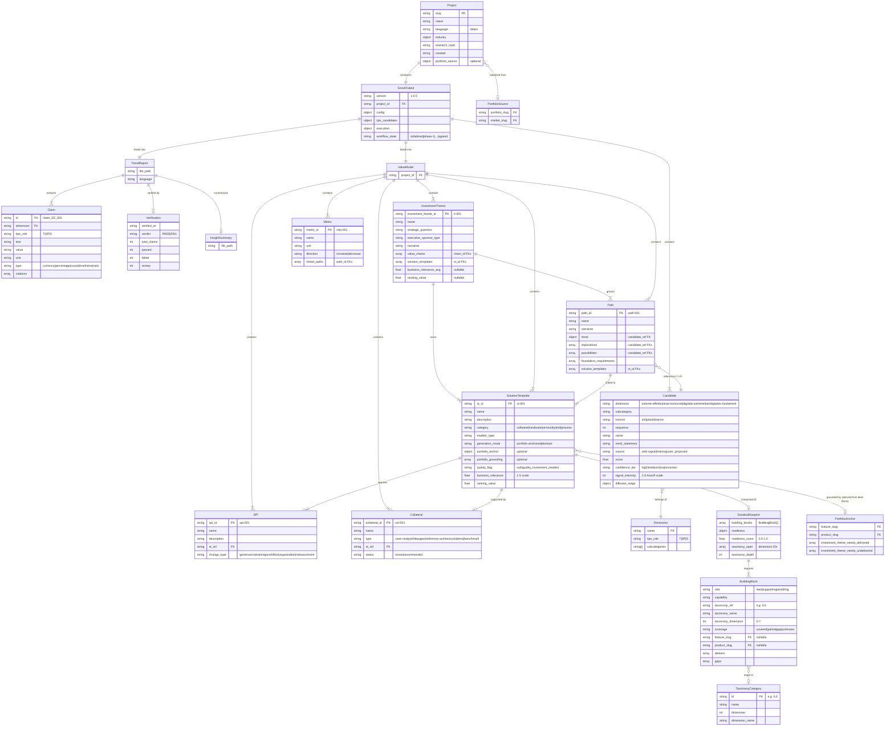

# cogni-trends Data Model Reference

## Project Structure

```
cogni-trends/{project-slug}/
├── tips-project.json              # Root manifest (project config + metadata)
├── trend-candidates.md            # Human-readable candidate presentation (Phase 3)
├── tips-trend-report.md           # Final assembled report (trend-report)
├── tips-trend-report-claims.json  # Merged claims registry (trend-report)
├── tips-insight-summary.md        # Narrative insight summary (trend-report Phase 2.5)
├── .metadata/                     # Workflow state + execution data
│   ├── trend-scout-output.json    # Consolidated scout output (config + candidates + state)
│   ├── candidate-review-verdicts/ # Stakeholder review verdicts (Phase 2.5)
│   │   ├── v1.json                # First review iteration verdict
│   │   └── v2.json                # Second review iteration verdict (if revision needed)
│   └── trend-report-verification.json  # Claim verification results
├── .logs/                         # Debug/audit trail (agent outputs)
│   ├── web-research-raw.json      # Full web research signals
│   ├── trend-generator-candidates.json  # Full candidate generation data
│   ├── candidates-compact.json    # Compact format for Phase 3
│   ├── report-header.md           # Report header section
│   ├── report-section-{dimension}.md   # Per-dimension report sections (4 files)
│   ├── claims-{dimension}.json    # Per-dimension claims (4 files)
│   ├── report-portfolio.md        # Portfolio analysis section
│   └── report-claims-registry.md  # Claims table section
└── phase1-research-summary.json   # Fallback copy of web research response
```

## Entity Schemas

### tips-project.json (Project Root)

Lightweight root manifest for project discovery and resume. Created during Phase 0, updated as workflow progresses.

```json
{
  "slug": "automotive-ai-predictive-maintenance-abc12345",
  "name": "Automotive AI Predictive Maintenance",
  "language": "de",
  "industry": {
    "primary": "manufacturing",
    "primary_en": "Manufacturing",
    "primary_de": "Fertigung",
    "subsector": "automotive",
    "subsector_en": "Automotive",
    "subsector_de": "Automobil"
  },
  "research_topic": "AI-driven predictive maintenance",
  "created": "2026-01-15T10:30:00Z",
  "updated": "2026-01-16T14:20:00Z"
}
```

Required fields: `slug`, `name`, `language`, `industry`, `research_topic`, `created`
Optional fields: `updated`, `portfolio_source`

The `portfolio_source` field is set when the project was initialized from a cogni-portfolio market (via Step 0.1c portfolio discovery). It links the TIPS project to a specific portfolio market for later bridge operations:

```json
{
  "portfolio_source": {
    "portfolio_slug": "acme-corp",
    "market_slug": "mid-market-saas-dach"
  }
}
```

The `language` field is a lowercase ISO 639-1 code (`"de"` or `"en"`). Controls the language of all generated user-facing content. JSON field names and slugs remain in English.

The `industry` object uses bilingual names for web research queries. The `primary` and `subsector` fields are slug-format identifiers; `_en` and `_de` variants are display names.

### trend-scout-output.json (Scout Output)

Location: `.metadata/trend-scout-output.json`

Consolidated output from the trend-scout skill containing project config, candidate data, scoring metadata, and execution state.

```json
{
  "version": "1.0.0",
  "project_id": "automotive-ai-predictive-maintenance-abc12345",
  "project_language": "de",

  "config": {
    "research_type": "smarter-service",
    "dok_level": 4,
    "industry": {
      "primary": "manufacturing",
      "primary_en": "Manufacturing",
      "primary_de": "Fertigung",
      "subsector": "automotive",
      "subsector_en": "Automotive",
      "subsector_de": "Automobil"
    },
    "research_topic": "AI-driven predictive maintenance",
    "organizing_concept": "ai-driven-predictive-maintenance",
    "portfolio_source": {
      "portfolio_slug": "acme-corp",
      "market_slug": "mid-market-saas-dach",
      "discovered_at": "2026-01-15T10:20:00Z"
    }
  },

  "tips_candidates": {
    "total": 60,
    "source_distribution": {
      "web_signal": 28,
      "training": 32,
    },
    "web_research_status": "success",
    "search_timestamp": "2026-01-15T10:25:00Z",
    "scoring_metadata": {
      "avg_score": 0.68,
      "confidence_distribution": { "high": 12, "medium": 18, "low": 5, "uncertain": 1 },
      "intensity_distribution": { "level_1": 4, "level_2": 6, "level_3": 10, "level_4": 12, "level_5": 4 },
      "indicator_distribution": { "leading": 16, "lagging": 20, "leading_pct": 0.44 },
      "diffusion_distribution": {
        "innovators": 3, "early_adopters": 8, "early_majority": 15,
        "late_majority": 8, "laggards": 2, "pre_chasm": 11, "post_chasm": 25
      },
      "scoring_framework_version": "1.0.0"
    },
    "items": []
  },

  "execution": {
    "workflow_state": "agreed",
    "current_phase": 4,
    "phases_completed": ["phase-0", "phase-1", "phase-2", "phase-3", "phase-4"],
    "agreed_at": "2026-01-15T11:45:00Z"
  },

  "downstream_integration": {
    "source_type": "trend-scout",
    "auto_load_candidates": true,
    "skip_tips_selection": true,
    "auto_configure_research_type": true,
    "auto_configure_dok_level": true,
    "auto_configure_language": true
  }
}
```

Workflow state values (in order): `initialized` → `phase-1` → `phase-2` → `phase-3` → `phase-4` → `agreed`

### Candidate Object

Each candidate in `tips_candidates.items`:

```json
{
  "dimension": "externe-effekte",
  "subcategory": "regulierung",
  "horizon": "act",
  "sequence": 1,
  "name": "EU AI Act Compliance",
  "trend_statement": "The EU AI Act creates immediate compliance requirements...",
  "keywords": ["ai-act", "regulation", "2024"],
  "research_hint": "Investigate implementation timelines and compliance costs...",
  "source": "web-signal",
  "source_url": "https://ec.europa.eu/...",
  "freshness_date": "2024-12",
  "score": 0.82,
  "confidence_tier": "high",
  "signal_intensity": 5,
  "component_scores": {
    "impact": 0.90,
    "probability": 0.95,
    "strategic_fit": 0.75,
    "source_quality": 0.80,
    "signal_strength": 0.85,
    "uncertainty_penalty": 0.02
  },
  "indicator_classification": {
    "type": "leading",
    "lead_time": "12-24m",
    "source_type": "regulatory"
  },
  "diffusion_stage": {
    "stage": "early_majority",
    "estimated_adoption": 0.25,
    "crossed_chasm": true
  }
}
```

Required fields: `dimension`, `subcategory`, `horizon`, `sequence`, `name`, `trend_statement`, `keywords`, `research_hint`, `source`, `score`, `confidence_tier`, `signal_intensity`

Optional fields: `source_url`, `freshness_date`, `component_scores`, `indicator_classification`, `diffusion_stage`

Valid `dimension` values: `externe-effekte`, `neue-horizonte`, `digitale-wertetreiber`, `digitales-fundament`

Valid `subcategory` values per dimension:
- `externe-effekte`: `wirtschaft`, `regulierung`, `gesellschaft`
- `neue-horizonte`: `strategie`, `fuehrung`, `steuerung`
- `digitale-wertetreiber`: `customer-experience`, `produkte-services`, `geschaeftsprozesse`
- `digitales-fundament`: `kultur`, `mitarbeitende`, `technologie`

Valid `horizon` values: `act` (immediate, 0-12 months), `plan` (medium-term, 12-36 months), `observe` (long-term, 36+ months)

Valid `source` values: `web-signal` (discovered via web research), `training` (generated from model knowledge), `user_proposed` (added by user)

Valid `confidence_tier` values: `high` (0.80-1.0), `medium` (0.50-0.79), `low` (0.30-0.49), `uncertain` (<0.30)

`signal_intensity` (Ansoff scale): 1=turbulence, 2=moderate, 3=emerging, 4=clear signal, 5=foreseeable

### Claims Registry

Location: `tips-trend-report-claims.json`

```json
{
  "status": "success",
  "file_path": "tips-trend-report.md",
  "language": "de",
  "total_claims": 42,
  "claims": [
    {
      "id": "claim_EE_001",
      "dimension": "externe-effekte",
      "tips_role": "T",
      "text": "Der globale KI-Markt wird bis 2027 auf 407 Mrd. USD wachsen.",
      "value": "407",
      "unit": "USD Mrd.",
      "type": "currency",
      "context": "Global AI market size projection",
      "qualifiers": ["global", "2027"],
      "citations": [
        { "url": "https://example.com/report", "proximity_confidence": 0.9 }
      ]
    }
  ]
}
```

Claim `id` format: `claim_{DIMENSION_PREFIX}_{SEQ}` where prefix is `EE` (externe-effekte), `DW` (digitale-wertetreiber), `NH` (neue-horizonte), `DF` (digitales-fundament).

Valid `type` values: `currency`, `percentage`, `count`, `timeframe`, `ratio`

### Verification Metadata

Location: `.metadata/trend-report-verification.json`

```json
{
  "verified_at": "2026-01-16T14:20:00Z",
  "verdict": "PASS",
  "total_claims": 42,
  "verified": 42,
  "passed": 38,
  "failed": 2,
  "review": 2
}
```

## Dimension Matrix

| Dimension | TIPS Role | Subcategories | Candidates per Horizon |
|-----------|-----------|---------------|----------------------|
| `externe-effekte` | T (Trends) | wirtschaft, regulierung, gesellschaft | 5 ACT, 5 PLAN, 5 OBSERVE |
| `neue-horizonte` | P (Possibilities) | strategie, fuehrung, steuerung | 5 ACT, 5 PLAN, 5 OBSERVE |
| `digitale-wertetreiber` | I (Implications) | customer-experience, produkte-services, geschaeftsprozesse | 5 ACT, 5 PLAN, 5 OBSERVE |
| `digitales-fundament` | S (Solutions) | kultur, mitarbeitende, technologie | 5 ACT, 5 PLAN, 5 OBSERVE |

**Total**: 4 dimensions x (5 + 5 + 5) = 60 candidates

## Workflow Phases

| Phase | Skill | State Value | What Happens |
|-------|-------|-------------|-------------|
| 0 | trend-scout | `initialized` | Language, industry, topic selection; project creation |
| 1 | trend-scout | `phase-1` | Bilingual web research (32 queries + APIs) |
| 2 | trend-scout | `phase-2` | Generate 60 candidates with multi-framework scoring |
| 3 | trend-scout | `phase-3` | Present candidates (all 60 auto-finalized) |
| 4 | trend-scout | `phase-4` → `agreed` | Finalize output JSON |
| R-0 | trend-report | `agreed` | Load input, validate gate, prep agent inputs |
| R-1 | trend-report | `report-enriching` | 4 parallel agents: evidence + section writing |
| R-2 | trend-report | `report-assembling` | Exec summary + portfolio analysis + assembly |
| R-2.5 | trend-report | `report-insight` | Optional narrative insight summary |
| R-3 | trend-report | `report-verifying` | Optional claim verification |
| R-4 | trend-report | `report-complete` | Finalization + metadata update |
| V-0 | value-modeler | `initialized` | Load scout output, discover portfolio |
| V-1 | value-modeler | `investment-themes-built` | Build investment themes + T→I→P relationship networks |
| V-2 | value-modeler | `solutions-generated` | Generate Solution Templates |
| V-3 | value-modeler | `scored` | Customer-specific BR scoring (1-5) |
| V-4 | value-modeler | `complete` | Apply F1 formula, rank, Big Block diagram |
| V-5 | value-modeler | `curated` | Optional: promote pursuit patterns to industry catalog |

## Entity Relationships



### File Hierarchy

```
tips-project.json (root manifest)
  └── .metadata/trend-scout-output.json (config + candidates + state)
        ├── .metadata/candidate-review-verdicts/v{N}.json (stakeholder review)
        ├── .logs/web-research-raw.json (raw signals -> candidates)
        ├── .logs/trend-generator-candidates.json (60 candidates)
        ├── tips-trend-report.md (report <- candidates)
        │     ├── .logs/report-section-{dimension}.md (4 sections)
        │     ├── tips-trend-report-claims.json (extracted claims)
        │     ├── tips-insight-summary.md (narrative summary)
        │     └── .metadata/trend-report-verification.json (verification results)
        └── tips-value-model.json (value modeler <- candidates)
              ├── investment_themes[] (strategic Handlungsfelder grouping paths)
              ├── paths[] (T->I->P relationship networks)
              ├── solution_templates[] (enablers linked to paths)
              ├── solution_process_improvements[] (SPIs per ST)
              ├── metrics[] (success KPIs per path)
              ├── collaterals[] (supporting content per ST)
              ├── curation_recommendations[] (catalog feedback loop)
              ├── tips-solution-ranking.md (ranked solution list)
              ├── tips-big-block.md (solution architecture diagram)
              ├── value-modeler-scoring.html (interactive BR scoring UI)
              └── .metadata/value-modeler-output.json (execution state)
```

## Value Modeler Schemas

### Investment Theme (Handlungsfeld)

Groups 1-4 value chains into a CxO-level strategic investment area. German customer-facing label: **Handlungsfeld**.

> **Note:** `theme_name` in `design-variables.schema.json` refers to the CSS/visual theme (e.g., "cogni-work"), NOT a TIPS investment theme. Do not confuse the two.

```json
{
  "investment_theme_id": "it-001",
  "name": "Intelligente Netz- & Asset-Optimierung",
  "strategic_question": "Wie digitalisieren wir Netzbetrieb und Asset-Management...?",
  "executive_sponsor_type": "CTO / Leiter Netzbetrieb",
  "narrative": "Extended narrative explaining the strategic investment area...",
  "value_chains": ["vc-001", "vc-002", "vc-003"],
  "solution_templates": ["st-001", "st-002", "st-003"],
  "business_relevance_avg": 4.527,
  "ranking_value": 4.527
}
```

### TIPS Path (Relationship Network)

```json
{
  "path_id": "path-001",
  "name": "AI-Driven Quality Optimization",
  "narrative": "Regulatory pressure drives need for real-time defect detection, enabling predictive quality management",
  "trend": { "candidate_ref": "externe-effekte/act/1", "name": "...", "business_relevance": null },
  "implications": [
    { "candidate_ref": "digitale-wertetreiber/act/3", "name": "...", "business_relevance": null }
  ],
  "possibilities": [
    { "candidate_ref": "neue-horizonte/plan/2", "name": "...", "business_relevance": null }
  ],
  "foundation_requirements": [
    { "candidate_ref": "digitales-fundament/act/2", "name": "...", "relationship": "prerequisite" }
  ],
  "solution_templates": ["st-001", "st-002"]
}
```

### Solution Template

```json
{
  "st_id": "st-001",
  "name": "Predictive Quality Analytics Platform",
  "description": "Deploy ML-based quality prediction integrated with production line sensors",
  "category": "software|hardware|service|hybrid|process",
  "enabler_type": "process_improvement|capability_building|risk_mitigation|revenue_enablement",
  "investment_theme_ref": "it-001",
  "linked_chains": ["vc-001", "vc-003"],
  "foundation_dependencies": ["digitales-fundament/act/2"],
  "generation_mode": "portfolio-anchored|abstract",
  "solution_blueprint": {
    "building_blocks": [
      {
        "role": "lead",
        "capability": "Predictive analytics engine",
        "taxonomy_ref": "6.6",
        "taxonomy_name": "AI, Data & Analytics",
        "taxonomy_dimension": 6,
        "coverage": "covered",
        "feature_slug": "predictive-analytics",
        "product_slug": "cloud-platform",
        "delivers": ["ML model training", "anomaly detection"],
        "gaps": ["edge inference"]
      },
      {
        "role": "supporting",
        "capability": "IoT sensor connectivity",
        "taxonomy_ref": "1.4",
        "taxonomy_name": "5G & IoT Connectivity",
        "taxonomy_dimension": 1,
        "coverage": "partial",
        "feature_slug": "iot-gateway",
        "product_slug": "connectivity-suite",
        "delivers": ["sensor data collection"],
        "gaps": ["private 5G", "edge processing"]
      },
      {
        "role": "enabling",
        "capability": "Implementation consulting",
        "taxonomy_ref": "7.2",
        "taxonomy_name": "Digital Transformation",
        "taxonomy_dimension": 7,
        "coverage": "gap",
        "feature_slug": null,
        "product_slug": null,
        "delivers": [],
        "gaps": ["manufacturing domain consulting", "change management"]
      }
    ],
    "readiness": {
      "covered_count": 1,
      "partial_count": 1,
      "gap_count": 1,
      "unknown_count": 0,
      "readiness_score": 0.64,
      "taxonomy_span": [1, 6, 7],
      "taxonomy_depth": 3
    }
  },
  "portfolio_anchor": {
    "feature_slug": "predictive-analytics",
    "product_slug": "cloud-platform",
    "investment_theme_needs_delivered": ["Real-time quality prediction", "Sensor data integration"],
    "investment_theme_needs_undelivered": ["Explainable AI audit trails", "Edge deployment"]
  },
  "portfolio_mapping": {
    "product_slug": "cloud-platform",
    "feature_slug": "predictive-analytics",
    "match_confidence": "high|medium|low|none",
    "proposition_exists": true,
    "solution_exists": false
  },
  "portfolio_grounding": [
    {
      "feature_slug": "predictive-analytics",
      "market_slug": "mid-market-saas-dach",
      "does_echo": "Reduces MTTR by 60% through AI-correlated alerting",
      "evidence_available": true
    }
  ],
  "quality_flag": null,
  "business_relevance": null,
  "business_relevance_calculated": null,
  "ranking_value": null
}
```

New fields (all optional, backward compatible — existing STs without these fields continue working):

- **`solution_blueprint`** (object, optional): Multi-dimensional composition of portfolio building
  blocks needed to deliver this solution. Captures the full solutioning expertise — not just which
  single feature matches, but what combination of portfolio capabilities across taxonomy dimensions
  is required to build and deliver the solution.
  - `building_blocks` (array, required): Ordered list of portfolio building blocks. Minimum 1 (the lead), typical 2-5.
    - `role` (string, required): `"lead"` = primary delivery mechanism (exactly 1 per blueprint),
      `"supporting"` = necessary technical layer, `"enabling"` = organizational/advisory prerequisite
    - `capability` (string, required): What this block provides to the solution (3-15 words)
    - `taxonomy_ref` (string, required): B2B ICT taxonomy category ID (e.g., "6.6", "1.4")
    - `taxonomy_name` (string, required): Human-readable taxonomy category name
    - `taxonomy_dimension` (integer, required): Dimension number 0-7 for fast filtering
    - `coverage` (string, required): Portfolio coverage status:
      - `"covered"` = portfolio feature fully addresses this capability
      - `"partial"` = portfolio feature exists but gaps remain
      - `"gap"` = no portfolio feature matches this capability
      - `"unknown"` = no portfolio context available to assess
    - `feature_slug` (string, nullable): Portfolio feature that maps to this block (null when gap/unknown)
    - `product_slug` (string, nullable): Parent product of the mapped feature (null when gap/unknown)
    - `delivers` (array of strings): Specific capabilities this block provides
    - `gaps` (array of strings): Specific capabilities this block cannot provide (empty when fully covered)
  - `readiness` (object, required): Aggregate portfolio readiness assessment
    - `covered_count` (integer): Blocks with coverage="covered"
    - `partial_count` (integer): Blocks with coverage="partial"
    - `gap_count` (integer): Blocks with coverage="gap"
    - `unknown_count` (integer): Blocks with coverage="unknown"
    - `readiness_score` (float, 0.0-1.0): Weighted coverage score using role-based weights
    - `taxonomy_span` (array of integers): Unique taxonomy dimensions referenced (e.g., [1, 4, 6, 7])
    - `taxonomy_depth` (integer): Number of taxonomy dimensions this solution spans
  - **Readiness Score Formula:**
    ```
    role_weight:    lead=1.0, supporting=0.7, enabling=0.4
    coverage_value: covered=1.0, partial=0.5, gap=0.0, unknown=0.5
    readiness_score = sum(coverage_value × role_weight) / sum(role_weight)
    ```
  - **Backward compatibility with `portfolio_anchor`:** When `solution_blueprint` is present,
    `portfolio_anchor` is derived from the lead building block:
    ```
    lead = building_blocks.find(b => b.role === "lead")
    portfolio_anchor.feature_slug = lead.feature_slug
    portfolio_anchor.product_slug = lead.product_slug
    portfolio_anchor.investment_theme_needs_delivered = lead.delivers
    portfolio_anchor.investment_theme_needs_undelivered = lead.gaps
    ```
    When `solution_blueprint` is absent (older projects), `portfolio_anchor` works standalone as before.

- **`generation_mode`** (string): How this ST was created.
  - `"portfolio-anchored"` — Generated starting from an existing portfolio feature as the delivery anchor. Phase 2.0 creates these when portfolio-context v2.0+ is available (v3.0 adds quality-aware generation with `quality_flag` propagation).
  - `"abstract"` — Generated from TIPS investment theme analysis without portfolio anchoring (the original behavior). **Default when absent.**
  - `"re-anchored"` — Blueprint was rebuilt by Step 2.7 re-anchor using LLM solutioning intelligence against the current portfolio. Indicates a re-analysis has occurred (original generation_mode is recorded in the reanchor_log).
- **`portfolio_anchor`** (object, when `generation_mode` is `"portfolio-anchored"` or `"re-anchored"`): Captures what the anchor feature can and cannot deliver for the investment theme.
  - `feature_slug` (string): The portfolio feature that anchors this ST
  - `product_slug` (string): The parent product
  - `investment_theme_needs_delivered` (string array): Investment theme requirements this feature addresses
  - `investment_theme_needs_undelivered` (string array): Investment theme requirements this feature cannot address — feeds the opportunity pipeline
- **`portfolio_grounding`** (array, optional): When portfolio-context v2.0+ exists, captures the specific proposition DOES/MEANS language that grounds this ST.
  - `feature_slug` (string): Matched feature
  - `market_slug` (string): Relevant market
  - `does_echo` (string): The DOES statement from the matched proposition
  - `evidence_available` (boolean): Whether the proposition has evidence entries
- **`quality_flag`** (string or null, optional): Set when the anchor feature's proposition has quality assessment failures.
  - `null` — No quality issues (or no quality data available)
  - `"quality_investment_needed"` — The matched proposition scored "fail" on one or more quality dimensions; the proposition should be improved before using this ST in customer-facing materials

### Re-Anchor Log

When Step 2.7 (Re-Anchor) is executed, a `reanchor_log` array is appended to `tips-value-model.json`
(top-level, alongside `solution_templates`). Each entry records what changed:

```json
{
  "reanchor_log": [
    {
      "st_id": "st-005",
      "st_name": "Smart Grid Digital Twin & Predictive Maintenance",
      "timestamp": "2026-03-14T15:30:00Z",
      "changes": {
        "lead_block_changed": true,
        "old_lead": {"taxonomy_ref": "5.4", "feature_slug": "monitoring-suite"},
        "new_lead": {"taxonomy_ref": "6.6", "feature_slug": "ai-analytics-engine"},
        "old_readiness": 0.45,
        "new_readiness": 0.72,
        "blocks_added": 1,
        "blocks_removed": 0,
        "blocks_remapped": 2,
        "coverage_upgrades": ["supporting:1.4 gap→covered"],
        "coverage_downgrades": []
      }
    }
  ]
}
```

Multiple re-anchor runs append to this array (never overwrite), making the full re-anchoring
history traceable. The `generation_mode` on re-anchored STs changes to `"re-anchored"`.
```

### Solution Process Improvement (SPI)

```json
{
  "spi_id": "spi-001",
  "name": "Establish data governance policy",
  "description": "Define data ownership, quality standards, and access controls for production sensor data",
  "st_ref": "st-001",
  "change_type": "governance|training|workflow|organization|measurement"
}
```

### Metric

```json
{
  "metric_id": "met-001",
  "name": "Defect rate reduction",
  "unit": "percentage",
  "direction": "increase|decrease",
  "linked_paths": ["path-001", "path-003"]
}
```

### Collateral

```json
{
  "collateral_id": "col-001",
  "name": "Predictive Maintenance ROI Case Study",
  "type": "case-study|whitepaper|reference-architecture|demo|benchmark",
  "st_ref": "st-001",
  "status": "exists|recommended"
}
```

### Enhanced F1: Solution Ranking

Per-path base: `PathScore(p) = avg(BR of scored TIPs in path p)`
Multi-path aggregation: `BR(ST) = 0.6 × max(PathScores) + 0.4 × avg(PathScores)`
Foundation adjustment: `FinalScore = BR(ST) × FoundationFactor`

FoundationFactor: 1.00 (0-1 deps), 0.95 (2-3 deps), 0.90 (4+ deps)
Business Relevance scale: 1 (Very Low) → 5 (Very High).

## Industry Catalog Structure

Catalogs persist across pursuits at `cogni-trends/catalogs/{industry}/{subsector}/`.

```
cogni-trends/catalogs/
└── {industry}/
    └── {subsector}/
        ├── catalog.json              # Root manifest (industry, version, stats)
        ├── tips-entities.json        # Curated TIP entities
        ├── solution-templates.json   # Proven Solution Templates
        ├── spis.json                 # Validated SPIs
        ├── metrics.json              # Effective KPIs
        ├── collaterals.json          # Available content assets
        └── .history/                 # Version snapshots
```

Catalog entity IDs use `cat-` prefix to distinguish from pursuit-specific IDs:
`cat-tip-001`, `cat-st-001`, `cat-spi-001`, `cat-met-001`, `cat-col-001`.

Each entity carries a `provenance` object tracking source pursuit, import date,
original reference, and generalization notes. The `pursuit_appearances` counter
increments when the same pattern appears in subsequent pursuits, serving as a
signal of industry-wide relevance.

See the `catalog` skill SKILL.md for full entity schemas.

## Naming Conventions

| Convention | Rule | Example |
|---|---|---|
| Project slug | `{subsector}-{topic}-{hash}` | `automotive-ai-predictive-maintenance-abc12345` |
| Project directory | `cogni-trends/{project-slug}/` | `cogni-trends/automotive-ai-predictive-maintenance-abc12345/` |
| Candidate sequence | `{dimension}/{horizon}/{sequence}` | `externe-effekte/act/1` |
| Claim ID | `claim_{DIM_PREFIX}_{SEQ}` | `claim_EE_001` |
| Investment Theme ID | `it-{SEQ}` | `it-001` |
| Path ID | `path-{SEQ}` | `path-001` |
| Solution Template ID | `st-{SEQ}` | `st-001` |
| SPI ID | `spi-{SEQ}` | `spi-001` |
| Metric ID | `met-{SEQ}` | `met-001` |
| Collateral ID | `col-{SEQ}` | `col-001` |
| Catalog directory | `cogni-trends/catalogs/{industry}/{subsector}/` | `cogni-trends/catalogs/manufacturing/automotive/` |
| Catalog TIP ID | `cat-tip-{SEQ}` | `cat-tip-001` |
| Catalog ST ID | `cat-st-{SEQ}` | `cat-st-001` |
| Catalog SPI ID | `cat-spi-{SEQ}` | `cat-spi-001` |
| Catalog Metric ID | `cat-met-{SEQ}` | `cat-met-001` |
| Catalog Collateral ID | `cat-col-{SEQ}` | `cat-col-001` |

## Backward Compatibility: Investment Theme Rename

Projects created before v0.4.0 use `themes[]`, `theme_id`, `theme_ref`, `theme_needs_delivered`, `theme_needs_undelivered`. The dashboard generator and project-status script accept both old and new field names via fallback reads. To migrate existing project data, re-run value-modeler Phase 1.

| Old Field | New Field |
|-----------|-----------|
| `themes[]` | `investment_themes[]` |
| `theme_id` / `theme-001` | `investment_theme_id` / `it-001` |
| `theme_ref` | `investment_theme_ref` |
| `theme_needs_delivered` | `investment_theme_needs_delivered` |
| `theme_needs_undelivered` | `investment_theme_needs_undelivered` |
