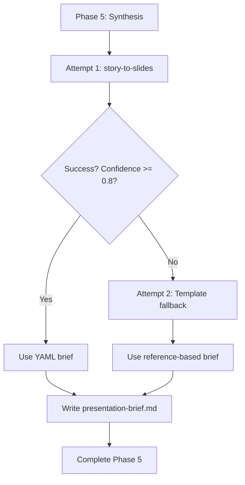

# Story-to-Slides Skill

## Overview

Transform any narrative with a story arc into an optimized YAML-based presentation brief for the PPTX skill. The skill analyzes a narrative's argument structure, distills it into slide-level messages using pyramid communication, applies copywriting techniques (number plays, headline optimization, consolidation), and selects the right visual layout for each message. Works with sales pitches, research reports, strategy documents, project updates, or thought leadership pieces.

**Core philosophy:** A great presentation brief is not a transcript of the narrative. It is a re-architecture of the narrative's argument into a visual medium where every slide has ONE clear message, supported by evidence the audience can absorb in 3 seconds.

## Key Capabilities

- **Three-Layer Intelligence** — Story arc analysis, pyramid-based message architecture, and slide copywriting working together
- **Theme-Aware Styling** — Caller provides a theme (from `/grab-theme`); PPTX skill reads the compact `theme.md` directly for all visual decisions
- **Story Arc Detection** — Identifies arc type (why-change, problem-solution, journey, argument, report) and maps section roles
- **Message Architecture** — Pyramid Principle structure with one message per slide, MECE validation, and consolidation when content exceeds max slides
- **Copywriting Optimization** — Assertion headlines, number plays (ratio framing, hero number isolation, before/after contrast), and bullet consolidation
- **Layout Mapping** — Message-driven layout selection from pptx-layouts.md (stat-card, four-quadrants, is-does-means, etc.)
- **Theme-Driven Styling** — Briefs contain no color fields or visual annotations; PPTX skill reads the theme directly for all visual decisions
- **Five-Layer Validation** — Schema compliance, message quality, copywriting quality, presentation logic, and content integrity
- **Confidence Scoring** — Per-slide and overall scoring; flags low-confidence transformations for manual review

## When to Use

- Transforming any prose narrative into a presentation brief (not limited to sales)
- Creating briefs from Why Change projects, research reports, strategy documents, project updates
- When you need slide-level message architecture, not just content extraction
- When the narrative needs consolidation (too much content for slides)
- When statistics need reframing for visual impact (number plays)
- When the story arc needs to be preserved but adapted for a slide medium

## Quick Start

### Basic Usage

```bash
# Single narrative file with default theme (smarter-service)
/story-to-slides source_path=/path/to/narrative.md language=en

# Project directory (reads all .md files)
/story-to-slides source_path=/path/to/proposal/ theme=smarter-service language=en

# With a specific theme (created via /grab-theme)
/story-to-slides source_path=/path/to/proposal/ theme=cogni-work language=en

# Custom client theme
/story-to-slides source_path=/path/to/proposal/ theme=acme-corp language=de

# Why Change project (auto-detected or explicit)
/story-to-slides source_path=/path/to/proposals/customer-slug/ arc_type=why-change

# From why-change-work Phase 5 synthesis (automatic invocation)
/why-change-work  # Automatically invokes story-to-slides in Phase 5
```

### Parameters

| Parameter | Type | Default | Description |
|-----------|------|---------|-------------|
| `source_path` | string | required | Path to narrative file(s) or project directory |
| `theme` | string | `smarter-service` | Theme ID from `/cogni-workplace/themes/` (created by `/grab-theme`) |
| `language` | string | `en` | Language code (en/de) |
| `title` | string | auto-detected | Presentation title (extracted from narrative if not provided) |
| `subtitle` | string | auto-detected | Presentation subtitle |
| `customer_name` | string | from metadata | Customer/audience organization name |
| `provider_name` | string | from metadata | Presenter/author organization name |
| `output_path` | string | `{source_dir}/presentation-brief.md` | Where to write the brief |
| `max_slides` | int | `15` | Maximum slide count (forces consolidation if narrative is long) |
| `arc_type` | string | `auto` | Story arc hint: `auto`, `why-change`, `problem-solution`, `journey`, `argument`, `report` |
| `confidence_threshold` | float | `0.8` | Minimum confidence for automatic layout mapping |
| `audience_context` | string | none | Structured audience/buyer data (roles, priorities, objections, champion, blockers). Enables Rich audience mode for targeted content. |
| `buyer_appendix_path` | string | none | Path to buyer-appendix.md for enriched Q&A prep (Step 7c only, not part of narrative stream). |
| `governing_thought` | string | auto-extracted | Pre-computed governing thought from caller. Skips re-derivation in Step 3. |
| `section_roles` | string | auto-detected | Pre-mapped section roles from caller. Skips re-derivation in Step 3. |

### Theme Selection

The `theme` parameter accepts any theme ID from `/cogni-workplace/themes/`. Themes are created by `/grab-theme` from websites or PPTX templates. The skill:

1. Loads the theme's compact `theme.md` (~30-50 lines: colors, fonts, design principles)
2. Stores the `theme_path` in the brief frontmatter
3. The PPTX skill reads the theme directly for all visual decisions (colors, contrast, fonts)

### Input Flexibility

**Single file:**
```
source_path: /path/to/narrative.md
```

**Project directory:**
```
source_path: /path/to/project/    # Reads all .md files
```

**Why Change project (backward compatible):**
```
source_path: /path/to/proposals/customer-slug/
arc_type: why-change
```

When `arc_type` is `auto` (default), the skill analyzes the content to detect the arc type.

### Expected Input (Why Change Example)

```text
proposal-project/
├── value-story.md
├── 01-why-change/
│   └── narrative.md
├── 02-why-now/
│   └── narrative.md
├── 03-why-you/
│   └── narrative.md
├── 04-why-pay/
│   └── narrative.md
└── power-positions.md
```

## Architecture

### Three-Layer Intelligence

```
Layer 1: STORY ARC ANALYSIS
  Read the narrative → Identify its argument structure → Map the arc
  (What is the story trying to say? What's the logical flow?)

Layer 2: MESSAGE ARCHITECTURE
  Pyramid communication → One message per slide → MECE grouping
  Number plays → Headline optimization → Evidence selection
  (How should each slide communicate its message?)

Layer 3: SLIDE SPECIFICATION
  Layout selection → Field population → Validation
  (What does each slide look like in the PPTX schema?)
```

### 12-Step Workflow

1. **Parse parameters** — Discover source files, load and validate theme, load references
2. **Read narrative** — Concatenate source files preserving section boundaries
2.5. **Build audience model** — Identify primary decision-maker, stakeholder priorities, and objections (Rich/Lean mode)
3. **Analyze story arc** — Detect arc type, extract governing thought, map section roles
4. **Architect slide messages** — Pyramid principle, one-message-per-slide, MECE check, audience-aware consolidation
5. **Apply copywriting** — Assertion headlines, number plays, bullet consolidation, evidence selection
6. **Select layouts** — Message-driven layout mapping from pptx-layouts.md
7. **Generate YAML** — Complete slide specifications with final copy-paste-ready text
7b. **Generate references slide** — Collect all cited sources into a closing references slide
7c. **Generate internal prep slides** — Methodology (always, process-flow) and Buying Center (Rich mode, four-quadrants text-card) as visible internal slides with extensive Speaker-Notes
8. **Validate** — Five-layer validation (schema, messages, copywriting, logic, content)
9. **Write brief** — Output presentation-brief.md with full metadata

## Story Arc Types

The skill auto-detects or accepts an explicit arc type:

| Arc Type | Detection Signals | Slide Flow |
|----------|-------------------|------------|
| `why-change` | "Why Change/Now/You/Pay" headers, crisis language, Power Positions | Problem → Urgency → Solution → Investment |
| `problem-solution` | Problem statement → solution description → benefits | Problem → Solution → Benefits → Next Steps |
| `journey` | Chronological progression, milestones, phases | Where We Were → What Happened → Where We Are → What's Next |
| `argument` | Thesis → evidence → counterarguments → conclusion | Thesis → Supporting Arguments → Evidence → Call to Action |
| `report` | Findings → analysis → recommendations | Executive Summary → Findings → Analysis → Recommendations |

Each section in the narrative is assigned a **role** (hook, problem, urgency, evidence, solution, proof, options, roadmap, investment, call-to-action) which drives layout selection.

## Copywriting Techniques

### Headline Optimization

Every slide title must be an **assertion, not a topic label**:

```text
BAD (topic label):   "Q3 Revenue Overview"
GOOD (assertion):    "Q3 Revenue Grew 23% Driven by Enterprise"

BAD (topic label):   "Security Challenges"
GOOD (assertion):    "688 Lives Lost Annually to Preventable Rail Incidents"

RULE: If you cover the body and only read titles,
      you should understand the full presentation argument.
```

### Number Plays

Statistics are reframed for maximum slide impact:

| Technique | Narrative Version | Slide Version |
|-----------|-------------------|---------------|
| **Ratio framing** | "12% failure rate" | "1 in 8 projects fail" |
| **Specific quantification** | "significant cost savings" | "€127K saved per quarter" |
| **Comparative anchoring** | "saves 480 hours/year" | "12 full weeks recovered — a quarter back" |
| **Before/after contrast** | "improved processing time" | "5 days → 4 hours (97% faster)" |
| **Compound impact** | "10 hours/week saved" | "10 hrs/week × 52 weeks × 5 people = €130K recovered" |
| **Hero number isolation** | "688 suicides and 2,661 attacks on..." | Hero: "688" / Sublabel: "+ 2,661 attacks" |

**Slide-specific rules:** ONE hero number per stat-card. Supporting numbers go in sublabel or context bullets. Always include the unit (€, %, hours, people).

### Bullet Point Consolidation

Narrative prose (8-12 points) is consolidated to 3-5 scannable slide bullets:

```text
BEFORE (narrative):
  - The system provides continuous 24/7 monitoring capability
  - It uses advanced machine learning to detect patterns
  - Real-time alerts are sent to operators when incidents are detected
  - The platform scales across multiple locations without proportional staff increase

AFTER (slide bullets):
  - 24/7 automated monitoring — no staff scaling needed
  - ML-powered pattern detection in real time
  - Instant alerts to operators on incidents
```

## Pattern Recognition

### 1. Statistics Extraction

**Detects:**

```markdown
688 Schienensuizide jährlich + 2.661 Übergriffe auf Bahnhöfen
```

**Transforms to:**

```yaml
Layout: stat-card-with-context

Hero-Stat-Box:
  Number: 688
  Label: Schienensuizide jährlich
  Sublabel: + 2.661 Übergriffe auf Bahnhöfen
```

### 2. Power Positions Extraction

**Detects:**

```markdown
### Power Position #1: KI-Videoanalytik für Bahnsicherheit

**IS**: Eine KI-gestützte Plattform für automatisierte Echtzeit-Überwachung

**DOES**: Analysiert 24/7 Videomaterial, erkennt kritische Ereignisse

**MEANS**: Computer Vision Modelle (YOLOv8, Faster R-CNN) + Edge Computing
```

**Transforms to:**

```yaml
Layout: is-does-means

IS-Box:
  Label: IS
  Text: Eine KI-gestützte Plattform für automatisierte Echtzeit-Überwachung

DOES-Box:
  Label: DOES
  Text: Analysiert 24/7 Videomaterial, erkennt kritische Ereignisse

MEANS-Box:
  Label: MEANS
  Text: Computer Vision Modelle (YOLOv8, Faster R-CNN) + Edge Computing
```

### 3. Comparison Detection

**Detects:**

```markdown
## Manuelle Überwachung
- 24/7 Personal erforderlich
- Reaktiv statt proaktiv

## KI-Videoanalyse
- Automatische 24/7 Überwachung
- Proaktive Warnungen
```

**Transforms to:**

```yaml
Layout: two-columns-equal

Left-Column:
  Headline: Manuelle Überwachung
  Bullets:
    - 24/7 Personal erforderlich
    - Reaktiv statt proaktiv

Right-Column:
  Headline: KI-Videoanalyse
  Bullets:
    - Automatische 24/7 Überwachung
    - Proaktive Warnungen
```

### 4. Timeline Detection

**Detects:**

```markdown
1. Discovery (4 Wochen)
   Anforderungsanalyse, Stakeholder-Interviews

2. Pilot (8 Wochen)
   Installation an 5 Bahnhöfen, KI-Training
```

**Transforms to:**

```yaml
Layout: timeline-steps

Step-1:
  Number: "1"
  Label: Discovery
  Description: Anforderungsanalyse, Stakeholder-Interviews
  Duration: 4 Wochen

Step-2:
  Number: "2"
  Label: Pilot
  Description: Installation an 5 Bahnhöfen, KI-Training
  Duration: 8 Wochen
```

## Layout Mapping

Layout selection is **message-driven** (based on what the slide needs to communicate), not purely pattern-driven:

| Slide Message Type | Best Layout | Why |
|--------------------|-------------|-----|
| Opening with title + subtitle | `title-slide` | Clean, focused |
| Single shocking statistic + context | `stat-card-with-context` | Hero number draws attention |
| 4 parallel metrics (overview) | `four-quadrants` | Equal-weight comparison |
| Before vs. After comparison | `two-columns-equal` | Side-by-side contrast |
| IS → DOES → MEANS capability | `is-does-means` | Progressive disclosure |
| 3 options/tiers/choices | `three-options` | Decision framework |
| Sequential process/timeline | `timeline-steps` | Linear progression |
| Key argument + supporting bullets | `stat-card-with-context` | Headline stat + evidence |
| Final CTA / wrap-up | `closing-slide` | Memorable close |

> Internal prep slides (Slide 2: Methodology uses `process-flow` + Detail-Grid; Slide 3: Buying Center uses `four-quadrants` text-card mode) — auto-generated in Step 7c with an INTERNAL Bottom-Banner and are not counted against `max_slides`.

**Fallback:** If no specific layout fits, `two-columns-equal` with structured bullets.

## Theme-Driven Visual Decisions

As of v4.0, presentation briefs are **content-only** — they contain no color fields and no visual annotations. The PPTX skill reads the theme (`theme.md`) directly for all color, contrast, and styling choices. This ensures slides always match the company's brand identity.

## Confidence Scoring

### High Confidence (>= 0.8)

- Exact pattern match or clear message type
- All required fields extracted
- No ambiguity in layout selection
- **Action:** Generate slide automatically

### Medium Confidence (0.5-0.8)

- Moderate pattern match
- Some fields inferred
- Alternative layouts possible
- **Action:** Generate with warning comment

### Low Confidence (< 0.5)

- Ambiguous structure
- Fallback layout used
- Manual review needed
- **Action:** Generate with CRITICAL flag

## Validation

### Five-Layer Framework

1. **Schema Compliance** — All layout types valid, required fields present, no color fields, valid YAML
2. **Message Quality** — Every title is an assertion (contains a verb), no duplicate messages (MECE), slide sequence follows arc, hero numbers isolated
3. **Copywriting Quality** — Number plays applied, bullets consolidated (3-5 per slide), headlines max 60 chars, no hedging language
4. **Presentation Logic** — Slide count within `max_slides`, visual variety (no 3+ consecutive same layout), arc flow logical
5. **Content Integrity** — All major narrative sections represented, key statistics included, citations preserved, German characters preserved (ä, ö, ü, ß)

### Manual Review Triggers

- Confidence score < 0.8
- Missing required narrative sections
- Ambiguous layout selection
- Missing statistics or Power Positions

## Expected Output

```yaml
---
type: presentation-brief
version: "4.0"
theme: smarter-service
theme_path: "/cogni-workplace/themes/smarter-service/theme.md"
customer: "Customer Name"
provider: "Provider Name"
language: "en"
generated: "2026-02-06"
arc_type: "why-change"
governing_thought: "Deutsche Bahn should deploy AI video analytics because 688 preventable deaths annually demand automated monitoring, resulting in 87% faster incident response."
confidence_score: 0.87
transformation_notes: |
  Story-to-slides transformation.
  Theme: smarter-service
  Arc type: why-change
  12 slides generated with 87% average confidence.
  2 slides flagged for manual review.
  Copywriting: 6 number plays, 12 headlines optimized.
---

# Presentation Brief: Customer Name

Deutsche Bahn should deploy AI video analytics because 688 preventable
deaths annually demand automated monitoring, resulting in 87% faster
incident response.

---

## Slide 1: Crisis in the Railway Network
Layout: title-slide
Title: Crisis in the Railway Network
Subtitle: Why manual monitoring is no longer sufficient
Metadata: Customer Name | Provider Name | 2026-02-06

## Slide 2: Pitch Methodology
Layout: process-flow
Slide-Title: Pitch Methodology
Diagram: |
  graph LR
    P0["Buying Center"] --> P1["Why Change"]
    P1 --> P2["Why Now"]
    P2 --> P3["Why You"]
    P3 --> P4["Why Pay"]
Detail-Grid:
  P0:
    - "Economic Buyer"
    - "Technical Evaluator"
    - "End Users"
    - "Champion & Blocker"
  P1:
    - "Safety crisis"
    - "688 lives annually"
    - "Aging infrastructure"
  P2:
    - "2026 EU deadline"
    - "Competitor advantage"
    - "Technology readiness"
  P3:
    - "Proven AI platform"
    - "Munich pilot success"
    - "87% detection advantage"
  P4:
    - "3-tier investment model"
    - "34-week deployment"
    - "18-month payback"
Bottom-Banner:
  Text: "INTERNAL — REMOVE BEFORE CLIENT PRESENTATION"
Speaker-Notes: |
  [... coaching notes + slide-by-slide pacing guide with PEAK/RELEASE ...]

## Slide 3: Buying Center
Layout: four-quadrants
Slide-Title: Buying Center
Q1:
  Label: "Economic Buyer"
  Sublabel: "CFO Infrastructure"
  Bullets:
    - "Lead with: ROI and risk reduction"
    - "Cost reduction is top priority"
    - "Frame all answers in ROI terms"
Q2:
  Label: "Technical Evaluator"
  Sublabel: "CTO / IT Lead"
  Bullets:
    - "Lead with: Integration compatibility"
    - "Open-source architecture matters"
    - "Address legacy system concerns"
Q3:
  Label: "End Users"
  Sublabel: "Operations Teams"
  Bullets:
    - "Lead with: Workflow simplicity"
    - "Minimal disruption to daily work"
    - "Training and onboarding clarity"
Q4:
  Label: "Champion"
  Sublabel: "Head of Digitalization"
  Bullets:
    - "Lead with: Digital transformation mandate"
    - "Flagship project for their agenda"
    - "Activate as internal advocate"
Bottom-Banner:
  Text: "INTERNAL — REMOVE BEFORE CLIENT PRESENTATION"
Speaker-Notes: |
  [... coaching notes for presenter ...]

## Slide 4: 688 Lives Lost Annually to Preventable Rail Incidents
Layout: stat-card-with-context
[... YAML specification ...]

[... additional slides ...]

---

## Generation Metadata

**Story Arc:** why-change
**Governing Thought:** Deutsche Bahn should deploy AI video analytics...

**Source Files:**
- value-story.md
- 01-why-change/narrative.md
- 02-why-now/narrative.md
- 03-why-you/narrative.md
- 04-why-pay/narrative.md
- power-positions.md

**Message Architecture:**
- Slides generated: 12
- Arguments (MECE groups): 4
- Consolidation applied: yes (18 sections → 12 slides)

**Copywriting Applied:**
- Number plays: 6
- Headlines optimized: 12
- Bullets consolidated: 8

**Average Confidence:** 0.87
**Manual Review Recommended:** Slides 4, 9 (low confidence)

**Validation:**
- Schema compliance: PASS
- Message quality: PASS
- Copywriting quality: PASS
- Presentation logic: PASS
- Content integrity: PASS
```

## Integration with why-change-work

### Phase 5 Synthesis Workflow



## Troubleshooting

### Low Confidence Score

**Symptoms:** `confidence_score < 0.8` in frontmatter

**Causes:**
- Ambiguous narrative structure
- Missing pattern keywords
- Inconsistent formatting

**Solution:**
1. Review flagged slides in comments
2. Check narrative files for clear patterns
3. Add explicit structure markers (e.g., `## Krise 1:`)
4. Manually adjust presentation-brief.md after generation

### Missing Slides

**Symptoms:** Expected slides not generated

**Causes:**
- Pattern not detected (keywords missing)
- Confidence threshold not met
- Section filtered during consolidation

**Solution:**
1. Check Generation Metadata section
2. Review extraction log in comments
3. Add keywords to narrative (e.g., "Krise", "vs.", "Phase")
4. Lower `max_slides` limit if consolidation is too aggressive
5. Manually add slides to brief

## References

- [pptx-layouts.md]($CLAUDE_PLUGIN_ROOT/libraries/pptx-layouts.md) - Layout schema definitions
- [EXAMPLE_BRIEF.md]($CLAUDE_PLUGIN_ROOT/libraries/EXAMPLE_BRIEF.md) - Reference brief examples
- why-change-work Phase 5 (external dependency: cogni-sales) - Integration workflow
- [SKILL.md](./SKILL.md) - Full implementation specification with detailed workflow steps

### Bundled Reference Documents

| File | Purpose |
|------|---------|
| `references/02-audience-model.md` | Audience Model construction (Rich/Lean mode), primary decision-maker, stakeholder priorities |
| `references/03-story-arc-analysis.md` | Arc type detection, governing thought extraction, section role assignment |
| `references/04-message-architecture.md` | Pyramid Principle, one-message-per-slide, MECE sequencing, audience-aware consolidation |
| `references/05a-slide-copywriting.md` | Number plays, headline optimization, bullet consolidation, evidence hierarchy |
| `references/05b-speaker-notes.md` | Speaker notes format reference: two-section structure, tags, templates, localization (used by Step 7c) |
| `references/06-slide-mapping-rules.md` | Message-driven layout selection, confidence scoring, fallback strategies |
| `references/08b-references-slide.md` | References slide construction, column splitting, citation formatting |
| `references/09-validation-checklist.md` | Five-layer validation framework with 50+ validation rules |
| `references/2g-diagram-simplification.md` | Mermaid diagram detection, classification decision tree, simplification rules |
| `references/08c-presenter-prep.md` | Internal prep slide generation (buyer map, story arc) + per-slide extensive Speaker-Notes (arc coaching, layout-aware openings, comprehensive Q&A) |
