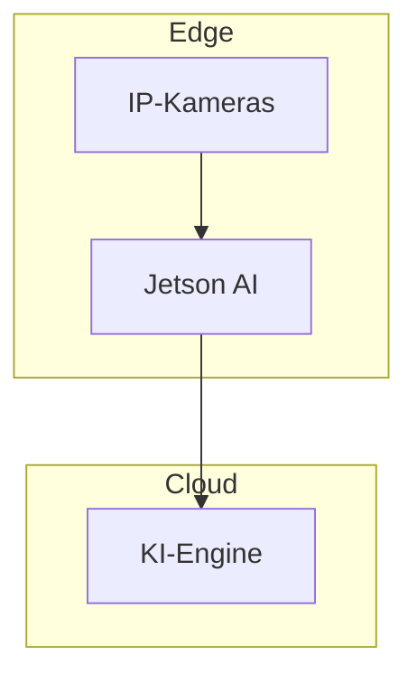
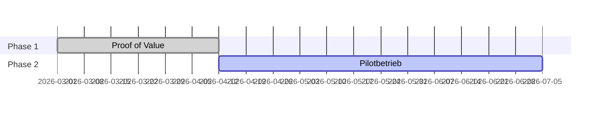

# Slide Mapping Rules

## Purpose

Define decision tree logic for mapping slide messages to PPTX layout types. Layout selection is **message-driven** (what does the slide need to communicate?) rather than pattern-driven (what regex matched?). Pattern detection informs the decision, but message type and evidence inventory are the primary drivers.

## Core Principle

> Layout selection is a MESSAGE decision, not a PATTERN decision.
> The question is never "what regex matches?" — it is "what does the audience need to SEE to believe this claim?"
> A statistic needs a hero number. A comparison needs two columns. A process needs a timeline.
> Match the VISUAL STRUCTURE to the EVIDENCE SHAPE, and the layout selects itself.

## Two-Pass Selection

**Pass 1 — Message-driven (preferred):** Select layout based on slide's message type and evidence from Steps 3-5.

**Pass 2 — Pattern-driven (fallback):** When raw narrative hasn't been processed through message architecture, use pattern-matching rules below.

---

## Message-Driven Layout Selection (v2.0)

| Slide Message Type | Evidence Shape | Best Layout | Confidence |
|--------------------|---------------|-------------|------------|
| Opening / governing thought | Title + subtitle | `title-slide` | 1.0 |
| Closing CTA / next steps | CTA headline + takeaway | `closing-slide` | 1.0 |
| Single shocking statistic + explanation | Hero number + context bullets | `stat-card-with-context` | 0.95 |
| Key argument + supporting data | Headline number + evidence bullets | `stat-card-with-context` | 0.9 |
| 4 parallel metrics (overview) | 4 numbers with labels | `four-quadrants` | 0.95 |
| Before vs. After / two approaches | 2 parallel bullet lists | `two-columns-equal` | 0.9 |
| Capability with IS-DOES-MEANS | 3 layered descriptions + proof | `is-does-means` | 1.0 |
| 3 options, tiers, or choices | 3 named groups with features | `three-options` | 0.95 |
| Sequential process or timeline | 4-6 ordered steps with durations | `timeline-steps` | 0.95 |
| Argument + bullets (no hero number) | Headline claim + 3-5 bullets | `two-columns-equal` | 0.7 |

### Reasoning Approach

Layout selection is visual argument design. Before selecting, reason through what the slide needs the audience to SEE:

```text
REASON through layout selection for each slide:

  1. RECALL the slide's message and role from Steps 4-5
     → What is this slide ARGUING? (assertion headline)
     → What ROLE does it play? (hook, problem, solution, etc.)
     → COMMUNICATION INTENT:
       problem → shock or quantify pain
       solution → demonstrate capability
       proof → show results or comparison
       roadmap → show sequence and progress

  2. INVENTORY the evidence from Step 5d
     → Numbers (hero stat, metrics, percentages)
     → Lists (bullets, features, capabilities)
     → Comparisons (before/after, old/new)
     → Layers (IS/DOES/MEANS)
     → Steps (sequential items with durations)

  3. ASK: "What VISUAL STRUCTURE best serves this evidence?"

     ONE dominant number? → stat-card-with-context
       VERIFY: truly ONE hero? If 2 equally important → consider sublabel or two slides.

     FOUR parallel metrics? → four-quadrants
       VERIFY: metrics truly PARALLEL (same abstraction level)?

     TWO things compared? → two-columns-equal
       VERIFY: sides truly comparable (problem/solution yes, about-us/pricing no)?

     Three IS/DOES/MEANS layers? → is-does-means
       VERIFY: layers distinct and non-overlapping?

     Three named OPTIONS with features? → three-options
       VERIFY: truly alternatives audience chooses between? If sequential → timeline-steps.

     SEQUENTIAL steps with time? → timeline-steps
       VERIFY: order matters? If parallel activities → four-quadrants or bullets.

     ONLY prose and bullets? → two-columns-equal (FALLBACK)
       NOTE: Ask "Is there a hero number, comparison, or structure I missed?"

  4. TEST the fit — does evidence FILL required fields?

     stat-card: Number ✓, Label (4-6 words) ✓, Context bullets (3-5) ✓
       → Missing number? Switch to two-columns.

     four-quadrants: 4 × (Number + Label) ✓
       → Only 3? Don't pad — use three-options or stat-card + sublabel.
       → 5+? Pick strongest 4, remainder in notes.

     two-columns: Left/Right headlines ✓, Balanced bullets (±1) ✓
       → Asymmetric (5 vs 1)? Consider stat-card or restructure.

     is-does-means: IS, DOES, MEANS each populated ✓
       → Only 2 layers? Confidence drops to 0.7. Consider two-columns.

     three-options: Exactly 3 named groups ✓
       → 2 options? Use two-columns. 4? Merge or split slides.

     timeline-steps: 4-6 steps with labels/durations ✓
       → Only 2? Too sparse — use two-columns.

  5. CHECK deck context — what layouts surround this slide?
     → 2+ consecutive same layout? Consider alternative for variety.
     → No stat-card yet and this slide has a number? Prefer stat-card.

  6. ASSIGN confidence score
     → 1.0: every field naturally populated
     → 0.9: all populated, minor inference
     → 0.8: one field needs creative adaptation
     → 0.7: selected by elimination, adequate but not ideal
     → 0.5: fallback — evidence doesn't match any specialized layout
     → <0.5: ambiguous — flag for manual review
```

### Layout Selection by Role (Tiebreaker)

When evidence supports multiple layouts, use role affinity:

```text
  hook       → PREFER stat-card | ALT two-columns (if no hero number)
  problem    → PREFER stat-card | ALT four-quadrants (multiple crisis dimensions)
  urgency    → PREFER stat-card | ALT two-columns (deadline vs. consequence)
  evidence   → Match evidence shape (no default — most varied role)
  solution   → PREFER is-does-means | ALT stat-card or two-columns
  proof      → PREFER stat-card | ALT two-columns (before/after)
  options    → PREFER three-options (3 tiers) | ALT two-columns (2 options)
  roadmap    → PREFER timeline-steps | ALT four-quadrants (parallel workstreams)
  investment → PREFER stat-card (ROI hero) | ALT three-options (pricing tiers)
  call-to-action → ALWAYS closing-slide

  # Diagram-specific affinities (when Mermaid block detected in narrative):
  solution (with architecture Mermaid) → PREFER layered-architecture | ALT process-flow
  roadmap (with gantt Mermaid)         → PREFER gantt-chart | ALT timeline-steps
  solution (with linear flow Mermaid)  → PREFER process-flow | ALT timeline-steps
```

## Available Layouts

1. **title-slide** — Opening (MANDATORY first)
2. **stat-card-with-context** — Large stat + context bullets
3. **four-quadrants** — 2×2 grid of metrics
4. **two-columns-equal** — Side-by-side comparison
5. **is-does-means** — Power Position structure
6. **three-options** — Pricing/features comparison
7. **timeline-steps** — Sequential process (text steps)
8. **layered-architecture** — Architecture box diagram with lanes (Mermaid `Diagram:` field)
9. **process-flow** — Linear pipeline with arrow connectors (Mermaid `Diagram:` field)
10. **gantt-chart** — Horizontal Gantt chart with phases (Mermaid `Diagram:` field)
11. **closing-slide** — CTA/ending (MANDATORY last)
*(Internal prep slides use specialized layouts — `process-flow` for Methodology, `four-quadrants` (text-card) for Buying Center — auto-generated in Step 7c, not mapped from narrative)*

---

## Pattern-Driven Decision Tree (Fallback)

When message architecture is NOT available, fall back to structural pattern matching:

```text
REASON through pattern-driven selection:
  1. READ section header + first 2-3 lines → what TYPE of content?
  2. SCAN for structural signals (priority order):
     IS/DOES/MEANS markers → is-does-means
     4 parallel subsections with numbers → four-quadrants
     3 parallel subsections with features → three-options
     Numbered sequential items with durations → timeline-steps
     One large statistic with explanation → stat-card-with-context
     Two parallel subsections or comparison language → two-columns-equal
     None → two-columns-equal (fallback)
  3. VERIFY signal is genuine:
     "4 key benefits" ≠ four-quadrants UNLESS each has a NUMBER
     "Phase 1, Phase 2" ≠ timeline-steps UNLESS each has a DURATION
     One number ≠ stat-card UNLESS the number IS the point
  4. ASK: "Would the audience understand this BETTER in this layout?"
```

### Rule 1: Title Slide

**Condition:** `position == first_slide`
**Layout:** `title-slide` | **Confidence:** 1.0

```yaml
Layout: title-slide
Title: {value-story title or H1}
Subtitle: {subtitle or first paragraph}
Metadata: {customer} | {provider} | {date}
```

---

### Rule 1b: Closing Slide

**Condition:** `role == "call-to-action" AND position == LAST`
**Layout:** `closing-slide` | **Confidence:** 1.0

```yaml
Layout: closing-slide
Title: {CTA headline — action-oriented}
Subtitle: {Key takeaway or next step}
Metadata: {Contact info or follow-up}
```

---

### Rule 2: Stat Card with Context

**Condition:** Single large statistic + context prose (2+ sentences OR 3+ bullets), NOT part of four-quadrant group.

**Layout:** `stat-card-with-context`

**Edge cases:**
- TWO large numbers → hero = more relevant to slide MESSAGE; other as sublabel. If both equally central → consider four-quadrants or two slides.
- Percentage vs absolute → absolute usually hits harder ("688 deaths" > "12% increase"). Exception: when % IS the proof ("97% detection rate"). Rule: which goes on a billboard?
- Small number (< 100) but significant → small CAN be hero if it surprises ("3 deaths per week").

```yaml
Layout: stat-card-with-context
Slide-Title: {section header}
Hero-Stat-Box:
  Number: {statistic}
  Label: {stat label}
  Sublabel: {if present}
  Icon: {from category}
Context-Box:
  Headline: {"Why..." sentence or from context}
  Bullets: {3-5 key points}
Bottom-Banner: {optional impact statement}
```

**Confidence:** 1.0 (all fields present) | 0.9 (label inferred) | 0.7 (context requires extraction)

**Example:**
```markdown
## Krise 1: Sicherheit außer Kontrolle
688 Schienensuizide jährlich + 2.661 Übergriffe auf Bahnhöfen.
Warum manuelle Überwachung versagt:
- Sicherheitspersonal kann nicht alle Bereiche 24/7 abdecken
- Kritische Ereignisse werden zu spät erkannt
→ stat-card-with-context (0.95)
```

---

### Rule 3: Four Quadrants

**Condition:** Exactly 4 parallel subsections, each with a statistic.

**Layout:** `four-quadrants`

**Edge cases:**
- 3 subsections → NO. Use three-options or stat-card + two-columns.
- 5 subsections → pick 4 most parallel, move 5th to notes or separate slide.
- Mixed stat types (%, €, count, ratio) → fine IF all support same argument.

```yaml
Layout: four-quadrants
Slide-Title: {section header}
Quadrant-{1-4}:        # repeat for each quadrant
  Number: {statistic}
  Label: {subsection title}
  Sublabel: {optional detail}
  Icon: {from category}
Bottom-Banner: {optional summary}
```

**Confidence:** 1.0 (4 with stats) | 0.9 (3-4 have stats) | 0.7 (2-3 have stats) | 0.5 (3 or 5 subsections)

**Example:**
```markdown
## Vier kritische Handlungsfelder
### Sicherheit — 688 Suizide p.a.
### Infrastruktur — 42% veraltete Systeme
### Kapazität — 156% Überlastung
### Kosten — €2.8M Notfall-OPs
→ four-quadrants (1.0)
```

---

### Rule 4: IS-DOES-MEANS (Power Position)

**Condition:** Power Position header + **IS**/**DOES**/**MEANS** markers.

**Layout:** `is-does-means`

```yaml
Layout: is-does-means
Slide-Title: {Power Position title}
IS-Box:  { Label: IS,  Text: {IS content}  }
DOES-Box: { Label: DOES, Text: {DOES content} }
MEANS-Box: { Label: MEANS, Text: {MEANS content} }
Bottom-Banner: {optional Proof statement}
```

**Confidence:** 1.0 (all 3 layers) | 0.9 (3 layers, no proof) | 0.7 (2 layers) | 0.5 (1 layer)

**Example:**
```markdown
### Power Position #1: KI-Videoanalytik für Bahnsicherheit
**IS**: KI-gestützte Plattform für automatisierte Echtzeit-Überwachung
**DOES**: Analysiert 24/7 Videomaterial, erkennt kritische Ereignisse
**MEANS**: Computer Vision (YOLOv8) + Edge Computing für <2s Latenz
**Proof**: Reduziert kritische Vorfälle um 73%
→ is-does-means (1.0)
```

---

### Rule 5: Two Columns Equal (Comparison)

**Condition:** Comparison keywords ("vs.", "verglichen", "manuell", "automatisiert") + two parallel subsections with 3-6 bullets each.

**Layout:** `two-columns-equal`

**Edge cases:**
- Comparison language but no two-part structure → create split (current/future). Confidence 0.5-0.7.
- More than 2 things → 3: three-options; 4: four-quadrants. Two-columns is strictly binary.
- Pro/con for ONE thing → still works (Left=pros, Right=cons). Confidence 0.8.

```yaml
Layout: two-columns-equal
Slide-Title: {section header}
Left-Column:  { Headline: {title}, Bullets: {points} }
Right-Column: { Headline: {title}, Bullets: {points} }
Bottom-Banner: {optional conclusion}
```

**Confidence:** 1.0 (equal bullets ±1) | 0.9 (bullets + conclusion) | 0.7 (uneven bullets) | 0.5 (unclear structure)

**Example:**
```markdown
## Manuell vs. KI-gestützt
### Manuelle Überwachung
- 24/7 Personal erforderlich
- Reaktiv statt proaktiv
### KI-Videoanalyse
- Automatische 24/7 Überwachung
- Proaktive Warnungen
→ two-columns-equal (0.95)
```

---

### Rule 6: Three Options

**Condition:** Three parallel subsections with feature lists. Often includes pricing ("€", "Mio", "k") or tier keywords ("Pilot", "Regional", "National").

**Layout:** `three-options`

**Edge cases:**
- No pricing → still three-options IF they're clear ALTERNATIVES. "Finding 1/2/3" = NOT alternatives → use stat-cards or quadrants.
- No explicit recommendation → don't force a Badge.

```yaml
Layout: three-options
Slide-Title: {section header}
Option-{1-3}:           # repeat for each option
  Name: {title}
  Price: {if present}
  Badge: {optional — "Empfohlen" if recommended}
  Features: {bullet list}
Bottom-Banner: {optional recommendation}
```

**Confidence:** 1.0 (pricing + features) | 0.9 (features, pricing inferred) | 0.7 (features present) | 0.5 (2 or 4 subsections)

**Example:**
```markdown
## Rollout-Strategien im Vergleich
### Pilot (€50k) — 5 Bahnhöfe, 20 Kameras, PoC
### Regional (€280k) - Empfohlen — 25 Bahnhöfe, 150 Kameras, 24/7
### National (€1.2M) — 100+ Bahnhöfe, 800+ Kameras, Vollintegration
→ three-options (1.0)
```

---

### Rule 7: Timeline Steps

**Condition:** Timeline keywords ("Phase", "Schritt", "Roadmap") + 4-6 numbered sequential steps with durations.

**Layout:** `timeline-steps`

**Edge cases:**
- No durations → still timeline if clearly sequential. Use "Phase N" as placeholder. Confidence 0.7.
- 7+ steps → split into two slides or compress. 8+ → summarize to 4 high-level phases.
- Only 2 steps → too sparse. Use two-columns (Phase 1 / Phase 2). Confidence 0.3.

```yaml
Layout: timeline-steps
Slide-Title: {section header}
Step-{1-N}:             # repeat for each step (4-6)
  Number: "{N}"
  Label: {step label}
  Description: {step description}
  Duration: {duration}
Bottom-Banner: {optional total duration}
```

**Confidence:** 1.0 (4+ complete steps) | 0.9 (3+ complete) | 0.7 (some durations missing) | 0.5 (unclear structure)

**Example:**
```markdown
## Implementierungs-Roadmap
1. Discovery (4 Wo) — Anforderungsanalyse
2. Pilot (8 Wo) — Installation an 5 Bahnhöfen
3. Rollout (12 Wo) — Skalierung auf 25 Standorte
4. Optimize (Laufend) — Kontinuierliche Optimierung
→ timeline-steps (0.95)
```

---

### Rule 8: Layered Architecture (Diagram)

**Condition:** Mermaid `graph`/`flowchart` block with `subgraph` blocks detected in narrative, OR hub-and-spoke topology detected (one node has ≥3 edges without subgraphs).

**Layout:** `layered-architecture`

**Detection:** Classification was pre-computed in Step 2g — the diagram type and simplified Mermaid are already available.

**Edge cases:**
- >3 subgraphs → merge to max 3 lanes during simplification
- >4 nodes per lane → collapse similar nodes
- TB/TD direction → transpose to LR
- Bidirectional edges → pick dominant direction, note feedback in speaker notes

```yaml
Layout: layered-architecture
Slide-Title: {architecture assertion headline}
Diagram: |
  graph LR
    subgraph Lane1["{label}"]
      A["{node}"]
    end
    subgraph Lane2["{label}"]
      B["{node}"]
    end
    A -->|{edge label}| B
Bottom-Banner: {optional architecture insight}
```

**Confidence:** 0.95 (subgraphs present) | 0.85 (hub-and-spoke inferred) | 0.7 (complex graph simplified)

**Example:**
```markdown
## Architecture Overview

→ layered-architecture (0.95)
```

---

### Rule 9: Process Flow (Diagram)

**Condition:** Mermaid `graph LR`/`flowchart LR` block detected with **no subgraphs** and a linear chain topology (A→B→C→D).

**Layout:** `process-flow`

**Edge cases:**
- >6 nodes → compress to max 6 during simplification
- Branches → extract happy path, note branches in speaker notes
- TD direction with linear chain → transpose to LR

```yaml
Layout: process-flow
Slide-Title: {process assertion headline}
Diagram: |
  graph LR
    A["{step 1}"] --> B["{step 2}"]
    B --> C["{step 3}"]
    C --> D["{step 4}"]
Bottom-Banner: {optional outcome}
```

**Confidence:** 0.9 (clean linear chain) | 0.7 (simplified from branching graph)

**Example:**
```markdown

→ process-flow (0.9)
```

---

### Rule 10: Gantt Chart (Diagram)

**Condition:** Mermaid `gantt` block detected in narrative.

**Layout:** `gantt-chart`

**Edge cases:**
- >8 tasks → group into phase-level bars during simplification
- >4 sections → merge related phases
- No dates → cannot use gantt-chart, fall back to timeline-steps with Step-N fields

```yaml
Layout: gantt-chart
Slide-Title: {timeline assertion headline}
Diagram: |
  gantt
    dateFormat YYYY-MM-DD
    section {phase}
    {task} :{status}, {id}, {start}, {duration}
Bottom-Banner: {optional total duration}
```

**Confidence:** 0.95 (well-formed gantt) | 0.8 (simplified from complex gantt)

**Example:**
```markdown

→ gantt-chart (0.95)
```

---

### Rule 11: Fallback — Two Columns Equal

**Condition:** No specific pattern matched AND section has content.

**Layout:** `two-columns-equal` | **Confidence:** 0.3-0.5

```text
BEFORE accepting fallback, ask:
  1. "Did I miss a hero number?" (buried stat → stat-card)
  2. "Is there an implicit comparison?" (currently/future → deliberate two-columns, conf 0.7-0.8)
  3. "Could content be MORE structured?" (4 bullets with metrics → four-quadrants?)
  4. "Did I miss a Mermaid diagram?" (```mermaid block → diagram layout)
  5. "Is this section slide-worthy?" (methodology/background → maybe speaker notes only)
  6. If none → accept fallback. Split meaningfully: What/How or Now/Future (NOT Key Points/Details)
```

```yaml
Layout: two-columns-equal
Slide-Title: {section header}
Left-Column:  { Headline: {theme group 1}, Bullets: {first half} }
Right-Column: { Headline: {theme group 2}, Bullets: {second half} }
```

Flag: `<!-- LOW CONFIDENCE: Fallback layout. Manual review recommended. -->`

---

## Decision Tree Execution Order

Execute in order, first match wins:

1. **Rule 1: Title** (first slide — MANDATORY)
2. **Rule 1b: Closing** (last slide — MANDATORY)
3. **Rule 8: Layered Architecture** (Mermaid graph with subgraphs — highest diagram specificity)
4. **Rule 9: Process Flow** (Mermaid graph, linear chain — no subgraphs)
5. **Rule 10: Gantt Chart** (Mermaid gantt block)
6. **Rule 4: IS-DOES-MEANS** (highest text specificity — unique markers)
7. **Rule 3: Four Quadrants** (4 subsections with stats)
8. **Rule 6: Three Options** (3 subsections with pricing)
9. **Rule 7: Timeline** (sequential steps with durations)
10. **Rule 2: Stat Card** (single large statistic)
11. **Rule 5: Two Columns** (comparisons)
12. **Rule 11: Fallback**

**Rationale:** Bookend slides first → diagram layouts (Mermaid blocks are unambiguous signals) → most specific text patterns → broader patterns → fallback. Diagram rules precede text rules because a Mermaid block is a definitive structural signal. IS-DOES-MEANS before four-quadrants because markers are unique. Stat-card after multi-element layouts because 4 stats should be quadrants, not a stat-card with 3 wasted.

---

## Confidence Threshold Handling

**Threshold:** 0.8

| Range | Action |
|-------|--------|
| ≥ 0.8 | Generate automatically, no review flag |
| 0.5–0.8 | Generate + warning comment + confidence in metadata |
| < 0.5 | Generate with fallback + CRITICAL flag + extraction log |

```yaml
<!-- CONFIDENCE: 0.45 | PATTERN: fallback | REVIEW: CRITICAL -->
<!-- EXTRACTION LOG: No Power Position markers, no statistics ≥100, no comparison keywords, no timeline markers -->
```

---

## Conflict Resolution

When multiple patterns match:

```text
REASON through conflicts:
  1. LIST all matching layouts with confidence scores
  2. ASK: "Which makes the STRONGEST visual argument?"
     → DEPTH (one number, fully explained) = stat-card
     → BREADTH (multiple numbers, overview) = four-quadrants
  3. CONSIDER role: problem/hook → depth; evidence/overview → breadth; solution → capability
  4. CONSIDER surroundings: if previous slide is same layout, prefer alternative when scores within 0.1
  5. DECIDE and LOG the alternative considered
```

**Tie resolution (within 0.05):** Power Positions > Statistics > Comparisons > Timelines

```yaml
<!-- PRIMARY: stat-card-with-context (0.92) -->
<!-- ALTERNATIVE: four-quadrants (0.88) - rejected: problem slide needs depth over breadth -->
```

**Multi-stat sections:**
- 2 stats → hero + sublabel in stat-card
- 3 stats → hero + sublabel + bullet, OR second slide
- 4 stats → four-quadrants
- 5+ stats → best 4 in quadrants, rest in notes

**Parallel vs hierarchical:** parallel (same importance) → four-quadrants; hierarchical (one dominates) → stat-card.

---

## Special Cases

**Nested comparisons:** two-columns-equal for top-level, nested bullets within.

**Long timelines (>4 steps):** Timeline for steps 1-4, second slide for 5-6. If >6 → two-columns-equal.

---

## Visual Variety Rules

Different layouts signal "new type of information" and re-engage attention. After all layouts selected, scan for monotony:

```text
RULE 1: No 3+ consecutive slides with same layout
  → Swap the one with LOWEST confidence to its best alternative

RULE 2: stat-card max 4× in a 12-slide deck
  → Merge related stat-cards into a four-quadrants slide

RULE 3: At least 3 different layout types per deck
  → Find most-used layout's lowest-confidence slide, switch to new type
```

**Fix reasoning:** swap the most FLEXIBLE slide (lowest confidence), not the strongest fit. If no good alternative exists → accept repetition and note for review. Never force a layout switch that makes content awkward.

---

## End-to-End Worked Example

12-slide Why Change deck showing full decision process:

```text
INPUT: Slide messages from Step 5

 # | Message                                          | Role       | Evidence
---|--------------------------------------------------|------------|----------------------------------
 1 | "DB AI: Preventing 688 Deaths, Saving €2.8M"    | hook       | governing thought
 2 | "688 Lives Lost Annually"                        | problem    | 688 hero, 2661 supporting, bullets
 3 | "Four Crisis Dimensions Demand Response"          | problem    | 4 parallel metrics
 4 | "DIN-2025 Mandates Video Surveillance by 2026"   | urgency    | deadline, regulation, cost
 5 | "Funding Closes Q2 2026, 78% of Peers Act"       | urgency    | deadline + 78% competitor stat
 6 | "PP#1: AI Video Analytics — 97% Detection"       | solution   | IS/DOES/MEANS, 97% proof
 7 | "PP#2: Predictive Maintenance — 73% Less DT"     | solution   | IS/DOES/MEANS, 73% proof
 8 | "PP#3: Passenger Flow — €1.2M Recovery"           | solution   | IS/DOES/MEANS, €1.2M proof
 9 | "€280K Returns 4.3x in Year One"                 | investment | €280K, 4.3x ROI, breakdown
10 | "Three Rollout Strategies"                        | options    | 3 tiers + pricing + features
11 | "4-Phase Rollout in 6 Months"                     | roadmap    | 4 steps with durations
12 | "Schedule Discovery Workshop This Quarter"        | CTA        | headline + takeaway

LAYOUT SELECTION REASONING:

Slide 1: MANDATORY title-slide (1.0)

Slide 2: ONE hero number (688 deaths) → stat-card (0.95)
  Fit: Number=688 ✓, Label="rail suicides/yr" ✓, Sublabel="+2,661 attacks" ✓, Bullets ✓

Slide 3: FOUR parallel metrics → four-quadrants (0.95)
  Fit: 4 × (Number + Label) ✓ | Different layout from slide 2 ✓

Slide 4: Deadline (2026) as hero feels weak for stat-card (0.75).
  Binary split (regulation vs. implications) fits two-columns better (0.8).
  Introduces 3rd layout type ✓ → two-columns-equal (0.8)

Slide 5: TWO pressures (funding + competition) → two-columns (0.9)
  2 consecutive two-columns acceptable (rule triggers at 3+).
  Alt: stat-card for 78% (0.8) — but loses comparison structure.

Slides 6-8: IS/DOES/MEANS markers → is-does-means (1.0 each)
  3 consecutive = variety violation, BUT Power Positions are PROTECTED —
  intentional series grouping, not monotony. Exception accepted.

Slide 9: Two candidates (€280K, 4.3x). Hero = 4.3x ROI (more compelling).
  stat-card-with-context (0.95). Welcome layout change after 3× is-does-means ✓

Slide 10: 3 named tiers + pricing → three-options (1.0)

Slide 11: 4 sequential phases with durations → timeline-steps (1.0)

Slide 12: MANDATORY closing-slide (1.0)

VISUAL VARIETY CHECK:
  Sequence: title → stat-card → four-quad → two-col → two-col → IDM×3 → stat-card → three-opt → timeline → closing
  Rule 1: IDM×3 accepted (Power Position exception). All others OK ✓
  Rule 2: stat-card count = 2 (max 4) ✓
  Rule 3: 8 unique layout types ✓

FINAL ASSIGNMENTS:
 # | Layout                  | Conf
---|-------------------------|------
 1 | title-slide             | 1.0
 2 | stat-card-with-context  | 0.95
 3 | four-quadrants          | 0.95
 4 | two-columns-equal       | 0.8
 5 | two-columns-equal       | 0.9
 6 | is-does-means           | 1.0
 7 | is-does-means           | 1.0
 8 | is-does-means           | 1.0
 9 | stat-card-with-context  | 0.95
10 | three-options           | 1.0
11 | timeline-steps          | 1.0
12 | closing-slide           | 1.0

Average confidence: 0.96 | Layout types: 8 | Manual review: 0 slides
```

---
