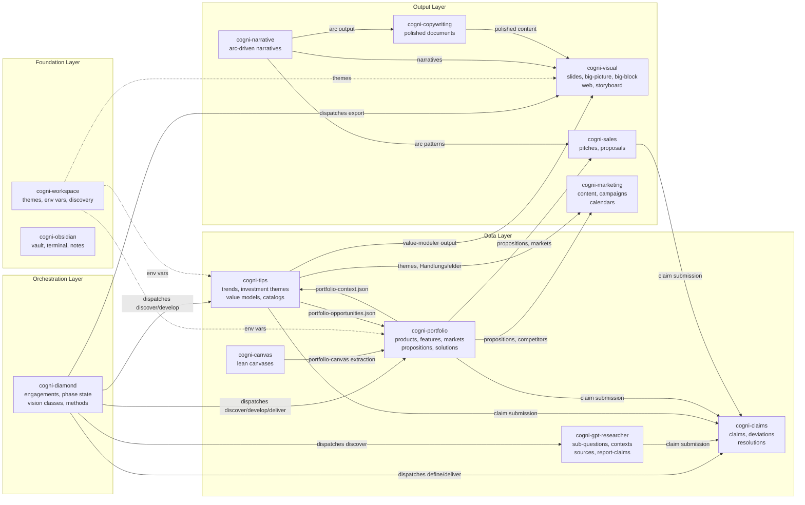

# Cross-Plugin Data Flow

How data flows between cogni-works plugins. No shared database — all cross-references are resolved at runtime via slug-based lookups, bridge files, and YAML frontmatter contracts.

## Architecture Layers

## Entity Summary

| Plugin | Key Entities | Storage Format | Cross-Plugin Contract |
|--------|-------------|---------------|----------------------|
| **cogni-portfolio** | Product, Feature, Market, Proposition, Solution, Package, Competitor, Customer, Scan | JSON files in project directory | Exports `portfolio-context.json` (schema v3.1) to TIPS. Imports `portfolio-opportunities.json` from TIPS |
| **cogni-tips** | TipsProject, TrendCandidate, TrendReport, InvestmentTheme, SolutionTemplate, Catalog | JSON + YAML in project directory | Exports themes + value-model to Marketing, Sales. Bidirectional bridge with Portfolio |
| **cogni-gpt-researcher** | SubQuestion, Context, Source, ReportClaim | Markdown + YAML frontmatter (Obsidian-browsable) | Submits claims to cogni-claims via claim-entity contract |
| **cogni-claims** | ClaimRecord, DeviationRecord, ResolutionRecord | JSON in `cogni-claims/` directory | Receives claims from all data-layer plugins. Status: unverified → verified/deviated → resolved |
| **cogni-sales** | PitchLog, BuyingCenter, PhaseDeliverable (research.json + narrative.md) | JSON + Markdown per phase | Consumes portfolio propositions + narrative arc patterns. Registers claims |
| **cogni-marketing** | MarketingProject, ContentStrategy, ContentPiece, Campaign, Calendar | JSON + Markdown with YAML frontmatter | Consumes portfolio propositions + TIPS themes. 16 content formats |
| **cogni-narrative** | Narrative (arc_id, sections, techniques) | Markdown with YAML frontmatter | Consumed by Visual, Copywriting, Sales via `arc_id` frontmatter |
| **cogni-copywriting** | (no persistent entities) | In-place document modification | Detects `arc_id` frontmatter for arc-aware polishing |
| **cogni-visual** | Brief (YAML frontmatter + Markdown body) | Per-deliverable brief files | Reads theme from cogni-workspace. Reads narrative via `arc_id` |
| **cogni-workspace** | Theme, WorkspaceConfig | Markdown (theme.md) + JSON (settings) | Theme files consumed by all visual plugins. Env vars consumed by all plugins |
| **cogni-obsidian** | VaultConfig, TerminalProfile | JSON config files in `.obsidian/` | Provides Obsidian browsing layer for all plugin outputs |
| **cogni-diamond** | Engagement (diamond-project.json), PhaseState, ExecutionLog, MethodLog, DecisionLog | JSON files in engagement directory | Dispatches to cogni-gpt-researcher, cogni-tips, cogni-portfolio, cogni-claims, cogni-visual. No data exports — orchestration only |
| **cogni-canvas** | LeanCanvas (9 sections, version history, per-section status) | Markdown with YAML frontmatter | Consumed by cogni-portfolio:portfolio-canvas for entity extraction |

## Cross-Plugin Bridge Files

| Bridge File | From | To | Purpose |
|------------|------|-----|---------|
| `portfolio-context.json` | cogni-portfolio | cogni-tips | Portfolio products, features, markets for trend-to-portfolio mapping |
| `portfolio-opportunities.json` | cogni-tips | cogni-portfolio | Growth opportunities scored by ranking, TAM alignment, competitive whitespace |
| `tips-value-model.json` | cogni-tips | cogni-visual | Solution templates, investment themes, TIPS paths for Big Block rendering |
| `pitch-log.json` | cogni-sales | (internal) | Workflow state, buying center config, phase tracking |
| `marketing-project.json` | cogni-marketing | (internal) | Brand voice, source paths, market-GTM path configuration |
| `claims.json` | various | cogni-claims | Claim records with source URLs, status, and deviation evidence |
| `diamond-project.json` | cogni-diamond | (internal) | Engagement config, vision class, phase state, plugin path references |
| `canvas-{slug}.md` | cogni-canvas | cogni-portfolio | Lean Canvas with 9 sections for portfolio-canvas entity extraction |

## Naming Conventions

| Plugin | Slug Pattern | Example |
|--------|-------------|---------|
| cogni-portfolio | `{entity}--{context}` (double-dash) | `cloud-monitoring--mid-market-saas-dach` |
| cogni-tips | `{subsector}-{topic}-{hash8}` | `automotive-ai-predictive-maintenance-abc12345` |
| cogni-sales | `{customer-or-segment}-pitch` | `siemens-manufacturing-pitch` |
| cogni-marketing | `{market}--{gtm-path}--{format}` | `dach-enterprise--ai-automation--whitepaper` |
| cogni-gpt-researcher | `{entity-type}-[slug]-[hash8]` | `src-acme-cloud-2a1f3e8b` |
| cogni-claims | `claim-{uuid-v4}` | `claim-550e8400-e29b-41d4-a716-446655440000` |
| cogni-diamond | `{client}-{engagement-type}` | `acme-market-entry` |
| cogni-canvas | `canvas-{product-or-venture}` | `canvas-cloud-monitoring-saas` |

## Data Isolation Principle

No shared database. Cross-references are resolved at runtime via:
- **Slug-based lookups** — portfolio market slugs in TIPS projects
- **Bridge files** — explicit JSON exports between plugins (portfolio-context, portfolio-opportunities)
- **Wikilinks** — Obsidian-browsable entity references (cogni-gpt-researcher)
- **YAML frontmatter** — `arc_id`, `theme_path`, `portfolio_path` fields for downstream consumption
- **File system conventions** — standard directory structures per plugin, discoverable via cogni-workspace scripts
