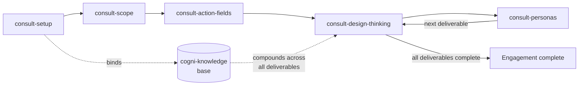

# Consulting Engagement

**Pipeline**: cogni-consult orchestrates cogni-knowledge (research spine) → per-deliverable design-thinking loops → acting-persona challenges → deliverable artifacts
**Duration**: Days to weeks depending on engagement scope and number of action fields
**End deliverable**: A set of tested, evidence-backed deliverable artifacts organized by action fields, each cited back to a compounding knowledge base

> **Note on the previous guide**: This guide previously covered the archived cogni-consulting (Double Diamond) plugin. Legacy Double Diamond engagements were handled by the now-removed cogni-consulting plugin (its source remains in git history). New engagements use cogni-consult.



## What You Get

A consulting engagement where every deliverable has its own evidence trail rooted in a single, compounding knowledge base. Rather than fixed phases gating the whole team, each deliverable walks its own design-thinking loop — empathize, define, ideate, prototype, test — at its own pace. Acting stakeholder personas challenge each deliverable before it counts as done.

The core difference from the classic approach:

- **Research compounds instead of evaporating** — one cogni-knowledge base is bound once at setup. Every deliverable's evidence run adds to it, so the tenth deliverable starts with nine deliverables' worth of prior synthesis, not a blank search.
- **Action fields are the work-breakdown structure** — scoping derives 3-6 named fields from one SMART key question. Deliverables live inside fields and track independently; nothing waits on an engagement-level phase gate.
- **Acting personas, not passive audience descriptions** — the shipped consulting partner and project manager personas challenge deliverables in their own voice before the artifact counts as tested. Their objections surface while the draft is still cheap to change.

## Prerequisites

| Requirement | Why |
|-------------|-----|
| cogni-consult installed | Orchestrates the engagement lifecycle |
| cogni-knowledge installed | Required — the research spine bound at setup |
| cogni-visual / document-skills installed (optional) | Deliverable export when a deliverable names an export route |
| cogni-workspace installed (optional) | Cross-session engagement discovery |
| Web access enabled | cogni-knowledge runs web research during the inverted pipeline |

cogni-consult is standalone as an orchestrator. cogni-knowledge is the one required integration — without it, the compounding-research promise cannot be delivered.

## Step-by-Step

### Step 1: Set Up the Engagement

`consult-setup` frames the desired outcome, scaffolds the action-fields directory structure, binds one cogni-knowledge base to the engagement, and registers the engagement so `consult-resume` can find it from any directory in later sessions.

**Command**: `/cogni-consult:consult-setup` or describe the engagement

**Example prompts:**

```
Start a consulting engagement for ACME's DACH cloud portfolio expansion
```

```
/cogni-consult:consult-setup
```

```
New consulting engagement — market entry analysis for a FinTech client entering the DACH SME segment
```

**What setup captures:**

| Field | Purpose |
|-------|---------|
| Engagement name | Becomes the directory slug |
| Client | Company or organization |
| Desired outcome | One sentence describing what success looks like |
| Market | One of `dach`, `de`, `fr`, `it`, `pl`, `nl`, `es`, `us`, `uk`, `eu` |
| Language | Communication language (default `en`) |

After confirming these fields, setup runs three operations:

1. Scaffolds `cogni-consult/{slug}/` with `scope/`, `action-fields/`, `personas/`, and `.metadata/` directories and writes `consult-project.json`
2. Dispatches `cogni-knowledge:knowledge-setup` to create the engagement's knowledge base — this is the research spine every later deliverable will pull from
3. Registers the engagement in the global discovery registry so `consult-resume` can locate it from any directory

**Tip**: If setup finds an existing engagement with the same slug, it routes to `consult-resume` rather than overwriting. One base per engagement, always.

### Step 2: Scope the Engagement

`consult-scope` is the keystone conversation. It frames one SMART key question, walks five guided scoping dimensions, and closes by naming 3-6 action fields — the work-breakdown structure every later skill works inside.

**Command**: `/cogni-consult:consult-scope` or continue immediately after setup

**Example prompts:**

```
/cogni-consult:consult-scope
```

```
Scope the engagement — let's frame the key question and derive the action fields
```

```
Frame a SMART key question for the cloud portfolio engagement, then walk the five dimensions
```

**The five scoping dimensions:**

| Dimension | What it surfaces |
|-----------|-----------------|
| Strategic Context | Market position, maturity, external drivers |
| Scope | What is inside and outside this engagement |
| Stakeholder | Who is affected, who decides, who must be convinced |
| Constraints / Barriers | Budget, timeline, regulatory, organizational |
| Success factors | What a good outcome looks like in concrete terms |

When a dimension needs market data or regulatory context the consultant cannot supply from their own knowledge, scoping routes the research through the engagement's bound knowledge base — never raw web search. The synthesis lands in `scope/research/` for the engagement record.

**Closing the scope:** After the five dimensions, scoping derives 3-6 action fields — each a thematic container that owns a set of deliverables. Examples: `market-evidence`, `portfolio-fit`, `go-to-market`. These become the engagement's WBS. The converged key question and the field list are written to `scope/key-question.md` and to `consult-project.json`.

### Step 3: Plan the Action-Field WBS

`consult-action-fields` takes over once scoping is complete. It renders the fields × deliverables dashboard, plans each field's deliverable set, and recommends the next deliverable to work.

**Command**: `/cogni-consult:consult-action-fields` or continue immediately after scoping

**Example prompts:**

```
/cogni-consult:consult-action-fields
```

```
Show the WBS — what deliverables are planned for each action field?
```

```
Plan the deliverables for the market-evidence field
```

**The WBS dashboard:**

```
| Action field   | Deliverable         | State       | DT stage | Persona review |
|----------------|---------------------|-------------|----------|----------------|
| market-evidence| market-sizing       | complete    | test     | complete       |
| market-evidence| competitor-landscape| in-progress | ideate   | pending        |
| portfolio-fit  | — (no deliverables) |             |          |                |
| go-to-market   | channel-strategy    | pending     | empathize| pending        |
```

For each field with an empty deliverable set, `consult-action-fields` reads the deliverable-types catalog and proposes 1-3 deliverables by field-type affinity. Confirm the set, then the skill writes each entry to the field's `field.json` manifest. The dashboard then recommends the next unstarted deliverable to work.

**Tip**: Fields can be added, split, or merged at any point. Each deliverable lives in exactly one field; splitting moves entries, it never duplicates them.

### Step 4: Produce a Deliverable (the DT Loop)

`consult-design-thinking` runs the design-thinking loop on one deliverable at a time. Each deliverable walks its own five-stage loop proportionate to its shape — a competitor landscape gets a full ideation pass, a stakeholder map may converge faster.

**Command**: `/cogni-consult:consult-design-thinking` or follow the WBS recommendation

**Example prompts:**

```
Work the competitor-landscape deliverable in market-evidence
```

```
/cogni-consult:consult-design-thinking
```

```
Continue the deliverable — pick up where we left off on the channel-strategy
```

**The five stages:**

| Stage | What happens |
|-------|-------------|
| Empathize | Stakeholder empathy mapping; research gaps checked against the knowledge base first |
| Define | Lock 1-3 HMW questions from empathize outputs; evidence gaps routed through the knowledge base before the spec is locked |
| Ideate | Guided diverge → cluster → converge → sketch against the locked spec |
| Prototype | Draft the deliverable artifact with full `sources[]` lineage on every evidence-backed claim |
| Test | Acting personas challenge the draft; the artifact is revised until it survives |

**How research compounds:** At the empathize stage, the skill first queries the engagement's bound knowledge base (`knowledge-query`). If the base already covers the topic — from a previous deliverable's research run — the prior synthesis is reused. Only when the base is silent does the full inverted pipeline run. The finalized synthesis is then copied to `action-fields/{field}/research/{topic}.md` so every subsequent deliverable finds it at a stable path. By the later deliverables of a multi-field engagement, the knowledge base carries significant depth that every new deliverable inherits for free.

**Example: research routing in practice**

> Deliverable: `competitor-landscape` in `market-evidence`
> Empathize surfaces a gap on "hyperscaler positioning in DACH"
> → `knowledge-query` against the engagement base: no coverage
> → Full inverted pipeline runs, adds 4 source pages and a synthesis
> → Synthesis copied to `action-fields/market-evidence/research/hyperscaler-dach.md`
>
> Two deliverables later: `positioning-narrative` in `go-to-market`
> Empathize surfaces the same topic
> → `knowledge-query`: coverage found (from the earlier run)
> → Synthesis reused — no re-research needed

The artifact written at the prototype stage is Obsidian-browsable markdown with YAML frontmatter. Every claim carries a `sources[]` lineage triple (`source_url`, `entity_ref`, `propagated_at`, plus a `kb_ref` when the claim came from the knowledge base) so corrections can cascade if a source is later found to be inaccurate.

### Step 5: Challenge with Acting Personas

`consult-personas` runs before a deliverable counts as tested. The two shipped defaults — the consulting partner (frameworks and commercial defensibility) and the project manager (delivery realism) — challenge each deliverable in their own voice.

**Command**: `/cogni-consult:consult-personas` or the test stage of the DT loop invokes personas automatically

**Example prompts:**

```
Have the partner persona challenge the competitor-landscape draft
```

```
Act as the project manager — what would you push back on in this deliverable?
```

```
Set up the client-side stakeholder personas from the scope's Stakeholder dimension
```

**Three modes:**

| Mode | What it does |
|------|-------------|
| Define | Seeds 1-4 client-side personas from the scope's Stakeholder dimension |
| Enrich | Populates a persona's empathy map, needs, and capabilities with engagement evidence |
| Challenge | The persona reads the deliverable and pushes back in its own voice |

**What a challenge produces:**

- What the persona sees as missing
- Claims or choices they would contest, and why
- What would make them accept the deliverable

Each challenge is dispositioned by the consultant (accepted / revised / rejected with reason) and recorded in both the persona's `work_log` and the deliverable's `## Persona Challenges` section. The challenge informs — it never blocks. The consultant decides what to revise.

**Tip**: Enrich the shipped defaults early. A partner persona enriched with the client's known commercial pressures challenges more specifically than the generic template. Enrichment is an `Edit` of the persona file; it never overwrites the prior history.

### Step 6: Resume Across Sessions

Multi-session engagements are the norm. `consult-resume` is the re-entry point: it discovers all registered engagements, renders the WBS dashboard, and recommends exactly one next action.

**Command**: `/cogni-consult:consult-resume` at the start of any session

**Example prompts:**

```
/cogni-consult:consult-resume
```

```
Where was I with the ACME engagement?
```

```
Continue the engagement
```

`consult-resume` is read-only — it never edits engagement state. Its recommendation branches on the current derived state:

| Situation | Recommendation |
|-----------|---------------|
| Scope not complete | `consult-scope` — frame the key question first |
| A field has no deliverables planned | `consult-action-fields` — plan the field's deliverable set |
| A deliverable is mid-loop | `consult-design-thinking` — resume at its current DT stage |
| A deliverable is complete but persona review is open | `consult-personas` — close the challenge pass |
| A deliverable is pending | `consult-design-thinking` — start the next one |
| Everything complete | Engagement complete — offer to extend the WBS |

One recommendation, not a menu. On confirmation, `consult-resume` dispatches the named skill with the engagement path already handed off — the target skill skips rediscovery.

## Variations

| Variation | What to change | When to use |
|-----------|---------------|-------------|
| Single-field engagement | Derive one action field in scoping | Narrowly scoped advisory work |
| Research-heavy engagement | Run `knowledge-ingest` with source documents before starting deliverables | Engagement topics with known prior art (reports, PDFs) |
| Export a deliverable as slides | Name `cogni-visual` as the `producing_route` in the deliverable manifest | Deliverable is a client-facing presentation |
| Multilingual engagement | Set `language` at setup | DACH or other non-English stakeholder audiences |
| Add a field mid-engagement | `consult-action-fields` add-field operation | Scope expands after an early deliverable reveals a gap |
| Persona-first | Define and enrich personas before deliverable work begins | Client stakeholder landscape is complex and well-known |
| Research report as a deliverable | Route through cogni-knowledge as the `producing_route` | The deliverable is a standalone research report rather than a consulting artifact |

## Common Pitfalls

- **Skipping the knowledge base binding.** Setting up an engagement without binding a cogni-knowledge base means every deliverable's research starts cold. The binding is done at `consult-setup` and cannot be retrofitted cleanly.
- **Multiple knowledge bases for one engagement.** `consult-project.json` records one `plugin_refs.knowledge_base` slug. Running `knowledge-setup` a second time creates a second base that research does not route through. One base per engagement, always.
- **Deriving too many action fields.** Six is the ceiling. More fields mean thinner deliverable sets per field and a harder-to-read WBS dashboard. Merge closely related themes at scoping time.
- **Not enriching personas before challenging.** An unenriched partner persona challenges with generic frameworks. Enriching even one or two empathy-map quadrants before the first challenge sharpens the feedback considerably.
- **Skipping the DT loop for simple deliverables.** The loop scales to fit — a simple deliverable converges in one pass through each stage. Skipping it means no decision log and no persona challenge record, which weakens the artifact's defensibility.
- **Treating the engagement as a linear sequence.** Multiple fields can have deliverables in-progress simultaneously. The WBS tracks them independently; parallel progress is fine.

## Related Guides

- [cogni-consult plugin guide](../plugin-guide/cogni-consult.md)
- [cogni-knowledge plugin guide](../plugin-guide/cogni-knowledge.md)
- [Research to Report workflow](./research-to-report.md) — cogni-knowledge's research pipeline, which the DT loop routes evidence through
- [Trends to Solutions workflow](./trends-to-solutions.md) — sourcing trend-backed solution options as deliverable inputs
- [Portfolio to Pitch workflow](./portfolio-to-pitch.md) — converting deliverable outputs into sales materials
