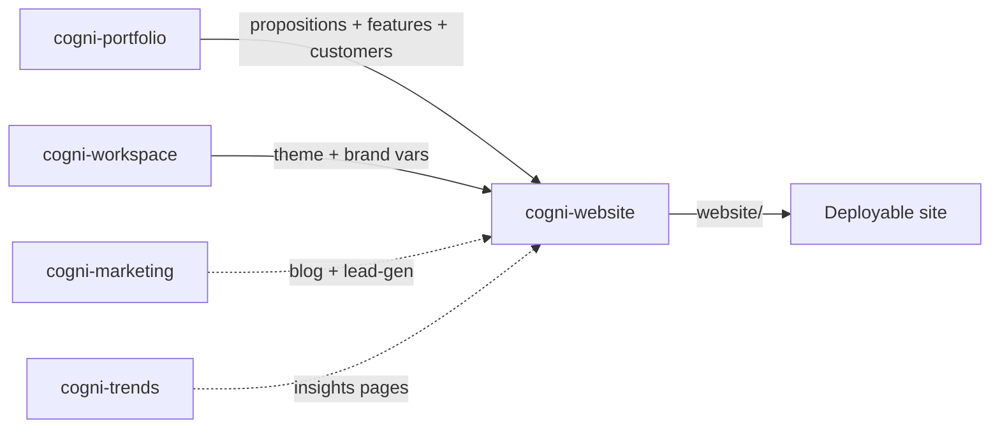

# Portfolio to Website

**Pipeline**: cogni-portfolio → cogni-workspace → cogni-website
**Duration**: 2–4 hours for a complete multi-page customer website
**End deliverable**: A deployable static website with shared navigation, theming, and SEO-optimized service pages — generated from your portfolio model



## What You Get

A complete multi-page customer website generated directly from your portfolio model. Service pages, product pages, customer landing pages, and an "About" page assembled from cogni-portfolio entities — propositions become headlines, features become capability lists, customer narratives become case-study blocks. Theming inherits from cogni-workspace so the site visually matches your slides, dashboards, and other deliverables.

The pipeline produces:
- `website-plan.json` — sitemap and content map from portfolio entities
- `website/{page-slug}.html` — rendered page files with shared navigation
- `website/assets/` — themed CSS, JS, and hero imagery
- `website/index.html` — homepage assembled from priority propositions

## Prerequisites

| Requirement | Why |
|-------------|-----|
| cogni-portfolio installed | Provides products, features, propositions, customer profiles — core page content |
| cogni-workspace installed | Provides the active theme (colors, fonts, design variables) the site inherits |
| cogni-website installed | Plans, builds, and previews the website |
| Optional: cogni-marketing | Adds blog posts and lead-generation landing pages to the site |
| Optional: cogni-trends | Adds an Insights/Trends page from TIPS investment themes |
| Optional: cogni-knowledge | Adds a Resources page with whitepapers from research syntheses |
| Optional: Pencil MCP | Enables AI-generated hero imagery via the hero-renderer agent |

## Step-by-Step

### 1. Confirm portfolio is ready

Before generating the site, the portfolio model must contain at least one product, the propositions you want to feature, and the customer profiles that drive landing pages.

```
Show portfolio status
```

If propositions or customers are missing, generate them first via `/propositions` and `/customers` in cogni-portfolio.

### 2. Pick or confirm a theme

Theme selection determines colors, fonts, and design variables across every page.

```
/pick-theme
```

The theme picker scans available workspace themes and prompts you to choose one. The chosen theme is stored in workspace state and inherited by every visual plugin — including cogni-website.

### 3. Set up the website project

```
/website-setup
```

This initializes a website project, discovers portfolio entities, and asks a few configuration questions (target market, primary CTA, language). It writes `website-project.json`.

### 4. Plan the sitemap

```
/website-plan
```

The planner reads portfolio propositions, customer profiles, and any optional inputs (marketing content, trend reports) and produces a sitemap: which pages exist, what content each one carries, and how navigation flows. Review `website-plan.json` and adjust priorities if needed before building.

### 5. Build the site

```
/website-build
```

Build dispatches the `site-assembler` agent to render every page from the plan. Each page inherits theme variables from workspace and pulls content from portfolio entities. If Pencil MCP is available, the `hero-renderer` agent generates hero imagery for landing pages.

### 6. Preview and iterate

```
/website-preview
```

Preview opens the rendered site in a local browser via claude-in-chrome. Iterate on theme tweaks, copy edits, or page additions by re-running `/website-build` after changes — only modified pages are rebuilt.

## Tips

- **Service pages stay current automatically.** When portfolio propositions change, re-run `/website-build` to regenerate affected pages — no manual copy edits.
- **Add marketing content for richer sites.** Run cogni-marketing first to produce blog posts and lead-generation pages; the website plan will include them automatically.
- **Theme changes are global.** Switching themes via `/pick-theme` and rebuilding is the fastest way to reskin the entire site.

## Related guides

- [cogni-portfolio guide](../plugin-guide/cogni-portfolio.md) — how to build the portfolio model the website draws from
- [cogni-workspace guide](../plugin-guide/cogni-workspace.md) — theme management and workspace setup
- [cogni-website guide](../plugin-guide/cogni-website.md) — full per-skill reference
- [Content Pipeline workflow](content-pipeline.md) — generating the marketing content that enriches the site
