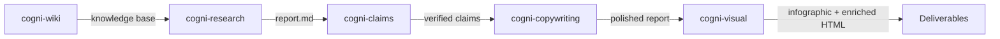

# Research to Report

**Pipeline**: cogni-wiki → cogni-research → cogni-claims → cogni-copywriting → cogni-visual
**Duration**: 10 min – 4 hours (all options) depending on research depth, claims volume, and visual enrichment
**End deliverable**: A verified, polished research report as themed HTML with data visualizations — plus an optional one-page infographic



## What You Get

A research report where every factual claim has been checked against its cited source, where the prose reads at executive level, and where the content is presented as a themed HTML deliverable with interactive charts and concept diagrams. The five-plugin chain produces:

- A persistent wiki that compounds your research knowledge across projects (cogni-wiki)
- A structured report with inline citations and a source registry (cogni-research)
- A claims verification pass that flags misquotations, unsupported conclusions, and stale data (cogni-claims)
- An executive-polished document with strong structure, active voice, and readability scoring (cogni-copywriting)
- A single-page infographic distilling the 3–5 key data points (cogni-visual / story-to-infographic)
- A themed HTML report with Chart.js visualizations, concept diagrams, and sidebar navigation (cogni-visual / enrich-report)

This is the chain to use when the report will be read by decision-makers or shared externally and both accuracy and visual impact matter.

## Prerequisites

| Requirement | Why |
|-------------|-----|
| cogni-wiki installed | Persistent knowledge base for compounding research |
| cogni-research installed | Runs the research pipeline |
| cogni-claims installed | Verifies claims against source URLs |
| cogni-copywriting installed | Applies messaging frameworks and readability polish |
| cogni-visual installed | Produces infographic and enriched HTML |
| Web access enabled | cogni-research dispatches parallel web researchers |

## Step-by-Step

### Step 0: Set Up a Local Wiki (Optional)

Before starting research, set up a Karpathy-style wiki to persist your knowledge. The wiki compiles sources once at ingestion instead of re-discovering them per query — your knowledge compounds with every ingest.

**Command**: `/wiki-setup` or describe what you need

**Example prompts:**

```
Set up a wiki for my AI regulation research
```

```
/wiki-setup --name "DACH Machinery AI Adoption"
```

This creates the wiki layout:

```
cogni-wiki/{slug}/
├── SCHEMA.md           Contract — conventions, linking rules
├── raw/                Your source documents (immutable)
├── wiki/
│   ├── index.md        One-line summary of every page
│   ├── log.md          Append-only operation log
│   ├── overview.md     Evolving synthesis
│   └── pages/          Flat, slug-named markdown pages
└── .cogni-wiki/config.json
```

You can ingest sources into the wiki at any point — before, during, or after the research run:

```
/wiki-ingest --source path/to/paper.pdf
```

```
Ingest this article into my wiki: https://example.com/article
```

**When to skip**: If you only need a one-off report without building a persistent knowledge base. Jump to Step 1.

### Step 1: Run the Research Pipeline

Start with a research topic or question. cogni-research decomposes it into sub-questions, dispatches parallel agents, aggregates sources, writes a cited draft, and runs a structural quality gate before outputting the final report.

**Command**: Describe your topic in natural language or use `/research-report`

**Example prompts:**

```
Research the state of AI regulation in the EU — detailed depth
```

```
Write a research report on quantum computing's impact on enterprise cryptography
```

```
Deep research on sustainable packaging adoption in the FMCG sector
```

**Choose your depth level:**

| Level | Sub-questions | Words | When to use |
|-------|--------------|-------|-------------|
| Basic | 5 | 3,000–5,000 | Quick overview, single topic |
| Detailed | 5–10 | 5,000–10,000 | Multi-section report with evidence |
| Deep | 10–20 (tree) | 8,000–15,000 | Recursive exploration, maximum coverage |

**Output location**: `cogni-research-{slug}/output/report.md`

If the run is interrupted, resume it:

```
Resume the research on AI regulation
```

**After the research run**, ingest the report and its sources into your wiki to compound knowledge:

```
Ingest the research report into my wiki
```

### Step 2: Verify Claims (Optional)

The research report contains inline citations linking claims to source URLs. `/verify-report` extracts those claims and checks each one against its cited source in a dedicated context window, then iterates until quality standards are met.

**Command**: `/verify-report` (or describe: "verify the claims in my research report")

**Example prompts:**

```
/verify-report
```

```
Verify the claims in the AI regulation report
```

**What happens:**

1. The `claim-extractor` agent pulls 10–30 verifiable claims from the draft
2. `cogni-claims` runs a `claim-verifier` agent per unique source URL
3. Deviations are reported: misquotation, unsupported conclusion, selective omission, data staleness, or source contradiction
4. The `revisor` agent revises flagged claims — up to 3 iterations

**Review the dashboard** to see claim status before proceeding:

```
/claims dashboard
```

Resolve any deviated claims you want to handle manually before polishing:

```
/claims resolve {claim-id}
```

### Step 3: Polish for Executive Readability (Optional)

Take the verified report into cogni-copywriting for structural polish and readability optimization. The plugin applies messaging frameworks (Pyramid Principle, BLUF, active voice), transforms passive construction, and adds visual hierarchy.

**Command**: `/copywrite {report-path}` or describe the task

**Example prompts:**

```
/copywrite cogni-research-ai-regulation/output/report.md
```

```
Polish this research report for executive readability — use Pyramid structure
```

```
/copywrite report.md --scope=tone
```

**Optional — run a stakeholder review** to catch blind spots before sharing:

```
/review-doc report.md
```

This runs 5 parallel stakeholder personas (executive, technical, legal, marketing, end-user) and synthesizes feedback into prioritized improvements.

### Step 4: Create an Infographic (Optional)

Distill the polished report into a single-page visual summary using cogni-visual's story-to-infographic skill. This extracts the 3–5 most impactful data points and produces an infographic brief that auto-renders into a visual.

**Command**: `/story-to-infographic` or describe what you want

**Example prompts:**

```
/story-to-infographic
```

```
Create an infographic from my research report — Economist style
```

```
Erstelle eine Infografik aus dem Report — Sketchnote-Stil
```

**Style presets:**

| Style | Output | Best for |
|-------|--------|----------|
| `economist` | Editorial .pen file (Pencil MCP) | Executive audiences, formal reports |
| `sketchnote` | Hand-drawn Excalidraw scene | Workshops, informal sharing |
| `whiteboard` | Clean Excalidraw scene | Presentations, teaching |
| `corporate` | Clean .pen file | Client-facing documents |

The infographic renders automatically after the brief is created. The output is a one-page visual that can be scanned in 10 seconds.

**When to skip**: If you only need the enriched HTML report (Step 5 already includes an infographic header). Use this step when you want a standalone one-pager to share separately.

### Step 5: Enrich the Report as Visual HTML (Optional)

Transform the polished markdown report into a themed, self-contained HTML deliverable with interactive Chart.js visualizations, concept diagrams, and sidebar navigation. The original markdown stays untouched — this creates a visual rendition.

**Command**: `/enrich-report` or describe what you want

**Example prompts:**

```
/enrich-report
```

```
Enrich my research report with charts and visualizations
```

```
Bericht mit Diagrammen anreichern und als HTML exportieren
```

**What you get:**

1. **Infographic header** — a page-filling visual executive summary at the top (KPI cards, charts, pull-quotes). Designed to be scanned in 60 seconds.
2. **Report body** — the full prose report below with sidebar navigation, sparse inline illustrations, and every paragraph preserved verbatim from the source.

This matches the consulting deliverable pattern: executive one-pager up front, detailed report below.

**Output location**: `{dir}/output/{stem}-enriched.html`

## Variations

| Variation | What to change | When to use |
|-----------|---------------|-------------|
| Skip wiki | Start at Step 1 | One-off research without knowledge compounding |
| Skip claims verification | Go directly from Step 1 to Step 3 | Internal-only drafts where accuracy is less critical |
| Polish only, no structure change | Add `--scope=tone` to `/copywrite` | Report structure is already strong; tone needs work |
| Run stakeholder review before final polish | Add `/review-doc` between Steps 2 and 3 | High-stakes external reports |
| Infographic only, no enriched HTML | Stop after Step 4 | Need a standalone one-pager, not a full visual report |
| Enriched HTML only, no standalone infographic | Skip Step 4, go to Step 5 | The enriched HTML already has an infographic header |
| Wiki-only mode | Run Steps 0 and 1, ingest results | Building a knowledge base without producing a deliverable |
| German-language output | Set language in research prompt | DACH stakeholder audiences |

## Common Pitfalls

- **Wrong research depth for the deliverable.** A deep research run for a 3-page summary wastes hours. Match depth to the scope of the deliverable — detailed is sufficient for most reports.
- **Skipping claims verification.** Research agents cite confidently. The verification step exists specifically because citations are frequently inaccurate. Don't skip it for externally shared content.
- **Applying `/copywrite` to an unverified draft.** Polish doesn't fix factual problems — it amplifies them. Verify first, polish second.
- **Too many scoped iterations.** If you run `--scope=tone` and then `--scope=structure` separately, the second pass may undo some first-pass improvements. Run full polish in one pass unless you have a specific reason not to.
- **Skipping the wiki for repeated topics.** If you research the same domain across multiple projects, a wiki saves significant time on subsequent runs. The 10-minute setup investment pays back after 2-3 ingests.
- **Running story-to-infographic AND enrich-report when you only need one.** The enriched HTML already includes an infographic header. Use story-to-infographic only when you need a standalone one-pager for separate sharing (e.g., as a poster or email attachment).
- **Enriching before polishing.** The enriched HTML preserves every paragraph verbatim. If the prose isn't polished yet, those rough patches are permanently baked into the visual deliverable. Always copywrite first.

## Related Guides

- [cogni-claims plugin guide](../plugin-guide/cogni-claims.md)
- [cogni-copywriting plugin guide](../plugin-guide/cogni-copywriting.md)
- [cogni-visual plugin guide](../plugin-guide/cogni-visual.md)
- [Consulting Engagement workflow](./consulting-engagement.md) — this pipeline runs inside the Develop phase
