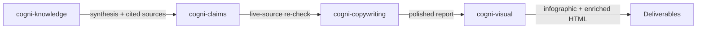

# Research to Report

**Pipeline**: cogni-knowledge → cogni-claims (optional) → cogni-copywriting → cogni-visual
**Duration**: 10 min – 4 hours (all options) depending on research depth, claims volume, and visual enrichment
**End deliverable**: A verified, polished research report as themed HTML with data visualizations — plus an optional one-page infographic



## What You Get

A research report where every citation has been checked against its cited source, where the prose reads at executive level, and where the content is presented as a themed HTML deliverable with interactive charts and concept diagrams. The chain produces:

- A persistent wiki knowledge base that compounds across runs — future runs read what prior runs filed before hitting the web (cogni-knowledge; the Karpathy-style engine is vendored in)
- A structured synthesis with inline citations and a source registry, verified **zero-network** against each cited source's extracted claims (cogni-knowledge)
- An optional **live-source re-check** that flags misquotations, unsupported conclusions, and stale data against the live source URLs (cogni-claims, via `knowledge-refresh --resweep`)
- An executive-polished document with strong structure, active voice, and readability scoring (cogni-copywriting)
- A single-page infographic distilling the 3–5 key data points (cogni-visual / story-to-infographic)
- A themed HTML report with Chart.js visualizations, concept diagrams, and sidebar navigation (cogni-visual / enrich-report)

This is the chain to use when the report will be read by decision-makers or shared externally and both accuracy and visual impact matter.

## Prerequisites

| Requirement | Why |
|-------------|-----|
| cogni-knowledge installed | Wiki-first research orchestrator (vendors the Karpathy wiki engine) |
| cogni-copywriting installed | Applies messaging frameworks and readability polish |
| cogni-visual installed | Produces infographic and enriched HTML |
| cogni-claims installed (optional) | Live-source re-check of cited claims via resweep |
| Web access enabled | cogni-knowledge dispatches parallel web researchers during curate/fetch |

## Step-by-Step

### Step 0: Set Up a Knowledge Base (Optional but recommended)

cogni-knowledge binds each research project to a wiki knowledge base. The Karpathy-style wiki engine is vendored into cogni-knowledge — no separate plugin to install. Sources are compiled once at ingestion instead of being re-discovered per query, so your knowledge compounds with every run.

**Command**: `/knowledge-setup` or describe what you need

**Example prompts:**

```
Set up a knowledge base for my AI regulation research
```

```
/knowledge-setup --name "DACH Machinery AI Adoption"
```

This creates the knowledge-base layout:

```
cogni-knowledge/{slug}/
├── .cogni-knowledge/binding.json    Binding manifest — which projects fed this base
├── wiki/                            The bound knowledge base
│   ├── index.md                     Curated front door (per-theme map)
│   ├── sources/                     One page per ingested source (with extracted claims)
│   ├── syntheses/                   Deposited, verified reports
│   ├── concepts/ · entities/ · questions/   Distilled cross-source knowledge
│   └── meta/                        log.md, context_brief.md, open_questions.md
└── .cogni-wiki/config.json
```

You can ingest a single source into the base at any point — before, during, or after a research run:

```
/knowledge-ingest-source --url https://example.com/article
```

```
/knowledge-ingest-source --file path/to/paper.pdf
```

**When to skip**: If you only need a one-off report without building a persistent knowledge base, `knowledge-setup` still binds a fresh base for the run — the base is where the verified synthesis lands, so it is rarely worth skipping.

### Step 1: Run the Inverted Pipeline

Start with a research topic or question. cogni-knowledge decomposes it into sub-questions (`knowledge-plan`), curates and fetches sources (`knowledge-curate` / `knowledge-fetch`), ingests them into the wiki with per-source extracted claims (`knowledge-ingest`), distills cross-source concepts (`knowledge-distill`), composes a cited draft (`knowledge-compose`), verifies every citation zero-network (`knowledge-verify`), and deposits the verified synthesis back into the wiki (`knowledge-finalize`).

**Command**: Describe your topic in natural language, or use `/knowledge-compose`

**Example prompts:**

```
Research the state of AI regulation in the EU — detailed depth
```

```
Write a research report on quantum computing's impact on enterprise cryptography
```

```
Deep research on sustainable packaging adoption in the FMCG sector
```

**Depth**: `knowledge-plan` decomposes the topic into 3–7 sub-questions; a deeper run ingests more sources per sub-question. The composer treats `target_words` as a soft upper budget — a tight, fully-grounded draft is the goal, not a word count.

**Output location**: `cogni-knowledge/{slug}/output/draft-vN.md`, with the verified synthesis deposited at `cogni-knowledge/{slug}/wiki/syntheses/{slug}.md`.

If the run is interrupted, resume it — the pipeline is idempotent and resumes mid-phase:

```
Resume the research on AI regulation
```

**Compounding**: every `knowledge-finalize` deposits the synthesis back into the wiki, so the next run reads it as prior cross-source framing instead of starting cold. That is the difference between a throwaway report and a knowledge base that gets sharper each run.

### Step 2: Verify Claims

cogni-knowledge verifies every citation **zero-network** during `knowledge-verify` — each cited sentence is scored against the cited page's extracted claims (`verbatim` / `paraphrase` / `unsupported`), with a bounded revisor loop that re-points or rephrases unsupported citations. This is citation-consistent verification with no live web re-fetch, and it runs as part of every pipeline pass.

For a **live-source re-check** (has the source URL changed since it was ingested?), run the optional resweep, which dispatches `cogni-claims` against the live URLs:

**Command**: `/knowledge-refresh --resweep`

**What happens:**

1. cogni-knowledge extracts the bound wiki's cited claims and their source URLs
2. `cogni-claims` runs a `claim-verifier` per unique source URL against the live page
3. Deviations are reported: misquotation, unsupported conclusion, selective omission, data staleness, or source contradiction

**Review the dashboard** to see claim status:

```
/claims dashboard
```

Resolve any deviated claims you want to handle manually before polishing:

```
/claims resolve {claim-id}
```

### Step 3: Polish for Executive Readability (Optional)

Take the verified report into cogni-copywriting for structural polish and readability optimization. The plugin applies messaging frameworks (Pyramid Principle, BLUF, active voice), transforms passive construction, and adds visual hierarchy.

**Command**: `/copywrite {report-path}` or describe the task

**Example prompts:**

```
/copywrite cogni-knowledge/ai-regulation/output/draft-v1.md
```

```
Polish this research report for executive readability — use Pyramid structure
```

```
/copywrite report.md --scope=tone
```

**Optional — run a stakeholder review** to catch blind spots before sharing:

```
/review-doc report.md
```

This runs 5 parallel stakeholder personas (executive, technical, legal, marketing, end-user) and synthesizes feedback into prioritized improvements.

### Step 4: Create an Infographic (Optional)

Distill the polished report into a single-page visual summary using cogni-visual's story-to-infographic skill. This extracts the 3–5 most impactful data points and produces an infographic brief that auto-renders into a visual.

**Command**: `/story-to-infographic` or describe what you want

**Example prompts:**

```
/story-to-infographic
```

```
Create an infographic from my research report — Economist style
```

```
Erstelle eine Infografik aus dem Report — Sketchnote-Stil
```

**Style presets:**

| Style | Output | Best for |
|-------|--------|----------|
| `economist` | Editorial .pen file (Pencil MCP) | Executive audiences, formal reports |
| `sketchnote` | Hand-drawn Excalidraw scene | Workshops, informal sharing |
| `whiteboard` | Clean Excalidraw scene | Presentations, teaching |
| `corporate` | Clean .pen file | Client-facing documents |

The infographic renders automatically after the brief is created. The output is a one-page visual that can be scanned in 10 seconds.

**When to skip**: If you only need the enriched HTML report (Step 5 already includes an infographic header). Use this step when you want a standalone one-pager to share separately.

### Step 5: Enrich the Report as Visual HTML (Optional)

Transform the polished markdown report into a themed, self-contained HTML deliverable with interactive Chart.js visualizations, concept diagrams, and sidebar navigation. The original markdown stays untouched — this creates a visual rendition.

**Command**: `/enrich-report` or describe what you want

**Example prompts:**

```
/enrich-report
```

```
Enrich my research report with charts and visualizations
```

```
Bericht mit Diagrammen anreichern und als HTML exportieren
```

**What you get:**

1. **Infographic header** — a page-filling visual executive summary at the top (KPI cards, charts, pull-quotes). Designed to be scanned in 60 seconds.
2. **Report body** — the full prose report below with sidebar navigation, sparse inline illustrations, and every paragraph preserved verbatim from the source.

This matches the consulting deliverable pattern: executive one-pager up front, detailed report below.

**Output location**: `{dir}/output/{stem}-enriched.html`

## Variations

| Variation | What to change | When to use |
|-----------|---------------|-------------|
| Fresh base each run | Let `knowledge-setup` bind a new base | One-off research without reusing a prior knowledge base |
| Skip live-source resweep | Rely on the zero-network `knowledge-verify` pass only | Internal-only drafts where live-URL drift is not a concern |
| Polish only, no structure change | Add `--scope=tone` to `/copywrite` | Report structure is already strong; tone needs work |
| Run stakeholder review before final polish | Add `/review-doc` between Steps 2 and 3 | High-stakes external reports |
| Infographic only, no enriched HTML | Stop after Step 4 | Need a standalone one-pager, not a full visual report |
| Enriched HTML only, no standalone infographic | Skip Step 4, go to Step 5 | The enriched HTML already has an infographic header |
| Knowledge-base only | Run Steps 0 and 1, query via `/knowledge-query` | Building a knowledge base without producing a polished deliverable |
| German-language output | Set the output language at `knowledge-setup` or in the research prompt | DACH stakeholder audiences |

## Common Pitfalls

- **Wrong research depth for the deliverable.** A deep research run for a 3-page summary wastes hours. Match depth to the scope of the deliverable — detailed is sufficient for most reports.
- **Treating the zero-network verify as a live fact-check.** `knowledge-verify` proves the draft is *citation-consistent* with what was ingested; it does not re-fetch the live source. For externally shared content where the source may have changed, run `knowledge-refresh --resweep`.
- **Applying `/copywrite` to an unverified draft.** Polish doesn't fix factual problems — it amplifies them. Let the pipeline finish (verify deposits the synthesis) first, polish second.
- **Too many scoped iterations.** If you run `--scope=tone` and then `--scope=structure` separately, the second pass may undo some first-pass improvements. Run full polish in one pass unless you have a specific reason not to.
- **Starting a fresh base for a repeated domain.** If you research the same domain across multiple projects, bind the same knowledge base so the wiki compounds — subsequent runs read prior syntheses and ingest fewer redundant sources.
- **Running story-to-infographic AND enrich-report when you only need one.** The enriched HTML already includes an infographic header. Use story-to-infographic only when you need a standalone one-pager for separate sharing (e.g., as a poster or email attachment).
- **Enriching before polishing.** The enriched HTML preserves every paragraph verbatim. If the prose isn't polished yet, those rough patches are permanently baked into the visual deliverable. Always copywrite first.

## Related Guides

- [cogni-knowledge plugin guide](../plugin-guide/cogni-knowledge.md)
- [cogni-claims plugin guide](../plugin-guide/cogni-claims.md)
- [cogni-copywriting plugin guide](../plugin-guide/cogni-copywriting.md)
- [cogni-visual plugin guide](../plugin-guide/cogni-visual.md)
- [Consulting Engagement workflow](./consulting-engagement.md) — this pipeline runs inside a deliverable's design-thinking loop
