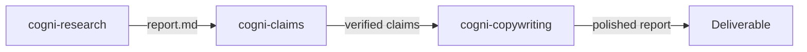

# Research to Report

**Pipeline**: cogni-research → cogni-claims → cogni-copywriting
**Duration**: 2–5 hours depending on research depth and claims volume
**End deliverable**: A verified, polished research report ready to share with stakeholders



## What You Get

A research report where every factual claim has been checked against its cited source, and where the prose reads at executive level. The three-plugin chain produces:

- A structured report with inline citations and a source registry (cogni-research)
- A claims verification pass that flags misquotations, unsupported conclusions, and stale data (cogni-claims)
- An executive-polished final document with strong structure, active voice, and readability scoring (cogni-copywriting)

This is the chain to use when the report will be read by decision-makers or shared externally and accuracy matters.

## Prerequisites

| Requirement | Why |
|-------------|-----|
| cogni-research installed | Runs the research pipeline |
| cogni-claims installed | Verifies claims against source URLs |
| cogni-copywriting installed | Applies messaging frameworks and readability polish |
| Web access enabled | cogni-research dispatches parallel web researchers |

## Step-by-Step

### Step 1: Run the Research Pipeline

Start with a research topic or question. cogni-research decomposes it into sub-questions, dispatches parallel agents, aggregates sources, writes a cited draft, and runs a structural quality gate before outputting the final report.

**Command**: Describe your topic in natural language or use `/research-report`

**Example prompts:**

```
Research the state of AI regulation in the EU — detailed depth
```

```
Write a research report on quantum computing's impact on enterprise cryptography
```

```
Deep research on sustainable packaging adoption in the FMCG sector
```

**Choose your depth level:**

| Level | Sub-questions | Words | When to use |
|-------|--------------|-------|-------------|
| Basic | 5 | 3,000–5,000 | Quick overview, single topic |
| Detailed | 5–10 | 5,000–10,000 | Multi-section report with evidence |
| Deep | 10–20 (tree) | 8,000–15,000 | Recursive exploration, maximum coverage |

**Output location**: `cogni-research-{slug}/output/report.md`

If the run is interrupted, resume it:

```
Resume the research on AI regulation
```

### Step 2: Verify Claims

The research report contains inline citations linking claims to source URLs. `/verify-report` extracts those claims and checks each one against its cited source in a dedicated context window, then iterates until quality standards are met.

**Command**: `/verify-report` (or describe: "verify the claims in my research report")

**Example prompts:**

```
/verify-report
```

```
Verify the claims in the AI regulation report
```

**What happens:**

1. The `claim-extractor` agent pulls 10–30 verifiable claims from the draft
2. `cogni-claims` runs a `claim-verifier` agent per unique source URL
3. Deviations are reported: misquotation, unsupported conclusion, selective omission, data staleness, or source contradiction
4. The `revisor` agent revises flagged claims — up to 3 iterations

**Review the dashboard** to see claim status before proceeding:

```
/claims dashboard
```

Resolve any deviated claims you want to handle manually before polishing:

```
/claims resolve {claim-id}
```

### Step 3: Polish for Executive Readability

Take the verified report into cogni-copywriting for structural polish and readability optimization. The plugin applies messaging frameworks (Pyramid Principle, BLUF, active voice), transforms passive construction, and adds visual hierarchy.

**Command**: `/copywrite {report-path}` or describe the task

**Example prompts:**

```
/copywrite cogni-research-ai-regulation/output/report.md
```

```
Polish this research report for executive readability — use Pyramid structure
```

```
/copywrite report.md --scope=tone
```

**Optional — run a stakeholder review** to catch blind spots before sharing:

```
/review-doc report.md
```

This runs 5 parallel stakeholder personas (executive, technical, legal, marketing, end-user) and synthesizes feedback into prioritized improvements.

## Variations

| Variation | What to change | When to use |
|-----------|---------------|-------------|
| Skip claims verification | Go directly from Step 1 to Step 3 | Internal-only drafts where accuracy is less critical |
| Polish only, no structure change | Add `--scope=tone` to `/copywrite` | Report structure is already strong; tone needs work |
| Run stakeholder review before final polish | Add `/review-doc` between Steps 2 and 3 | High-stakes external reports |
| Export to HTML, PDF, or DOCX | Run `/enrich-report` with `formats: ["html", "pdf"]` after Step 3 | Sharing beyond Claude Cowork |
| German-language output | Set language in research prompt | DACH stakeholder audiences |

## Common Pitfalls

- **Wrong research depth for the deliverable.** A deep research run for a 3-page summary wastes hours. Match depth to the scope of the deliverable — detailed is sufficient for most reports.
- **Skipping claims verification.** Research agents cite confidently. The verification step exists specifically because citations are frequently inaccurate. Don't skip it for externally shared content.
- **Applying `/copywrite` to an unverified draft.** Polish doesn't fix factual problems — it amplifies them. Verify first, polish second.
- **Too many scoped iterations.** If you run `--scope=tone` and then `--scope=structure` separately, the second pass may undo some first-pass improvements. Run full polish in one pass unless you have a specific reason not to.

## Related Guides

- [cogni-research plugin guide](../plugin-guide/cogni-research.md)
- [cogni-claims plugin guide](../plugin-guide/cogni-claims.md)
- [cogni-copywriting plugin guide](../plugin-guide/cogni-copywriting.md)
- [Consulting Engagement workflow](./consulting-engagement.md) — this pipeline runs inside the Develop phase
