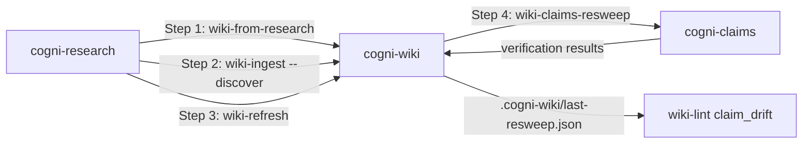

# Wiki ↔ Research Cycle

**Pipeline**: cogni-research ↔ cogni-wiki ↔ cogni-claims (bidirectional)
**Duration**: 5 min – 4 hours per step depending on which loop is invoked
**End deliverable**: A wiki that compounds research across projects, with citations re-verified periodically and stale findings surfaced as lint warnings



## What You Get

A long-lived wiki that compounds research across cogni-research projects, with stale pages refreshed against new findings, completed projects deposited as sub-question-sized pages, and periodic re-verification of cited URLs surfaced as `claim_drift` warnings on subsequent `wiki-lint` runs. Unlike linear pipelines, this loop has four entry points — each step below is independently invocable depending on your starting state.

## Prerequisites

- [ ] cogni-research installed
- [ ] cogni-wiki installed
- [ ] cogni-claims installed
- [ ] Web access enabled (cogni-research dispatches researchers; cogni-claims fetches sources)

## Step-by-Step

### Step 1: Cold-start a wiki from a research topic

**Plugin:** cogni-wiki
**Command:** `/wiki-from-research --topic "<topic>"` (Mode A) or `/wiki-from-research --research-slug <slug>` (Mode B)

Mode A chains `cogni-research:research-setup` → `research-report` → `cogni-wiki:wiki-setup` → `wiki-ingest --discover research:<slug>` in one dispatch. Mode B starts from an already-completed research project and skips the research run. Pre-flight blocks wiki-target collisions before any research budget is burned, refuses `report_source ∈ {wiki, hybrid}` (circular evidence), and nudges `verify-report` first when zero claims are verified.

**Output:** `<wiki-root>/wiki/pages/sq-NN-*.md`, `<wiki-root>/raw/research-<slug>/sq-NN-*.md`, `<wiki-root>/.cogni-wiki/{index.md,log.md}`.

### Step 2: Deposit a completed research project as wiki pages

**Plugin:** cogni-wiki
**Command:** `/wiki-ingest --discover research:<slug>`

Sub-question-centric: one wiki page per sub-question, not one per source. `batch_builder.py` materialises per-sub-question synthesis files bundling the sub-question's findings, its `verified` claims (claims with `verification_status != verified` are dropped to preserve "every claim citable" discipline), and the source URLs that backed them, then feeds the standard batch-mode pipeline. `--exclude-ingested` makes re-runs idempotent.

**Output:** `<wiki-root>/raw/research-<slug>/sq-NN-*.md` (synthesis files) and one `<wiki-root>/wiki/pages/<slug>.md` per sub-question.

### Step 3: Refresh stale pages from a completed research project

**Plugin:** cogni-wiki
**Command:** `/wiki-refresh --from-research <slug>`

`refresh_planner.py` calls `lint_wiki.py` directly to enumerate stale pages (`stale_page` >365d, `stale_draft` >180d), then matches each against the highest-scoring sub-question via Jaccard token overlap on `(title + tags + type)` versus `(query + parent_topic)`, with default threshold `0.30`. The plan is batch-confirmed (one prompt for N pages) before any dispatch; matched pages are then sequentially updated via `wiki-update` with diff-gate. Push-mode auto-research per stale page is out-of-scope by design (~$0.50/page).

**Output:** `<wiki-root>/raw/refresh-<slug>-<date>/sq-NN-*.md`, `<wiki-root>/wiki/pages/<slug>.md` (frontmatter `updated:` bumped, body diff-gated).

### Step 4: Re-verify wiki citations against current source content

**Plugin:** cogni-wiki
**Command:** `/wiki-claims-resweep --stale-only` (or `--all`, `--page <slug>`)

Pull-mode, report-only — no page mutations. `extract_page_claims.py` walks `wiki/pages/` deterministically (no network, no LLM) and yields one claim candidate per sentence containing an inline `[text](http(s)://...)` link or bare URL. `resweep_planner.py --phase plan` materialises per-page claim manifests; the orchestrator then dispatches `cogni-claims:claims submit` followed by `verify` per page. `--phase aggregate` writes `report.md` plus a lock-wrapped `<wiki-root>/.cogni-wiki/last-resweep.json`. On the next `/wiki-lint` run, the JSON is read best-effort and one `claim_drift` warning is emitted per page with findings, plus a single `last_resweep` info line.

**Output:** `<wiki-root>/raw/claims-resweep-<date>/<slug>/claims.json`, `<wiki-root>/raw/claims-resweep-<date>/report.md`, `<wiki-root>/.cogni-wiki/last-resweep.json` (lint bridge).

## Example Prompts

```
Step 1: "Build a wiki from research on the agent economy"
Step 2: "Deposit my completed agent-economy-followup research into the wiki"
Step 3: "Refresh the wiki from the agent-economy-followup research"
Step 4: "Re-verify cited URLs in stale wiki pages"
```

## Variations

| Variation | What changes | When to use |
|-----------|--------------|-------------|
| Mode B cold-start | `--research-slug <slug>` instead of `--topic` on `wiki-from-research` | The research project is already complete; no fresh research budget needed |
| Idempotent re-deposit | `--exclude-ingested` on `wiki-ingest --discover` | Project gained new sub-questions; only deposit the new ones |
| Loose refresh matching | `--match-threshold 0.20` on `wiki-refresh` | Short titles or specialised vocabulary; default 0.30 missed obvious matches |
| Force-refresh fresh pages | `--pages <slug,slug> --force` on `wiki-refresh` | Source URL changed for a page that isn't yet stale |
| Single-page resweep | `--page <slug>` on `wiki-claims-resweep` | Verify one specific page rather than the whole wiki |
| Stale-only resweep | `--stale-only [--days N]` on `wiki-claims-resweep` | Skip recently-verified pages; mirrors lint's stale threshold |

## Common Pitfalls

- **Circular evidence in cold-start.** `wiki-from-research` Mode B refuses research projects with `report_source ∈ {wiki, hybrid}` because the research itself was sourced from the wiki — depositing it back is a closed evidence loop. Use a project sourced from web or local files.
- **No matches in `wiki-refresh`.** Either no pages older than `STALE_PAGE_DAYS=365`, or the Jaccard threshold is too high for short titles. Try `--days 90` to widen staleness, lower `--match-threshold 0.20`, or pass `--pages <slug,slug> --force` to bypass the threshold for known targets.
- **Source-unavailable backlog after `wiki-claims-resweep`.** Sources behind paywalls or login walls return `source_unavailable` rather than `deviated`. Run `cogni-claims:claims cobrowse` afterwards to recover them interactively.
- **Ghost slug in `last-resweep.json`.** When a page is deleted between sweep and lint, `wiki-lint` silently skips that slug rather than erroring. To clean the bridge, re-run the sweep.
- **Skipping `verify-report` before deposit.** `wiki-ingest --discover research:<slug>` filters claims to `verification_status: verified`. Findings without verified claims still create wiki pages, but lose their citation discipline. Run `verify-report` first to maximise yield.
- **Running refresh on a non-stale page.** Refresh only acts on pages flagged by `lint_wiki.py`. To force-refresh a fresh page (e.g., the source URL changed), pass `--pages <slug> --force`.

## Related Guides

- [Research to Report](./research-to-report.md) — single-shot research pipeline (research → report → claims → copywriting → visual)
- [cogni-wiki plugin guide](../plugin-guide/cogni-wiki.md)
- [cogni-research plugin guide](../plugin-guide/cogni-research.md)
- [cogni-claims plugin guide](../plugin-guide/cogni-claims.md)
