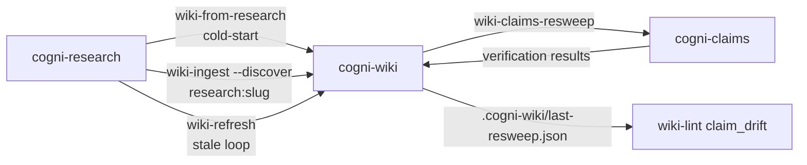

# Wiki ↔ Research Cycle

**Pipeline**: cogni-research ↔ cogni-wiki ↔ cogni-claims (bidirectional)
**Duration**: 5 min – 4 hours per direction depending on which loop is invoked
**End deliverable**: A wiki that compounds research across projects, with citations re-verified periodically and stale findings surfaced as lint warnings



## What You Get

This is the chain to use when you want a knowledge base that **compounds** across research projects rather than re-discovering sources every run, and when cited URLs need periodic re-verification because source content drifts.

- A wiki seeded from a research topic in one dispatch (cold-start)
- Stale wiki pages refreshed with the latest research findings (refresh)
- Completed research projects deposited as sub-question-sized wiki pages (deposit)
- Periodic re-verification of cited URLs in existing wiki pages, with deviated and source-unavailable claims surfaced both in a sweep report and as `claim_drift` lint warnings (re-verify)

## Prerequisites

| Requirement | Why |
|-------------|-----|
| cogni-research installed | Runs the research pipeline |
| cogni-wiki installed | Persistent knowledge base for compounding research |
| cogni-claims installed | Re-verifies cited URLs against current source content |
| Web access enabled | cogni-research dispatches researchers; cogni-claims fetches sources |

## Four Interaction Patterns

Unlike the linear `X-to-Y` workflows, the wiki ↔ research cycle has four entry points. Pick the pattern that matches your starting state.

### 1. Cold-start a wiki from a research topic — `wiki-from-research`

Use when you have a topic but no wiki yet. One dispatch chains `cogni-research:research-setup` → `research-report` → `cogni-wiki:wiki-setup` → `wiki-ingest --discover research:<slug>`.

- **Mode A** (`--topic "<topic>"`): start from free text. Cogni-research is run with `report_type=detailed` by default; the resolved slug is reused as the wiki slug.
- **Mode B** (`--research-slug <slug>`): start from an existing completed research project. Skips the research dispatch entirely.

Pre-flight blocks wiki-target collisions before any research budget is burned. Mode B refuses projects with `report_source ∈ {wiki, hybrid}` (circular evidence) and nudges `verify-report` first when zero claims are verified — `wiki-ingest --discover research:` filters claims to `verification_status: verified`, so unverified findings would land without their citations.

See `cogni-wiki/skills/wiki-from-research/SKILL.md` for the full Mode A/B parameter list and re-run resume/overwrite/abort prompts.

### 2. Refresh stale pages from a completed research project — `wiki-refresh`

Use when a topic you've covered in the wiki has new research and you want existing pages updated, not duplicated.

`refresh_planner.py` calls `lint_wiki.py` directly to enumerate stale pages: `stale_page` (older than `STALE_PAGE_DAYS=365`) and `stale_draft` (older than `STALE_DRAFT_DAYS=180`). Each stale page is matched to the highest-scoring sub-question via Jaccard token overlap on `(title + tags + type)` versus `(query + parent_topic)`, with a default threshold of `0.30` (tunable via `--match-threshold`). The plan is batch-confirmed (one prompt for N pages) before any dispatch; matched pages are then sequentially updated via `wiki-update` with diff-gate. Materialised refresh files land under `<wiki-root>/raw/refresh-<research-slug>-<date>/`.

Push-mode auto-research per stale page is **out of scope** by design (~$0.50/page). Use Pattern 3 to deposit a new project, then run refresh against it.

See `cogni-wiki/skills/wiki-refresh/SKILL.md`.

### 3. Deposit a completed research project as wiki pages — `wiki-ingest --discover research:<slug>`

Use when you have a finished research project and want it captured into an existing wiki, sub-question by sub-question.

The discover mode is **sub-question-centric**: one batch entry per sub-question, not one per source. `batch_builder.py` materialises per-sub-question synthesis files under `<wiki-root>/raw/research-<slug>/sq-NN-<short>.md` bundling the sub-question's findings, its `verified` claims (claims with `verification_status != verified` are dropped to preserve "every claim citable" discipline), and the source URLs that backed them. The materialised files then feed through the standard batch-mode pipeline.

`--exclude-ingested` skips sub-questions whose page already exists, making re-runs idempotent.

See `cogni-wiki/skills/wiki-ingest/references/batch-mode.md` for the full `--discover` mode taxonomy.

### 4. Re-verify wiki citations — `wiki-claims-resweep`

Use periodically — weeks or months after pages were ingested — to detect source drift. Pull-mode, **report-only** (no page mutations).

`extract_page_claims.py` walks `wiki/pages/` and yields one claim candidate per sentence containing an inline `[text](http(s)://...)` link or bare URL. Extraction is deterministic (no network, no LLM). `resweep_planner.py --phase plan` materialises per-page claim manifests under `<wiki-root>/raw/claims-resweep-<date>/`; the orchestrator then dispatches `cogni-claims:claims submit` followed by `verify` sequentially per page. `--phase aggregate` writes a markdown `report.md` plus `<wiki-root>/.cogni-wiki/last-resweep.json` (lock-wrapped via the `_wiki_lock` advisory contract).

`wiki-lint` reads the JSON best-effort on subsequent runs and emits one `claim_drift` warning per page with findings, plus a single `last_resweep` info line (sweep age + mode). Missing or malformed JSON is a silent skip — lint behaviour is identical to pre-sweep state.

Modes: `--all` (default), `--page <slug>`, `--stale-only [--days N]`. See `cogni-wiki/skills/wiki-claims-resweep/SKILL.md`.

## End-to-End Example

A representative timeline, single wiki, ~$1–3 of cogni-research budget plus per-resweep cogni-claims cost:

```
# Day 1 — Cold-start a wiki on a fresh topic
/wiki-from-research --topic "agent economy"
# → cogni-research/agent-economy/.metadata/research-report.md
# → ~/wiki-agent-economy/wiki/pages/sq-01-*.md, sq-02-*.md, ...
# → ~/wiki-agent-economy/raw/research-agent-economy/sq-NN-*.md  (per-sub-question synthesis)
# → ~/wiki-agent-economy/.cogni-wiki/index.md, log.md

# Day 7 — Drop a paper, ingest it as one more page
cp ~/Downloads/sutton-bitter-lesson.md ~/wiki-agent-economy/raw/
/wiki-ingest sutton-bitter-lesson.md
# → ~/wiki-agent-economy/wiki/pages/sutton-bitter-lesson.md  (backlinks woven, index/log updated)

# Spot-check the wiki, never from memory
/wiki-query "what does the wiki say about agent identity?"
# → answer cites sq-03-agent-identity.md and sutton-bitter-lesson.md only

# Day 90 — A follow-up research project lands; refresh the matching pages
/wiki-refresh --from-research agent-economy-followup --dry-run
# → printed plan: 2 pages matched (score ≥ 0.30), 1 below threshold
/wiki-refresh --from-research agent-economy-followup
# → ~/wiki-agent-economy/raw/refresh-agent-economy-followup-2026-08-01/sq-NN-*.md
# → wiki/pages/<slug>.md  (frontmatter `updated:` bumped, body diff-gated by wiki-update)

# Day 365 — Re-verify cited URLs against current source content
/wiki-claims-resweep --stale-only
# → ~/wiki-agent-economy/raw/claims-resweep-2027-05-01/<slug>/claims.json   (per-page manifest)
# → ~/wiki-agent-economy/raw/claims-resweep-2027-05-01/report.md            (deviated + unavailable)
# → ~/wiki-agent-economy/.cogni-wiki/last-resweep.json                      (lock-wrapped lint bridge)

# Day 366 — Lint surfaces the drift
/wiki-lint
# → INFO  last_resweep: sweep age 1d, mode stale-only
# → WARN  claim_drift on 3 pages: see raw/claims-resweep-2027-05-01/report.md
```

The pages flagged by `claim_drift` are then resolved manually through `/wiki-update --reason source-drift --source <new-url> <slug>` — the resweep itself never mutates `wiki/pages/`.

## Output Artefacts

| Direction | Files produced | Where |
|-----------|----------------|-------|
| Cold-start | new wiki tree + `index.md` + `log.md` + sub-question pages | `<wiki-root>/wiki/pages/*.md`, `<wiki-root>/raw/research-<slug>/sq-*.md` |
| Refresh | per-page synthesis files + bumped page `updated:` frontmatter | `<wiki-root>/raw/refresh-<slug>-<date>/`, `<wiki-root>/wiki/pages/*.md` |
| Deposit | per-sub-question synthesis + new wiki pages | `<wiki-root>/raw/research-<slug>/sq-*.md`, `<wiki-root>/wiki/pages/*.md` |
| Re-verify | per-page claim manifests + `report.md` + lint-bridge JSON | `<wiki-root>/raw/claims-resweep-<date>/`, `<wiki-root>/.cogni-wiki/last-resweep.json` |

## Common Pitfalls

- **Circular evidence in cold-start.** `wiki-from-research` Mode B refuses research projects with `report_source ∈ {wiki, hybrid}` because the research itself was sourced from the wiki — depositing it back is a closed evidence loop. Use a project sourced from web or local files.
- **No matches in `wiki-refresh`.** Either no pages older than `STALE_PAGE_DAYS=365`, or the Jaccard threshold is too high for short titles. Try `--days 90` to widen staleness, lower `--match-threshold 0.20`, or pass `--pages <slug,slug> --force` to bypass the threshold for known targets.
- **Source-unavailable backlog after `wiki-claims-resweep`.** Sources behind paywalls or login walls return `source_unavailable` rather than `deviated`. Run `cogni-claims:claims cobrowse` afterwards to recover them interactively.
- **Ghost slug in `last-resweep.json`.** When a page is deleted between sweep and lint, `wiki-lint` silently skips that slug rather than erroring. To clean the bridge, re-run the sweep.
- **Skipping `verify-report` before deposit.** `wiki-ingest --discover research:<slug>` filters claims to `verification_status: verified`. Findings without verified claims still create wiki pages, but lose their citation discipline. Run `verify-report` first to maximise yield.
- **Running refresh on a non-stale page.** Refresh only acts on pages flagged by `lint_wiki.py`. To force-refresh a fresh page (e.g., the source URL changed), pass `--pages <slug> --force`.

## Related Guides

- [Research to Report](./research-to-report.md) — single-shot research pipeline (research → report → claims → copywriting → visual)
- [cogni-wiki plugin guide](../plugin-guide/cogni-wiki.md)
- [cogni-research plugin guide](../plugin-guide/cogni-research.md)
- [cogni-claims plugin guide](../plugin-guide/cogni-claims.md)
